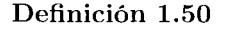
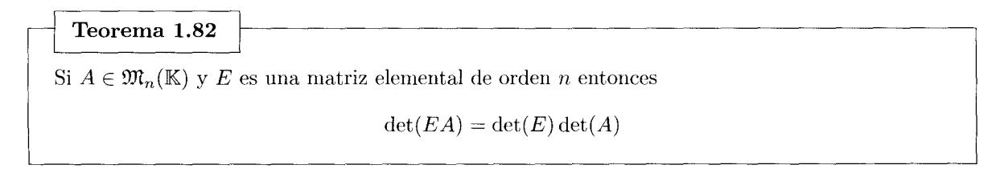

# **Capítulo 1**

# **Matrices**

Las matrices son uno de los objetos matemáticos más destacados en el estudio del Álgebra Lineal, tanto por sus propiedades como por su versatilidad. En los siguientes capítulos veremos que las matrices se utiliimn para representar y manipular de forma cómoda otros objetos propios del Álgebra Lineal como sistemas lineales, conjuntos de vectores, aplicaciones lineales ... de manera que se pueden deducir propiedades ele éstos a partir del estudio matricial. Además. las matrices se pueden manipular e implementar de forma muy natural en los ordenadores, lo que permite resolver con ellas muchos problemas de índole algorítmico y computacional. En este capítulo presentaremos formalmente las matrices y estudiaremos sus propiedades más importantes.

• Una **matriz** *A* de tamaño o de orden m x n es un conjunto de m· n escalares o elementos de un cuerpo IK1que están ordenados en m filas y *n* columnas de la forma

$$
A = \begin{pmatrix} a_{11} & a_{12} & \cdots & a_{1n} \\ a_{21} & a_{22} & \cdots & a_{2n} \\ \vdots & \vdots & \ddots & \vdots \\ a_{m1} & a_{m2} & \cdots & a_{mn} \end{pmatrix}
$$

La **entrada** (i, \_j) es el elemento de A que se encuentra en la **fila** 'Í y en la **columna** j, y lo denotamos por *a*1j o [A];1 . Podemos ver una matriz como una tabla que recoge información que depende ele dos índices. U na matriz se puede escribir de forma abreviada como *A* = ( Uij) con i = 1, ... , In y j = 1, ... , n o. cuando se sobreentienda su tamaño, simplemente *A* = ( a;*1 ).* La matriz

$$
\begin{pmatrix}\n1 & -1 & 1 & 5 \\
2 & 3 & 7 & -2 \\
1 & 4 & -1 & -3\n\end{pmatrix}
$$

tiene 3 filas y 4 columnas. y su entrada (2. 3) es rv23 = 7.

1 A lo largo de todo el texto consideraremos que lK = IR (cuerpo de los números reales) o 1K = IC (cuerpo de los números complejos).

• 9J1 111xn(IK) es el conjunto de las matrices de tamaüo 111 x *11* cuyas entradas son elementos ele JK. Una matriz fila es una matriz ele 9J1 1 x 11 (IK) ~' una matriz columna es una matriz de 9J1 111x J(IK). Por ejemplo

$$
(3 \quad -1 \quad 1 \quad 4) \longrightarrow \text{ matrix file, } \begin{pmatrix} 2 \\ 1 \\ 7 \end{pmatrix} \longrightarrow \text{ matrix columna}
$$

U na matri~ de 9J1, x 11 (IK) está formada por 111 matrices filas o por *11* matrices columnas.

• U na matriz cuadrada es una matriz COll igual número ele filas que de columnas. U na matriz cuadrada que tiene *11* filas ~- n columnas es una matriz de orden *11.* Al conjunto 9J1 11 x 11 (IK) lo denotamos de forma abreviada por 9Jt 11 (IK). Por ejemplo

$$
A = \begin{pmatrix} 3 & -1+i & 4i \\ 2i & 0 & -2 \\ 1 & 6 & -3+i \end{pmatrix} \in \mathfrak{M}_3(\mathbb{C})
$$

Una matriz de orden *11* se escribe ele fonua compacta como *A* = (o;J J;'.J= 1.

- Sea A una matriz de orden *n.* 
  - La diagonal o diagonal principal de *A* está formada por las entradas (a 11 *a22 .....* 0 1112 ).
  - La traza de A es la suma ele los eh'nH'ntos de su diagonal, esto es,

$$
tr(A) = \sum_{i=1}^{n} a_{ii} = a_{11} + a_{22} + \dots + a_{nn}
$$

- La subdiagonal de A está formada por las entradas (o 21 .a:J2 .... ,a11 . 11 \_ 1 ).
- La superdiagonal de A está formada por las entradas ( o 12 . *an .* .... *u* 11 -J. 11 ).

La matriz

$$
A = \begin{pmatrix} 3 & -1 & 4 \\ 5 & 2 & -2 \\ 1 & 6 & -7 \end{pmatrix}
$$

tiene diagonal ( 3. 2. - 7), subdiagonal ( G, 6). supercliagonal (-l. -2) ~- tr( A) = 3 + 2 - 7 = -2.

• La matriz traspuesta de la matriz *A* E íJJL 111 x 11 (lK) es la matri;-; *A*1E 9J111 x 111 (lK) cuya entrada (i.j) ('S igual a la entrada *(j.* i) de A. Es decir. [A];j = [A1 ]¡;. Por ejemplo.

$$
A = \begin{pmatrix} 3 & -3 & 1 \\ \boxed{1 & 0 & 2} \\ 2 & 4 & 1 \\ 5 & -1 & 0 \end{pmatrix} \implies A^t = \begin{pmatrix} 3 & \boxed{1} & 2 & 5 \\ -3 & 0 & 4 & -1 \\ 1 & 2 & 1 & 0 \end{pmatrix}
$$

La tila *i* de A se com·ierte eu la col muna *i* de A*1 y* la columna j de A se conYicrtc en la tila j de *A.1•*  El tamaí'ío de *A* coincide con el tamaüo de A. *1*si y sólo si 111 = *n.* En ¡mrticular (A1 ) 1*=A.* 

• U na **matriz simétrica** es una matriz cuadrada que coincide con su traspuesta. Esto es, *A* E 9Jl, (JK) es mm matriz simétrica si *A*1= *A.* Un ejemplo de matriz simNric:a es

$$
\left(\begin{array}{ccc}\n1 & -2 & 5 \\
-2 & 4 & 7 \\
5 & 7 & 0\n\end{array}\right)
$$

Una **matriz antisimétrica** es una matriz cuadrada que coincide con su matriz traspuesta cambiada de signo. Esto es, *A* E 9Jl11 (JK) es una matriz antisim(~trica si *A'* = *-A.* Por ejemplo,

$$
\left(\begin{array}{ccc} 0 & -2 & 5 \\ 2 & 0 & 7 \\ -5 & -7 & 0 \end{array}\right)
$$

es una matriz antisimétrica. Observamos que las entradas situadas en la diagonal principal son iguales aO. Esta propiedad es válida para cualquier matriz antisimótrica, ¡,por quU

• La **matriz traspuesta conjugada** de la matriz A E 9Jl111 x, (CC) es la matriz A\* E 9Jl, x*m* (CC) cuya entrada *(i, .J)* es el número complejo conjugado de la entrada (.i, *i)* de A, esto es, *a;¡* = a.~;. (recordamos que *o+ ib* = *o- bi).* Por ejemplo,

$$
A = \begin{pmatrix} i & -3-i & 1 & 2 \\ 2 & 4+i & 4 & 3 \\ 5i & -1 & 7 & -1+i \end{pmatrix} \implies A^* = \begin{pmatrix} -i & 2 & -5i \\ -3+i & 4-i & -1 \\ 1 & 4 & 7 \\ 2 & 3 & -1-i \end{pmatrix}
$$

Los tamaüos de A E 9:1lmxn(CC) y A\* E 9:1lnxm(CC) coiuciden si y sólo si ·m= *n.* 

• Una **matriz hermítica** es una matriz cuadrada que coincide con su matriz traspuesta conjugada. Esto es, *A* E 9Jl, (CC) es una matriz hennítica si A\* = *A.* Por ejemplo, la siguiente matriz es hermítica:

$$
\left(\begin{array}{ccc}3 & -3+i & i\\-3-i & 4 & 1\\-i & 1 & 0\end{array}\right)
$$

Observamos que los elementos de la diagonal principal son reales. Esta propiedad es válida para cualquier matriz henuítica, ¿por qu{~?

• Una **matriz triangular superior** es una matriz de onleu n con todas las entrada situadas por debajo de su diagonal principal iguales a O. Y una **matriz triangular inferior** es una matriz de ordcu *n* con todas las entradas situadas por encima de su diagonal principal iguales a O. Seau

$$
A = \begin{pmatrix} 4 & 7 - 3i & i \\ 0 & 1 + i & -2 \\ 0 & 0 & 5 \end{pmatrix} \quad \text{y} \quad B = \begin{pmatrix} 4 & 0 & 0 \\ 3 & 5 & 0 \\ 1 & 2 & 9 \end{pmatrix},
$$

la matriz A E 9n:1(CC) es triangular superior y la matriz BE 9n:1(1R) es triangular iuferior.

• Una **matriz diagonal** es una matriz de orden *n* tal que toda entrada ele *A* situada fuera de su diagonal principal es igual a O. Denotaremos por cliag(d1 •.... *dn)* a la matriz diagonal de orden *n* tal que las entradas situadas en su diagonal principal son d¡, .... *dn.* Por ejemplo

diag(2, -5, 1, 6) = 
$$
\begin{pmatrix} 2 & 0 & 0 & 0 \ 0 & -5 & 0 & 0 \ 0 & 0 & 1 & 0 \ 0 & 0 & 0 & 6 \end{pmatrix}
$$

Toda matriz diagonal es triangular superior y triangular inferior.

• La **identidad** de orden *n.* que denotamos por J,. es la matriz diagonal de orden *n* cm1 todas las entradas situadas en la diagonal principal iguales a l. Por ejemplo

$$
I_1 = \begin{pmatrix} 1 \\ 1 \end{pmatrix}, I_2 = \begin{pmatrix} 1 & 0 \\ 0 & 1 \end{pmatrix}, I_3 = \begin{pmatrix} 1 & 0 & 0 \\ 0 & 1 & 0 \\ 0 & 0 & 1 \end{pmatrix}, I_4 = \begin{pmatrix} 1 & 0 & 0 & 0 \\ 0 & 1 & 0 & 0 \\ 0 & 0 & 1 & 0 \\ 0 & 0 & 0 & 1 \end{pmatrix}, \dots
$$

• 1J na **matriz nula** es una matriz con todas sus entradas iguales a O. Denotaremos por 0, *xn* a la matriz nula ele tamaüo *rn* x *n* o, cuando no se produzca ambigiieclacl. simplemente O. Por ejemplo.

$$
0_{3\times3} = \begin{pmatrix} 0 & 0 & 0 \\ 0 & 0 & 0 \\ 0 & 0 & 0 \end{pmatrix}
$$

Una matriz nula de orden *n* es un matriz diagonal cou ceros en la diagonal principal.

• L na fila de una matriz es una **fila nula** si todas sus entradas son iguales a O. y una columna es una **columna nula** si todas sus entradas iguales a O. Sea

$$
A = \begin{pmatrix} 3 & -1 & 0 & 4 \\ 0 & 0 & 0 & 0 \\ 1 & 4 & 0 & -3 \end{pmatrix}
$$

la segunda fila de A es una fila nula ~· la tercera columna ele A es una columna nula.

• Una **submatriz** ele *A* es cualquier matriz que se obtenga a partir de *A* eliminando una o varias de sus filas y o columnas. También se considera a A como una submatriz de A. Por ejemplo. si

$$
A = \begin{pmatrix} 3 & -1 & 1 & 4 \\ 2 & 3 & 2 & -2 \\ 1 & 4 & 6 & -3 \\ 0 & 5 & 0 & 4 \end{pmatrix} \quad \text{y} \quad B = \begin{pmatrix} 3 & -1 & 4 \\ 1 & 4 & -3 \end{pmatrix}
$$

entonces *B* es una subrnatriz de *A* que se obtiene eliminando de *A* las filas 2 y 4 y la columna 3.

• Submatrices fila y columna de una matriz A. Denotaremos por F¡ (A) a la matriz fila formada por las entradas de la fila i-ésima ele A. y por C¡(A) a la matriz columna formada por las entradas de la columna j-ésima de *A.* Si *A* es una matriz de tamaüo *m* x *n* entonces

$$
F_i(A) = (a_{i1} \dots a_{in}) \quad \text{y} \quad C_j(A) = \begin{pmatrix} a_{1j} \\ \vdots \\ a_{mj} \end{pmatrix}
$$

Cuando se sobreentienda la matriz a la que nos estamos rcfirieudo, las matrices fila y columna se llamarán simplemente *F*1 , ... , *F*11 , y C1 •.... *Cn.* Por ejemplo, para

$$
A = \begin{pmatrix} 3 & -1 & 1 & 4 \\ 2 & 3 & 2 & -2 \\ 1 & 4 & 6 & -3 \end{pmatrix}
$$
 tenemos  $F_2 = \begin{pmatrix} 2 & 3 & 2 & -2 \end{pmatrix}$  y  $C_3 = \begin{pmatrix} 1 \\ 2 \\ 6 \end{pmatrix}$ 

# l. l. Operaciones con matrices

El contenido de esta sección es esencial, aunque pueda resultar un poco árido, ya que en ella se presentan las operaciones elementales que se pueden realizar con matrices y se demuestran todas las propiedades fundamentales que debe cumplir dicha operativa.

## Suma de matrices y del producto por escalares

• La suma de dos matrices *A* y *B* del mismo tamaüo es la matriz *A+ B* cuya entrada (i. *j)* es

$$
[A + B]_{ij} = a_{ij} + b_{ij}
$$

Es decir,

$$
A + B = \begin{pmatrix} a_{11} & \dots & a_{1n} \\ \vdots & \ddots & \vdots \\ a_{m1} & \dots & a_{mn} \end{pmatrix} + \begin{pmatrix} b_{11} & \dots & b_{1n} \\ \vdots & \ddots & \vdots \\ b_{m1} & \dots & b_{mn} \end{pmatrix} = \begin{pmatrix} a_{11} + b_{11} & \dots & a_{1n} + b_{1n} \\ \vdots & \ddots & \vdots \\ a_{m1} + b_{m1} & \dots & a_{mn} + b_{mn} \end{pmatrix}
$$

Por ejemplo

$$
\begin{pmatrix} 3 & -3 & 1 \ 1 & 0 & 2 \end{pmatrix} + \begin{pmatrix} 0 & 4 & 1 \ 1 & 5 & -1 \end{pmatrix} = \begin{pmatrix} 3 & 1 & 2 \ 2 & 5 & 1 \end{pmatrix}
$$

• El producto de un escalar ,\ por una matriz *A* es la matriz *,\A* cuya entrada *(i,j)* es

$$
[\lambda A]_{ij} = \lambda a_{ij}
$$

Es decir,

$$
\lambda A = \lambda \begin{pmatrix} a_{11} & \dots & a_{1n} \\ \vdots & \ddots & \vdots \\ a_{m1} & \dots & a_{mn} \end{pmatrix} = \begin{pmatrix} \lambda a_{11} & \dots & \lambda a_{1n} \\ \vdots & \ddots & \vdots \\ \lambda a_{m1} & \dots & \lambda a_{mn} \end{pmatrix}
$$

Por ejemplo

$$
3 \cdot \begin{pmatrix} 3 & -2 \\ 1 & 0 \\ 2 & 1 \end{pmatrix} = \begin{pmatrix} 9 & -6 \\ 3 & 0 \\ 6 & 3 \end{pmatrix}
$$

Ejemplo 1.1 Calcule las matrices 3A, 2B,  $A + C$  v 3A + 2B siendo

$$
A = \begin{pmatrix} 3 & -3 & 1 \\ 1 & 0 & 2 \\ 2 & 4 & 1 \\ 5 & -1 & 0 \end{pmatrix}, \quad B = \begin{pmatrix} 0 & 4 & 1 \\ 7 & 4 & 2 \\ 1 & 5 & -1 \\ 2 & 3 & 3 \end{pmatrix} \quad \text{y} \quad C = \begin{pmatrix} 2 & -1 & 2 \\ 1 & 0 & 2 \\ 1 & -1 & 0 \end{pmatrix}
$$

**Solución:** La suma  $A + C$  no tiene sentido pues A y C tienen distinto tamaño. El resto de las operaciones sí tiene sentido:

$$
3A = \begin{pmatrix} 9 & -9 & 3 \\ 3 & 0 & 6 \\ 6 & 12 & 3 \\ 15 & -3 & 0 \end{pmatrix}, \quad 2B = \begin{pmatrix} 0 & 8 & 2 \\ 14 & 8 & 4 \\ 2 & 10 & -2 \\ 4 & 6 & 6 \end{pmatrix}, \quad 3A + 2B = \begin{pmatrix} 9 & -1 & 5 \\ 17 & 8 & 10 \\ 8 & 22 & 1 \\ 19 & 3 & 6 \end{pmatrix} \quad \Box
$$

Teorema 1.2

#### Leyes de la suma de matrices y del producto por escalares

Sean  $A, B, C \in \mathfrak{M}_{m \times n}(\mathbb{K})$  y  $\alpha, \beta \in \mathbb{K}$ . La suma de matrices cumple las leyes:

- 1. Asociativa:  $(A + B) + C = A + (B + C)$ .
- 2. Conmutativa:  $A + B = B + A$ .
- 3. Existencia de elemento neutro:  $A + 0_{m \times n} = A = 0_{m \times n} + A$ .
- 4. Existencia de elemento opuesto:  $A + (-A) = 0_{m \times n} = (-A) + A$ .

Y. además, para el producto por escalares se cumplen las leyes:

- 5. Distributiva respecto de la suma de matrices:  $\alpha(A+B) = \alpha A + \alpha B$ .
- 6. Distributiva respecto de la suma de escalares:  $(\alpha + \beta)A = \alpha A + \beta A$ .
- 7. Asociativa respecto del producto por escalares:  $(\alpha \beta)A = \alpha(\beta A)$ .
- 8. La unidad del cuerpo,  $1 \in \mathbb{K}$ , cumple que  $1 A = A$ .

Demostración: Probaremos, para cada una de las leyes, que la ley se cumple en todas las entradas. Para ello emplearemos las propiedades de la suma y del producto de elementos de K.

l. Para demostrar la igualdad de las matrices (A+ JJ) + C y A+ (B + C) hay que demostrar que cada entrada (i .. i) de (A+ B) +Ces igual a la entrada (i,j) de A+ (B + C). Es decir, [(A+ B) + CJ;J =[A+ (B + C)]¡¡. Veámoslo.

$$
[(A + B) + C]_{ij} = [A + B]_{ij} + [C]_{ij} = (a_{ij} + b_{ij}) + c_{ij} = a_{ij} + (b_{ij} + c_{ij})
$$
  
= 
$$
[A]_{ij} + [B + C]_{ij} = [A + (B + C)]_{ij}
$$

Nótese que en la tercera igualdad hemos aplicado la propiedad asociativa en IK..

Del mismo modo se demuestran el resto de propiedades.

2. 
$$
[A + B]_{ij} = a_{ij} + b_{ij} = b_{ij} + a_{ij} = [B + A]_{ij}
$$
.  
\n3.  $[A + 0_{m \times n}]_{ij} = a_{ij} + 0 = a_{ij} = 0 + a_{ij} = [0_{m \times n} + A]_{ij}$ .  
\n4.  $[A + (-A)]_{ij} = a_{ij} + (-a_{ij}) = 0 = (-a_{ij}) + a_{ij} = [(-A) + A]_{ij}$ .  
\n5.  $[\alpha(A + B)]_{ij} = \alpha[A + B]_{ij} = \alpha(a_{ij} + b_{ij}) = \alpha a_{ij} + \alpha b_{ij} = [\alpha A]_{ij} + [\alpha B]_{ij} = [\alpha A + \alpha B]_{ij}$ .  
\n6.  $[(\alpha + \beta)A]_{ij} = (\alpha + \beta)a_{ij} = \alpha a_{ij} + \beta a_{ij} = [\alpha A]_{ij} + [\beta A]_{ij} = [\alpha A + \beta A]_{ij}$ .  
\n7.  $[(\alpha \beta)A]_{ij} = (\alpha \beta)a_{ij} = \alpha(\beta a_{ij}) = \alpha[\beta A]_{ij} = [\alpha(\beta A)]_{ij}$ .  
\n8.  $[1A]_{ij} = 1a_{ij} = a_{ij}$ .  $\square$ 

#### **Producto de matrices**

• El **producto de dos matrices** tiene sentido si el número de columnas de la prinwra es igual al uúmero de filas de la segunda. Dadas las matrices

$$
A = \begin{pmatrix} a_{11} & \dots & a_{1n} \\ \vdots & \ddots & \vdots \\ a_{m1} & \dots & a_{mn} \end{pmatrix} \quad \text{y} \quad B = \begin{pmatrix} b_{11} & \dots & b_{1p} \\ \vdots & \ddots & \vdots \\ b_{n1} & \dots & b_{np} \end{pmatrix}
$$

de tcunaños *m* x *n* y *n* x p respectivamente, el producto *AB* es la matriz AB de tamaüo m x p cuya entrada (i. j) se obtiene multiplicawlo la fila i de *A* por la colunma j de *B* según la regla

$$
[AB]_{ij} = F_i(A) C_j(B) = (a_{i1} \cdots a_{in}) \begin{pmatrix} b_{1j} \\ \vdots \\ b_{nj} \end{pmatrix} = a_{i1}b_{1j} + \ldots + a_{in}b_{nj} = \sum_{k=1}^n a_{ik}b_{kj}
$$

**Ejemplo 1.3** Si 
$$
A = \begin{pmatrix} 3 & -3 & 1 \ 1 & 0 & 2 \ 2 & 4 & 1 \ 5 & -1 & 0 \end{pmatrix}
$$
,  $B = \begin{pmatrix} -1 & 0 \ 2 & 1 \ 3 & 1 \end{pmatrix}$ ,  $C = \begin{pmatrix} 0 & 4 & 1 \ 7 & 4 & 2 \end{pmatrix}$  entonces  
\n
$$
AB = \begin{pmatrix} 3 & -3 & 1 \ 1 & 0 & 2 \ 2 & 4 & 1 \ 2 & 4 & 1 \ 5 & -1 & 0 \end{pmatrix} \begin{pmatrix} -1 & 0 \ 2 & 1 \ 3 & 1 \end{pmatrix} = \begin{pmatrix} 3 \cdot (-1) + (-3) \cdot 2 + 1 \cdot 3 & 3 \cdot 0 + (-3) \cdot 1 + 1 \cdot 1 \\ 1 \cdot (-1) + 0 \cdot 2 + 2 \cdot 3 & 1 \cdot 0 + 0 \cdot 1 + 2 \cdot 1 \\ 2 \cdot (-1) + 4 \cdot 2 + 1 \cdot 3 & 2 \cdot 0 + 4 \cdot 1 + 1 \cdot 1 \\ 5 \cdot (-1) + (-1) \cdot 2 + 0 \cdot 3 & 5 \cdot 0 + (-1) \cdot 1 + 0 \cdot 1 \end{pmatrix} = \begin{pmatrix} -6 & -2 \ 5 & 2 \ 9 & 5 \ 9 & 5 \ 9 & 5 \end{pmatrix}
$$
\n
$$
BC = \begin{pmatrix} -1 & 0 \ 2 & 1 \ 3 & 1 \end{pmatrix} \begin{pmatrix} 0 & 4 & 1 \ 7 & 4 & 2 \end{pmatrix} = \begin{pmatrix} 0 & -4 & -1 \ 7 & 12 & 4 \ 7 & 16 & 5 \end{pmatrix}
$$
\nminning, any  $AC$ ,  $PA$ ,  $CA$  approach to  $\Box$ 

mientras que *AC. BA* y *CA* carecen de sentido. D

## Teorema 1.4

## Leyes del producto de matrices

Sean *A* E 911mxn(IK), *B,C* E 911nxp(IK), DE 9Jlpxq(IK) y o E JK:. El producto cumple las leyes:

- l. Asociativa: *(AB)D* = *A(BD).*
- 2. Existencia de elemento neutro por la derecha: *Aln* = *A.*
- 3. Existencia de elemento neutro por la izquierda: *ImA* = *A.*
- 4. Asociativa respecto del producto por escalares: o(AB) = *(oA)B* = *A(aB).*
- 5. Distributiva respecto de la suma de matrices por la derecha: *A(B* + *C)* = *AB +AG.*
- G. Distributiva respecto de la suma de matrices por la izquierda: *(B* + *C)D* = *BD* + *CD.*

Demostración: Probarcmo;.;. para cada una de las leyes. que la le~· sP cumple en toda;.; las entrada:;.

1. 
$$
[(AB)D]_{ij} = \sum_{k=1}^{p} [AB]_{ik} d_{kj} = \sum_{k=1}^{p} (\sum_{h=1}^{n} a_{ih} b_{hk}) d_{kj} = \sum_{k=1}^{p} \sum_{h=1}^{n} a_{ih} b_{hk} d_{kj} = \sum_{h=1}^{n} \sum_{k=1}^{p} a_{ih} b_{hk} d_{kj}
$$
$$
= \sum_{h=1}^{n} a_{ih} (\sum_{k=1}^{p} b_{hk} d_{kj}) = \sum_{h=1}^{n} a_{ih} [BD]_{hj} = [A(BD)]_{ij}.
$$
  
2. 
$$
[AI_n]_{ij} = \sum_{k=1}^{n} a_{ik} [I_n]_{kj} = a_{ij} \text{ ya que } [I_n]_{jj} = 1 \text{ y } [I_n]_{kj} = 0 \text{ para } k \neq j.
$$

3. La demostración es análoga a la del apartado 2.

4. 
$$
[\alpha(AB)]_{ij} = \alpha[AB]_{ij} = \alpha(\sum_{k=1}^{n} a_{ik}b_{kj}) = \sum_{k=1}^{n} \alpha a_{ik}b_{kj} = \sum_{k=1}^{n} [\alpha A]_{ik}b_{kj} = [(\alpha A)B]_{ij}.
$$

La demostración de la igualdad [n(AB)];j = [A(oB)];¡ es análoga.

5. 
$$
[A(B+C)]_{ij} = \sum_{k=1}^{n} a_{ik} [B+C]_{kj} = \sum_{k=1}^{n} a_{ik} (b_{kj} + c_{kj}) = \sum_{k=1}^{n} a_{ik} b_{kj} + \sum_{k=1}^{n} a_{ik} c_{kj} = [AB]_{ij} + [AC]_{ij}.
$$

6. La demostración es análoga a la del apartado 5. D

#### **Otras propiedades del producto de matrices**

• Puede ocurrir que AB = O siendo A y B no nulas.

$$
A = \begin{pmatrix} 3 & -1 \\ -6 & 2 \end{pmatrix}, B = \begin{pmatrix} 3 & -1 \\ 9 & -3 \end{pmatrix} \implies AB = \begin{pmatrix} 0 & 0 \\ 0 & 0 \end{pmatrix}
$$

• Veamos cómo es el producto AB cuando B es una matriz columna.

Si *A* E 9nmxn(lK) y *B* E 9n,x ¡(JK) entonces AB E 9J1111 x 1 (JK). Aplicando que el producto es conmutativo en lK y las propiedades de la suma de matrices y del producto por escalares tenemos:

$$
\begin{pmatrix} a_{11} & \dots & a_{1n} \\ \vdots & \ddots & \vdots \\ a_{m1} & \dots & a_{mn} \end{pmatrix} \begin{pmatrix} b_{11} \\ \vdots \\ b_{n1} \end{pmatrix} = b_{11} \begin{pmatrix} a_{11} \\ \vdots \\ a_{m1} \end{pmatrix} + \dots + b_{n1} \begin{pmatrix} a_{1n} \\ \vdots \\ a_{mn} \end{pmatrix}
$$

Es decir, podemos escribir AB como suma de múltiplos de las columnas ele A. Por ejemplo

$$
\begin{pmatrix} 2 & 1 & 1 \ 2 & 0 & 1 \ 2 & 2 & 1 \ 3 & 1 & 1 \end{pmatrix} \begin{pmatrix} -2 \ 4 \ 3 \end{pmatrix} = -2 \begin{pmatrix} 2 \ 2 \ 2 \ 3 \end{pmatrix} + 4 \begin{pmatrix} 1 \ 0 \ 2 \ 1 \end{pmatrix} + 3 \begin{pmatrix} 1 \ 1 \ 1 \end{pmatrix} = \begin{pmatrix} 3 \ -1 \ 7 \ 1 \end{pmatrix}
$$

• Veamos cómo es el producto *e* A cuando *e* es una matriz fila.

Si *e* E 9J1¡ X *m* (JK) y A E 9nmx 11 (JK) entonces *e* AE 9)1¡ xn (JK). Aplicando que el producto es conmutativo en lK y las propiedades de la suma de matrices y del producto por escalares tenernos:

$$
(c_{11} \ldots c_{1m}) \begin{pmatrix} a_{11} & \ldots & a_{1n} \\ \vdots & \ddots & \vdots \\ a_{m1} & \ldots & a_{mn} \end{pmatrix} = (c_{11}a_{11} + \cdots + c_{1m}a_{m1} \cdots c_{11}a_{1n} + \cdots + c_{1m}a_{mn})
$$
  
=  $c_{11}(a_{11} \ldots a_{1n}) + \cdots + c_{1m}(a_{m1} \ldots a_{mn})$ 

Es decir\_ podemos escribir CA como suma de múltiplos de las filas de A. Por ejemplo

$$
\begin{pmatrix} 3 & 4 & -2 & 2 \end{pmatrix} \begin{pmatrix} 2 & 1 & 1 \\ 2 & 0 & 1 \\ 2 & 2 & 1 \\ 3 & 1 & 1 \end{pmatrix} = 3(2 \quad 1 \quad 1) + 4(2 \quad 0 \quad 1) - 2(2 \quad 2 \quad 1) + 2(3 \quad 1 \quad 1) = (16 \quad 1 \quad 7)
$$

• ?\o se cumple la ley comuutativa para d producto ele matrices.

C> Puede darse que *AB* tenga sentido mientras que *BA* no lo tenga:

$$
A = \begin{pmatrix} 3 & -1 & 1 \\ 1 & 0 & 2 \\ 2 & 1 & 1 \end{pmatrix}, B = \begin{pmatrix} 2 & 0 \\ -3 & 2 \\ 2 & 1 \end{pmatrix} \implies AB = \begin{pmatrix} 11 & -1 \\ 6 & 2 \\ 3 & 3 \end{pmatrix}
$$

y *BA* no tiene sentido ya que d núnH'ro de columnas de *B* es distinto del número de filas de *A.*  C> *AE* :v· *EA* pueden tener ambos sentido ~- no coincidir sus tamaüos:

$$
A = \begin{pmatrix} 3 & -1 & 1 \end{pmatrix}, B = \begin{pmatrix} 0 \\ 2 \\ 1 \end{pmatrix} \implies AB = \begin{pmatrix} -1 \end{pmatrix}, BA = \begin{pmatrix} 0 & 0 & 0 \\ 6 & -2 & 2 \\ 3 & -1 & 1 \end{pmatrix}
$$

C> *AE* y *EA* pueden tener ambos sentido. tener igual tamaüo y 110 coincidir:

A pueden tener ambos sentido, tener igual tamaño y no coincidir:  
\n
$$
A = \begin{pmatrix} 3 & -1 \\ 1 & 2 \end{pmatrix}, B = \begin{pmatrix} 0 & 1 \\ 2 & -3 \end{pmatrix} \implies \begin{pmatrix} -2 & 6 \\ 4 & -5 \end{pmatrix} = AB \neq BA = \begin{pmatrix} 1 & 2 \\ 3 & -8 \end{pmatrix}
$$

C> La expresión *A2*= *AA* tiene sentido si y sólo si *A* ('S cuadrada. Luego la expresión *(A.+ E) 2* tiene sentido si y sólo si *A+ E* es cuadrada. esto cs. si y sólo si *A* y *E* son matrices cuadradas del mi~;mo tamaüo. De manera que si *A. E* E 9J1 11(IK) entonces tenemos que

$$
(A + B)2 = (A + B)(A + B) = A2 + AB + BA + B2
$$

*y* la fórmula del binomio de l\icwton se cumple únicamente cuando *A y E* conmutan. esto cs.

$$
(A + B)2 = A2 + 2AB + B2
$$
si y sólo si  $AB = BA$ 

• No se cumple la propiedad de cancelación. es decir *A.B* = *AC* no implica *E* = *C.* 

$$
\begin{pmatrix} 1 & 2 \ 2 & 4 \end{pmatrix} \begin{pmatrix} 2 & 3 \ 1 & 1 \end{pmatrix} = \begin{pmatrix} 1 & 2 \ 2 & 4 \end{pmatrix} \begin{pmatrix} 0 & 1 \ 2 & 2 \end{pmatrix} \quad \text{y sin embargo} \quad \begin{pmatrix} 2 & 3 \ 1 & 1 \end{pmatrix} \neq \begin{pmatrix} 0 & 1 \ 2 & 2 \end{pmatrix}
$$

#### **Matrices por bloques**

Dada una matriz A de tarnaíio *m.* x *·n* podernos utilizar líneas verticales y horizontales para dividirla en subrnatrices que se denominan **bloques.** 

1**Ejemplo 1.5** 1 La rnatri:.~

$$
A = \begin{pmatrix} 1 & -1 & 1 \\ 1 & 0 & 2 \\ \hline 1 & 1 & 2 \end{pmatrix}
$$

está dividida en cuatro submatrices o bloques *A 11 . A* 12 , *A*21 y *A*22 tal como se indica

$$
A = \left(\begin{array}{c|c} A_{11} & A_{12} \\ \hline A_{21} & A_{22} \end{array}\right) \text{ con } A_{11} = \left(\begin{array}{c|c} 1 & -1 \\ 1 & 0 \end{array}\right), \ A_{12} = \left(\begin{array}{c|c} 1 \\ 2 \end{array}\right), \ A_{21} = \left(\begin{array}{c|c} 1 & 1 \end{array}\right) \text{ y } A_{22} = \left(\begin{array}{c|c} 2 \end{array}\right)
$$

Damos otra división de A, ahora utilizawlo sólo una línea horizontal:

$$
A = \begin{pmatrix} 1 & -1 & 1 \\ 1 & 0 & 2 \\ \hline 1 & 1 & 2 \end{pmatrix} = \begin{pmatrix} B \\ C \end{pmatrix} \text{ con } B = \begin{pmatrix} 1 & -1 & 1 \\ 1 & 0 & 2 \end{pmatrix} \text{ y } C = \begin{pmatrix} 1 & 1 & 2 \end{pmatrix} \quad \Box
$$

Un caso particular de rnatri:.~ por bloques es cuando dividimos la matriz cu sus submatrices fila o en sus submatrices columna:

$$
A = \begin{pmatrix} \frac{F_1}{F_2} \\ \vdots \\ \frac{F_m}{F_m} \end{pmatrix}, \quad A = (C_1 | C_2 | \cdots | C_n)
$$

Sean *A* y *B* dos **matrices por bloques,** tal y como se indica a continuación:

$$
A = \begin{pmatrix} A_{11} & A_{12} & \dots & A_{1n} \\ \hline A_{21} & A_{22} & \dots & A_{2n} \\ \vdots & \vdots & \vdots & \vdots \\ \hline A_{m1} & A_{m2} & \dots & A_{mn} \end{pmatrix} \quad y \quad B = \begin{pmatrix} B_{11} & B_{12} & \dots & B_{1q} \\ \hline B_{21} & B_{22} & \dots & B_{2q} \\ \vdots & \vdots & \vdots & \vdots \\ \hline B_{p1} & B_{p2} & \dots & B_{pq} \end{pmatrix}
$$

Si 71 = p y los tamaños de los bloques cumplen que para todo i E {l, ... ,m}, j E {l. .... n} y *k* E {l .... , q} el producto *A¡.J B¡¡,.* tieuc sentido, esto es, el núnwnJ de columnas de *A;\_¡* es igual al uúmcro de filas de *B 1¡,.;* entonces el producto *AB* es una matriz formada por mq bloques tal que el bloque de *ABen* la posición (i.j) se obtiene según la regla

$$
(A_{i1} \cdots A_{in}) \begin{pmatrix} B_{1j} \\ \vdots \\ B_{nj} \end{pmatrix} = A_{i1}B_{1j} + \ldots + A_{in}B_{nj}
$$

Una matriz cuadrada es **diagonal por bloques** si tiene una estructura *de* bloques

$$
A = \begin{pmatrix} A_{11} & 0 & \dots & 0 \\ \hline 0 & A_{22} & \ddots & \vdots \\ \hline \vdots & \ddots & \ddots & 0 \\ \hline 0 & \dots & 0 & A_{pp} \end{pmatrix}
$$
o de modo más esquemático 
$$
A = \begin{pmatrix} A_{11} & \dots & 0 \\ \vdots & \ddots & \vdots \\ 0 & \dots & A_{pp} \end{pmatrix}
$$

con A11 , *i* = l. ... , *p* matrices cuadradas y el resto de bloques matrices nulas.

Si *A* y *B* son matrices diagonales por bloques de orden *n* y para í = l ..... p los bloques *A;¡* y *B*1; son del mismo orden n;. con n 1+ · · · + *n* Jl = 11. entonces su cálculo se simplifica mucho

$$
AB = \begin{pmatrix} A_{11} & \dots & 0 \\ \vdots & \ddots & \vdots \\ 0 & \dots & A_{pp} \end{pmatrix} \begin{pmatrix} B_{11} & \dots & 0 \\ \vdots & \ddots & \vdots \\ 0 & \dots & B_{pp} \end{pmatrix} = \begin{pmatrix} A_{11}B_{11} & \dots & 0 \\ \vdots & \ddots & \vdots \\ 0 & \dots & A_{pp}B_{pp} \end{pmatrix}
$$

#### **Las potencias de una matriz cuadrada**

La **potencia** k~ésima ele una matriz A de orden *n* es el producto de A por sí misma k yeces

$$
A^k = A \stackrel{k}{\cdots} A \quad \text{para} \quad k \ge 1 \qquad \text{y por convenio} \quad A^0 = I_n
$$

Algunas matrices cuadradas tienen un comportamiento especial con respecto a la potencia. AsL por ejemplo, decimos que *A* E 9Jl 71 (JK) es **idempotente** si *A2*= *A.* decimos que *A* es **nilpotente** si existe un entero *k* > O tal que *A¡,.* =O, y decimos que *A* es **involutiva** si *A2 =In.* 

#### 1**Ejemplo 1.6**

Sean las matrices

$$
A = \begin{pmatrix} -3 & -4 & -8 \\ 1 & 2 & 2 \\ 1 & 1 & 3 \end{pmatrix}, \quad B = \begin{pmatrix} -3 & -4 & -7 \\ 1 & 0 & 1 \\ 1 & 2 & 3 \end{pmatrix} \quad \text{y} \quad C = \begin{pmatrix} 0 & 2 & 3 \\ -1 & -3 & -3 \\ 1 & 2 & 2 \end{pmatrix}
$$

Podemos comprobar que *A2*= *A* luego *A* es idempotente. que *B 3*= O luego *B* es nilpotente. y que C2 = I:~ luego *C* es involutiva. D

Para las matrices diagonales es especialmente sencillo calcular sus potencias:

$$
A = diag(d_1, d_2, \dots, d_n) \Rightarrow A^k = diag(d_1^k, d_2^k, \dots, d_n^k)
$$

y lo mismo ocurre a las matrices diagonales por bloques

$$
A = \begin{pmatrix} A_{11} & \cdots & 0 \\ \vdots & \ddots & \vdots \\ 0 & \cdots & A_{pp} \end{pmatrix} \Rightarrow A^{k} = \begin{pmatrix} A_{11}^{k} & \cdots & 0 \\ \vdots & \ddots & \vdots \\ 0 & \cdots & A_{pp}^{k} \end{pmatrix}
$$

#### **La fórmula del binomio de N ewton**

Si *A* y *B* son matrices de orden *n,* entonces podremos calcular las potencias de la matriz suma *A+ B* utilizando la fórmula del binomio de Ncwton si las matrices *A* y *B* conmutan (ya se mencionó anteriormente en el caso *(A+* B) 2 ). Es decir:

$$
\text{Si } AB = BA \text{ entonces } (A+B)^k = \sum_{i=0}^k \binom{k}{i} A^{k-i} B^i
$$

Esta fórmula cobra especial interés cuando una de las dos matrices *A* o *B* es nilpotente. Veamos un ejemplo en el que determinarnos la potencia k:-ósima de la matriz

$$
C = \left(\begin{array}{rrr} 2 & 2 & 1 \\ 0 & 2 & 2 \\ 0 & 0 & 2 \end{array}\right).
$$

Para ello descomponemos C como suma de dos matrices que conmuten. una de ellas nilpotente

$$
C = \left(\begin{array}{ccc} 2 & 0 & 0 \\ 0 & 2 & 0 \\ 0 & 0 & 2 \end{array}\right) + \left(\begin{array}{ccc} 0 & 2 & 1 \\ 0 & 0 & 2 \\ 0 & 0 & 0 \end{array}\right) = 2I_3 + B
$$

Comprobamos que *B* es nilpotente

$$
B = \begin{pmatrix} 0 & 2 & 1 \\ 0 & 0 & 2 \\ 0 & 0 & 0 \end{pmatrix}, B^2 = \begin{pmatrix} 0 & 0 & 4 \\ 0 & 0 & 0 \\ 0 & 0 & 0 \end{pmatrix}, B^3 = 0 \Rightarrow B^k = B^{k-3}B^3 = 0 \text{ si } k \ge 3.
$$

Corno las matrices 2/3 y *B* conmutan se puede calcular la potencia k-(~sima como sigue

$$
C^{k} = (2I_{3} + B)^{k} = \sum_{i=0}^{k} {k \choose i} (2I_{3})^{k-i} B^{i}
$$

Los únicos sumandos no nulos son aquéllos en los que aparecen *B* 0= *1:*1, *B* o B 2 . Es decir

$$
C^{k} = {k \choose 0} (2I_3)^{k} B^{0} + {k \choose 1} (2I_3)^{k-1} B + {k \choose 2} (2I_3)^{k-2} B^{2}
$$

y operando y simplificando queda

$$
C^k = 2^k I_3 + k 2^{k-1} I_3 B + \frac{k(k-1)}{2} 2^{k-2} I_3 B^2 = \begin{pmatrix} 2^k & k 2^k & k^2 2^{k-1} \\ 0 & 2^k & k 2^k \\ 0 & 0 & 2^k \end{pmatrix}
$$
 para todo  $k \ge 1$ .

## **Propiedades de la traspuesta**

## **Teorema 1.7**

Si la suma o el producto de matrices tiene sentido en cada uno de los casos que enunciamos a continuación, entonces son ciertas las afirmaciones:

1. 
$$
(A + B)^t = A^t + B^t
$$
.

2. 
$$
(A_1 + \cdots + A_k)^t = A_1^t + \cdots + A_k^t
$$
.

- 3. (aA) 1= n:A1 para todo o E lK.
- 4. *(AB)* 1= *B*1*A*1 .

$$
5. (A_1 \cdots A_k)^t = A_k^t \cdots A_1^t.
$$

**Demostración:** Probaremos que las propiedades l. 3 y 4 se cumplen eu cada entrada, mientras que la propiedad 2 será consecuencia de la propiedad 1 ~- la propiedad 5 de la propiedad 4:

1. 
$$
[(A + B)^{t}]_{ij} = [A + B]_{ji} = a_{ji} + b_{ji} = [A^{t}]_{ij} + [B^{t}]_{ij}.
$$
  
\n2. 
$$
(A_{1} + \dots + A_{k})^{t} = (A_{1} + (A_{2} + \dots + A_{k}))^{t} = A'_{1} + (A_{2} + \dots + A_{k})^{t} = \dots = A'_{1} + \dots + A'_{k}.
$$
  
\n3. 
$$
[(\alpha A)^{t}]_{ij} = [\alpha A]_{ji} = \alpha a_{ji} = [\alpha A^{t}]_{ij}.
$$
  
\n4. Si  $A \in \mathfrak{M}_{m \times n}$  y  $B \in \mathfrak{M}_{n \times p}$ , 
$$
[(AB)^{t}]_{ij} = [AB]_{ji} = \sum_{k=1}^{n} a_{jk}b_{ki} = \sum_{k=1}^{n} b_{ki}a_{jk} = [B^{t}A^{t}]_{ij}.
$$
  
\n5. 
$$
(A_{1} \cdots A_{k})^{t} = (A_{1}(A_{2} \cdots A_{k}))^{t} = (A_{2} \cdots A_{k})^{t}A^{t}_{1} = \dots = A'_{k} \cdots A^{t}_{1}.
$$

## **Corolario 1.8**

- Si *A* es mm matriz cuadrada entonces
  - l. *A+ A*1es simótrica y *A- A*1es antisimNrica.
  - 2. *A* se puede escribir como la suma de una matriz simétrica v una antisimNrica.
  - :3. *AA*1es simétrica.

**Demostración:** El apartado 1 se demuestra aplicando la propiedad 1 del Teorema l. 7:

$$
(A + At)t = At + (At)t = At + A = A + At
$$
  
$$
(A - At)t = At - (At)t = At - A = -(A - At)
$$

El apartado 2 se deduce del apartado l., ya que *A* = A~A' + *"'-;A'* .

Y el apartado 3 se deduce de la propiedad 4 del Teorema 1.7. ~·a que (.-L41) 1 = (A1) 1A*1*= *AA1* D Un ejemplo ilustra cómo escribimos una matriz como suma de una matriz simétrica y de una antisimétrica. Dada

$$
A = \begin{pmatrix} -3 & -4 & -8 \\ 1 & 2 & 2 \\ 1 & 1 & 3 \end{pmatrix}
$$

podemos comprobar que  $A = B + C$  con

$$
B = \frac{A + A^{t}}{2} = \frac{1}{2} \left[ \begin{pmatrix} -3 & -4 & -8 \\ 1 & 2 & 2 \\ 1 & 1 & 3 \end{pmatrix} + \begin{pmatrix} -3 & 1 & 1 \\ -4 & 2 & 1 \\ -8 & 2 & 3 \end{pmatrix} \right] = \begin{pmatrix} -3 & -\frac{3}{2} & -\frac{7}{2} \\ -\frac{3}{2} & 2 & \frac{3}{2} \\ -\frac{7}{2} & \frac{3}{2} & 3 \end{pmatrix}
$$
$$
C = \frac{A - A^{t}}{2} = \frac{1}{2} \left[ \begin{pmatrix} -3 & -4 & -8 \\ 1 & 2 & 2 \\ 1 & 1 & 3 \end{pmatrix} - \begin{pmatrix} -3 & 1 & 1 \\ -4 & 2 & 1 \\ -8 & 2 & 3 \end{pmatrix} \right] = \begin{pmatrix} 0 & -\frac{5}{2} & -\frac{9}{2} \\ \frac{5}{2} & 0 & \frac{1}{2} \\ \frac{9}{2} & -\frac{1}{2} & 0 \end{pmatrix}
$$

#### Propiedades de la traza

#### Teorema 1.9

Si la suma o el producto de matrices tiene sentido en cada uno de los casos que enunciamos a continuación, entonces son ciertas las afirmaciones:

1. 
$$
tr(A + B) = tr(A) + tr(B).
$$

$$
2. \operatorname{tr}(\lambda A) = \lambda \operatorname{tr}(A).
$$

$$
3. \ \operatorname{tr}(A) = \operatorname{tr}(A^t).
$$

$$
4. \operatorname{tr}(AB) = \operatorname{tr}(BA).
$$

**Demostración:** En las tres primeras propiedades suponemos que  $A \vee B$  son matrices de orden n.

1. 
$$
\text{tr}(A + B) = \sum_{i=1}^{n} [A + B]_{ii} = \sum_{i=1}^{n} [A]_{ii} + \sum_{i=1}^{n} [B]_{ii} = \text{tr}(A) + \text{tr}(B)
$$

2. 
$$
\text{tr}(\lambda A) = \sum_{i=1}^{n} [\lambda A]_{ii} = \lambda \sum_{i=1}^{n} [A]_{ii} = \lambda \text{tr}(A).
$$

- 3. Es evidente pues  $A y At$  tienen los mismos elementos en la digonal principal.
- 4. Para que los productos AB y BA tengan ambos sentido necesariamente serán  $A \in \mathfrak{M}_{n \times m}(\mathbb{K})$  y  $B \in \mathfrak{M}_{m \times n}(\mathbb{K})$ , siendo AB una matriz de orden n y BA de orden m. En tal caso

$$
\text{tr}(AB) = \sum_{i=1}^{n} [AB]_{ii} = \sum_{i=1}^{n} \sum_{j=1}^{m} a_{ij} b_{ji} = \sum_{j=1}^{m} \sum_{i=1}^{n} b_{ji} a_{ij} = \sum_{j=1}^{m} [BA]_{jj} = \text{tr}(BA) \qquad \Box
$$

# **1.2. Método de Gauss**

En esta sección describiremos un proceso de transformación de una matriz mediante la realización de transformaciones en sus filas denominadas operaciones elementales. Con este procedimiento convertiremos la matriz original en una matriz escalonada en la que determinaremos propiedades de la matriz original más fácilmente. La propiedad fundamental que queremos estudiar es la dependencia o independencia lineal de sus filas. La manipulación de matrices por medio de operaciones elementales de filas es de vital importancia en el Álgebra Lineal. por eso es imprescindible su correcto aprendizaje así corno su utilización sistemática ~· fiuicla. El proceso es conocido como **método de Gauss2**y se utilizará en secciones y capítulos posteriores para:

- Calcular el detenninante y rango rle m1a matriz de forma eficiente.
- Resolver sistemas lineales.
- Determinar la dependf'ncia e independencia lineal de un conjunto de vectores.
- Determinar unas ecuaciones implícitas de un suhespacio vectorial.

## **Combinación lineal de filas de una matriz**

**Definición 1.10**  Sean F 1 ..... F~c E 9Jl 1x" (!K) matrices filas. La matri:~~ fila es una **combinación lineal** de F 1 ..... F~c con **coeficientes** n 1 ....• n~.:. Las matrices fila F 1 ..... F~,: son **dependientes** (o linealmente dependientes) si alguna de ellas es combinación lineal de las demás. En caso contrario se dice que F 1 ..... F~; son **independientes**  (o linealmente independientes).

Cada fila de A E 9nmxn(IK) es una matriz fila de tamaüo 1 x *n.* De las propiedades de la suma de matrices y del producto por escalares se deduce que una combinación lineal ele filas de A es un matriz fila de tamaüo 1 x *n.* 

# **Ejemplo 1.11** En la matriz

1

$$
\mid
$$
 En la matrix

$$
A = \begin{pmatrix} 0 & 0 & 1 & 3 \\ 3 & 6 & 1 & 2 \\ 1 & 2 & 0 & 1 \\ 0 & 0 & 3 & 5 \end{pmatrix} \xrightarrow{\rightarrow} F_1
$$
  
\n
$$
P_2 = \begin{pmatrix} 2F_1 = \begin{pmatrix} 0 & 0 & 2 & 6 \\ 3 & 6 & 1 & 2 \end{pmatrix} \\ -3F_3 = \begin{pmatrix} -3 & -6 & 0 & -3 \end{pmatrix} \\ \nT_1 + F_2 - 3F_3 = \begin{pmatrix} 0 & 0 & 3 & 5 \end{pmatrix} = F_4
$$

Las filas de A son dependientes pues. como se ve, F~ es combinación lineal de F 1 . F*2*~· F;*3 .* D

2 .Johann Carl Friedrich Gauss (Brunswick. 1777- Gotinga. 1855).

Una **combinación lineal trivial** de matrices fila es aquélla en la que todos los coeficientes son O.

| Proposición 1.12    |                                                                                                                                          |
|---------------------|------------------------------------------------------------------------------------------------------------------------------------------|
| existen escalares a | Sean F¡,  , Fk matrices fila del mismo tamaño, entonces F 1 ,  , Fk son dependientes si y sólo 1 ,  , a k no todos nulos tales que |
|                     |                                                                                                                                          |

$$
{\bf Demostración:}
$$

=?) Supongamos que las filas *F*1 , ... , *Fk* son dependientes, entonces existe una fila. que sin pérdida de generalidad podemos suponer es FA:, que es una combinación lineal de las demás. Es decir

$$
F_k = \alpha_1 F_1 + \dots + \alpha_{k-1} F_{k-1}, \text{ con } \alpha_i \in \mathbb{K}
$$

Entonces,

$$
\alpha_1 F_1 + \cdots + \alpha_{k-1} F_{k-1} - F_k = 0
$$

que es una combinación lineal no trivial de F 1, ••• , FA:, dado que o¡,. =-1 #O.

{=) Ahora, supongamos que existe una combinación lineal no trivial n 1F1 + · · · + *od'k* = O, es decir que algún o¡ *#* O. Entones, podemos despejar *F;* obteniendo:

$$
F_i = \frac{-\alpha_1}{\alpha_i} F_1 + \dots + \frac{-\alpha_{i-1}}{\alpha_i} F_{i-1} + \frac{-\alpha_{i+1}}{\alpha_i} F_{i+1} + \dots + \frac{-\alpha_k}{\alpha_i} F_k
$$

Luego la fila *F;* es una combinación lineal de las demás y así F1 , ... , F~.- son dependientes. O

**Observación:** Como consecuencia del resultado anterior, si F 1 , ... , *Fk* son matrices fila independientes del mismo tamaño, entonces ninguna ele ellas es nula. En efecto, si alguna fuese nula, por ejemplo *F*1 = O, obteudríamos la combinación lineal no trivial *cqF*1 + OF2 + · · · + *OF,..* = O con a 1*#* O, lo que implicaría que F 1 , ... , *Fk* serían dependientes.

Para nuestros objetivos será importante saber el número maxuno de filas independientes que tiene una matri~. Vamos a describir un proceso para construir un conjunto *S* con d máximo número de filas indepeudientes. Sea *A* E 9nm x, (!K) y sean F¡, .... *F,"* las filas de *A.* U na fila nula. como acabamos de observar, no puede formar parte de uiugún conjunto de filas independientes, por lo que podernos suponer que A no tiene filas nulas (sino las eliminaríamos). Empe~amos construyendo el conjunto S 1 = *{F1* }. De forma recursiva construimos el conjunto *Sk* para k = 2, ... , *m* como sigue: si F~.- es una combinación lineal de las filas de S~,:\_ 1 entonces *S k* = *Sk-l,* y si F~.- no es una combinación lineal de las filas de *Sk-l* entonces la aiíadimos al conjunto *Sk* = *S,..\_* 1U *{Fk}.* De este modo el conjunto *S* = *Sm* está compuesto por filas independientes, y todas las filas que no están en *S* son combinación lineal de filas de S. Más adelante se demuestra que este procedimiento da lugar a un conjunto que tiene el máximo número posihle de filas iudcpewlientes.

1 Ejemplo 1.13 Encontrar m1 conjunto máximo de filas iwlependicntes e11 las matrices

$$
A = \begin{pmatrix} 0 & 1 & 1 & 2 \\ 0 & 2 & 2 & 4 \\ 3 & 4 & 3 & 6 \\ 3 & 2 & 1 & 2 \end{pmatrix} \quad \text{y} \quad B = \begin{pmatrix} 0 & 3 & 1 & 2 \\ 0 & 2 & 2 & 2 \\ 1 & 1 & 0 & 0 \end{pmatrix}
$$

Solución: Comenzamos con *A.* Partimos del conjunto *S 1*{ F 1 }. Como *F2* = *2F¡* e1ltmH·es *S2* = { *F*1 } • Como F;, no es proporcional a *F*1 • entonces *S;,* = { *F*1 • F:d. Como F¡ = - *2F¡* + F;, t>ntm1ces *S* 4= *{F*1 • F;,}. Luego *S"* es un conjunto con d m(lximo nÍlllH'ro de filas iudependientes ele .-1.

Seguimos cm1 la matriz B. Partimos dd conjunto S1 = {F1 }. Como F2 = nF1 no *tiew·* solución (ya que *F*2 no es proporcimml a *FI).* entonces S2 = { F 1 • P2}. Como F;1 = o *F*1 + *.d* F2 no tiene solución (ya que la primera e11tracla de F;¡ es 1 y la primera entrada de oF1 + ;J F2 es cero para cualesquiera valores (Y. *3* E !K). elltOlH'eS s3 = { *F¡. F¿'* Fd. Luego todas las filas de *B* son indqwwlientes. D

## Operaciones elementales de filas. l\!Iatrices elementales

Las transformaciones que se pueden aplicar a una matriz l'll el COJJocido como mNodo de Gauss se denomi11an operaciones elementales de filas. Son de tres tipos ~- consisten en lo siguiente:

Tipo **1:** l11tcrcambiar las filas i ~· j. Se denota *f¡* H .fj.

Tipo **11:** Sumar a la fila i la fila j umltiplicada por 1m escalar. Se denota *.f,* -+ *f¡* + .J.fj.

Tipo **111:** l\Iultiplicar la fila i por un escalar no nulo. Se denota *.f¡-+ .Jf¡* co11 j *el* O.

## 1Ejemplo 1.14 Vemos m1 ejemplo de cada m1o de los tipos de operaciones eleme11talcs ele filas:

(1) Una operación elemental de Tipo I: 
$$
\begin{pmatrix} 0 & 2 & 2 \ 2 & 0 & 4 \ 3 & -1 & 3 \ 0 & 1 & 2 \end{pmatrix} \xrightarrow{f_1 \leftrightarrow f_3} \begin{pmatrix} 3 & -1 & 3 \ 2 & 0 & 4 \ 0 & 2 & 2 \ 0 & 1 & 2 \end{pmatrix}
$$
  
(2) Una operación elemental de Tipo II: 
$$
\begin{pmatrix} 0 & 2 & 2 \ 2 & 0 & 4 \ 3 & -1 & 3 \ 0 & 1 & 2 \end{pmatrix} \xrightarrow{f_3 \to f_3 + 2f_1} \begin{pmatrix} 0 & 2 & 2 \ 2 & 0 & 4 \ 3 & 3 & 7 \ 0 & 1 & 2 \end{pmatrix}
$$
  
(3) Una operación elemental de Tipo III: 
$$
\begin{pmatrix} 0 & 2 & 2 \ 2 & 0 & 4 \ 3 & -1 & 3 \ 0 & 1 & 2 \end{pmatrix} \xrightarrow{f_2 \to 3f_2} \begin{pmatrix} 0 & 2 & 2 \ 6 & 0 & 12 \ 3 & -1 & 3 \ 0 & 1 & 2 \end{pmatrix} \square
$$

Asociadas a las operaciones dementaks de filas están las denominadas matrices elementales.

## **Definición 1.15**

U na **matriz elemental** de orden *n* es una matriz resultante de aplicar a la matrit~ identidad I, una operación elemental de filas. Las hay de tres tipos:

• Ef,+-+!*1* : 1\Iatri;.-: resultante de aplicar a *111* la operación elemental *j;* +-+ *fJ·* 

$$
I_n \xrightarrow[\ f_i \leftrightarrow f_j]{} E_{f_i \leftrightarrow f_j}
$$

• Et,--+f,HJf1 : Matriz resultante de aplicar a *In* la operaciém elenwntal *f¡--+ f¡* + ¡-Jjj.

$$
I_n \xrightarrow[\ f_i \to f_i + \beta f_j]{} E_{f_i \to f_i + \beta f_j}
$$

## • Ef,--+df, : Matriz resultante de aplicar a!, la operación elemental *f¡--+ ¡)j;. ¡)fe* O.

$$
I_n \xrightarrow[\ f_i \to \beta f_i]{f_i} E_{f_i \to \beta f_i}
$$

**Ejemplo 1.16** Veamos, para orden ·1, un ejemplo de cada tipo de matriz elemental:

$$
E_{f_1 \leftrightarrow f_3} = \begin{pmatrix} 0 & 0 & 1 & 0 \\ 0 & 1 & 0 & 0 \\ 1 & 0 & 0 & 0 \\ 0 & 0 & 0 & 1 \end{pmatrix}, \quad E_{f_3 \to f_3 + \beta f_1} = \begin{pmatrix} 1 & 0 & 0 & 0 \\ 0 & 1 & 0 & 0 \\ \beta & 0 & 1 & 0 \\ 0 & 0 & 0 & 1 \end{pmatrix}, \quad E_{f_2 \to \beta f_2} = \begin{pmatrix} 1 & 0 & 0 & 0 \\ 0 & \beta & 0 & 0 \\ 0 & 0 & 1 & 0 \\ 0 & 0 & 0 & 1 \end{pmatrix} \qquad \Box
$$

Hcalit~ar una operación elemental en las filas de una matriz *A* es equivalente a multiplicar *A* por la i;r,quierda por la matri;r, elemental que c:mTespo!lde a dicha operación elemental. Este hecho queda rdlcjado en el siguiente esquema:

$$
A \xrightarrow[ f_i \leftrightarrow f_j ]{} E_{f_i \leftrightarrow f_j} \cdot A \qquad A \xrightarrow[ f_i \to f_i + \beta f_j ]{} E_{f_i \to f_i + \beta f_j} \cdot A \qquad A \xrightarrow[ f_i \to \beta f_i ]{} E_{f_i \to \beta f_i} \cdot A
$$

1**Ejemplo 1.17** Lo ilustramos con cada tipo de operación elemental:

(1) Operación elemental de Tipo **1:** 

$$
\begin{pmatrix} 0 & 2 & 2 \ 2 & 0 & 4 \ 3 & -1 & 3 \ 0 & 1 & 2 \end{pmatrix} \xrightarrow{f_1 \leftrightarrow f_3} \begin{pmatrix} 3 & -1 & 3 \ 2 & 0 & 4 \ 0 & 2 & 2 \ 0 & 1 & 2 \end{pmatrix} = \begin{pmatrix} 0 & 0 & 1 & 0 \ 0 & 1 & 0 & 0 \ 1 & 0 & 0 & 0 \ 0 & 0 & 0 & 1 \end{pmatrix} \begin{pmatrix} 0 & 2 & 2 \ 2 & 0 & 4 \ 3 & -1 & 3 \ 0 & 1 & 2 \end{pmatrix}
$$

(2) Operación elemental de Tipo **11:** 

| 2 o |  |  |  |  |  |  |  |
|--------|--|--|--|--|--|--|--|
| -1     |  |  |  |  |  |  |  |

(3) Operación elemental de Tipo **111:** 

$$
\begin{pmatrix} 0 & 2 & 2 \ 2 & 0 & 4 \ 3 & -1 & 3 \ 0 & 1 & 2 \end{pmatrix} \xrightarrow{f_2 \rightarrow 3f_2} \begin{pmatrix} 0 & 2 & 2 \ 6 & 0 & 12 \ 3 & -1 & 3 \ 0 & 1 & 2 \end{pmatrix} = \begin{pmatrix} 1 & 0 & 0 & 0 \ 0 & 3 & 0 & 0 \ 0 & 0 & 1 & 0 \ 0 & 0 & 0 & 1 \end{pmatrix} \begin{pmatrix} 0 & 2 & 2 \ 2 & 0 & 4 \ 3 & -1 & 3 \ 0 & 1 & 2 \end{pmatrix} \qquad \Box
$$

#### **Matrices escalonadas y escalonadas reducidas**

El primer elemento no nulo de cada una de las filas de una matriz se denomina **pivote.** U na fila nula no tiene pivote. Introducimos a continuación dos tipos de matrices que están caracterizadas por dónde están colocados y por cómo son sus pivotes.

#### **Definición 1.18**

La matriz A es **escalonada** (o escalonada por filas) si cumple las siguientes propiedades:

- Si A tiene k filas nulas, éstas son las k últimas.
- Todo pivote de A tiene más ceros a su izquierda que el pivote de la fila anterior. Como es lógico. esta propiedad no afPcta al pivote de la primera fila.

La matriz *A* es **escalonada reducida** si es escalonada y además cumple que:

- Todos los pivotes de *A* son iguales a l.
- Toda entrada de *A* situada en la misma columna que un pivote es igual a O.

**Ejemplo 1.19** 

1

1 La matriz

$$
\begin{pmatrix}\n-4 & 1 & -2 & -3 & 2 & 1 \\
0 & 3 & 6 & 4 & 0 & 4 \\
0 & 1 & 1 & -3 & 2 & -3 \\
0 & 0 & 0 & 0 & 1 & 1\n\end{pmatrix}
$$

no es escalonada porque el pivote de la fila :3 tienP a su izquierda igual número de ceros quP el pivote de la fila 2. De manera informaL la matriz dada tiene un ¡wldaño de altura 2 y los peldaüos de una matriz escalonada tienen altura l. Las matrices

$$
\begin{pmatrix}\n-i & 0 & 0 & -4 & 0 & -4 \\
\hline\n0 & i & 0 & 4+i & 0 & -1 \\
0 & 0 & 0 & 0 & 2 & 3 \\
0 & 0 & 0 & 0 & 0 & 0\n\end{pmatrix} \quad y \quad \begin{pmatrix}\n1 & 0 & 0 & 5 & 7 & 0 \\
\hline\n0 & 0 & 1 & -3 & 0 & -1 \\
0 & 0 & 0 & 0 & 1 & 2 \\
0 & 0 & 0 & 0 & 0 & 0\n\end{pmatrix}
$$

son escalonadas, pero no son escalonadas reducidas: la primera porque no todo pivote es igual a 1, y la segunda porque no toda entrada situada en la misma columna que un pivote es igual a O. La matriz

$$
\begin{pmatrix} 0 & 1 & 9 & 0 & 7 & 0 & 0 \\ 0 & 0 & 0 & 1 & 2 & 0 & 0 \\ 0 & 0 & 0 & 0 & 0 & 1 & 0 \\ 0 & 0 & 0 & 0 & 0 & 0 & 1 \end{pmatrix}
$$

es escalonada reducida. O

Observaciones: l. La matriz nula es escalonada y escalonada reducida.

2. La única matriz escalonada reducida de orden *n* con *n* filas no nulas es la identidad *In.* 

## Matrices equivalentes por filas

Cuando aplicamos una sucesión de operaciones elementales de filas a una matriz estarnos estableciendo una conexión entre la matriz original y la matriz final.

Definición 1.20

Dos matrices *A* y *B* son equivalentes por filas, *A* "'¡ *B,* si *A* = *B* o si se puede transformar *A* en *B* mediante una sucesión finita de operaciones elementales de filas. Esta última propiedad es igual a decir que existen matrices elementales E1 , ... , *E k* tales que *B* = *E k··· E1A.* 

1Ejemplo 1.21 Las matrices

$$
A = \begin{pmatrix} 0 & -3 & 3 \\ 2 & 6 & 0 \\ 1 & -3 & 2 \end{pmatrix} \quad \text{y} \quad B = \begin{pmatrix} 1 & -3 & 2 \\ 0 & 12 & -4 \\ 0 & 0 & 2 \end{pmatrix}
$$

son equivalentes por filas ya que

$$
\begin{pmatrix} 0 & -3 & 3 \ 2 & 6 & 0 \ 1 & -3 & 2 \end{pmatrix} \xrightarrow{f_1 \leftrightarrow f_3} \begin{pmatrix} 1 & -3 & 2 \ 2 & 6 & 0 \ 0 & -3 & 3 \end{pmatrix} \xrightarrow{f_2 \to f_2 - 2f_1} \begin{pmatrix} 1 & -3 & 2 \ 0 & 12 & -4 \ 0 & -3 & 3 \end{pmatrix} \xrightarrow{f_3 \to f_3 + \frac{1}{4}f_2} \begin{pmatrix} 1 & -3 & 2 \ 0 & 12 & -4 \ 0 & 0 & 2 \end{pmatrix}
$$

es una sucesión de operaciones elementales de filas que transforma *A* en *B.* O

Si transformamos una matriz *A* en *B* aplicando una operación elemental, podemos innortir el proceso y transformar *B* en *A* aplicando la **operación elemental inversa:** 

> *f¡* H *f¡ f¡* ~ *f¡- df) f¡* ~ ~f¡ es la operación elemental invnsa de *f¡* H f *1* es la operación elemental inwrsa de *f.¡* ~ f, + *:3f1*  es la operación elemental inwrsa de *f¡* ~ *3 j,. /3 #* O

La existencia de las operaciones elementales inversas permite estable('(~!' una relación de eqni,·alencia.

**Teorema 1.22** 

La equivalencia por filas es una relación de equivalencia.

**Demostración:** Sean *A. B* y *C* matrices del mismo tamaüo. Vamos a demostrar que se cumplen las tres propiedades que definen una relación de equivalencia:

*Refie:riva: A ""'.r A.* Se cumple por definición.

Simétrica: Si A""' *.r* B. entonces B "'fA.

Supougamos qne *B* se obtiene a partir de *A* mediante mm sucesióu fiuita de operaciones elementales. Entouces. podemos revertir el proceso pasando de *B* a *A* mediante la aplicación eu orden contrario de las operaciones elementales inversas correspondientes. Luego *B* "'f *A.* 

*Tmnsit'iva:* Si *A ""'.r B* y *B* "'f *C.* entonces *A* ~f *C.* 

Asumimos qne *A* "'f *B* y *B* "'.f C:. Entonces. podemos trasformar *A* en *C* aplicando las operaciones elementales que transforman *A* en *B* y des¡m{'s las qnc transformau *B* en *C.* Luego *ArvrC.* O

#### **Combinación lineal de filas en matrices equivalentes por filas**

Supongamos que A se trausforma en B mcdiaute nna operación clcment al de filas. Sean F 1 ..... F*11* las filas de *A* y nos fijamos en las posibles transformaciones qnc sufre *F;* tras aplicarle la opcraciém elemental: i) *f¡* H f¡: *ii) f,* ~ *J;* +o f 1 : *ú* i) *.f¡* ~ o *.f¡.* En todos los casos la fila *i* de *B* que obtenemos es combinación lineal de filas de A.

Si *A* se transforma en *B* mediante una sucesión de operaciones elementales de filas

$$
A = A_0 \longrightarrow A_1 \longrightarrow \cdots \longrightarrow A_k = B
$$

entonces cada fila de *Ah:* es nna cmnhinación lineal de las filas de *A,.\_* 1. A su H'Z, cada fila de A~,;\_ 1es

una combinación lineal de las filas de A~c-2, y así hasta llegar a A0 . Por lo tanto cada fila ele *B* = A~c cs combinación lineal de fila.s de *A* = A0 .

Si *A* ""f *B* entouc<'S toda fila de *B* es combinación li1wal de filas de *A* 

[ **Ejemplo 1.23** Las matrices

$$
A = \begin{pmatrix} 0 & 0 & 2 & 6 \\ 3 & 6 & 1 & 2 \\ 3 & 6 & 0 & -1 \\ 0 & 0 & 1 & 5 \end{pmatrix} \quad \text{y} \quad B = \begin{pmatrix} 3 & 6 & 1 & 2 \\ 0 & 0 & 2 & 6 \\ 0 & 0 & 0 & 2 \\ 0 & 0 & 0 & 0 \end{pmatrix}
$$

sm1 equivalentes por filas. Esto lo probaremos en d siguicut.e ejemplo, doude veremos que

$$
A \qquad \overrightarrow{f_1 \leftrightarrow f_2} \qquad \overrightarrow{f_3 \to f_3 - f_1} \qquad \overrightarrow{f_3 \to f_3 + \frac{1}{2}f_2} \qquad \overrightarrow{f_4 \to f_4 - \frac{1}{2}f_2} \qquad \overrightarrow{f_3 \leftrightarrow f_4} \qquad B
$$

Lo <¡ue ahora nos interesa es comprobar el efecto que tiene en las filas originales de *A* esta sucesión de operaciones elementales. Tenemos que

$$
A = \begin{pmatrix} F_1 \\ F_2 \\ F_3 \\ F_4 \end{pmatrix} \xrightarrow{f_1 \leftrightarrow f_2} \begin{pmatrix} F_2 \\ F_1 \\ F_3 \\ F_4 \end{pmatrix} \xrightarrow{f_3 \to f_3 - f_1} \begin{pmatrix} F_2 \\ F_1 \\ F_3 - F_2 \\ F_4 \end{pmatrix} \xrightarrow{f_3 \to f_3 + \frac{1}{2}f_2} \begin{pmatrix} F_2 \\ F_1 \\ F_4 \end{pmatrix}
$$
$$
\xrightarrow{f_4 \to f_4 - \frac{1}{2}f_2} \begin{pmatrix} F_2 \\ F_1 \\ F_3 - F_2 + \frac{1}{2}F_1 \\ F_4 - \frac{1}{2}F_1 \end{pmatrix} \xrightarrow{f_3 \leftrightarrow f_4} \begin{pmatrix} F_2 \\ F_1 \\ F_4 - \frac{1}{2}F_1 \\ F_3 - F_2 + \frac{1}{2}F_1 \end{pmatrix} = B
$$

Y así hemos escrito cada fila de *B* como una combinación lineal de filas de *A.* Además, del hecho de que la última fila de B sea nula, es decir. F:1 - F2 + ~ F 1= O, podemos deducir, entre otras relaciones, que F;¡ = *F*2 + ~ *F*1 • Es decir, que la fila ;) de *A* <'S combinación lineal d<~ las filas 1 y 2 de A. D

#### **Equivalencia por filas a una matriz escalonada**

En el Ejemplo 1.21 vimos que partiendo de una matriz dada hemos llegado a una matriz escalonada a travús de operaciones elementales de filas de **Tipo 1 y 11.** En realidad esto es posible hacerlo siempre, como afirmad siguiente resultado. En la demostración describiremos un proceso que modifica paso a paso una matriz mediante operaciones demcntalcs de filas con d objeto de ir detectando y transformando en nulas aquellas filas que sean combinación lineal del resto. Al final del proceso se llega a una matriz escalonada cuyas filas no nulas son independientes.

Teorema 1.24

Toda matriz es equivalente por filas a una matriz escalonada.

Demostración: Detallamos en forma de algoritmo los pasos que se deben seguir para transformar *A*  en una matriz escalonada utilizando únicamente operaciones elementales de Tipo 1 y 11:

- l. Buscamos la primera columna de *A* que tenga algún elemento distinto de O. Supongamos que es la columna j. Buscarnos en esta columna j ele A el primer elemento distinto de O. Supongamos que éste se encuentra eu la fila *h* :v que es igual a ,\ *#* O. Entonces aplicamos la operación elemental de Tipo 1: f¡ H *fh* y obtenemos una matriz que tiene un pivote igual a ,\ en la posición ( 1, *j).*
- 2. Para cada *i #* 1 sea~, *el* elemento que se encuentra en la posición *(i.j).* Si~, #O realizamos la operación elemental de Tipo 11: *f¡* -+ *f¡* - 3; *h.* De esta forma obtenemos una matriz con pivote igual a,\ en la posición (1,j) ~·ceros por debajo. Si~~= O no se hace nada en la fila i.
- 3. Si la matriz que hemos obtenido es escalonada entonces ya hemos terminado. Eu caso contrario lo que hacemos es dejar fijadas la primera fila ~· las primeras j columnas. y con el el resto de la matriz comenzar de nuevo el proceso nJ!vicndo al paso l. D

El procedimiento que acabamos de describir. de transformación de un matriz en una matriz escalonada. se conoce como método de escalonamiento de Gauss o método de Gauss.

1 Ejemplo 1.25 Encuéntrese una matriz escalonada equivalente por filas a

$$
\begin{pmatrix} 0 & 0 & 2 & 6 \\ 3 & 6 & 1 & 2 \\ 3 & 6 & 0 & -1 \\ 0 & 0 & 1 & 5 \end{pmatrix}
$$

Solución: Seguiremos el procedimiento descrito en la demostración del Teorema 1.2-L

l. La primera columna con algún elemento no nulo es la columna L y el primer elemento no nulo de la columna 1 se encuentra en la fila 2. Realizamos mm transformación de Tipo 1:

$$
\begin{pmatrix} 0 & 0 & 2 & 6 \\ 3 & 6 & 1 & 2 \\ 3 & 6 & 0 & -1 \\ 0 & 0 & 1 & 5 \end{pmatrix} \xrightarrow[\overline{f_1} \leftrightarrow \overline{f_2}]{} \begin{pmatrix} 3 & 6 & 1 & 2 \\ 0 & 0 & 2 & 6 \\ 3 & 6 & 0 & -1 \\ 0 & 0 & 1 & 5 \end{pmatrix}
$$

2. Hacemos ceros por debajo del primer pivote. Como ha~· un único elemento distinto de O. que se encuentra en la fila 3. sólo necesitamos una transformación de Tipo 11:

$$
\frac{1}{f_3 \to f_3 - f_1} \begin{pmatrix} 3 & 6 & 1 & 2 \\ 0 & 0 & 2 & 6 \\ 0 & 0 & -1 & -3 \\ 0 & 0 & 1 & 5 \end{pmatrix}
$$

- 3. La matriz no es escalonada, así que dejamos fijadas la fila 1 y la columna 1, y con el resto de la matriz (que hemos enmarcado) comenzamos de nuevo el proceso.
- 1'. En la matriz enmarcada la primera columna que no tiene todos sus elementos iguales a O es la columna 2 y el primer elemento no nulo de la columna 2 se encuentra en la fila l. Por lo que en este caso no necesitamos una transformación de **Tipo l.**
- 2'. Hacemos ceros por debajo del segundo pivote. Como hay dos elementos distintos de O necesitarnos dos transformaciones de **Tipo 11:**

$$
\frac{\sqrt{3}}{f_3 \to f_3 + \frac{1}{2}f_2} \begin{pmatrix} 3 & 6 & 1 & 2 \\ 0 & 0 & 2 & 6 \\ 0 & 0 & 0 & 0 \\ 0 & 0 & 1 & 5 \end{pmatrix} \xrightarrow{f_4 \to f_4 - \frac{1}{2}f_2} \begin{pmatrix} 3 & 6 & 1 & 2 \\ 0 & 0 & 2 & 6 \\ 0 & 0 & 0 & 0 \\ 0 & 0 & 0 & 2 \end{pmatrix}
$$

- 3'. La matriz no es escalonada, así que dejarnos fijadas la fila 1 y 2 y las columnas 1, 2 y 3. Y con el resto de la matriz (que hemos enmarcado) comenzamos de nuevo el proceso.
- 1". En la nueva matriz enmarcada la primera columna que no tiene todos sus elementos iguales a O es la columna **1** y el primer elemento no nulo de la columna 1 se encuentra en la fila 2. Realizamos una transformación de **Tipo 1:**

$$
\frac{1}{f_3 \leftrightarrow f_4} \begin{pmatrix} 3 & 6 & 1 & 2 \\ 0 & 0 & 2 & 6 \\ 0 & 0 & 0 & 2 \\ 0 & 0 & 0 & 0 \end{pmatrix}
$$

- 211 Hacemos ceros por debajo del tercer pivote. Como no hay elementos que sean distintos de O no necesitamos ninguna transformación del **Tipo 11.**
- 3". La matriz obtenida es escalonada, luego el proceso termina aquí. D

Si a una matriz le aplicarnos el algoritmo descrito en la demostración del Teorema 1.24 llegarnos a una matriz escalonada. Pero si a esa misma matriz le aplicarnos una sucesión diferente de operaciones elementales de filas podemos llegar a otra matriz escalonada diferente. Luego **una matriz no** es **equivalente por filas a una única matriz escalonada.** 

1**Ejemplo 1.26** Vamos a convertir la matriz

$$
A = \begin{pmatrix} 6 & 2 & -2 \\ 2 & 1 & 3 \\ 8 & 4 & 5 \end{pmatrix}
$$

en escalonada utilizando dos sucesiones distintas de operaciones elementales por filas:

l. Siguiendo el método descrito en cl Teorema 1.2-±

$$
A \frac{6}{f_2 \to f_2 - \frac{1}{3}f_1} \begin{pmatrix} 6 & 2 & -2 \\ 0 & \frac{1}{3} & \frac{11}{3} \\ 8 & 4 & 5 \end{pmatrix} \frac{1}{f_3 \to f_3 - \frac{4}{3}f_1} \begin{pmatrix} 6 & 2 & -2 \\ 0 & \frac{1}{3} & \frac{11}{3} \\ 0 & \frac{4}{3} & \frac{23}{3} \end{pmatrix} \frac{1}{f_3 \to f_3 - 4f_2} \begin{pmatrix} 6 & 2 & -2 \\ 0 & \frac{1}{3} & \frac{11}{3} \\ 0 & 0 & -\frac{21}{3} \end{pmatrix} = B
$$

2. Siguiendo otra sucesión de operacioues dem<~ntalcs de filas

$$
A \xrightarrow[f_1 \leftrightarrow f_2]{\begin{pmatrix} 2 & 1 & 3 \\ 6 & 2 & -2 \\ 8 & 4 & 5 \end{pmatrix}} \xrightarrow[f_2 \to f_2 - 3f_1]{\begin{pmatrix} 2 & 1 & 3 \\ 0 & -1 & -11 \\ 8 & 4 & 5 \end{pmatrix}} \xrightarrow[f_3 \to f_3 - 4f_1]{\begin{pmatrix} 2 & 1 & 3 \\ 0 & -1 & -11 \\ 0 & 0 & -7 \end{pmatrix}} = C
$$

Luego A"'¡ B y A '""¡ C siendo B ~· *e* matrices escalonada distintas. o

## Equivalencia por filas a una matriz escalonada reducida

A menudo interesa transformar una matriz dada <'n una matriz equivale11te por filas escalonada reducida. Por ejemplo esto es útil para encontrar las soluciones de un sistema de ecuaciones lineales.

En la demostración del Teorema 1.2-± dimos un algoritmo que partiendo de una matriz A finalizaba encontrando mm matriz escalonada equivalente por filas a *A.* En la demostración del siguiente teorema vemos como dicho algoritmo se puede continuar hasta llegar a una matriz escalonada reducida equivalente por filas a *A.* 

Teorema 1.27

Toda matriz es equivalente por filas a una matriz escalonada reducida.

Demostración: Detallamos los pasos que se deben seguir para transformar una matriz "-t en una matriz escalonada reducida utilizando operaciones elementales de filas de Tipo l. 11 \' III:

- l. Aplicando d método desarrollado en la demostración dd Teorema 1.24 la matriz *A* se transforma en una matriz escalonada *B* utilizando o¡wracimws elementales *ele* filas ele Tipo I y 11. Supongamos que !m; pivotes de B se encucntnm <'n las posicioues (l. j 1 ) •••.• (k .. h) cm1 j 1 < ... < *.h*  ~· tienen valor igual a A 1 ••••• A¡, respectivamente.
- 2. Empezamos por el pinJte A¡, situado en la posición (k .. h). Si A¡, *el* 1 aplicamos mm opcracióu elemental de Tipo Ill: *.h* -+ >.\ .h· ~· ohtcw'moc; una matriz que tiene Ull pivote igual a 1 cu la posición (k .. h·).
- :3. Para cada i < k sea 1 el ckmPnto quP s<' encm'ntra l'n la posicióu (i .. h). Si *¡ el* O realizamos la operación ckmeutal de Tipo 11: *f¡* -+ *f, -¡.h.* De esta forma obteuemos una matriz c011 pivote igual a 1 en la posición (k, *j¡J* ~· ceros en el resto de elementos de la columna *.h.*
- *4.* Repetimos los pasos 2 v 3 c011 el resto de los pivotes. El orden quP se sigue es de derecha a izquinda. es decir, se coutiuua ('011 el pivote de la posición (k - 1. *j¡,.\_* 1 ) y así hasta llegar al pivote de la posicióu (l. j 1). Al fiual t enclrcmos una matriz escalonada reducida. D

El procedimiento que acabamos de describir, de transformación de un matriz en una matriz escalmmda reducida, completa el mótodo de escalonamiento de Gauss y se conoce corno método de Gauss-Jordan:l. ·

1Ejemplo 1.28 siguiente matriz

Encuéntrese una matriz escalonada reducida que sea equivalente por filas a la

|         |       | o 2 |          |
|---------|-------|-----|----------|
| (o 3 | (j    |     | 2        |
| 3       | 6     | ()  | ") -1 |
|         | o o 1 |     | 5        |

Solución: En el Ejemplo 1.25 ya vimos que

|          |       | o 2 |         |     |    | 6       |   |          |
|----------|-------|-----|---------|-----|----|---------|---|----------|
|          | (j    | 1   | 6) 2 | "'. | (' | o ()    | 2 | 2) (j |
| (~ :3 | 6     | ()  | -1      | 1   |    | o o o 2 |   |          |
|          | o o 1 |     | 5       |     |    | o o o o |   |          |

y tenemos que continuar hasta llegar a una escalonada reducida. Seguirnos el procedimiento descrito en la demostración del Teorema 1.27. En primer lugar trabajamos con el pivote que se encuentra en la fila 3 (que es la última fila no nula), para posteriormente pasar al pivote de la fila 2 y luego al pivote de la fila 1:

$$
\begin{pmatrix}\n3 & 6 & 1 & 2 \\
0 & 0 & 2 & 6 \\
0 & 0 & 0 & 2 \\
0 & 0 & 0 & 0\n\end{pmatrix}\n\xrightarrow{f_3 \rightarrow \frac{1}{2}f_3}\n\begin{pmatrix}\n3 & 6 & 1 & 2 \\
0 & 0 & 2 & 6 \\
0 & 0 & 0 & 1 \\
0 & 0 & 0 & 0\n\end{pmatrix}\n\xrightarrow{f_1 \rightarrow f_1 - 2f_3}\n\begin{pmatrix}\n3 & 6 & 1 & 0 \\
0 & 0 & 2 & 6 \\
0 & 0 & 0 & 1 \\
0 & 0 & 0 & 0\n\end{pmatrix}\n\xrightarrow{f_2 \rightarrow f_2 - 6f_3}\n\begin{pmatrix}\n3 & 6 & 1 & 0 \\
0 & 0 & 2 & 0 \\
0 & 0 & 0 & 1 \\
0 & 0 & 0 & 0\n\end{pmatrix}
$$
\n
$$
\xrightarrow{f_2 \rightarrow \frac{1}{2}f_2}\n\begin{pmatrix}\n3 & 6 & 1 & 0 \\
0 & 0 & 1 & 0 \\
0 & 0 & 0 & 1 \\
0 & 0 & 0 & 0\n\end{pmatrix}\n\xrightarrow{f_1 \rightarrow f_1 - f_2}\n\begin{pmatrix}\n3 & 6 & 0 & 0 \\
0 & 0 & 1 & 0 \\
0 & 0 & 0 & 1 \\
0 & 0 & 0 & 0\n\end{pmatrix}\n\xrightarrow{f_1 \rightarrow \frac{1}{3}f_1}\n\begin{pmatrix}\n1 & 2 & 0 & 0 \\
0 & 0 & 1 & 0 \\
0 & 0 & 0 & 1 \\
0 & 0 & 0 & 0\n\end{pmatrix}\n\qquad \square
$$

## La forma de Hermite por filas de una matriz

El Teorema 1.24 afirma que para cada matriz *A* existe una matriz escalonada equivalente por filas a *A.* Después vimos con un ejemplo que la matriz escalonada a la que podemos llegar partiendo de *A*  y aplicando sucesivas operaciones elementales de filas no es única. El Teorema 1.27 afirma que para cada matriz A existe una matriz escalonada reducida I3 equivalente por filas a A, y nos describe un procedimiento algorítmico para construir I3. ¡,Es *[]* la única matriz escalonada reducida equivalente por filas a *A?* La respuesta es sí. Para demostrarlo vemos previamente un resultado auxiliar.

: 1 Willwlm .Jordan (Eilwangcu, 1842 Hannovcr, 1899).

| Lema 1.29 |  |  |
|-----------|--|--|
|           |  |  |

Si *A* y *B* son matrices escalonadas reducidas y *A* ~ *¡ B* entonces *A* = *B.* 

**Demostración:** Recordemos que si *A* ""'.f *B* entonces cada fila de *A* es combinación liueal de filas de *B.* y viceversa. cada fila de *B* es combiuación lineal de las de A.

Vamos a demostrar que si el pivote en la primera fila de A está en la columna i y el pivote de la primera fila de *B* está en la columna j entonces i = j. Procedemos por reduccióu al absurdo suponieudo que i < j. En tal caso la primera fila de *A* no se podría escribir como combinación lineal de las filas de *B.* ya que todos los elementos de la columna i de *B* seríau iguales a O. Un argumento similar. intercambiando los papeles de *A* y *B.* valdría para descartar que i > *j.* Luego *i* = *j.* 

Observamos que si expresamos las filas F2 ( *B) .* .... *Fm* ( *B)* ele *B* como combinación lineal de las filas de *A.* en ninguna de ellas aparecerá la primera fila de *A,* F 1*(A),* ya que eso haría que apareciera una entrada distinta de O debajo del pivote ele la primera fila ele B. Se puede hacer un argumento similar intercambiando los papeles de *A* y *B.* De manera que podemos eliminar la primera fila de *A* y la primera de *By* obtendremos dos matrices A1 y B1 que son escalonadas reducidas~· que preservan la propiedad de que cada fila de cada una de ellas es combinacióu lineal de las filas de la otra.

Si repetimos el mismo argumento hasta que se nos acaben las filas uo nulas podemos concluir que los pivotes ele *A* y de *B* se encuentran situados en las mismas posiciones: (l.j¡), .... *(h.j¡,).* A partir de la fila *h.* todas las filas de *A* y *B* son nulas y, por tanto. coiuciden. Ahora supongamos que para *k* E {l. .... h} la fila *k* de *B* es igual a una combinación lineal de filas de *A.* En ese caso la fila *k* de *A* tiene que aparecer con coeficiente igual a 1, ya que es la única fila cm1 eutrada distinta de O eu la columna *)k* (concretamente *ak1,* = *bkJ,* = 1), y cualquier otra fila uo nula de A. F1(A). no puede aparecer con un coeficiente distinto ele O, puesto que eso introduciría una entrada distinta de O en la columna del pivote correspondiente a la fila Fl(B). Por lo tanto la fila k de B y la fila k de A son iguales para *k* E {l. .... h}. luego *A= B.* D

Por el Teorema 1.27 sabemos que toda matriz es cqui\·alente por filas a una matriz escalonada reducida. Y por el Lema 1.29 sabemos que uo hay dos matrices escalouadas reducidas distintas y equivalentes. Luego concluimos que esa matriz escalonada reducida es úuica.

## **Teorema 1.30**

Toda matriz es equivalente por filas a una única matriz escalonada reducida.

## **Definición 1.31**

La **forma de** Hermitec~ **por filas o forma escalonada reducida** de A es la úuica matriz escalonada reducida equiYalcnte por filas a A. La dcuotaremos por H *¡* (A).

4 Charles Hcnnitc (Dieuze, 1822 París. 1901).

El Teorema 1.30 dice que cada clase de equivalencia definida por ~ *¡* contiene a una única matriz escalonada reducida. que será la forma de Hermitc por filas de todas las matrices que pertenecen a dicha clase de equivalencia. Por otra parte, si dos matrices tienen la misma forma de Hermite por filas entonces son equivalentes por filas entre sí por ser equivalentes por filas a una misma matriz.

Teorema 1.32

A y B son equivalentes por filas si y sólo si H¡(A) = H¡(B).

Ejemplo 1.33 En el Ejemplo 1.28 vimos que

$$
A = \begin{pmatrix} 0 & 0 & 2 & 6 \\ 3 & 6 & 1 & 2 \\ 3 & 6 & 0 & -1 \\ 0 & 0 & 1 & 5 \end{pmatrix} \sim_f \begin{pmatrix} 1 & 2 & 0 & 0 \\ 0 & 0 & 1 & 0 \\ 0 & 0 & 0 & 1 \\ 0 & 0 & 0 & 0 \end{pmatrix} = H_f(A)
$$

Por otra parte. siguiendo el proceso descrito en los Teoremas 1.24 y 1.27 tenernos que

$$
B = \begin{pmatrix} 1 & 1 & 1 & 2 \\ -1 & -1 & 0 & 4 \\ 3 & 3 & 2 & 1 \\ 0 & 0 & 1 & 6 \end{pmatrix} \sim_f \begin{pmatrix} 1 & 1 & 0 & 0 \\ 0 & 0 & 1 & 0 \\ 0 & 0 & 0 & 1 \\ 0 & 0 & 0 & 0 \end{pmatrix} = H_f(B)
$$

Como H.r(A) i' H.r(B) entonces, por el Teorema 1.32, A y B no son equivalentes por filas. D

## Alternativas a los métodos de Gauss y de Gauss-Jordan

Aunque no se puede describir de forma sistemática, hay situaciones en las que es conveniente alterar ligeramente los algoritmos de escalonamiento dados en los Teoremas 1.24 y 1.27 para simplificar los cálculos que permiten transformar una matriz dada en una matriz escalonada o escalonada reducida. Por ejemplo. en una columna en la que buscamos un pivote no nulo es preferible, en lugar de tornar el primer elemento no nulo de dicha columna, escoger como pivote un elemento no nulo del menor valor absoluto posible. Esto tiene una especial ventaja cuando dicho elemento divide al resto de elementos de la columna y trabajamos con matrices cuyas entradas son enteros, pues evitaremos la aparición ele fracciones.

También. en algunas ocasiones podemos realizar de una sola vez operaciones elementales ahorrando en el número de matrices que hay que escribir. l'vlás adelante veremos que no se pueden agrupar cualquier tipo de operaciones elementales. l\fostrarnos algunas de las agrupaciones que no dan lugar a error:

l. Cuando utilizamos una misma fila para modificar a otras filas:

$$
\begin{pmatrix}\n1 & 1 & 2 & 1 \\
2 & 1 & 3 & 2 \\
2 & 1 & 1 & 4\n\end{pmatrix}\n\xrightarrow[f_2 \to f_2 - 2f_1]{f_2 \to f_2 - 2f_1}\n\begin{pmatrix}\n1 & 1 & 2 & 1 \\
0 & -1 & -1 & 0 \\
0 & -1 & -3 & 2\n\end{pmatrix}
$$

2. Cuando multiplicamos algunas de las filas, cada una por una constante:

$$
\begin{pmatrix} 2 & 2 & 4 & 2 \ 0 & 1 & 3 & 1 \ 0 & 0 & -3 & 6 \end{pmatrix} \xrightarrow[f_1 \to \frac{1}{2}f_1]{f_1 \to \frac{1}{2}f_1} \begin{pmatrix} 1 & 1 & 2 & 1 \ 0 & 1 & 3 & 1 \ 0 & 0 & 1 & -2 \end{pmatrix}
$$

:3. Cuando una operaciém elemental *f¡* --+ o *f¡,* cm1 n cp O va seguida de una operación elemental *J;* --+ *f¡* + 8 *fJ* las podemos agrupar denotando el resulta do por *f;* --+ n *f¡* + B *fJ* .

$$
\begin{pmatrix} 3 & 1 & 2 & 1 \\ 2 & -1 & 1 & 2 \\ 2 & 1 & 1 & 4 \end{pmatrix} \xrightarrow{f_2 \rightarrow 3f_2 - 2f_1} \begin{pmatrix} 3 & 1 & 2 & 1 \\ 0 & -5 & -1 & 4 \\ 2 & 1 & 1 & 4 \end{pmatrix}
$$

[ Ejemplo 1.34 Vamos a proceder a transformar una matriz dada en escalonada reducida siu seguir una pauta ordenada ~' agrupaudo operaciones elementales por filas.

$$
\begin{pmatrix}\n-4 & 8 & 0 & 0 \\
0 & 0 & 4 & 2 \\
2 & -4 & -3 & 0 \\
-2 & 4 & 3 & 0\n\end{pmatrix}\n\xrightarrow{f_1 \rightarrow f_1 + 2f_3}\n\begin{pmatrix}\n0 & 0 & -6 & 0 \\
0 & 0 & 4 & 2 \\
2 & -4 & -3 & 0 \\
0 & 0 & 0 & 0\n\end{pmatrix}\n\xrightarrow{f_2 \rightarrow 3f_2 + 2f_1}\n\begin{pmatrix}\n0 & 0 & -6 & 0 \\
0 & 0 & 0 & 6 \\
4 & -8 & 0 & 0 \\
0 & 0 & 0 & 0\n\end{pmatrix}
$$
\n
$$
\xrightarrow{f_1 \rightarrow f_2 \rightarrow f_3 \rightarrow f_1}\n\begin{pmatrix}\n4 & -8 & 0 & 0 \\
0 & 0 & -6 & 0 \\
0 & 0 & 0 & 6 \\
0 & 0 & 0 & 0\n\end{pmatrix}\n\xrightarrow{f_1 \rightarrow \frac{1}{4}f_1}\n\begin{pmatrix}\n1 & -2 & 0 & 0 \\
0 & 0 & 1 & 0 \\
0 & 0 & 0 & 1 \\
0 & 0 & 0 & 0\n\end{pmatrix}
$$
\n
$$
\xrightarrow{f_2 \rightarrow \frac{1}{5}f_3}\n\begin{pmatrix}\n1 & -2 & 0 & 0 \\
0 & 0 & 1 & 0 \\
0 & 0 & 0 & 0 \\
0 & 0 & 0 & 0\n\end{pmatrix}
$$

#### Errores habituales al agrupar operaciones elementales

Hay que destacar la importaucia de aplicar de forma secuencial las operaciones elementales: se aplican en el orden que se indique y de una en una. es decir. cada operación elemental va transformando la matriz en la que actúa en otra distinta. Alguna agrupación dC' operaciones puede dar lugar a error al perderse esta noción de secucncialidacl. Por ejemplo. cuando en la lista de operaciones elementales de filas que agrupamos generamos un ciclo en el siguiente sentido: modificamos la fila i 1 empleando la fila i2. modificamos la fila *i2* empleando la fila i:J, .... modificamos la fila i¡,.\_ 1empleando la fila *i¡,..* y modificamos la fila i ¡,. empleando la fila i 1 . Un ejemplo sencillo nos servirá como ilustracióu:

$$
\begin{pmatrix} 2 & 4 \ 1 & 2 \end{pmatrix} \xrightarrow[f_1 \to f_1 - 2f_2]{f_1 \to f_1 - 2f_2} \begin{pmatrix} 0 & 0 \ 0 & 0 \end{pmatrix}
$$
$$
f_2 \to f_2 - \frac{1}{2}f_1
$$

Aparentemente hemos realizado correctamente cada una de las operaciones elementales de filas teniendo en cuenta la matriz original. sin embargo el resultado al que hemos llegado no es correcto ~·a que no es posible cmncnz¡u con una matriz distinta de O y tras aplicarle una serie dC' o¡wraciones elementales ele filas acabar en la matriz O.

Vamos a ver la diferencia que existe al realizar esas mismas operaciones elementales de filas de forma

secuencial:  
\n
$$
\begin{pmatrix} 2 & 4 \ 1 & 2 \end{pmatrix} \xrightarrow{f_1 \rightarrow f_1 - 2f_2} \begin{pmatrix} 0 & 0 \ 1 & 2 \end{pmatrix} \xrightarrow{f_2 \rightarrow f_2 - \frac{1}{2}f_1} \begin{pmatrix} 0 & 0 \ 1 & 2 \end{pmatrix}
$$

Evitaremos el problema que acabamos de describir si imponemos que ninguna fila que se va a modificar se puede a sus vez emplear en la misma operación para modificar a otra fila. De esta forma el resultado será el mismo que *el* que se obtcudría aplicando operaciones elementales de filas de forma sccuew:ial.

Otros errores frecuentes ocurre u al realizar la operación elemental *f¡* ---+ *f¡* + ~ *f¡* o bien *.f¡* ---+ *of¡,*  siendo *o* un parámetro que pueda llegar a ser O. Por ejemplo. la operación elemental

$$
\begin{pmatrix} \alpha & 3 \\ 1 & 4 \end{pmatrix} \xrightarrow[f_2 \to f_2 - \frac{1}{\alpha} f_1] \begin{pmatrix} \alpha & 3 \\ 0 & 4 - \frac{3}{\alpha} \end{pmatrix}
$$

no es correcta si existe la posibilidad de que o = O.

## Operaciones elementales por columnas

El contenido eh~ esta sección ha sido desarrollado trabajawlo por filas. Podemos obtener resultados auálogos si trabajamos por columnas. Empezamos definiendo las operaciones elementales por columnas que se pueden aplicar a una matriz. Son de tn~s tipos:

Tipo 1: Intercambiar dos colmnnas. Se denota e¡ +-+ *r·;.* 

Tipo 11: Sumar a mm columna otra multiplicada por 1111 escalar. Se deuota r·¡ ---+ e¡ + *,dr·¡.* 

Tipo 111: 1\Iultiplicar una colmmm por m1 escalar no nulo. Se dcuota e¡ ---+ de¡ cou *¡) fe* O.

U na matriz elemental de orden *n* que opera por columnas se obticue al aplicar a la matriz identidad *In* la correspondiente operación elemental por colummts. Las hay de tres tipos:

• *Fe,* He.~ es la matriz resultante de aplicar a *In* la operación clcmt'ntal e¡ +-+ e¡.

$$
I_n \xrightarrow[c_i \leftrightarrow c_j]{}
$$
  $F_{c_i \leftrightarrow c_j}$ 

• *Fe, 4 c,* +ric.~ es la matriz resultautc de aplicar a *In* la o¡wraci{m cleuH'lüal e¡ ---+ r:¡ + ¡')e¡.

$$
I_n \xrightarrow[c_i \to c_i + \beta c_j]{c_i \to c_i + \beta c_j}
$$

• *Fc, 4 dc,* es la matriz resultauk ele aplicar a *In* la opcrac:i{m clnneu!al e·¡ ---+ /)e¡ con f) *fe* O.

$$
I_n \xrightarrow[c_i \to \beta c_i]{} F_{c_i \to \beta c_i}
$$

Realizar una operación elemental en las columnas de una matriz A es equivalente a multiplicar A por la derecha por la matriz elemental que corresponde a dicha operación elemental. Este hecho queda reflejado en el siguiente esquema:

$$
A \xrightarrow[c_i \leftrightarrow c_j]{} A \cdot F_{c_i \leftrightarrow c_j} \qquad A \xrightarrow[c_i \rightarrow c_i + \beta c_j]{} A \cdot F_{c_i \rightarrow c_i + \beta c_j} \qquad A \xrightarrow[c_i \rightarrow \beta c_i]{} A \cdot F_{c_i \rightarrow \beta c_i}
$$

Vamos a ilustrar con un ejemplo cada tipo de operación elemental por columnas:

$$
\begin{pmatrix}\n0 & 2 & 2 \\
2 & 0 & 4 \\
3 & -1 & 3 \\
0 & 1 & 2\n\end{pmatrix}\n\xrightarrow[\sigma_1 \to \sigma_3]{\sigma_1 \to \sigma_3}\n\begin{pmatrix}\n2 & 2 & 0 \\
4 & 0 & 2 \\
3 & -1 & 3 \\
2 & 1 & 0\n\end{pmatrix}\n=\n\begin{pmatrix}\n0 & 2 & 2 \\
2 & 0 & 4 \\
3 & -1 & 3 \\
0 & 1 & 2\n\end{pmatrix}\n\begin{pmatrix}\n0 & 0 & 1 \\
0 & 1 & 0 \\
1 & 0 & 0\n\end{pmatrix}
$$
\n
$$
\begin{pmatrix}\n0 & 2 & 2 \\
2 & 0 & 4 \\
3 & -1 & 3 \\
0 & 1 & 2\n\end{pmatrix}\n\xrightarrow[\sigma_3 \to \sigma_3 \to \sigma_3 \to \sigma_2]{\sigma_2}\n\begin{pmatrix}\n0 & 2 & -2 \\
2 & 0 & 4 \\
3 & -1 & 8 \\
0 & 1 & 0\n\end{pmatrix}\n=\n\begin{pmatrix}\n0 & 2 & 2 \\
2 & 0 & 4 \\
3 & -1 & 3 \\
0 & 1 & 2\n\end{pmatrix}\n\begin{pmatrix}\n1 & 0 & 0 \\
0 & 1 & -2 \\
0 & 0 & 1\n\end{pmatrix}
$$
\n
$$
\begin{pmatrix}\n0 & 2 & 2 \\
2 & 0 & 4 \\
3 & -1 & 3 \\
0 & 1 & 2\n\end{pmatrix}\n\xrightarrow[\sigma_2 \to \sigma_3 \to \sigma_2]{\sigma_2}\n\begin{pmatrix}\n0 & 6 & 2 \\
2 & 0 & 4 \\
3 & -3 & 3 \\
0 & 3 & 2\n\end{pmatrix}\n=\n\begin{pmatrix}\n0 & 2 & 2 \\
2 & 0 & 4 \\
3 & -1 & 3 \\
0 & 1 & 2\n\end{pmatrix}\n\begin{pmatrix}\n1 & 0 & 0 \\
0 & 3 & 0 \\
0 & 0 & 1\n\end{pmatrix}
$$

## **Definición 1.35**

Dos matrices *A* y *B* son **equivalentes por columnas,** *A* ~e *B.* si se puede transformar *A* en *B* mediante una sucesión finita de operaciones elementales de columnas. Esta última propiedad es igual a decir que existen matrices elementales F 1 , .... *Fh* tales que *B* = *AF*1 · · · *Fh.* 

**Ejemplo 1.36** 
$$
C = \begin{pmatrix} 0 & 2 & 1 \\ -3 & 6 & -3 \\ 3 & 0 & 2 \end{pmatrix} y D = \begin{pmatrix} 1 & 0 & 0 \\ -3 & 12 & 0 \\ 2 & -4 & 2 \end{pmatrix} \text{ son equivalence por columns ya que}
$$
$$
\begin{pmatrix} 0 & 2 & 1 \\ -3 & 6 & -3 \\ 3 & 0 & 2 \end{pmatrix} \overline{c_1 \leftrightarrow c_3} \begin{pmatrix} 1 & 2 & 0 \\ -3 & 6 & -3 \\ 2 & 0 & 3 \end{pmatrix} \overline{c_2 \rightarrow c_2 - 2c_1} \begin{pmatrix} 1 & 0 & 0 \\ -3 & 12 & -3 \\ 2 & -4 & 3 \end{pmatrix} \overline{c_3 \rightarrow c_3 + \frac{1}{4}c_2} \begin{pmatrix} 1 & 0 & 0 \\ -3 & 12 & 0 \\ 2 & -4 & 2 \end{pmatrix}
$$

es una sucesión de operaciones elementales de columnas que transforma C en D. D

Si nos fijamos con detalle en los Ejemplos 1.21 y 1.36 observarnos que *C* = *A1 ,* que *D* = *Bt,* que las operaciones por filas en *A* se comportan como las operaciones por columnas en *A t,* y que la sucesión de matrices que obtenernos en un caso son las traspuestas de las que obtenemos en el otro caso. Lo que ahonda en la idea de que todo lo que queramos hacer por columnas a una matriz es equivalente a trasporwr la matriz y hacerlo por filas. En particular, *A* "'.f *B* si y sólo si *At* "'e *Bt.* 

La relación entre las matrices elementales (por filas) y la:-; elernentale:-; por columna:-; es la siguiente:

$$
F_{c_i \leftrightarrow c_j}=E_{f_i \leftrightarrow f_j}, \quad F_{c_i \rightarrow c_i+\beta c_j}=E_{f_j \rightarrow f_j+\beta f_i}, \quad F_{c_i \rightarrow \beta c_i}=E_{f_i \rightarrow \beta f_i}
$$

Teorema 1.37

La equivalencia por columnas es una relación de equivalencia.

Una matriz *A* es escalonada (escalonada reducida) por columnas si su tra:-;puesta *At* es escalonada (escalonada reducida). La forma de Hermite por columnas de A, que denotaremos por *Hc(A),* es la única matriz escalonada reducida por columna:-; equivalente por columnas a *A.* 

## Matrices equivalentes

De los conceptos de equivalencia por filas y equivalencia por columnas podemo:-; pasar al concepto genérico de equivalencia si permitimos que :-;e puedan realizar todo tipo de operaciones elementales.

#### Definición 1.38

Dos matrice:-; *A* y *B* son equivalentes, *A* "' *B,* si se puede transformar *A* en *B* mediante una sucesión finita de operaciones elementales por fila:-; *y/* o columnas. Equivalentemente, si exi:-;ten matrices elementale:-; E 1 , ... , *E¡,.,* F 1 , ... , *Fh* tales que *B =E¡,,··· E¡AF¡* · · · *Fh.* 

**Ejemplo 1.39** 
$$
A = \begin{pmatrix} 1 & -3 & 1 \\ -2 & 7 & 0 \\ 1 & -6 & -5 \end{pmatrix}
$$
  $y B = \begin{pmatrix} 7 & -3 & 4 \\ -2 & 1 & 1 \\ 6 & -3 & -3 \end{pmatrix}$  son equivalents ya que  
$$
\begin{pmatrix} 1 & -3 & 1 \\ -2 & 7 & 0 \\ 1 & -6 & -5 \end{pmatrix} \sim_f \begin{pmatrix} 1 & -3 & 1 \\ 0 & 1 & 2 \\ 1 & -6 & -5 \end{pmatrix} \sim_f \begin{pmatrix} 1 & -3 & 1 \\ 0 & 1 & 2 \\ 0 & -3 & -6 \end{pmatrix} \sim_f \begin{pmatrix} 1 & -3 & 4 \\ 0 & 1 & 1 \\ 0 & -3 & -3 \end{pmatrix} \sim_c \begin{pmatrix} 7 & -3 & 4 \\ -2 & 1 & 1 \\ 6 & -3 & -3 \end{pmatrix}
$$

es una sucesión de operacione:-; elementales (de filas y ele columnas) que transforma *A* en *B.* D

De forma análoga a corno se hizo con el Teorema 1.22 se puede demo:-;trar el siguiente resultado.

## Teorema 1.40

La equivalencia ele matrices es una relación ele equivalencia.

# **1.3. El rango de una matriz**

Eu esta sección vamos a estudiar c:aractcrizacioues *y* propiedades del rango ele mm matriz. nu cm1ccpto que juega un papel central cu todo el Álgebra Lilwal.

## **Definición 1.41**

El **rango** de una matriz *A.* rg(A). l'S el máximo n(uuero de filas independientes qne tiene *A.* 

**Observación:** El rango de mm matriz que ticue 11 filas serú m1 Yalor cutre O y 11. En un extremo tenemos, por ejemplo. a la ideutidad I, ya quP rg(I11 ) = *n* al ser sns 11 filas iudepcudientcs. En el otro extremo el rango es O y tenemos úuicamcutc' a la matriz nnla. ya qnc uua fila müa no forma parte de niugún conjuuto ele filas ilHlepclHlientcs.

El método ele Gauss sirve para detectar precisamente el número de filas ilHle¡wudientes de mm matriz. Si nua fila *F;* ele uua matriz *A* l'S combinación lineal de otras filas. *F;* = n 1 F 1 + ... + o, *Fk.* l'ntouces podemos obtener nua matriz eqnin1lcutc por filas *A'* cuyas filas sean todas ignales a las de *A* salvo *F;*  que será uula. Lo podemos hacer aplicauclo las operaciones l'lcmeutalcs agrnpadas

$$
A \xrightarrow[ f_i \to f_i - (\alpha_1 f_1 + \ldots + \alpha_k f_k)]
$$

Esto es lo que hace el algoritmo de escalonamieuto del Teorema 1.24: se queda cm1 m1 conjunto máximo de filas independientes y cOJJYicrtl' eu nulas al resto que sm1 combiuacioncs liucales de aqnMlas. Vamos a demostrar esto formalmcute.

## **Proposición 1.42**

El rango de una matriz escalonada es igual al número de filas no uulas que tiene.

**Demostración:** Las filas u u las de nua matriz no fórman parte de ningún coujunto de filas iuclcpl'lldientes, luego basta dl~mostrar quP todas las filas no unJas son indqwmlicntcs. Sea *A* E 1))1, 11x 11 (OC) una matriz cscalouada cuvas filas no nulas sm1 F 1 .... , *F;.* Procedemos por reducción al absurdo suponieudo qnc dichas filas sou dqwndicntes. entm1ces l'xistcu n 1 •.••. n 1E OC uo todos m!los taks que

$$
\alpha_1 F_1 + \dots + \alpha_t F_t = 0
$$

Sea 1: d llll'!lor natnral para el que n *k* c/c O. Entmln's

$$
\alpha_1 F_1 + \dots + \alpha_{k-1} F_{k-1} + \alpha_k F_k + \dots + \alpha_t F_t = \alpha_k F_k + \dots + \alpha_t F_t = 0
$$

\_va que n 1 = · · · = n k- 1= O. Sin embargo. la fila resultante de la comhinacióu lineal *nkFk* + · · · + n 1F*1* u o puede ser mil a ~·a que si *o h-.¡* es el pivote de la fila }~ .. por ser la matriz cscalouada. no hay uiugúu *e* lemcnto distiHto de O, sah·o (•L e u la columna j de las filas F,+ 1 •.... F1 • Así. n~,.F,. + · · · + n 1 *F*1 teHdrú m1 dcmeuto no 1mlo *O¡,Jlk.J* en la posicióll j. lo que nos llcYa a mm contradiccióu. EHtonccs. todas las filas !lO nulas de la matriz cscalouada sou illd!'j)('lldielltes. como queríamos demostrar. D

## Matrices equivalentes por filas y rango

U na de las propiedades más importantes del rango de una matriz es que se trata ele un invariante por operaciones elementales de filas.

## Teorema 1.43

Si dos matrices son equivalentes por filas entonces tienen igual rango.

Demostración: Supongamos qw~ *A* y *B* son dos matrices C'quivalentes por filas. Sabemos que entonces coinciden sus formas de Hermitc por filas, esto es, *H¡(A)* = *H.r(IJ).* Por otra parte, la Proposición 1.42 nos dice que el rango ele la forma de Hermitc por filas ('S igual al número de filas no nulas. Por lo tanto. para demostrar que rg(A) = rg(B) bastará con demostrar que el rango de una matriz es igual al número de filas no nulas ele su forma de Hennite por filas, ya que entonces

$$
rg(A) = rg(Hf(A)) = rg(Hf(B)) = rg(B)
$$

Veamos pues que rg(A) = *rg(H1(A)).* Asumimos que rg(A) *=k.* Sin pórdida de generalidad, reonlcnando filas si fuera necesario, supongamos que F 1 , ••• , *F¡,.* son /; filas de *A* independientes y que las restantes son combinación lineal suya. Entonces, mediante operaciones dcmcntaks ele filas, podernos transformar *A* en una matriz *C* cuyas primeras *k-*filas son las mismas de *A* y las restantes nulas. Si la forma de Hermite por filas de *C, H1(C).* tuviera menos de *k* filas no nulas (no puede tener más) entonces alguna fila de entre F 1 , ... , *F¡,.* se habría convertido en nula. Salvo operaciones elementales de tipo I, intercambio de filas, en el proct~SO de transfornmción de *e* Cl! su escalonada reducida equivalente *Hl* ( *C),* una fila *F¡* sufre la siguiente transfonuaci{m:

$$
F_i \longrightarrow \beta F_i + \alpha_1 F_1 + \dots + \alpha_{i-1} F_{i-1} + \alpha_{i+1} F_{i+1} + \dots + \alpha_k F_k, \ \ \beta \neq 0
$$

Si *F¡* se hubiese transformado en nula, entonces

$$
F_i = \frac{-1}{\beta} (\alpha_1 F_1 + \dots + \alpha_{i-1} F_{i-1} + \alpha_{i+1} F_{i+1} + \dots + \alpha_k F_k)
$$

por lo que *F;* sería una combinación lineal ele las demás filas, lo que supoue una contradicción. Luego el número de filas no nulas de *H¡(C)* es *k.* y por tanto *rg(li¡(C)) =k.* D

Nota: El recíproco de este teorema no es cierto en gcueral: dos matrices eon el mismo rango no tienen por quó ser equivalentes. Podernos verlo en el Ejemplo 1.:3:3 ele la página 29, donde las matrices *A* y *B* tienen rango :3 y no son equivalentes por filas p1ws *Ht(A)* f *H.r(B).* 

Del Teorema 1.43 y la Proposición 1.42 obtenemos mm caracterización práctica del rango.

## Corolario 1.44

El rango de una matriz A es igual al número de filas no nulas que tiene cualquier matriz escalouada equivalente por filas a A.

Ejemplo 1.45 Vamos a calcular en función de  $\alpha$ ,  $\beta$  y  $\gamma$  el rango de la matriz

$$
A = \begin{pmatrix} 2 & 3 & 5 & \alpha \\ 4 & 8 & 12 & \beta \\ 6 & 7 & 13 & \gamma \end{pmatrix}
$$

Procedemos a escalonar A:

$$
\begin{pmatrix} 2 & 3 & 5 & \alpha \\ 4 & 8 & 12 & \beta \\ 6 & 7 & 13 & \gamma \end{pmatrix} \sim_f \begin{pmatrix} 2 & 3 & 5 & \alpha \\ 0 & 2 & 2 & \beta - 2\alpha \\ 6 & 7 & 13 & \gamma \end{pmatrix} \sim_f \begin{pmatrix} 2 & 3 & 5 & \alpha \\ 0 & 2 & 2 & \beta - 2\alpha \\ 0 & -2 & -2 & \gamma - 3\alpha \end{pmatrix} \sim_f \begin{pmatrix} 2 & 3 & 5 & \alpha \\ 0 & 2 & 2 & \beta - 2\alpha \\ 0 & 0 & 0 & \gamma + \beta - 5\alpha \end{pmatrix} = A'
$$

Luego rg(A) = rg(A') = 3 si  $\gamma + \beta - 5\alpha \neq 0$  y rg(A) = 2 si  $\gamma + \beta - 5\alpha = 0$ .  $\Box$ 

Terminamos el apartado con un resultado que caracteriza las matrices de orden  $n \times$  rango  $n$ .

#### Teorema 1.46

Una matriz de orden n tiene rango n si y sólo si es producto de matrices elementales.

**Demostración:** Sea A una matriz de orden n. Por el Teorema 1.43 tenemos que rg(A) = n si y sólo si rg $(H_f(A)) = n$ . Como la única matriz escalonada reducida de orden n y rango n es  $I_n$ , entonces  $\text{rg}(A) = n$  si y sólo si  $H_f(A) = I_n$  si y sólo si  $A \sim_f I_n$ . Por otro lado, como la relación de equivalencia por filas es simétrica, entonces rg(A) = n si y sólo si  $I_n \sim_f A$ , es decir, si y sólo si existen matrices elementales  $E_1, \ldots, E_k$  tales que  $A = E_k \cdots E_1 I_n = E_k \cdots E_1$ .  $\Box$ 

#### Matrices equivalentes y rango

Ahora podemos combinar las operaciones elementales por filas y por columnas para yer cómo se comporta el rango con respecto a la equivalencia de matrices. El siguiente lema técnico nos será de gran utilidad.

**Lemma 1.47**  
**Bean** 
$$
H_r = \left(\begin{array}{c|c} I_r & 0 \\ \hline 0 & 0 \end{array}\right)
$$
 y  $H_s = \left(\begin{array}{c|c} I_s & 0 \\ \hline 0 & 0 \end{array}\right)$  de igual tamaño. Entonces  $H_r \sim H_s$  si y sólo si  $r = s$ .

**Demostración:**  $\Rightarrow$  Procederemos por reducción al absurdo Supongamos que  $r \neq s$ . Sin pérdida de generalidad podemos suponer que  $r < s$ . Como  $H_r \sim H_s$  entonces  $H_s = E_k \cdots E_1 H_r F_1 \cdots F_h$ para una serie de matrices elementales  $E_i$  y  $F_j$ , que se corresponden con operaciones elementales de filas y columnas, respectivamente. Entonces, se tiene que  $H_s \sim_f H_r F_1 \cdots F_h$  y por el Teorema 1.43  $\text{rg}(H_s) = \text{rg}(H_r F_1 \cdots F_h)$ . Por otro lado, la matriz  $H_r F_1 \cdots F_h$ , resultante de hacer operaciones elementales con las columnas de  $H_r$ , es una matriz cuyas únicas filas no nulas son las r primeras. luego rg $(H_r F_1 \cdots F_h) \leq r$ . Entonces,  $s = \text{rg}(H_s) \leq r$  lo que supone una contradicción con la hipótesis  $r < s$ . Por lo tanto,  $r = s$ .

$$
\Leftarrow
$$
) Si  $r = s$  entonces  $H_r = H_s$  y por tanto  $H_r \sim H_s$ .

$$
\text{Eema } 1.48
$$
\n
$$
\text{Sean } A \text{ y } H_r = \left(\frac{I_r}{0} \mid \frac{0}{0}\right) \text{ matrices de igual tamaño. Entonces } A \sim H_r \text{ si y solo si rg}(A) = r.
$$

**Demostración:** ~ Supongamos que el rango de *A* es *T.* Sea *H¡(A)* = *(hi1 )* la forma escalonada reducida de *A.* Como A~¡ *H¡(A),* entonces *H¡(A)* tiene exactamente *T* filas no nulas y los pivotes de *H ¡* (A) se encuentran en las posiciones (l .. h), ... , *('r, j,.).* Para cada k: = 1, ... , *r* la columna *j k*  de *H¡(A)* tiene como única entrada no nula a hkJ¡ = l. Para cada fila k: con 1 "S *k* "S *r,* mediante operaciones elementales de columnas c1 --+ Cz - hkl eh con l > j k; haremos que todas las entradas de la fila k. salvo hkJ;, sean iguales a O. Con estas operaciones obtenemos una matriz *e* con r entradas iguales a 1 en las posiciones (l,j¡), ... , *(r,j,.)* de los pivotes y con el resto de entradas iguales a O. Mediante intercambio de columnas podemos transformar *e* en *H,..* Luego *A* 1 *H¡(A)* ~e *e* ~eH,. y, por lo tanto, *A* ~ *H,.* como queríamos demostrar.

=? Supongamos que A~ *H,.* y sea rg(A) = s. Según acabamos de ver A~ *H,.* Luego *H,.* ~ *Hs* y del Lemma 1.47 se sigue que *8* = *r.* O

El concepto de equivalencia de matrices permite obtener la siguiente caracterización del rango.

#### **Teorema 1.49**

Dos matrices de igual tamaüo son equivalentes si y sólo si tienen igual rango.

**Demostración:** Sean *A* y *B* dos matrices de igual tamaüo con *rg(A)* = *r* y rg(B) = *8.* El Lema 1.48 nos dice que A~ *H,.* y que *B* ~ *H 8 •* Por el Lema 1.47 *H,.* ~ *Hs* si y sólo si T = *s.* Y como ~ es una relación de equivalencia entonces *A* ~ *B* si y sólo si *r* = *s.* D

Del Teorema 1.49 y el Lema 1.48 se sigue que todas las matrices del mismo tarnaüo y rango son equivalentes a una misma matriz que es a la vez escalonada reducida por filas y por columnas.

La **forma de Hermite** de una matrix A de rango 
$$
r
$$
 es  $H(A) = \begin{pmatrix} I_r & 0 \\ 0 & 0 \end{pmatrix}$  del orden de  $A$ .

**Nota:** En la demostración Lema 1.48 se describen las operaciones elementales de columuas necesarias para obtener la forma de Hermite de uua matriz a partir de su forma escalonada reducida. Veamos un ejemplo práctico. En el Ejemplo 1.28 vimos que

$$
A = \begin{pmatrix} 0 & 0 & 2 & 6 \\ 3 & 6 & 1 & 2 \\ 3 & 6 & 0 & -1 \\ 0 & 0 & 1 & 5 \end{pmatrix} \sim_f \begin{pmatrix} 1 & 2 & 0 & 0 \\ 0 & 0 & 1 & 0 \\ 0 & 0 & 0 & 1 \\ 0 & 0 & 0 & 0 \end{pmatrix} = H_f(A)
$$

Podemos aplicar ahora opnaciones elementales por colmmtas hasta llegar a la forma de Hermite ck *A.* En cada fila no nula ha~· m1 pivote y utilizamos la columna del pivote para conseguir hacer ceros el resto de elementos de la fila. En este caso sólo lw~· que hacerlo con la primera fila:

|          | 2  | o    |         |                   |         | () | ()   |    |
|----------|----|------|---------|-------------------|---------|----|------|----|
|          | () |      | ()      |                   | ()      | () | 1    |    |
| () (~ |    | o () | ") ~ | 2c 1 c2 ~ c2 - | (' ~ |    | o () |    |
| ()       |    | o o  |         |                   |         | () | o    | ~) |

Cuando los únicos elementos no nulos de la matriz son los pivotes, todos iguales a l. eiltoncc's hacemos intercambios de columnas:

$$
\begin{pmatrix}\n1 & 0 & 0 & 0 \\
0 & 0 & 1 & 0 \\
0 & 0 & 0 & 1 \\
0 & 0 & 0 & 0\n\end{pmatrix}\n\xrightarrow{c_2 \leftrightarrow c_3}\n\begin{pmatrix}\n1 & 0 & 0 & 0 \\
0 & 1 & 0 & 0 \\
0 & 0 & 0 & 1 \\
0 & 0 & 0 & 0\n\end{pmatrix}\n\xrightarrow{c_3 \leftrightarrow c_4}\n\begin{pmatrix}\n1 & 0 & 0 & 0 \\
0 & 1 & 0 & 0 \\
0 & 0 & 1 & 0 \\
0 & 0 & 0 & 0\n\end{pmatrix}\n=\n\begin{pmatrix}\nI_3 & 0 \\
0 & 1\n\end{pmatrix}\n= H(A)
$$

El rango de la matriz traspuesta

Teorema l. 51

Sean *A* y *B* dos matrices de tamaño *m* x *n.* Son ciertas las afirmaciones:

- l. *A* "' *B* si y sólo si *A* 1 "' *B 1 .*
- 2. Si *A* es cuadrada entonces *A* rv *A1 .*
- 3. rg(A) = rg(A1 ).
- 4. Si A tiene tamaño m x n entonces rg( A) ::=; mín { rn, n}.

Demostración: l. Si A rv B entonces

$$
B=E_k\cdots E_1AF_1\cdots F_h
$$

donde las E, :v Fj son matrices clcment alcs. Luego

$$
B^t = (E_k \cdots E_1 A F_1 \cdots F_h)^t = F_h^t \cdots F_1^t A^t E_1^t \cdots E_k^t
$$

y concluimos que A1 rv B 1puesto que las *El* V las FJ son matrices elementales.

De manera análoga tem'mos que si *A.* 1~ IJ 1entonces (A1Jf rv (/31 ]1. esto cs. A rv B.

2. Sea rg(A) = *r.* Por el Lema 1.~8 *A "'H,.,* y según el apartado 1 tenemos que *A1* rv *H; ..* Teniendo cn cuenta que 11;. = H, entonces

$$
A^t \sim H_r^t = H_r \sim A
$$

:v por ser "' una relación de equivalencia se tien(' A rv .41 .

:l. Sea *A* E 9Jl, x "(OC). El resultado para 111 = *n* se sigue del apartado anterior y del Teorema 1.49. Supongamos ahora, sin perdida <k generalidad. que *m* < *n.* Sea *e* la matriz de orden 11 que se obtiene añadiéndole a *A n* - *m* filas nulas. La matriz *C1* es la matriz que se ohtieue añadiónclole a *A*1 11-m. columuas nulas. Se cumple que rg(A) = rg(C) y rg(A1 ) = rg(C1) . Por otro lado. como *e* es una matriz cuadrada. aplicando la propiedad (2) rg(C) = rg(C1), y por tanto

$$
rg(A) = rg(C) = rg(Ct) = rg(At)
$$

4. Por la definición de rango tenemos que rg(A) <;:: m. Y corno A*1*E 9nnxm(IK) tenemos que rg(A1 ) <;:: *n.* E! resultado se sigue entonces ya que rg(A) = rg(A1 ). O

El uúmcro de columnas linealmente indcpewlientes de *A* es igual al número de filas linealmente independientes de A1 . Teniendo en cueuta que rg(A) = rg(A 1 ) llegamos a la conclusión de que **el rango de una matriz también es el máximo número de columnas linealmente independientes que tiene.** Esto es anúlogo a la Dcfinci{m 1.41 de raugo de mm matriz utilizando su estructura por columnas en lugar de por filas. Todos los resultados que rclacionau el raugo de uua matriz con su estructura de filas ¡nwdcu ser enmwiados en relación a su estructura de c:o 1 umn as.

[ **Ejemplo 1.52** 1 Sea

$$
\mid
$$
 Sea

$$
A = \begin{pmatrix} 2 & 0 & 0 & 0 \\ 4 & 0 & 0 & 0 \\ 6 & 7 & 0 & 0 \\ 1 & 5 & 2 & 0 \end{pmatrix}
$$

Dado que rg(A) = rg(A1 ) tenemos que

$$
rg\begin{pmatrix} 2 & 0 & 0 & 0 \ 4 & 0 & 0 & 0 \ 6 & 7 & 0 & 0 \ 1 & 5 & 2 & 0 \end{pmatrix} = rg\begin{pmatrix} 2 & 4 & 6 & 1 \ 0 & 0 & 7 & 5 \ 0 & 0 & 0 & 2 \ 0 & 0 & 0 & 0 \end{pmatrix} = 3
$$

Habitualmente estamos trabajando con <'quivalcncia por filas y con matrices escalonadas por filas. Por eso nos resulta sc11cillo ver qU<~ *A* 1*es* uua matriz escalonada que ticuc :~ filas no 1mlas *y* concluir que rg(A) = rg(A1) = *:3.* Pero tambiüu podríamos haber dicho directamente que *A* es una *m.atr'iz escalonada* JHJT *colu:mnas* que tiene :~ colunmas no 11ulas .Y qu<' por ta!lt.o rg;(A) = :3. O

#### El rango de la suma y del producto de matrices

Terminamos el estudio del rango viendo cómo se comporta con respecto a las operaciones con matrices.

#### Teorema 1.53

Sean  $A, B \in \mathfrak{M}_{m \times n}(\mathbb{K})$  y  $D \in \mathfrak{M}_{n \times n}(\mathbb{K})$ . Son ciertas las afirmaciones:

- 1.  $|\text{rg}(A) \text{rg}(B)| \le \text{rg}(A + B) \le \text{rg}(A) + \text{rg}(B).$
- 2.  $\text{rg}(A) = \text{rg}(\alpha A)$  para todo  $\alpha \in \mathbb{K}$  con  $\alpha \neq 0$ .
- 3.  $\text{rg}(AD) \leq \min\{\text{rg}(A), \text{rg}(D)\}.$
- 4. Si  $C \in \mathfrak{M}_n(\mathbb{K})$  y rg $(C) = n$  entonces rg $(AC) = \text{rg}(A)$ .
- 5. Si  $C \in \mathfrak{M}_n(\mathbb{K})$  y rg $(C) = n$  entonces rg $(CD) = \text{rg}(D)$ .

#### Demostración:

1. Consideramos la matriz  $\left(\frac{A+B}{B}\right)$  de tamaño  $2m \times n$ . Si le aplicamos las m operaciones elementales

 $f_i \rightarrow f_i - f_{i+m}$  con  $i = 1, ..., m$ 

la transformaremos en la matriz  $\left(\frac{A}{B}\right)$ . Ambas matrices tienen igual rango por ser equivalentes por filas. Entonces

$$
rg(A + B) \le rg \left(\frac{A + B}{B}\right) = rg \left(\frac{A}{B}\right) \le rg(A) + rg(B)
$$

La primera desigualdad es obvia. La segunda desigualdad se debe a que el número de filas independientes de  $\left(\frac{A}{B}\right)$  será menor o igual al número de filas independientes de A más el número de filas independientes de B.

Por otro lado, como

$$
A = (A + B) + (-B)
$$

entonces

$$
rg(A) \le rg(A + B) + rg(-B) = rg(A + B) + rg(B) \quad (*)
$$

y como

$$
B = (A + B) + (-A)
$$

entonces

$$
rg(B) \le rg(A + B) + rg(-A) = rg(A + B) + rg(A) \quad (**)
$$

De (\*) y (\*\*) se sigue que

$$
rg(A+B) \ge \max\{rg(A) - rg(B), rg(B) - rg(A)\} = |rg(A) - rg(B)|
$$

- 2. Las matrices *A* y *nA* son equivalentes por filas ya que podernos pasar de *A* a oA mediante una sucesión de operaciones elementales de filas que consisten en multiplicar cada fila de *A* por o. El resultado es, por tanto, consecuencia del Teorema 1.49.
- 3. Sean *H* = *H¡(A)* y *G* = *He(D)* las formas de Hennite por filas de *A* y por columnas de *D.*  Entonces

$$
H = E_k \cdots E_1 A \quad y \quad G = DF_1 \cdots F_h
$$

donde las E; y FJ son ciertas matrices elementales. Dado que

$$
HG = E_k \cdots E_1 A DF_1 \cdots F_h
$$

entonces *AD* rv *HG.* Si rg(A) = *T* entonces *H* tiene *r* filas no nulas y *HG* tiene como mucho *r*  filas no nulas. Si rg(D) = *s* entonces *G* tiene *s* columnas no nulas y *HG* tiene como mucho *s*  columnas no nulas. Por tanto

$$
rg(AD) = rg(HG) \le \min\{r, s\}
$$

- 4. Si rg( C) = *n* entonces, Teorema 1.4G, C = E 1···E *k* donde E 1 •.... E *k* son matrices elementales. Luego *AC* = *AE*1 • • • *Ek* y *AC* "'e *A.* Dado que *AC* "'e *A* entonces tambión se tiene que *AC"' A*  y aplicando el Teorema 1.49 se deduce que rg(AC) = rg(A).
- 5. Se demuestra de manera análoga al apartado anterior (vóase Ejercicio 1.13.). D

#### La inversa de una matriz cuadrada $1.4.$

El producto de matrices cuadradas de orden n es una operación interna en  $\mathfrak{M}_n(\mathbb{K})$ , es asociativo, no es conmutativo y la matriz identidad de orden  $n$  es su elemento neutro. Esto nos lleva a preguntarnos por la existencia de elemento inverso.

## Definición 1.54

Una matriz A de orden n es **invertible** o **regular** si existe una matriz de orden n, que se llama **matriz inversa** de A y se denota por  $A^{-1}$ , tal que

$$
A \cdot A^{-1} = I_n = A^{-1} \cdot A
$$

De estas igualdades se sigue que si A es invertible entonces su inversa es invertible y  $(A^{-1})^{-1} = A$ . Diremos que una matriz es singular si no tiene inversa.

No todas las matrices tienen inversa. El ejemplo más sencillo es la matriz nula  $\theta$  de orden n, ya que para cualquier otra matriz B de orden n tenemos que  $B \cdot 0 = 0 \cdot B = 0$ .

Calcular, si existe, una matriz inversa de  $A = \begin{pmatrix} 1 & -2 \\ 1 & -1 \end{pmatrix}$ . Ejemplo 1.55 **Solución:** Sea  $B = \begin{pmatrix} \alpha & \beta \\ \gamma & \delta \end{pmatrix}$  una matriz tal que  $AB = I_2$ , esto es,  $\begin{pmatrix} 1 & -2 \\ 1 & -1 \end{pmatrix} \begin{pmatrix} \alpha & \beta \\ \gamma & \delta \end{pmatrix} = \begin{pmatrix} \alpha - 2\gamma & \beta - 2\delta \\ \alpha - \gamma & \beta - \delta \end{pmatrix} = \begin{pmatrix} 1 & 0 \\ 0 & 1 \end{pmatrix}$ 

Igualando las entradas y resolviendo queda  $\alpha = -1, \beta = 2, \gamma = -1, \delta = 1$ . La matriz  $B = \begin{pmatrix} -1 & 2 \\ -1 & 1 \end{pmatrix}$ es, por tanto, la única candidata a ser una matriz inversa de A. Para que lo sea también se tiene que verificar que  $BA = I_2$ . Vemos que esto también lo cumple:

$$
\begin{pmatrix} -1 & 2 \\ -1 & 1 \end{pmatrix} \begin{pmatrix} 1 & -2 \\ 1 & -1 \end{pmatrix} = \begin{pmatrix} 1 & 0 \\ 0 & 1 \end{pmatrix} \qquad \Box
$$

En la solución del ejemplo hemos visto que A tiene una única matriz inversa. ¿Puede darse que una matriz tenga más de una matriz inversa? En el siguiente resultado veremos que eso no es posible.

#### Teorema 1.56

Una matriz invertible tiene una única inversa.

**Demostración:** Si A es invertible y C y D son inversas de A entonces

$$
C = CI_n = C(AD) = (CA)D = I_nD = D \qquad \Box
$$

En el siguiente resultado vemos que las matrices elementales tienen inversa y cómo se calcula.

## Proposición 1.57

La matriz inversa de cada tipo de matriz elemental viene dada por:

(i) 
$$
E_{f_i \leftrightarrow f_j}^{-1} = E_{f_i \leftrightarrow f_j}.
$$
  
\n(ii) 
$$
E_{f_i \to f_i + \beta f_j}^{-1} = E_{f_i \to f_i - \beta f_j}.
$$
  
\n(iii) 
$$
E_{f_i \to \beta f_i}^{-1} = E_{f_i \to \frac{1}{\beta} f_i} \text{ con } \beta \neq 0.
$$

**Demostración:** La comprobación en cada caso es inmediata. Observamos que las inversas coinciden con las matrices elementales asociadas a las operaciones elementales inversas (pág. 22).  $\Box$ 

Describimos a continuación el comportamiento de la inversa con respecto a la traspuesta y al producto.

Teorema 1.58

Sean  $A, B, A_1, \ldots, A_k$  matrices de orden n. Son ciertas las afirmaciones:

- 1. A es invertible si y sólo si  $A^t$  es invertible. Además,  $(A^t)^{-1} = (A^{-1})^t$ .
- 2. Si A y B son invertibles entonces AB es invertible y su inversa es  $(AB)^{-1} = B^{-1}A^{-1}$ .

3. Si  $A_1, \ldots, A_k$  son invertibles entonces  $(A_1 \cdots A_k)^{-1} = A_k^{-1} \cdots A_1^{-1}$ .

**Demostración:** 1. Si A es invertible entonces podemos comprobar que  $(A^{-1})^t$  es la inversa de  $A^t$ :

$$
A^{t}(A^{-1})^{t} = (A^{-1}A)^{t} = I_{n}^{t} = I_{n} \qquad \text{y} \qquad (A^{-1})^{t}A^{t} = (AA^{-1})^{t} = I_{n}^{t} = I_{n}
$$

En sentido contrario, si  $A^t$  es invertible entonces su traspuesta  $(A^t)^t = A$  es invertible. 2. Veamos que  $B^{-1}A^{-1}$  es la inversa de AB:

$$
(AB)(B^{-1}A^{-1}) = ABB^{-1}A^{-1} = AI_nA^{-1} = AA^{-1} = I_n
$$
  
$$
(B^{-1}A^{-1})(AB) = B^{-1}A^{-1}AB = B^{-1}I_nB = B^{-1}B = I_n
$$

3. 
$$
(A_1 A_2 \cdots A_k)^{-1} = (A_1 (A_2 \cdots A_k))^{-1} = (A_2 \cdots A_k)^{-1} A_1^{-1} = \cdots = A_k^{-1} \cdots A_2^{-1} A_1^{-1}.
$$
  $\square$ 

Ejemplo 1.59 Calcule  $A = E_1 E_2 E_3 E_4$  y la matriz inversa de A siendo

$$
E_1 = \begin{pmatrix} 0 & 0 & 1 \\ 0 & 1 & 0 \\ 1 & 0 & 0 \end{pmatrix}, E_2 = \begin{pmatrix} 1 & 0 & 0 \\ -1 & 1 & 0 \\ 0 & 0 & 1 \end{pmatrix}, E_3 = \begin{pmatrix} 1 & 0 & 3 \\ 0 & 1 & 0 \\ 0 & 0 & 1 \end{pmatrix}, E_4 = \begin{pmatrix} 1 & 0 & 0 \\ 0 & 1 & 0 \\ 0 & 0 & 2 \end{pmatrix}
$$

Solución: Calculamos A

$$
A = E_1 E_2 E_3 E_4 = \begin{pmatrix} 0 & 0 & 1 \\ 0 & 1 & 0 \\ 1 & 0 & 0 \end{pmatrix} \begin{pmatrix} 1 & 0 & 0 \\ -1 & 1 & 0 \\ 0 & 0 & 1 \end{pmatrix} \begin{pmatrix} 1 & 0 & 3 \\ 0 & 1 & 0 \\ 0 & 0 & 1 \end{pmatrix} \begin{pmatrix} 1 & 0 & 0 \\ 0 & 1 & 0 \\ 0 & 0 & 2 \end{pmatrix} = \begin{pmatrix} 0 & 0 & 2 \\ -1 & 1 & -6 \\ 1 & 0 & 6 \end{pmatrix}
$$

Si escribimos una matriz como producto de matrices elementales. el cálculo de su inversa se puede realizar utilizando el Teorema 1.58 y la Proposición 1..57. En concreto tenemos que

$$
A^{-1} = E_4^{-1} E_3^{-1} E_2^{-1} E_1^{-1} = \begin{pmatrix} 1 & 0 & 0 \\ 0 & 1 & 0 \\ 0 & 0 & 1/2 \end{pmatrix} \begin{pmatrix} 1 & 0 & -3 \\ 0 & 1 & 0 \\ 0 & 0 & 1 \end{pmatrix} \begin{pmatrix} 1 & 0 & 0 \\ 1 & 1 & 0 \\ 0 & 0 & 1 \end{pmatrix} \begin{pmatrix} 0 & 0 & 1 \\ 0 & 1 & 0 \\ 1 & 0 & 0 \end{pmatrix} = \begin{pmatrix} -3 & 0 & 1 \\ 0 & 1 & 1 \\ 1/2 & 0 & 0 \end{pmatrix} \quad \Box
$$

Caracterización de las matrices invertibles

## Teorema **1.60**

Sea *A* una matriz de orden *n.* Son equivalentes las afirmaciones:

- l. *A* tiene inversa.
- 2. Si *BA =CA* entonces *B =C.*
- 3. Si *BA* = O entonces *B* = O.
- 4. *A* tiene rango *n.*

Demostración: 1 =? 2. Supongamos que *A* tiene inversa !' *BA* = *e A,* entonces SP deduce que *B* ~ *e* tienen el mismo tamaño *m* X *n.,* y dado que *A* tiene inversa entonces

$$
B = BI_n = BAA^{-1} = CAA^{-1} = CI_n = C
$$

- 2 =? 3. Obvio. basta con tomar *C* = O.
- 3 =? 4. Procedemos por reducción al absurdo. Supongamos que rg(A) < *n.* La forma de HennitP por filas de *A, H¡(A)* =E~;··· *E1*iL donde las *E,* son matrices elementales. tiene rango menor que *n*  y por tanto las entradas de su última fila son iguales a O. Si *D* =(O ... O 1) E9J11 *xn* entonces es fácil comprobar que *DH¡(A)* =O, esto es, que DE~;··· *E1A* =O. Dado que el producto *Ek* · · · *E1*  tiene rango n. del cuarto apartado del Teorema 1.5:~ se sigue que

$$
rg(DE_k\cdots E_1)=rg(D)=1
$$

y esto nos lle,·a a contradecir la condición :~ pues DE~; · · · *E1 A* = O ~- DE~; · · ·E¡ # O.

4 =? l. Por el Teorema 1.46 *A* = E~; · · · *E 1*donde *E* 1 ..... E~; son matrices elementales. Entonces

$$
(E_1^{-1} \cdots E_k^{-1})A = E_1^{-1} \cdots E_k^{-1} E_k \cdots E_1 = I_n = E_k \cdots E_1 E_1^{-1} \cdots E_k^{-1} = A(E_1^{-1} \cdots E_k^{-1})
$$

luego Ej 1 · · · E; 1es la inversa de *A.* O

**Nota:** lVIás adelante utilizaremos el hecho de que una matriz invertible se puede escribir como producto de matrices elementales para desarrollar un mNodo efectivo para el cálculo de su inversa.

1**Ejemplo 1.6 l**1 El Teorema 1.60 nos dice que una matriz A de orden *n* tiene inversa si y sólo si rg(A) = *n,* o lo que es lo mismo. si y sólo si las *n* filas de A son independientes. Las filas de la matriz

$$
A = \begin{pmatrix} 2 & 3 & 5 \\ 1 & 1 & 3 \\ 3 & 8 & 4 \end{pmatrix}
$$

no son independientes puesto que 5F1 - 7 *F2* - F*3* =O. Luego rg(A) < 3 y A no tiene inversa. Sea B la matriz fila cuyas entradas son los coeficientes de esta ecuación. Entonces

$$
BA = \begin{pmatrix} 5 & -7 & -1 \end{pmatrix} \begin{pmatrix} 2 & 3 & 5 \\ 1 & 1 & 3 \\ 3 & 8 & 4 \end{pmatrix} = 5F_1 - 7F_2 - F_3 = 5(2 \quad 3 \quad 5) - 7(1 \quad 1 \quad 3) - (3 \quad 8 \quad 4) = (0 \quad 0 \quad 0)
$$

Tenernos un ejemplo que prueba que si *A cp* O no tiene inversa entonces *BA* = O no implica *B* = O. Como ya sabíamos, el producto de dos matrices no nulas puede ser una matriz nula.'i. O

Podemos completar el Teorema 1.60 viendo quó cosas pasan cuando se multiplica una matriz invertible por la derecha.

#### **Teorema 1.62**

Sea *A* una matriz de orden *n.* Son equivalentes las afirmaciones:

- 1'. A tiene inversa.
- 2'. Si *AB* = *AC* entonces *B =C.*
- 3'. Si *AB* =O entonces *B* =O.

**Demostración:** El rawnamiento es análogo al de la demostración del Teorema 1.60, teniendo en cuenta que ahora al multiplicar A por la derecha aparecen operaciones elementales por columnas. O

#### **Corolario 1.63**

Sean *A. B* y *e* matrices de orden TI. Son ciertas las afirmaciones:

l. Si *AB =In* entonces *B* = *A-* 1•

2. Si *CA= In* entonces *C* = A- 1 .

&quot;Con lenguaje algebraico decimos que el anillo 9J1, (JK) tiene divisores de cero.

Demostración: l. Si AB = *In* entonces

$$
n = \text{rg}(I_n) = \text{rg}(AB) \le \min\{\text{rg}(A), \text{rg}(B)\} \le n
$$

Luego rg(A) = *n* Y. por el Teorema 1.60. A tiene inversa. Entonces, multiplicawlo en la ecuación AB = !, por la izquierda por *A-l* se tiene

$$
A^{-1}AB = A^{-1}I_n \Leftrightarrow I_nB = A^{-1} \Leftrightarrow B = A^{-1}
$$

2. Se denmestra ele forma análoga. []

Una consecuencia de este resultado es que si tenemos una matriz *B* como candidata a ser la inyer:m de una matriz *A,* basta con que comprobemos mw de las dos condiciones: AB = I, o bien BA = !, .

## Matrices congruentes y matrices semejantes

Dos matrices *A* y *B* de ordeu *n* son congruentes si existe una matriz regular *P.* del mismo orden. tal que *B* = *P*1*AP.* 

Una consecuencia de los Teoremas anteriores l~S que dos matrices congruentes tienen el mismo rango. En efecto. si *P* es regular entonces tambi('n *P1* es regular *y* 

$$
rg(A) = rg(AP) = rg(PtAP) = rg(B)
$$

Dos matrices *A* y *B* de orden *n* son sernejantes si existe una matriz regular *P.* del mismo orden. tal que B = p- 1AP. Del mismo modo se demuestra que dos matrices semejantes tienen el mismo rango

$$
rg(A) = rg(AP) = rg(P^{-1}AP) = rg(B)
$$

También se cumple que dos matrices semejantes tienen la misma traza.

$$
tr(B) = tr(P^{-1}AP) = tr((P^{-1}A)P) = tr(P(P^{-1}A)) = tr(I_nA) = tr(A)
$$

## Cálculo de las matrices que transforman A en Hr (A) y A en *He* (A)

Dada una matriz *A* de tamaño 111 x 11. ¡,cómo podemos calcular una matriz inYertible *P* de orden rn tal quePA= *H¡(A)"* ¿y cómo podemos calcular una matriz invertibk *C2* de orden n tal que *AQ* = *Hc(A)'?* Vamos a describir un procedimiento sencillo para calcular *P* y Q:

l. Aplicamos a A operaciones elementales por filas hasta obtener H.r(A):

$$
A \xrightarrow[\overline{f_{i_1} \rightarrow \cdots} \overline{f_{i_2} \rightarrow \cdots} \cdots \overline{f_{i_k} \rightarrow \cdots} H_f(A)]
$$

Sean E 1 , .... E¡, las matrices elementales de orden 111 asociadas a dichas o¡wracimws. Entonces

$$
(E_k \cdots E_1) A = H_f(A)
$$

Para calcular *P* = *E k··· E 1*se aplicau las mismas operaciones elementales a *Im:* 

$$
I_m
$$
  $\overrightarrow{f_{i_1} \rightarrow \cdots}$   $\overrightarrow{f_{i_2} \rightarrow \cdots}$   $\cdots$   $\overrightarrow{f_{i_k} \rightarrow \cdots}$   $E_k \cdots E_1$ 

Podemos aplicar las operaciones elementales por filas a la Vl'Z a *A* y a *Im* del siguiente modo

$$
(A | I_m) \quad \overrightarrow{f_{i_1} \to \cdots} \quad \overrightarrow{f_{i_2} \to \cdots} \quad \cdots \quad \overrightarrow{f_{i_k} \to \cdots} \quad (H_f(A) | E_k \cdots E_1)
$$

2. Aplicamos a *A* operaciones elementales por colunmas hasta obtener H,.( A):

$$
A \quad \overrightarrow{c_{i_1} \rightarrow \cdots} \quad \overrightarrow{c_{i_2} \rightarrow \cdots} \quad \cdots \quad \overrightarrow{c_{i_h} \rightarrow \cdots} \quad H_c(A)
$$

Sean F1 , ... , *Fh* las matrices elementales de orden *n* asociadas a dichas operaciones. Entonces

$$
A(F_1\cdots F_h)=H_c(A)
$$

Para calcular Q = *F*1 • · • *F¡,* se aplican las mismas operaciones elementales a 111 :

$$
I_n
$$
  $\overrightarrow{c_{i_1} \rightarrow \cdots}$   $\overrightarrow{c_{i_2} \rightarrow \cdots}$   $\cdots$   $\overrightarrow{c_{i_h} \rightarrow \cdots}$   $F_1 \cdots F_h$ 

Podemos aplicar las operaciones cll~mcJltaks por columnas a la vez a *A* y a *l 11*del siguiente modo

$$
\left(\frac{A}{I_n}\right) \quad \overrightarrow{c_{i_1} \to \cdots} \quad \overrightarrow{c_{i_2} \to \cdots} \quad \cdots \quad \overrightarrow{c_{i_h} \to \cdots} \quad \left(\frac{H_c(A)}{F_1 \cdots F_h}\right)
$$

1**Ejemplo 1.64** Sea

$$
-{\rm Sea}
$$

$$
A = \begin{pmatrix} 1 & 3 & 3 & 1 \\ 0 & 1 & 2 & 0 \\ 1 & 3 & 1 & 1 \\ 1 & 2 & 1 & 1 \end{pmatrix}
$$

- l. Calcule H f (A) y una matri:o~ in vertible P tal que P A = H f (A).
- 2. Calcule Hc(A) y una matriz invcrtiblc *Q* tal que AQ = He(A).

**Solución:** Empezamos calculando Hf(A) y P:

$$
(A|I_4) = \begin{pmatrix} 1 & 3 & 3 & 1 & 1 & 0 & 0 & 0 \\ 0 & 1 & 2 & 0 & 0 & 1 & 0 & 0 \\ 1 & 3 & 1 & 1 & 0 & 0 & 1 & 0 \\ 1 & 2 & 1 & 1 & 0 & 0 & 0 & 1 \end{pmatrix} \xrightarrow{f_3 \rightarrow f_3 - f_1} \begin{pmatrix} 1 & 3 & 3 & 1 & 1 & 0 & 0 & 0 \\ 0 & 1 & 2 & 0 & 0 & 1 & 0 & 0 \\ 0 & 0 & -2 & 0 & -1 & 0 & 1 & 0 \\ 0 & -1 & -2 & 0 & -1 & 0 & 0 & 1 \end{pmatrix}
$$
  
$$
\xrightarrow{f_1 \rightarrow f_1 - 3f_2} \begin{pmatrix} 1 & 0 & -3 & 1 & 1 & -3 & 0 & 0 \\ 0 & 1 & 2 & 0 & 0 & 1 & 0 & 0 \\ 0 & 0 & -2 & 0 & -1 & 0 & 1 & 0 \\ -1 & 0 & 1 & 0 & 1 & 0 & 0 \\ -1 & 1 & 0 & 1 & 0 & 1 \end{pmatrix} \xrightarrow{f_3 \rightarrow \frac{1}{2}f_3} \begin{pmatrix} 1 & 0 & -3 & 1 & 1 & -3 & 0 & 0 \\ 0 & 1 & 2 & 0 & 0 & 1 & 0 & 0 \\ 0 & 0 & 1 & 0 & 1 & 0 & \frac{1}{2} & 0 & -\frac{1}{2} & 0 \\ 0 & 0 & 0 & 0 & -1 & 1 & 0 & 1 \end{pmatrix}
$$
  
$$
\xrightarrow{f_4 \rightarrow f_4 + f_2} \begin{pmatrix} 1 & 0 & 0 & 1 & \frac{5}{2} & -3 & -\frac{3}{2} & 0 \\ 0 & 1 & 0 & 0 & -1 & 1 & 1 & 0 \\ 0 & 0 & 1 & 0 & \frac{1}{2} & 0 & -\frac{1}{2} & 0 \\ 0 & 0 & 0 & 0 & -1 & 1 & 0 & 1 \end{pmatrix} = (H_f(A)|P)
$$

con  $PA = Hf(A)$  (compruebe que es cierto). Y ahora calculamos  $H_c(A)$  y  $Q$ :

$$
\begin{pmatrix}\nA \\
\hline\nA \\
I_4\n\end{pmatrix} = \n\begin{pmatrix}\n1 & 3 & 3 & 1 \\
0 & 1 & 2 & 0 \\
1 & 3 & 1 & 1 \\
1 & 2 & 1 & 1 \\
0 & 1 & 0 & 0 \\
0 & 0 & 1 & 0\n\end{pmatrix}\n\begin{pmatrix}\n1 & 0 & 0 & 0 \\
0 & 1 & 2 & 0 \\
1 & 0 & -2 & 0 \\
1 & -1 & -2 & 0 \\
0 & 1 & 0 & 0 \\
0 & 0 & 1 & 0\n\end{pmatrix}\n\begin{pmatrix}\n1 & 0 & 0 & 0 \\
0 & 1 & 2 & 0 \\
1 & -1 & -2 & 0 \\
0 & 1 & 0 & 0 \\
0 & 0 & 1 & 0\n\end{pmatrix}\n\begin{pmatrix}\n1 & 0 & 0 & 0 \\
0 & 1 & 2 & 0 \\
1 & -1 & -2 & 0 \\
0 & 1 & 0 & 0 \\
0 & 0 & 1 & 0\n\end{pmatrix}\n\begin{pmatrix}\n1 & 0 & 0 & 0 \\
0 & 1 & 0 & 0 \\
0 & 1 & 0 & 0 \\
0 & 0 & 1 & 0 \\
0 & 0 & 0 & 1\n\end{pmatrix}\n\begin{pmatrix}\n1 & 0 & 0 & 0 \\
0 & 1 & 0 & 0 \\
0 & 0 & 1 & 0 \\
0 & 0 & 1 & 0 \\
0 & 0 & 0 & 1\n\end{pmatrix}
$$
\n
$$
\xrightarrow{-2, 0}
$$
\n
$$
\xrightarrow{-3, -3, -1}
$$
\n
$$
\xrightarrow{-1, 0, 0}
$$
\n
$$
\xrightarrow{-3, -3, -1}
$$
\n
$$
\xrightarrow{-1, 0, 0}
$$
\n
$$
\xrightarrow{-1, 0, 0}
$$
\n
$$
\xrightarrow{-1, 0, 0}
$$
\n
$$
\xrightarrow{-1, 0, 0}
$$
\n
$$
\xrightarrow{-1, 0, 0}
$$
\n
$$
\xrightarrow{-1, 0, 0}
$$
\n
$$
\xrightarrow{-1, 0, 0}
$$
\n
$$
\xrightarrow{-1, 0, 0}
$$
\n
$$
\xrightarrow{-1, 0, 0}
$$
\n
$$
\xrightarrow{-1, 0, 0}
$$
\n
$$
\xrightarrow{-1, 0, 0}
$$

con  $AQ = H_c(A)$  (compruebe que es cierto).  $\Box$ 

Dado que una matriz es invertible si y sólo si es producto de matrices elementales, podemos caracterizar en términos de matrices invertibles la equivalencia de matrices.

## Proposición 1.65

Sean  $A \times B$  dos matrices del mismo tamaño. Son ciertas las afirmaciones:

- 1.  $A \sim_f B$  si y sólo si existe una matriz invertible P tal que  $PA = B$ .
- 2.  $A \sim_c B$  si y sólo si existe una matriz invertible Q tal que  $AQ = B$ .
- 3.  $A \sim B$  si y sólo si existen matrices invertibles P y Q tales que  $PAQ = B$ .

Ejemplo 1.66 ¿Son equivalentes

$$
A = \begin{pmatrix} 1 & -6 & 3 \\ -2 & 12 & -5 \end{pmatrix} \quad \text{y} \quad B = \begin{pmatrix} 2 & 3 & 3 \\ -2 & -2 & 1 \end{pmatrix} \, ?
$$

Si lo son encuentre dos matrices invertibles P y Q tales que  $PAQ = B$ .

Solución: El Teorema 1.49 nos dice que dos matrices son equivalentes si y sólo si tienen igual rango. Luego A y B son equivalentes puesto que  $rg(A) = rg(B) = 2$ .

Para calcular  $P \times Q$  vamos a proceder según el siguiente esquema:

- l. Se calcula una matriz P1 invertihle tal que P1A = H¡(A).
- 2. Se calcula una matriz Q1 invertible tal que H¡(A)Q1 = H(A).
- 3. Se calcula una matriz *P2* invertible tal que *P2*B = H¡(B).
- 4. Se calcula una matriz Q*2* invertible tal que H¡(B)Ch = H(B).
- 5. Entonces *P* = P2 - 1 ?¡ y Q = *Q* 1 *Q:¡* 1 son matrices in vertibles tales que *P AQ* = *B* ya que

$$
H(A) = H(B) \Rightarrow H_f(A)Q_1 = H_f(B)Q_2 \Rightarrow P_1AQ_1 = P_2BQ_2 \Rightarrow P_2^{-1}P_1AQ_1Q_2^{-1} = B
$$

Así que manos a la obra:

l. Cálculo de P1 y H¡(A):

$$
(A | I_2) = \begin{pmatrix} 1 & -6 & 3 & | & 1 & 0 \\ -2 & 12 & -5 & | & 0 & 1 \end{pmatrix} \sim_f \begin{pmatrix} 1 & -6 & 3 & | & 1 & 0 \\ 0 & 0 & 1 & | & 2 & 1 \end{pmatrix}
$$
$$
\sim_f \begin{pmatrix} 1 & -6 & 0 & | & -5 & -3 \\ 0 & 0 & 1 & | & 2 & 1 \end{pmatrix} = (H_f(A) | P_1)
$$

2. Cálculo de Q1 y H(A):

$$
\left(\frac{H_f(A)}{I_3}\right) = \left(\begin{array}{ccc} 1 & -6 & 0 \\ 0 & 0 & 1 \\ \hline 1 & 0 & 0 \\ 0 & 1 & 0 \\ 0 & 0 & 1 \end{array}\right) \sim_c \left(\begin{array}{ccc} 1 & 0 & 0 \\ 0 & 0 & 1 \\ \hline 1 & 6 & 0 \\ 0 & 1 & 0 \\ 0 & 0 & 1 \end{array}\right) \sim_c \left(\begin{array}{ccc} 1 & 0 & 0 \\ 0 & 1 & 0 \\ \hline 1 & 6 & 0 \\ 0 & 0 & 1 \\ 0 & 0 & 1 \end{array}\right) = \left(\frac{H(A)}{Q_1}\right)
$$

3. Cálculo de *P2* y H¡(B):

$$
(B | I_2) = \begin{pmatrix} 2 & 3 & 3 & 1 & 0 \ -2 & -2 & 1 & 0 & 1 \end{pmatrix} \sim_f \begin{pmatrix} 2 & 3 & 3 & 1 & 0 \ 0 & 1 & 4 & 1 & 1 \end{pmatrix}
$$
$$
\sim_f \begin{pmatrix} 2 & 0 & -9 & -2 & -3 \ 0 & 1 & 4 & 1 & 1 \end{pmatrix} \sim_f \begin{pmatrix} 1 & 0 & -9/2 & -1 & -3/2 \ 0 & 1 & 4 & 1 & 1 \end{pmatrix} = (H_f(B) | P_2)
$$

4. Cálculo de Ch y H(B):

lculo de 
$$
Q_2
$$
 y  $H(B)$ :  
\n
$$
\left(\frac{H_f(B)}{I_3}\right) = \left(\begin{array}{ccc} 1 & 0 & -9/2 \\ 0 & 1 & 4 \\ \hline 1 & 0 & 0 \\ 0 & 1 & 0 \\ 0 & 0 & 1 \end{array}\right) \sim_c \left(\begin{array}{ccc} 1 & 0 & 0 \\ 0 & 1 & 4 \\ \hline 1 & 0 & 9/2 \\ 0 & 1 & 0 \\ 0 & 0 & 1 \end{array}\right) \sim_c \left(\begin{array}{ccc} 1 & 0 & 0 \\ 0 & 1 & 0 \\ \hline 1 & 0 & 9/2 \\ 0 & 1 & -4 \\ 0 & 0 & 1 \end{array}\right) = \left(\frac{H(B)}{Q_2}\right)
$$

5. Cálculo ele P = P2 - 1 P1 *:.·* Q = Q1 Q2 1 :

$$
P = P_2^{-1} P_1 = \begin{pmatrix} -1 & -3/2 \\ 1 & 1 \end{pmatrix}^{-1} \begin{pmatrix} -5 & -3 \\ 2 & 1 \end{pmatrix} = \begin{pmatrix} 2 & 3 \\ -2 & -2 \end{pmatrix} \begin{pmatrix} -5 & -3 \\ 2 & 1 \end{pmatrix} = \begin{pmatrix} -4 & -3 \\ 6 & 4 \end{pmatrix}
$$
  
$$
Q = Q_1 Q_2^{-1} = \begin{pmatrix} 1 & 0 & 6 \\ 0 & 0 & 1 \\ 0 & 1 & 0 \end{pmatrix} \begin{pmatrix} 1 & 0 & 9/2 \\ 0 & 1 & -4 \\ 0 & 0 & 1 \end{pmatrix}^{-1} = \begin{pmatrix} 1 & 0 & 6 \\ 0 & 0 & 1 \\ 0 & 1 & 0 \end{pmatrix} \begin{pmatrix} 1 & 0 & -9/2 \\ 0 & 1 & 4 \\ 0 & 0 & 1 \end{pmatrix} = \begin{pmatrix} 1 & 0 & 3/2 \\ 0 & 0 & 1 \\ 0 & 1 & 4 \end{pmatrix}
$$

Y ahora llega el momento de comprobar que todo está bien. que *PAQ* = B:

$$
PAQ = \begin{pmatrix} -4 & -3 \\ 6 & 4 \end{pmatrix} \begin{pmatrix} 1 & -6 & 3 \\ -2 & 12 & -5 \end{pmatrix} \begin{pmatrix} 1 & 0 & 3/2 \\ 0 & 0 & 1 \\ 0 & 1 & 4 \end{pmatrix} = \begin{pmatrix} 2 & 3 & 3 \\ -2 & -2 & 1 \end{pmatrix} \qquad \Box
$$

## Cálculo de la matriz inversa usando el método de Gauss

Sea *A* una matriz in vertible de orden *n.* Según el Teorema l.GO *A* tiene rango *n.* Dado que la única matriz escalonada red u e ida ele rango 11 es la identidad. tenemos que Hl (A) = 1*11* y t amhii''n H, (A) = 1*11 •*  Particularizaremos lo visto en el apartado auterior al caso de matrices iun'rtiblcs.

## l. Cálculo de la inversa de *A* con operaciones elementales de filas.

Trausformamo:-; (A 1 J,) mediante operaciones elementales de filas en la matriz (J, IP) tal qtw *P A* = *I,.* Según Pl Corolario 1.17. *P* = *A-!.* De forma esquemática

$$
(A | I_n) \quad \overrightarrow{f_{i_1} \to \cdots} \quad \cdots \quad \overrightarrow{f_{i_k} \to \cdots} \quad (I_n | A^{-1})
$$

## 2. Cálculo de la inversa de *A* con operaciones elementales de columnas.

Trausfonnamos ( ;~ ) mediante operaciones dmncntales de columnas en la matriz ( 8 ) tal que *AQ* = *111 •* Según el Corolario 1.17. Q = *A* - 1. De forma esquemática

$$
\left(\frac{A}{I_n}\right) \quad \overrightarrow{c_{i_1} \to \cdots} \qquad \cdots \qquad \overrightarrow{c_{i_h} \to \cdots} \qquad \left(\frac{I_n}{A^{-1}}\right)
$$

1 Ejemplo 1.67 Calcule la matriz inversa de

$$
A = \left(\begin{array}{rrr} 1 & 1 & 1 \\ 1 & 2 & 4 \\ -2 & -4 & -7 \end{array}\right)
$$

Solución: Aplicamot> el procedimiento que acabamos de describir:

$$
\begin{pmatrix}\nA \mid I_3\n\end{pmatrix} = \begin{pmatrix}\n1 & 1 & 1 & 1 & 0 & 0 \\
1 & 2 & 4 & 0 & 1 & 0 \\
-2 & -4 & -7 & 0 & 0 & 1\n\end{pmatrix} \sim_f \begin{pmatrix}\n1 & 1 & 1 & 1 & 0 & 0 \\
0 & 1 & 3 & -1 & 1 & 0 \\
0 & -2 & -5 & 2 & 0 & 1\n\end{pmatrix}
$$
\n
$$
\sim_f \begin{pmatrix}\n1 & 0 & -2 & 2 & -1 & 0 \\
0 & 1 & 3 & -1 & 1 & 0 \\
0 & 0 & 1 & 0 & 2 & 1\n\end{pmatrix} \sim_f \begin{pmatrix}\n1 & 0 & 0 & 2 & 3 & 2 \\
0 & 1 & 0 & -1 & -5 & -3 \\
0 & 0 & 1 & 0 & 2 & 1\n\end{pmatrix} = \begin{pmatrix}\nI_3 \mid A^{-1}\n\end{pmatrix}
$$

Luego

$$
A^{-1} = \left(\begin{array}{rrr} 2 & 3 & 2 \\ -1 & -5 & -3 \\ 0 & 2 & 1 \end{array}\right) \quad \Box
$$

## Inversas laterales

#### Definición 1.68

S<~a *A* una matriz de tamaño *m* x *n.* 

- U na inversa por la izquierda de *A* es una matriz *X* de tamar!o *n* x *m.* tal que *X A* = *I,.*
- Una inversa por la derecha de *A* es una matriz *Y* de tamaüo 11 x *m* tal que *AY= Im·*

## Proposición 1.69

Una matriz *A* de tamaño rn x n tiene inversa por la izquierda si y sólo si rg(A) = n, y tiene inversa por la derecha si y sólo si rg(A) *=m.* Si rg(A) = *m= n* entonces la inversa de *A* coincide con la única inversa de A por la izquierda y con la única inversa de A por la derecha.

Demostración: Vamos a dividir la demostración en los distintos casos posibles:

- l. rg(A) < 11. Entonces A no tiene inversa por la izquierda ya que para cualquier matriz X de tamaño *n* x *m* se tiene que rg(XA):::; mín{rg(X).rg(A)} < 11.
- 2. rg(A) < 111. Entonces A no tiene inversa por la derecha ya que para cualquier matriz Y de tamaño *n* x *m.* se tiene que rg(AY):::; mín{rg(A). rg(Y)} *<m.*
- 3. rg(A) = n *<m ..* Transformamos (Ailm) mediante operaciones elementales de filas en (H¡(A)IP):

$$
(A | I_m) \quad \overrightarrow{f_{i_1} \to \cdots} \qquad \cdots \qquad \overrightarrow{f_{i_k} \to \cdots} \qquad (H_f(A) | P) = \left( \begin{array}{c|c} I_n & P_1 \\hline 0 & P_2 \end{array} \right)
$$

Entonces Fes una matriz de orden *m* tal que *FA= H¡(A).* Teniendo en cuenta que

$$
\left(\frac{I_n}{0}\right) = H_f(A) = PA = \left(\frac{P_1}{P_2}\right) A = \left(\frac{P_1 A}{P_2 A}\right) \quad \text{con } P_1 \text{ de tamaño } n \times m
$$

se sigue que *F1 A* = *In* y, por lo tanto, que P1 es una inversa por la izquierda de A.

4. 
$$
rg(A) = m < n
$$
. Transformamos  $\left(\frac{A}{I_n}\right)$  con operaciones elementales de columnas en  $\left(\frac{H_c(A)}{Q}\right)$ :  
 $\left(\frac{A}{I_n}\right) \xrightarrow{c_{i_1} \to \cdots} \cdots \xrightarrow{c_{i_h} \to \cdots} \left(\frac{H_c(A)}{Q}\right) = \left(\frac{I_m}{Q_1} \middle| \frac{0}{Q_2}\right)$ 

$$
\left(\begin{array}{c|c}\n\overline{I_n}\n\end{array}\right) \quad c_{i_1} \rightarrow \cdots \quad c_{i_h} \rightarrow \cdots \quad\n\left(\begin{array}{c|c}\n\overline{Q} & \overline{Q}\n\end{array}\right) = \left(\begin{array}{c|c}\n\overline{Q_1}\n\end{array}\right) \quad
$$

Entonces *Q* es una matriz de orden *n* tal que *AQ* = *Hc(A).* Teniendo pn cuenta que

$$
(I_m | 0) = H_c(A) = AQ = A(Q_1 | Q_2) = (AQ_1 | AQ_2) \text{ con } Q_1 \text{ de tamaño } n \times m
$$

se sigue que *AQ1* = *Irn* y, por lo tanto. que Q1 es una inversa por la derecha de A.

5. rg( A) = *rn* = *n.* La inversa de A es única y es inversa por la izquierda y por la derecha. O

\ **Ejemplo l. 70** Calcule una inversa por la izquierda de la matriz

$$
A = \begin{pmatrix} 1 & 1 \\ 1 & 2 \\ -2 & -4 \end{pmatrix}
$$

**Solución:** El rango de *A* es 2 y, por tanto. *A* tiene inversa por la ii:quierda. La calculamos por el procedimiento que acabamos de describir, aplicando operaciones elementales por filas a la matriz ( *A* 1 h ) hasta transformar *A* en *H ¡ (A)·* 

$$
(A | I_3) = \begin{pmatrix} 1 & 1 & 1 & 0 & 0 \\ 1 & 2 & 0 & 1 & 0 \\ -2 & -4 & 0 & 0 & 1 \end{pmatrix} \sim_f \begin{pmatrix} 1 & 1 & 1 & 0 & 0 \\ 0 & 1 & -1 & 1 & 0 \\ 0 & -2 & 2 & 0 & 1 \end{pmatrix} \sim_f \begin{pmatrix} 1 & 0 & 2 & -1 & 0 \\ 0 & 1 & -1 & 1 & 0 \\ \hline 0 & 0 & 0 & 2 & 1 \end{pmatrix} = \left(\frac{I_2 | P_1}{0 | P_2}\right)
$$

Una inversa por la izquierda de *A* es *F1 •* Vamos a comprobarlo:

$$
P_1 A = \begin{pmatrix} 2 & -1 & 0 \\ -1 & 1 & 0 \end{pmatrix} \begin{pmatrix} 1 & 1 \\ 1 & 2 \\ -2 & -4 \end{pmatrix} = \begin{pmatrix} 1 & 0 \\ 0 & 1 \end{pmatrix}
$$

Nota: Si una matriz admite inversa por la izquierda, ósta no es única. Puede comprobarse que otra inversa por la izquierda de *A* es la matriz

$$
C=\left(\begin{array}{ccc}2&-1/5&2/5\\-1&1/5&-2/5\end{array}\right)\qquad\square
$$

U u ejemplo de cálculo de una inversa por la derecha según d método desarrollado cn la demostración de la Proposición anterior se puede encontrar en el Ejercicio 1.17.

# **1.5. El determinante de una matriz cuadrada**

## **Definición l. 71**

Definimos el **determinante** de la matriz A E 9Jl77 (1K), det(A), de forma recursiva:

- Sin= 1 y *A=* (a), entonces det(A) *=a.*
- Si *n* > 1 entonces el determinante de *A* viene dado por la fórmula

$$
\begin{array}{rcl}\n\det(A) & = & \sum_{i=1}^{n} (-1)^{i+1} a_{i1} \det(A_{i1}) \\
& = & a_{11} \det(A_{11}) - a_{21} \det(A_{21}) + \dots + (-1)^{n+1} a_{n1} \det(A_{n1})\n\end{array}
$$

donde Aij denota a la subrnatriz de A de orden *n* - 1 que se obtiene eliminando la fila i y la columna j de *A.* 

Se denomina **adjunto o cofactor** del elemento a;.i ele A al escalar

$$
\alpha_{ij} = (-1)^{i+j} \det(A_{ij})
$$

de manera que

$$
\det(A) = \sum_{i=1}^{n} a_{i1} \alpha_{i1} = a_{11} \alpha_{11} + \dots + a_{n1} \alpha_{n1}
$$

y se conoce como **fórmula de Laplacé del determinante por la primera columna.** 

Para referirnos al determinante de A también emplearemos la notación

$$
\det(A) = \begin{vmatrix} a_{11} & \cdots & a_{1n} \\ \vdots & \ddots & \vdots \\ a_{n1} & \cdots & a_{nn} \end{vmatrix}
$$

El determinante de una matriz *A* de orden 2 viene dado por

$$
\begin{vmatrix} a_{11} & a_{12} \\ a_{21} & a_{22} \end{vmatrix} = a_{11}a_{22} - a_{21}a_{12}
$$

ya que

$$
\det(A) = a_{11}\alpha_{11} + a_{21}\alpha_{21} = a_{11}\det(A_{11}) - a_{21}\det(A_{21}) = a_{11}a_{22} - a_{21}a_{12}
$$

6 Pierrc-Simon Laplace (Dcaumont-cn-Auge, 1749- Paris 1827).

Regla de Sarrus7: El determinante de una matriz A de orden 3 viene dado por

$$
\begin{vmatrix} a_{11} & a_{12} & a_{13} \ a_{21} & a_{22} & a_{23} \ a_{31} & a_{32} & a_{33} \end{vmatrix} = a_{11}a_{22}a_{33} + a_{12}a_{23}a_{31} + a_{13}a_{21}a_{32} - a_{11}a_{23}a_{32} - a_{12}a_{21}a_{33} - a_{13}a_{22}a_{31}
$$

ya que

 $\mathbf{L}$  $\sim$  10  $\mu$  $\mathbb{R}^2$  $\sim 1$ 

$$
det(A) = a_{11}\alpha_{11} + a_{21}\alpha_{21} + a_{31}\alpha_{31}
$$
  
\n
$$
= a_{11} det(A_{11}) - a_{21} det(A_{21}) + a_{31} det(A_{31})
$$
  
\n
$$
= a_{11} \begin{vmatrix} a_{22} & a_{23} \\ a_{32} & a_{33} \end{vmatrix} - a_{21} \begin{vmatrix} a_{12} & a_{13} \\ a_{32} & a_{33} \end{vmatrix} + a_{31} \begin{vmatrix} a_{12} & a_{13} \\ a_{22} & a_{23} \end{vmatrix}
$$
  
\n
$$
= a_{11}(a_{22}a_{33} - a_{23}a_{32}) - a_{21}(a_{12}a_{33} - a_{13}a_{32}) + a_{31}(a_{12}a_{23} - a_{13}a_{22})
$$
  
\n
$$
= a_{11}a_{22}a_{33} + a_{12}a_{23}a_{31} + a_{13}a_{21}a_{32} - a_{11}a_{23}a_{32} - a_{12}a_{21}a_{33} - a_{13}a_{22}a_{31}
$$

 $\mathcal{L}$ 

$$
\begin{vmatrix} 2 & 3 \\ 4 & 1 \end{vmatrix} = 2 - 12 = -10; \qquad \begin{vmatrix} -2 & 3 & -1 \\ 0 & 0 & 2 \\ 4 & 3 & 1 \end{vmatrix} = 0 + 24 + 0 - (-12) - 0 - 0 = 36
$$

Ahora calculamos el determinante de una matriz de orden 4 por medio de la fórmula de Laplace:

$$
\begin{vmatrix} 2 & 0 & 2 & 3 \ 0 & 2 & 1 & 1 \ 1 & 0 & 0 & 2 \ 0 & 1 & 3 & 1 \ \end{vmatrix} = 2(-1)^{1+1} \begin{vmatrix} 2 & 1 & 1 \ 0 & 0 & 2 \ 1 & 3 & 1 \ \end{vmatrix} + 0(-1)^{2+1} \begin{vmatrix} 0 & 2 & 3 \ 0 & 0 & 2 \ 1 & 3 & 1 \ \end{vmatrix} + 1(-1)^{3+1} \begin{vmatrix} 0 & 2 & 3 \ 2 & 1 & 1 \ 1 & 3 & 1 \ \end{vmatrix} + 0(-1)^{4+1} \begin{vmatrix} 0 & 2 & 3 \ 2 & 1 & 1 \ 1 & 3 & 1 \ \end{vmatrix}
$$
  
= 2 \cdot 1 \cdot (-10) + 0 \cdot (-1) \cdot 4 + 1 \cdot 1 \cdot 13 + 0 \cdot (-1) \cdot (-8) = -7

Si desarrollamos la fórmula de Laplace para una matriz de orden  $n$  aparecen n! sumandos, y cada sumando es el producto de *n* elementos de la matriz situados en filas y columnas distintas. Si *n* crece entonces el número de operaciones crece tan rápidamente que el cálculo resulta impracticable incluso para un ordenador potente. Más adelante veremos cómo se puede calcular el determinante de forma más eficiente. No obstante, en el caso de las matrices triangulares sí resulta práctico el cálculo del determinante desarrollando por la primera columna.

## Proposición 1.73

Si A es una matriz de orden n triangular superior entonces el determinante de A es el producto de los  $n$  elementos de su diagonal principal, es decir,

$$
\det(A) = a_{11}a_{22}\cdots a_{nn}
$$

&lt;sup>7Pierre Frédéric Sarrus (Saint-Affrique. 1798 – 1861).

Demostración: Procedemos por inducción. El resultado es obvio para *n* = l. Supongamos que es cinto para matrices de orden *n* - l. Sea *A* una matriz de orden *n* triangular superior y calculemos su dctcrmiuante desarrollando la fónnula de Laplace por la primera columna. Corno *A* sólo tiene un elemento distinto de O en dicha columna, Ü'!lemos dct(A) = o 11dct(A 1 1 ). Ahora bien. A11 es triangular superior de orden *n* - l y por hipótesis de inducción dct( A 11 ) = *o-22* · · · *o 1111 •* Por lo tanto det(A) = a11 a2:2 · · · a11,,. O

1Ejemplo l. 7 4 " veamos · 1 ' 1 'l 1 l l l t · t l t · cou llll e.wmp o como <'S e ca cu o < e < e ,enmnan ,e <e mm ma ,nz triangular superior desarrollawlo si<~mpre por la primera columna:

$$
\det\begin{pmatrix} 3 & 6 & 1 & 2 \\ 0 & 2 & 7 & 6 \\ 0 & 0 & 5 & 2 \\ 0 & 0 & 0 & 4 \end{pmatrix} = 3 \det\begin{pmatrix} 2 & 7 & 6 \\ 0 & 5 & 2 \\ 0 & 0 & 4 \end{pmatrix} = 3 \cdot 2 \det\begin{pmatrix} 5 & 2 \\ 0 & 4 \end{pmatrix} = 3 \cdot 2 \cdot 5 \cdot (4) = 3 \cdot 2 \cdot 5 \cdot 4 = 120 \square
$$

## Determinante y operaciones elementales

A lo largo de (~S te apartado trabajaremos con matrices A = (O.¡¡)' B = (bi¡)' *e* = ( *C¡J)* de orden *n.*  Comenzamos viendo el efecto que tienen en el dctenniuantc las operaciones deuwntales de filas, y más adelante demostraremos que análogos resultados son vúlidos tambih1 para columnas.

## Proposición l. 75

Si se intercambian dos filas en una matriz de orden *n* el determinante cambia de signo.

Demostración: Vamos a ver que si *A l l J3* entonces det(B) = - det(A). Tenieudo en cuenta . *k* B ·'' que *A* y *B* se difcreucian únicamente en las filas /,: y *h* que esUtn intercambiadas, tcuemos que probar que

$$
\det(B) = \begin{vmatrix} \vdots & \vdots & \vdots & \vdots \\ a_{h1} & \cdots & a_{hn} \\ \vdots & \vdots & \vdots & \vdots \\ a_{k1} & \cdots & a_{kn} \\ \vdots & \vdots & \vdots & \vdots \end{vmatrix} = - \begin{vmatrix} \vdots & \vdots & \vdots & \vdots \\ a_{k1} & \cdots & a_{kn} \\ \vdots & \vdots & \vdots & \vdots \\ a_{h1} & \cdots & a_{hn} \\ \vdots & \vdots & \vdots & \vdots \end{vmatrix} = -\det(A)
$$

Lo probaremos primero para el caso en el que las filas sean cousecutivas. Emplearemos inducción en el orden *n* de A. El resultado tiene sentido sólo si *n* 2: 2. Si *n* = 2 entonces

$$
\begin{vmatrix} a_{21} & a_{22} \\ a_{11} & a_{12} \end{vmatrix} = a_{21}a_{12} - a_{22}a_{11} = - \begin{vmatrix} a_{11} & a_{12} \\ a_{21} & a_{22} \end{vmatrix}
$$

Asumimos que es cierto para matrices de orden *n* - 1 y veamos que es cierto para orden *n.* Sea B la matriz de orden *n* que se obtieuc intercambiando las filas k: y *k+* 1 de *A.* Desarrollando d determinante de *B* por la primera columna y llamando al adjunto del elemento *b¡;* tenemos

$$
\det(B) = \sum_{i=1}^{n} b_{i1} \beta_{i1}
$$
  
=  $b_{k1} \beta_{k1} + b_{k+1,1} \beta_{k+1,1} + \sum_{i \neq k, k+1} b_{i1} \beta_{i1}$   
=  $a_{k+1,1}(-1)\alpha_{k+1,1} + a_{k1}(-1)\alpha_{k1} + \sum_{i \neq k, k+1} a_{i1}(-\alpha_{i1})$   
=  $-\det(A)$ 

En la tercera igualdad hemos utilizado que 3;¡ = -oii para i e/= *k. k* + 1: lo que se deduce de la hipótesis de inducción. El resto se deduce de la estructura de B con respecto a la estructura de *A.* 

Supongamos ahora que *B* se obtiene intercambiando en *A* dos filas no consecutivas *k* y *h.* Entonces podemos obtener B partiendo de A mediante 2(h - k) - 1 intercambios de filas consecutivas: k con *k+* l. *k+* 1 con *k+* 2, ... *. h-* 1 con *h. h-* 2 con *h-* 1, .... *k* con *k+* l. Entonces

$$
\det(B) = (-1)^{2(h-k)-1} \det(A) = -\det(A) \qquad \Box
$$

## **Corolario l. 76**

Si A tiene dos filas iguales entonces clet(A) =O.

**Demostración:** Tenernos que probar que

$$
\det(A) = \begin{vmatrix} \vdots & \vdots & \vdots \\ a_{k1} & \cdots & a_{kn} \\ \vdots & \vdots & \vdots \\ a_{k1} & \cdots & a_{kn} \\ \vdots & \vdots & \vdots \end{vmatrix} = 0
$$

teniendo en cuenta que *A* tiene dos filas iguales. Si intercambiamos las dos filas iguales de *A* obtenemos de nuevo *A.* De la Proposicion 1.75 se sigue que clct(A) =- det(A). luego clet(A) =O. O

## **Proposición l. 77**

Si se multiplica una fila ele una matriz ele orden *n* por un número entonces el determinante ele la matriz obtenida queda multiplicado por dicho número.

**Demostración:** Vamos a ,·cr que si *A* 1 ------+1 *B* entonces det(B) = *t* det(A). Teniendo en cuenta k--+tk que *A* y *B* se diferencian únicamente en la fila *k* tenernos que probar que

$$
\det(B) = \begin{vmatrix} \vdots & \vdots & \vdots \\ ta_{k1} & \cdots & ta_{kn} \\ \vdots & \vdots & \vdots \end{vmatrix} = t \begin{vmatrix} \vdots & \vdots & \vdots \\ a_{k1} & \cdots & a_{kn} \\ \vdots & \vdots & \vdots \end{vmatrix} = t \det(A)
$$

Procedemos por inducción en el orden n de la matriz *A.* Si *n* = 1 el resultado es obvio. Asumimos que es cierto para *n* - 1 y veamos que es cierto para *n.* Sea B la matriz de orden *n* que se obtiene multiplicando por *t* la fila *k* de *A.* Entonces desarrollando el determinante de *B* por la primera columna y llamando /J;j al adjunto del elemento *b;j* tenemos

$$
\det(B) = \sum_{i=1}^{n} b_{i1} \beta_{i1} = b_{k1} \beta_{k1} + \sum_{i \neq k} b_{i1} \beta_{i1} = ta_{k1} \alpha_{k1} + \sum_{i \neq k} a_{i1} (t \alpha_{i1}) = t \det(A)
$$

En la tercera igualdad hemos utilizado que *(); 1*= tnil para *i* el *k:;* que sigue de la hipótesis de inducción. El resto se deduce de la estructura de *B* con respecto a la estructura de *A.* D

## **Corolario l. 78**

Si *A* tiene una fila nula entonces det(A) =O.

## **Proposición l. 79**

Sean *A, B* y *C* tres matrices que se diferencian únicamente en su fila *k* y la fila *k* de *A* es igual a la suma de las filas *k* de *By C.* Entonces det(A) = det(B) + det(C).

**Demostración:** Tenemos que probar que IAI = IBI + ICI, esto es,

$$
\det(A) = \begin{vmatrix} \vdots & \vdots & \vdots \\ b_{k1} + c_{k1} & \cdots & b_{kn} + c_{kn} \\ \vdots & \vdots & \vdots & \vdots \end{vmatrix} = \begin{vmatrix} \vdots & \vdots & \vdots \\ b_{k1} & \cdots & b_{kn} \\ \vdots & \vdots & \vdots \end{vmatrix} + \begin{vmatrix} \vdots & \vdots & \vdots \\ c_{k1} & \cdots & c_{kn} \\ \vdots & \vdots & \vdots \end{vmatrix} = \det(B) + \det(C)
$$

teniendo en cuenta que las matrices *A. B* y *C* se diferencian únicamente en la fila *k.* 

Procedemos por inducción en el orden *n* de las matrices. Si *n* = 1 el resultado es obvio. Asumimos que es cierto para matrices ele orden *n-* 1y veamos que es cierto para matrices de orden *n.* Sean *A, B* y *C* matrices de orden *n* en las condiciones del enunciado. Entonces desarrollando el determinante de *A* por la primera columna y llamando *(3;j* y *{i.j* al adjunto del elemento *b;j* de *B* y Cij de e' respectivamente, tenemos

$$
\begin{array}{rcl}\n\det(A) & = & \sum_{i=1}^{n} a_{i1} \alpha_{i1} \\
& = & a_{k1} \alpha_{k1} + \sum_{i \neq k} a_{i1} \alpha_{i1} \\
& = & (b_{k1} + c_{k1}) \alpha_{k1} + \sum_{i \neq k} a_{i1} (\beta_{i1} + \gamma_{i1}) \\
& = & (b_{k1} \alpha_{k1} + \sum_{i \neq k} a_{i1} \beta_{i1}) + (c_{k1} \alpha_{k1} + \sum_{i \neq k} a_{i1} \gamma_{i1}) \\
& = & (b_{k1} \beta_{k1} + \sum_{i \neq k} b_{i1} \beta_{i1}) + (c_{k1} \gamma_{k1} + \sum_{i \neq k} c_{i1} \gamma_{i1}) \\
& = & \det(B) + \det(C)\n\end{array}
$$

En la tercera igualdad hemos utilizado que a¡¡ = *¡3; 1*+ Íil para *i* el *k;* que se sigue de la hipótesis de inducción. El resto se deduce de la estructura que tienen *B* y *C* con respecto a la de *A.* D

## **Proposición 1.80**

Si a una fila de una matriz de orden *n* se le suma un múltiplo de otra fila. el determinante de la matriz obtenida no varía

**Demostración:** Vamos a ver que si A . j f B entonces clct(B) = det(A). Teniendo ('n ClH'nta h---+ ,. *+t./¡*  que *A* v *B* se difereucian úuicamente en la fila *k* teucmos que probar que

$$
\det(B) = \begin{vmatrix} \vdots & \vdots & \vdots & \vdots \\ a_{k1} + ta_{h1} & \cdots & a_{kn} + ta_{hn} \\ \vdots & \vdots & \vdots & \vdots \\ a_{h1} & \cdots & a_{hn} \\ \vdots & \vdots & \vdots & \vdots \end{vmatrix} = \begin{vmatrix} \vdots & \vdots & \vdots \\ a_{k1} & \cdots & a_{kn} \\ \vdots & \vdots & \vdots \\ a_{h1} & \cdots & a_{hn} \\ \vdots & \vdots & \vdots \end{vmatrix} = \det(A)
$$

Sea *C* la matriíl que se obtiene a partir de A. sustitnwndo la fila *k* de A. por d múltiplo *t* de la fila *h*  de *A.* Entonces las matrices *A. B* y *C* se diferencian úuicameute en la fila *k.* Coucrctamentc la fila *k*  deBes igual a la suma de las filas *k* ele *Av* ele *C.* Por la Proposicióu 1.79 dct(B) = clet(A) + clet(C). Sea *C'* la matriz que se obtiene a partir de *C* dividiendo por *t* todas las entradas de su fila *k.* Entonces por la Proposicion l. 77 clet ( *C)* = *t* clct ( C'). Pero *C'* tiene dos filas iguales. y por el Corolario l. 7G det(C') =O. Luego det(B) = det(A) + tdet(C') = dct(A). O

Los resultados anteriores nos permiten calcular fácilmcute el determinante de las matrices demcutales.

#### **Corolario 1.81**

El determinante de las matrices elementales viene dado por:

- l. dct (Eh+-+¡, ) = -l.
- 2. clet(Eh--+h-rtf¡,) = l.
- 3. det(Eh--+tj¡)=t.

**Demostración:** l. *In* f f Eh+-+f, y por la Proposición 1.7G cll't(Eh+-+/,) = -dt>t(In) = -1. *k* +---1-' *h* . . **1** • • 1

2. 
$$
I_n \overrightarrow{f_k \to f_k + t f_h} E_{f_k \to f_k + t f_h}
$$
y por la Proposición 1.80  $\det(E_{f_k \to f_k + t f_h}) = \det(I_n) = 1$ .

3. En pstc caso podríamos utilizar la Proposición l. 77. pero lo demostraremos de otro modo. La matriz Eh --+1 h es triangular superior y las entradas dP su diagonal sm1. salvo la cut rada (k, k) que es igual a *t.* iguales a l. De la Proposición l. 73 se sigue que det (Eh --+l h) = *t.* O

Del Corolario 1.81 y de las propiedades e1mnc:iadas ('ll las Proposiciones l. 7f.i. l. 77 ~- 1.80 se deduce de forma directa el siguiente resultado.

#### **Cálculo efectivo de determinante**

1

El Teorema 1.82 y la Proposición l. 7:~ nos permiten calcular de forma efectiva el determinante de una matriz cuadrada *A.* Basta con transformar *A* mediante operaciones elementales de filas en una matriz escalonada *A'.* Toda matriz cuadrada escalonada es triaugular superior y su determinante es el producto de los elementos de la diagonal principal. Por otra parte, con cada operación elemental que realizamos el determinante se puede ver afectado por un factor. De manera que el determinante de *A* será el producto de estos factores por el determinante de *A'.* 

**Ejemplo 1.83** Calcule el determinante de las matrices

$$
A = \begin{pmatrix} 6 & 2 & -2 \\ 2 & 1 & 3 \\ 8 & 4 & 5 \end{pmatrix} \quad \text{y} \quad B = \begin{pmatrix} -4 & 8 & 0 & 4 \\ 2 & -4 & 3 & 5 \\ -2 & 4 & 3 & 4 \\ 1 & -2 & 7 & 3 \end{pmatrix}
$$

**Solución:** Transformamos *A* en una matriz escalonada equivalente por filas

$$
\begin{pmatrix} 6 & 2 & -2 \ 2 & 1 & 3 \ 8 & 4 & 5 \end{pmatrix} \xrightarrow{f_1 \leftrightarrow f_2} \begin{pmatrix} 2 & 1 & 3 \ 6 & 2 & -2 \ 8 & 4 & 5 \end{pmatrix} \xrightarrow{f_2 \to f_2 - 3f_1} \begin{pmatrix} 2 & 1 & 3 \ 0 & -1 & -11 \ 8 & 4 & 5 \end{pmatrix} \xrightarrow{f_3 \to f_3 - 4f_1} \begin{pmatrix} 2 & 1 & 3 \ 0 & -1 & -11 \ 0 & 0 & -7 \end{pmatrix}
$$

La primera operación elemental aplicada cambia el signo del determinante, mientras que las otras dos dejan el determinante invariante. Luego

$$
\det(A) = \det\begin{pmatrix} 6 & 2 & -2 \\ 2 & 1 & 3 \\ 8 & 4 & 5 \end{pmatrix} = (-1)\det\begin{pmatrix} 2 & 1 & 3 \\ 0 & -1 & -11 \\ 0 & 0 & -7 \end{pmatrix} = (-1) \cdot 14 = -14
$$

Transformamos ahora *B* en una matriz escalonada equivalente por filas

$$
\begin{pmatrix}\n-4 & 8 & 0 & 4 \\
2 & -4 & 3 & 5 \\
-2 & 4 & 3 & 4 \\
1 & -2 & 7 & 3\n\end{pmatrix}\n\xrightarrow[f_2 \to f_2 + \frac{1}{2}f_1]{f_2 \to f_2 + \frac{1}{2}f_1} \begin{pmatrix}\n-4 & 8 & 0 & 4 \\
0 & 0 & 3 & 7 \\
0 & 0 & 3 & 2 \\
0 & 0 & 7 & 4\n\end{pmatrix} \longrightarrow \dots
$$
\n
$$
f_4 \to f_4 + \frac{1}{4}f_1
$$

pero aquí nos paramos, ¡\_por quó? Aunque esta última matriz no es escalonada, el hecho de que el pivote de la segunda fila no se encuentre en la diagonal principal nos anuncia que la matriíl escalonada a la que lleguemos tendrá un O en la entrada (2,2) de la diagonal y que, por tanto, su determinante será igual a O. Luego det(B) = O. D

#### **Otras propiedades del determinante**

## **Teorema 1.84**

Sean *A* y *B* dos matrices de orden *n.* Son ciertas las afirmaciones:

- l. det(A) =/=O si y sólo si A es invertible.
- 2. det(AB) = det(A) det(B) (y por tanto det(AB) = det(BA)).

$$
3. \ \det(A) = \det(A^t).
$$

**Demostración:** l. {=) Si A es invertiblc entonces por el Teorema 1.60 A = E 1 · · ·E *k* donde las E, son matrices elementales. Y por el Teorema 1.82

$$
\det(A) = \det(E_1 \cdots E_k) = \det(E_1) \det(E_2 \cdots E_k) = \cdots = \det(E_1) \cdots \det(E_k)
$$

Como el determinante de una matriz clt>rnent al nunca es O entonces det (A) =/= O.

=;.) Este sentido de la demostración es equivalente a probar que si *A* no es inwrtible. entonces det(A) =O. Supongamos entonces que A no es invertihle. Por el Teorema 1.60 rg(A) < *no* lo que es lo mismo *A* es equivalente a una matriz escalonada *A.'* en la que al menos su última fila es una fila de ceros. Sea *A.'* = *E*1 · · · E~:A donde las *E;* son matrices elementales. por el Teorema 1.82

$$
\det(A') = \det(E_1 \cdots E_k A) = \det(E_1) \det(E_2 \cdots E_k A) = \cdots = \det(E_1) \cdots \det(E_k) \det(A)
$$

Como det(E;) =/=O para i =l. ... ,k~· det(A') =O (wr Corolario 1.78). entonces det(A.) =O.

- 2. Consideramos dos posibilidades:
  - a) *A* o *B* no son inwrtibles. En este caso det(A) det(B) =O pues det(A) =O o det(B) =O. Por el Teorema 1.53

rg(AB) <:: mín{rg(A).rg(B)} < *n* 

luego *AB* no es im·ertible y por la propiedad 1 tenernos que *det(AB)* =O.

*b) A* y *B* son invertibles. Entonces *A* = E 1···E~; y *B* = F1 · · · *F¡,* donde las *E;* y las *Fi* son matrices elementales. Luego

det(Afl) = det(E¡ · · · *E¡J¡* · · · *F¡,)* = dct(E¡) · · · det(Ek) det(Fl) · · · det(F¡,) = dct(A) det(B)

3. Por el Teorema 1.58 si A no tiene im·prsa entonces A1 tampoco. y d apartado 1 nos dice que det(A) = det(A1 ) = O. Si A es invertihlc entonces A = E 1···E~: donde las E; son matrices elementales. ~·

$$
A^t = (E_1 \cdots E_k)^t = E_k^t \cdots E_1^t
$$

Luego por el apartado 2. det(A) =e det(E¡) · · · det(EA-) y det(A1 ) = dct(Ek) · · · det(Ej ).

Vamos a demostrar que para toda matriz elemental E se cumple det(E) = det(E1 ). y de ahí se deduce directamente que det(A) = det(A.1 ). En primer lugar, si E se corresponde con una operación elemental del tipo I o de tipo III, E es una matriz simétrica. luego E = E*1*y por tauto det(E) = det(E1 ). Por último. si E= E¡,--+f,+-'!1 sabemos que det(E) = l. y su traspuesta es E1= E¡1 *--tf*1+3f, que tamhil'll tiene dPtcrminaute l. D

#### **Desarrollo del determinante por cualquier fila o columna**

El hecho de que una matriz tenga el mismo determinante que su matriz traspuesta (ver Teorema 1.84) nos permite probar que el determinante tambi{~n lo podemos definir desarrollando por la primera fila en lugar de por la primera columna.

**Proposición 1.85** 

El determinante de una matriz *A* de orden *n* se puede calcular según la fórmula

$$
\det(A) = \sum_{j=1}^{n} a_{1j} \alpha_{1j} = a_{11} \alpha_{11} + \dots + a_{1n} \alpha_{1n}
$$

que se conoce como **fórmula de Laplace del determinante por la primera fila.** 

**Demostración:** Sea *B*  entonces A *t.* Como el determinante de una matriz es igual al de su traspuesta

$$
\det(A) = \det(B) = \sum_{i=1}^{n} (-1)^{i+1} b_{i1} \det(B_{i1}) = \sum_{i=1}^{n} (-1)^{1+i} a_{1i} \det(A_{1i}^t)
$$
$$
= \sum_{i=1}^{n} (-1)^{1+i} a_{1i} \det(A_{1i}) = \sum_{i=1}^{n} a_{1i} \alpha_{1i} \qquad \Box
$$

Teniendo en cuenta esta caracteri:.mción del determinante utilizando la primera fila se puede demostrar (repitiendo los mismos argumentos que los utilizados en los resultados anteriores cambiando filas por columnas), que se cumplen las mismas propiedades respecto de las operaciones elementales por columnas. Es decir:

- El determinante ele una matriz triangular inferior es igual al producto de los elementos ele la diagonal principal.
- Si se intercambian dos columnas en una matriz de orden n el determinante cambia de signo.
- Si a una columna de una matri:.~ de orden n se le suma un múltiplo de otra columna, el determinante la matriz obtenida no varía
- Si se multiplica una columna de una matriz de orden n por un número entonces el determinante de la matriz obtenida queda multiplicado por dicho número.
- Si A tiene una columna nula entonces dPi A = O.
- Si *A, B* y *C* se diferencian únicamente en su columna j de manera que la columna *\_j* de *A*  es igual a la suma de las columnas j de *By C,* entonces clet(A) = dct(B) + det(C).

#### **Teorema 1.86**

El determinante de una matriz A de orden *n* se puede calcular según las fórmulas

$$
\det(A) = \sum_{j=1}^{n} a_{ij} \alpha_{ij} \qquad \text{o} \qquad \det(A) = \sum_{i=1}^{n} a_{ij} \alpha_{ij}
$$

conocidas como **fórmulas de Laplace del determinante por la fila i o por la columna** .i.

**Demostración:** En la matriz *A* intercambiamos la fila i cou la fila i ~ 1, dcspués iuterc:ambiamos la fila i ~ 1 con la fila i ~ 2, ~· así seguimos hasta que iutcrcambiamos la fila 2 cou la fila l. S ca *B* la matriz a la que llegamos tras esos i ~ 1 intercambios eh~ filas. Eutonces

| A= | O]¡     | O¡¡¡   | B= .\" | O¡] UJJ | (] Í TI O]n |
|----|---------|--------|-----------|------------|----------------|
|    | (1¡_ 1  | Üf-1.n |           |            |                |
|    | O¡¡     | o,n    |           | (/ i-1.1   | Oi-l.n         |
|    | (!¡+J.l | a,+l.n |           | U¡~J.l     | Oi+l.n         |
|    |         |        |           |            |                |

Por la Proposición l. 75 dd( B) = ( ~ 1) ,\_ 1 det (A). Si calculamos Pl detpnuiuante de B según la fórmula ele Laplace utilizando la fila 1 teuemos

$$
\det(B) = \sum_{j=1}^{n} b_{1j} \beta_{1j} = \sum_{j=1}^{n} (-1)^{1+j} b_{1j} \det(B_{1j}) = \sum_{j=1}^{n} (-1)^{1+j} a_{ij} \det(A_{ij})
$$

luego

$$
\det(A) = (-1)^{i-1} \det(B) = \sum_{j=1}^{n} (-1)^{j+j} a_{ij} \det(A_{ij}) = \sum_{j=1}^{n} a_{ij} \alpha_{ij}
$$

La fórmula *ele* La place para el dNerminantc usaudo la columna j sP sigue dP la igualdad det (A) dct(A\_I). D

) **Ejemplo 1.87** Calcule el dctcrmiuante de la matriz:

$$
A = \begin{pmatrix} 3 & 6 & 2 & 2 \\ 4 & 2 & 0 & 6 \\ 0 & 3 & 0 & 0 \\ 3 & 7 & 0 & 4 \end{pmatrix}
$$

**Solución:** Acabamos ele demostrar que se puede calcular el dctcrmimmtc ele una matriz utilizall<lo la fórmula de Laplace por cualquier fila o columna. Lo más práctico ps huscar filas o columnas con un  $\mathcal{L}$ 

elevado número de ceros. En este caso elegimos la columna 3 donde sólo  $a_{13} \neq 0$ :

$$
\begin{vmatrix} 3 & 6 & 2 & 2 \\ 4 & 2 & 0 & 6 \\ 0 & 3 & 0 & 0 \\ 3 & 7 & 0 & 4 \end{vmatrix} = a_{13}\alpha_{13} = 2 \cdot (-1)^{1+3} \begin{vmatrix} 4 & 2 & 6 \\ 0 & 3 & 0 \\ 3 & 7 & 4 \end{vmatrix} = 2 \cdot 3 \cdot (-1)^{2+2} \begin{vmatrix} 4 & 6 \\ 3 & 4 \end{vmatrix} = 6 \cdot (-2) = -12
$$

En la primera igualdad hemos desarrollado el determinante por la tercera columna y en la tercera igualdad por la segunda fila.  $\Box$ 

Ejemplo 1.88 Calcule los valores de  $x$  que anulan el determinante de la matriz

$$
A = \begin{pmatrix} x & 1 & 2 & 3 \\ 1 & x & 3 & 2 \\ 2 & 3 & x & 1 \\ 3 & 2 & 1 & x \end{pmatrix}
$$

Solución: Utilizaremos operaciones elementales por filas y columnas, y tendremos en cuenta su repercusión en el determinante de la matriz (tal y como se y en las Proposiciones 1.75, 1.77 y 1.80 para operaciones elementales por filas y en sus homólogas por columnas en la página 61). También nos será útil la fórmula de Laplace para el cálculo del determinante cuando nos aparezean filas o columnas con una única entrada no nula.

Observamos que la suma de las entradas en cada una de las filas coincide (y es igual a  $x+6$ ). Este tipo de matrices son conocidas como matrices estocásticas generalizadas. Para el cálculo del determinante de estas matrices se sustituye una de las columnas por la suma de todas ellas. Por ejemplo

$$
\det(A) = \begin{vmatrix} x & 1 & 2 & 3 \\ 1 & x & 3 & 2 \\ 2 & 3 & x & 1 \\ 3 & 2 & 1 & x \end{vmatrix}_{c_1 \to c_1 + c_2 + c_3 + c_4} = \begin{vmatrix} x+6 & 1 & 2 & 3 \\ x+6 & x & 3 & 2 \\ x+6 & 3 & x & 1 \\ x+6 & 2 & 1 & x \end{vmatrix}
$$

Esta operación deja invariante el determinante. A continuación hacemos ceros en la columna con operaciones de filas y desarrollamos por dicha columna el determinante

$$
f_i \rightarrow f_i - \overline{f_1} \stackrel{=}{\underset{i=2,3,4}{\prod}} \begin{vmatrix} x+6 & 1 & 2 & 3 \\ 0 & x-1 & 1 & -1 \\ 0 & 2 & x-2 & -2 \\ 0 & 1 & -1 & x-3 \end{vmatrix} = (x+6) \begin{vmatrix} x-1 & 1 & -1 \\ 2 & x-2 & -2 \\ 1 & -1 & x-3 \end{vmatrix}
$$

y a partir de aquí seguimos como mejor podamos

$$
\sum_{c_1 \to c_1 + c_3} (x+6) \begin{vmatrix} x-2 & 1 & -1 \\ 0 & x-2 & -2 \\ x-2 & -1 & x-3 \end{vmatrix} \xrightarrow[3s \to \overline{f_3} - f_1]{} (x+6) \begin{vmatrix} x-2 & 1 & -1 \\ 0 & x-2 & -2 \\ 0 & -2 & x-2 \end{vmatrix}
$$

$$
= (x+6)(x-2)\begin{vmatrix} x-2 & -2 \ -2 & x-2 \end{vmatrix} = (x+6)(x-2)(x-4)x
$$

Luego el determinante de *A* es igual a O si y sólo si l' = -G. 2. 4 o O.

**Nota:** En la matriz *A* también la suma de las entradas en cada una de las columnas coincide. de manera que podríamos haber procedido de forma análoga. En este caso las primeras operaciones elementales nos llevarían a sustituir una de las filas por la suma de todas ellas. D

#### **El determinante de una matriz triangular por bloques**

El resultado de la Proposición l. 73 se puede generalizar a matrices diagonales por bloques.

**Proposición 1.89**  Si *A* es una matriz de orden *n* y *B* es una matriz de orden *m* entonces det ( ~1 ~ ) = det(A) det(B)

**Demostración:** Procedemos por inducción sobre 11. el orden de la matriz *A.* Si n = 1 el resultado se sigue por la fórmula de Laplace para el cálculo del determinante utilizando la columna 1:

$$
\det\left(\begin{array}{c|c} a & C \\ \hline 0 & B \end{array}\right) = a \det(B)
$$

Supongamos que el resultado es válido si el orden de *A* igual a *n* - l.

Sea A una matriz de orden n y consideramos la matriz *JI.[* = ( "~ 1 ~ ) de orden n + m. Aplicamos la fórmula de Laplace de cálculo del determinante utilizando la columna 1:

$$
\begin{array}{rcl}\n\det(M) & = & \sum_{i=1}^{n+m} (-1)^{i+1} m_{i1} \det(M_{i1}) = \sum_{i=1}^{n} (-1)^{i+1} m_{i1} \det(M_{i1}) \\
& = & \sum_{i=1}^{n} (-1)^{i+1} a_{i1} \left( \det(A_{i1}) \det(B) \right) = \det(B) \sum_{i=1}^{n} (-1)^{i+1} a_{i1} \det(A_{i1}) \\
& = & \det(B) \det(A)\n\end{array}
$$

donde la segunda igualdad es debida a que m; 1= O si i > *n,* y la tercera igualdad es debida a la hipótesis de inducción aplicada a 1\I;¡ =o ( ·~; 11 ~ ) con orden de A; 1 igual a n - 1 . D

**Corolario 1.90** 

Si A es una matriz de orden *n* triangular superior (inferior) por bloques tal que las matrices A1 , *A2 •... , An* situadas en su diagonal son cuadradas, entonces

$$
\det(A) = \det(A_1) \det(A_2) \cdots \det(A_n)
$$

**Demostración:** Por la Proposición 1.89 tenemos que

$$
\det\begin{pmatrix}\nA_1 & * & \cdots & * \\
\hline\n0 & A_2 & \cdots & * \\
\vdots & \vdots & \ddots & \vdots \\
0 & 0 & \cdots & A_n\n\end{pmatrix} = \det(A_1) \det\begin{pmatrix}\nA_2 & \cdots & * \\
\vdots & \ddots & \vdots \\
0 & \cdots & A_n\n\end{pmatrix} = \cdots = \det(A_1) \det(A_2) \cdots \det(A_n) \quad \Box
$$

1**Ejemplo 1.9l** 1 Calcularnos el determinante de una matriz triangular por bloques aplicando directamente el resultado anterior:

$$
\det\begin{pmatrix}3&5&1&2&1&7\\1&2&7&6&4&0\\0&0&1&2&3&3\\0&0&9&3&4&1&5\\0&0&0&0&1&5\end{pmatrix} = \det\begin{pmatrix}3&5\\1&2\end{pmatrix} \det\begin{pmatrix}1&2\\3&4\end{pmatrix} \det\begin{pmatrix}3&8\\1&5\end{pmatrix} = 1 \cdot (-2) \cdot 7 = -14 \qquad \square
$$

#### **Cálculo de la inversa usando el determinante**

Sea *A* = ( a;j) una matriz de orden n. Se llama **matriz adjunta** de *A* a la matriz que se obtiene sustituyendo cada elemento a;J por su adjunto o cofactor o;j. Es decir

$$
Adj(A) = (\alpha_{ij})
$$
 donde  $\alpha_{ij} = (-1)^{i+j} \det(A_{ij})$  para  $i, j = 1, ..., n$ 

Realizarnos el producto de las matrices Adj(A) 1 y A:

$$
\text{Adj}(A)^t \cdot A = \begin{pmatrix} \alpha_{11} & \dots & \alpha_{n1} \\ \vdots & \ddots & \vdots \\ \alpha_{1n} & \dots & \alpha_{nn} \end{pmatrix} \begin{pmatrix} a_{11} & \dots & a_{1n} \\ \vdots & \ddots & \vdots \\ a_{n1} & \dots & a_{nn} \end{pmatrix} = \begin{pmatrix} \sum_{k=1}^n \alpha_{k1} a_{k1} & \dots & \sum_{k=1}^n \alpha_{k1} a_{kn} \\ \vdots & \ddots & \vdots \\ \sum_{k=1}^n \alpha_{kn} a_{k1} & \dots & \sum_{k=1}^n \alpha_{kn} a_{kn} \end{pmatrix}
$$

y calculamos el valor que tienen las entradas de la última matriz. Para i = 1, ... , *n* tenemos que ¿~'= 1 akiO:ki es la fórmula de Laplace por la columna i del determinante de *A.* Luego todos las entradas de la diagonal son iguales a det(A). Para i, j = 1, ... , n con 'i f j tenemos que L~=l akiakj es la fórmula de Laplace por la columna j del determinante de la matriz que se obtiene sustituyendo (no intercambiando) la columna j de A por la columna ideA, y como se trata de una matriz con dos columnas iguales entonces dicho determinante es 0. Luego todas las entradas de fuera de la diagonal son iguales a 0. Entonces:

$$
\text{Adj}(A)^t A = \det(A) I_n
$$

Si A es invertible, entonces  $\det(A) \neq 0$  y despejando en la igualdad anterior se tiene

$$
\frac{\text{Adj}(A)^t}{\det(A)} A = I_n
$$

Es decir,

$$
A^{-1} = \frac{\text{Adj}(A)^t}{\det A} = \frac{1}{\det A} \begin{pmatrix} \alpha_{11} & \dots & \alpha_{1n} \\ \vdots & \ddots & \vdots \\ \alpha_{n1} & \dots & \alpha_{nn} \end{pmatrix}^t
$$

que es una fórmula clásica para el cálculo de la inversa.

Ejemplo 1.92

Calcule las matrices inversas de las matrices

$$
A = \begin{pmatrix} -3 & -2 \\ 5 & 1 \end{pmatrix}, \quad B = \begin{pmatrix} -3 & 2 & 0 \\ 2 & -3 & 1 \\ 1 & 1 & -1 \end{pmatrix}, \quad D = \begin{pmatrix} 1 & 4 & 0 \\ 2 & 3 & 1 \\ 0 & 1 & 1 \end{pmatrix}
$$

**Solución:**  $\triangleright$  Calculamos el determinante de A

$$
\det\begin{pmatrix} -3 & -2 \\ 5 & 1 \end{pmatrix} = (-3) - (-10) = 7
$$

Como det(A)  $\neq$  0 entonces

$$
A^{-1} = \frac{1}{\det(A)} \begin{pmatrix} \alpha_{11} & \alpha_{12} \\ \alpha_{21} & \alpha_{22} \end{pmatrix}^t = \frac{1}{7} \begin{pmatrix} 1 & -5 \\ 2 & -3 \end{pmatrix}^t = \begin{pmatrix} \frac{1}{7} & \frac{2}{7} \\ -\frac{5}{7} & -\frac{3}{7} \end{pmatrix}
$$

 $\vartriangleright$  Calculamos el determinante de  $B$ 

$$
\det\begin{pmatrix} -3 & 2 & 0\\ 2 & -3 & 1\\ 1 & 1 & -1 \end{pmatrix} = (-9+2+0) - (-3-4+0) = 0
$$

Como det(B) = 0 entonces B no tiene inversa.

 $\vartriangleright$  Calculamos el determinante de  $D$ 

$$
\det \begin{pmatrix} 1 & 4 & 0 \\ 2 & 3 & 1 \\ 0 & 1 & 1 \end{pmatrix} = (3+0+0) - (1+8+0) = -6
$$

Como det $(D) \neq 0$  entonces

$$
D^{-1} = \frac{1}{\det(D)} \begin{pmatrix} \alpha_{11} & \alpha_{12} & \alpha_{13} \\ \alpha_{21} & \alpha_{22} & \alpha_{23} \\ \alpha_{31} & \alpha_{32} & \alpha_{33} \end{pmatrix}^{t} = \frac{1}{-6} \begin{pmatrix} \det\begin{pmatrix} 3 & 1 \\ 1 & 1 \end{pmatrix} & -\det\begin{pmatrix} 2 & 1 \\ 0 & 1 \end{pmatrix} & \det\begin{pmatrix} 2 & 3 \\ 0 & 1 \end{pmatrix} \\ -\det\begin{pmatrix} 4 & 0 \\ 1 & 1 \end{pmatrix} & \det\begin{pmatrix} 1 & 0 \\ 0 & 1 \end{pmatrix} & -\det\begin{pmatrix} 1 & 4 \\ 0 & 1 \end{pmatrix} \\ \det\begin{pmatrix} 4 & 0 \\ 3 & 1 \end{pmatrix} & -\det\begin{pmatrix} 1 & 0 \\ 2 & 1 \end{pmatrix} & \det\begin{pmatrix} 1 & 4 \\ 2 & 3 \end{pmatrix} \end{pmatrix}
$$
$$
= \frac{1}{-6} \begin{pmatrix} 2 & -2 & 2 \\ -4 & 1 & -1 \\ 4 & -1 & -5 \end{pmatrix}^{t} = \frac{1}{-6} \begin{pmatrix} 2 & -4 & 4 \\ -2 & 1 & -1 \\ 2 & -1 & -5 \end{pmatrix} = \begin{pmatrix} -\frac{1}{3} & \frac{2}{3} & -\frac{2}{3} \\ \frac{1}{3} & -\frac{1}{6} & \frac{1}{6} \\ -\frac{1}{3} & \frac{1}{6} & \frac{5}{6} \end{pmatrix} \square
$$

#### Menores y rango

Definición 1.93

Un menor de orden k de una matriz  $A$  es el determinante de una submatriz de  $A$  de orden k. Si A es cuadrada, de orden n, el **menor principal** de A de orden k para  $k = 1, ..., n$  es

 $\Delta_k(A) = \det \begin{pmatrix} a_{11} & \dots & a_{1k} \\ \vdots & \ddots & \vdots \\ a_{k1} & \dots & a_{kk} \end{pmatrix}$ 

Ejemplo 1.94 Sea

$$
B = \begin{pmatrix} 1 & 0 & -2 & 1 & 2 \\ 2 & -1 & -3 & 0 & -1 \\ 4 & -1 & 1 & 2 & 0 \\ 5 & -2 & -4 & 1 & 3 \end{pmatrix}
$$

El menor de orden 2 correspondiente a la submatriz  $2 \times 2$  de B que resulta de eliminar las filas 2 y 3 y las columnas 1, 3 y 4 (también diremos que es el menor cuyos elementos están en las filas 1 y 4, y en las columnas  $2 y 5$  es:

$$
M_1 = \det\begin{pmatrix} 0 & 2 \\ -2 & 3 \end{pmatrix} = -4
$$

El menor de orden 3 correspondiente a la submatriz  $3 \times 3$  de B que resulta de eliminar la fila 4 y las columnas  $1 \times 2$  es:

$$
M_2 = \det \begin{pmatrix} -2 & 1 & 2 \\ -3 & 0 & -1 \\ 1 & 2 & 0 \end{pmatrix} = -17
$$

Los menores de orden 4 correspondientes a las submatrices de *B* obtenidas eliminando la columna 3 o la 4, respectivamente, son

$$
M_3 = \det \begin{pmatrix} 1 & 0 & 1 & 2 \\ 2 & -1 & 0 & -1 \\ 4 & -1 & 2 & 0 \\ 5 & -2 & 1 & 3 \end{pmatrix} = -36 \quad \text{y} \quad M_4 = \det \begin{pmatrix} 1 & 0 & -2 & 2 \\ 2 & -1 & -3 & -1 \\ 4 & -1 & 1 & 0 \\ 5 & -2 & -4 & 3 \end{pmatrix} = 0 \qquad \Box
$$

**Proposición 1.95** 

Sea A una matriz de orden *m* x *n* y Ap una submatriz de A de orden p y rango p. Si rg(A) > p entonces A tiene una submatriz Ap+l de orden p + 1 y rango p + 1 que contiene a Ap.

**Demostración:** Salvo permutación de filas :v columnas, que no infiu)·en en el rango. podemos suponer que AP es la submatriz de A formada por las p primeras filas y columnas de *A.* Como Ap tiene orden p:V rango p entonces sus filas son independientes. de donde se sigue que las filas F 1 ..... *Fp* de *A*  son independientes. y lo mismo ocurre con las columnas C1 .... , CP" Por otro lado. corno rg(A) *>p.*  entonces existe al menos otra fila de *A.* pongamos *F,* con s > *p.* tal que las filas F 1 , .... *FP, Fs* son independientes. Sea A.~, la submatriz de A de ordeu (p + 1) x *n* formada por las filas F 1 ..... *FP,* F, de A. esto es

$$
A_p = \left( \begin{array}{cccc} a_{11} & \cdots & a_{1p} \\ \vdots & \ddots & \vdots \\ a_{p1} & \cdots & a_{pp} \end{array} \right) \quad \text{y} \quad A'_p = \left( \begin{array}{cccc} a_{11} & \cdots & a_{1p} & \cdots & a_{1n} \\ \vdots & \ddots & \vdots & & \vdots \\ a_{p1} & \cdots & a_{pp} & \cdots & a_{pn} \\ \hline a_{s1} & \cdots & a_{sp} & \cdots & a_{sn} \end{array} \right)
$$

Como las filas de A.~, son independientes. entonces rg( A.~) = p + l. .v como el número de filas independientes es igual al ele columnas independientes, entonces A.~ tiene p + 1 columnas independientes. Sea C¡. l > p, una columna de *A.;,* tal que las columnas C\ ..... *CP.* C1 de A;) sean independientes. Entonces la matriz Ap+l de orden p + 1 que resulta ele ampliar AP con la fila F, y la columna *C*1

$$
A_{p+1} = \begin{pmatrix} a_{11} & \dots & a_{1p} & a_{1l} \\ \vdots & \ddots & \vdots & \vdots \\ a_{p1} & \dots & a_{pp} & a_{pl} \\ \hline a_{s1} & \dots & a_{sp} & a_{sl} \end{pmatrix}
$$

es una submatriz ele A de orden p + 1 y rango p + l que contiene a *AP.* D

Dado que el rango de uua matriz es mayor o igual que el rango de cualquier submatriz suya. la Proposiciones 1.95 nos permite dar mm definición alternativa de rango utilizando menores.

### **Teorema 1.96**

El rango de una matriz A es igual al mayor orden de un menor no nulo de A.

**Demostración:** Sea p el mayor orden de un menor no nulo de *A.* Entonces *A* posee una submatriz *Ap*  de orden p tal que *det(Ap)* f. O. Como *rg(Ap)* =p y *AP* es una submatriz de *A,* se sigue que *rg(A)* ~p. Veamos que no puede ocurrir *rg(A)* > p y así concluiremos que *rg(A)* =p, corno queremos demostrar. En efecto, si fuese *rg(A)* > *p,* por la Proposición 1.95 existiría una subrnatriz *Ap+l* de *A,* de orden p+ 1 y rango p + **1** que contiene a *Ap.* Pero rg(Ap+I) =p + **1** implica *det(Ap+I)* i- O , y por tanto *A* tendría un menor no nulo de orden p + l. Una contradicción con la hipótesis. D

Recordarnos que el rango de una matriz es el máximo número de filas independientes que tiene. La matriz nula tiene rango O. Una matriz no nula con todas sus filas proporcionales tiene rango 1 puesto que tiene únicamente una fila independiente. Si una matriz contiene dos filas no nulas que no son proporcionales entonces su rango ya será mayor o igual que 2 porque tiene como mínimo dos filas independientes. Localizar en una matriz con dos filas no proporcionales una submatriz de orden 2 y rango 2 es trivial.

#### **Procedimiento para el cálculo del rango por menores**

Teniendo en cuenta todos los resultados anteriores, describimos a coutinuación un método algorítmico que nos dice cómo proceder de manera sistemática para calcular el rango de una matrit~ utilizando menores.

1**Ejemplo 1.97** Calcularemos, utilizando menores, el rango de la matriz

$$
A = \begin{pmatrix} 1 & 3 & 3 & 1 \\ 0 & 1 & 2 & 0 \\ 1 & 2 & 1 & 1 \\ 1 & 3 & 1 & 1 \end{pmatrix}
$$

La matriz A tiene al menos rango 2 ya que sus filas 1 y 2 no son proporcionales. Corno subrnatriz de Ade orden 2 y rango 2 podemos tornar aquella cuyos elementos están en las filas 1 y 2 y columnas 1 y2 ya que dct ( 6 f) = 1 f. O. Vamos a seguir ahora el procedimiento descrito en la demostración de la Proposición 1.95. Sea

$$
A_2 = \begin{pmatrix} 1 & 3 \\ 0 & 1 \end{pmatrix}
$$

Comenzamos con la matriz formada por las filas 1 y 2 de *A* que contienen a *A2* a las que le añadimos la fila 3 de A, esto es,

$$
A'_2 = \begin{pmatrix} 1 & 3 & 3 & 1 \\ 0 & 1 & 2 & 0 \\ 1 & 2 & 1 & 1 \end{pmatrix}
$$

yen *A;* buscamos una subrnatriz de orden :3 y rango 3 que contenga a *A2:* 

$$
\text{columns } 1, 2, 3 \longrightarrow \text{det}\begin{pmatrix} 1 & 3 & 3 \\ 0 & 1 & 2 \\ 1 & 2 & 1 \end{pmatrix} = 0; \quad \text{columns } 1, 2, 4 \longrightarrow \text{det}\begin{pmatrix} 1 & 3 & 1 \\ 0 & 1 & 0 \\ 1 & 2 & 1 \end{pmatrix} = 0
$$

Por lo tanto *A;* no tiene una submatriz de orden;{ y rango 3 que contenga a *A2.* A efectos de calcular el rango de A podemos eliminar c;u fila 3 porque es dependiente ele las filas 1 y 2 (compruébese que

 $F_3(A) = F_1(A) - F_2(A)$ . Si la fila 3 de A hubiera sido independiente de las filas 1 y 2 de A entonces el rango de  $A'_2$ sería 3 y, por la Proposición 1.95, $A'_2$ tendría una submatriz de orden 3 y rango 3 que contiene a  $A_2$ . Y hemos visto que eso no sucede.

Consideramos ahora la matriz formada por las filas 1 y 2 de  $A$  que contienen a  $A_2$  a las que le añadimos la fila 4 de  $A$ , esto es,

$$
A_2'' = \begin{pmatrix} 1 & 3 & 3 & 1 \\ 0 & 1 & 2 & 0 \\ 1 & 3 & 1 & 1 \end{pmatrix}
$$

y en $A_2^{\prime\prime}$ buscamos una submatriz de orden $3$ y rango $3$ que contenga a $A_2;$ 

$$
columns 1, 2, 3 \longrightarrow \det \begin{pmatrix} 1 & 3 & 3 \\ 0 & 1 & 2 \\ 1 & 3 & 1 \end{pmatrix} = -2 \neq 0
$$

Hemos encontrado un menor de orden 3 en  $A_2''$  no nulo por lo que ya no seguimos con la casuística. Además, ya podemos concluir que el rango de A es 3 pues ya no nos quedan más filas.  $\Box$ 

Ejemplo 1.98 Vamos a demostrar que la siguiente matriz tiene rango 2

$$
A = \begin{pmatrix} 1 & 0 & 2 & 1 \\ 2 & -1 & -3 & 0 \\ 4 & -1 & 1 & 2 \\ 5 & -2 & -4 & 1 \end{pmatrix}
$$

La matriz A tiene al menos rango 2 ya que sus dos primeras filas no son proporcionales. Una submatriz de  $A$ de orden $2$ y rango $2$ es, por ejemplo, la submatriz $\left(\frac{1}{2}\begin{smallmatrix}0\\-1\end{smallmatrix}\right)$ cuyos elementos están en las filas $1$ y  $2 y$  en las columnas  $1 y 2$  de  $A$ , puesto que

$$
\det\begin{pmatrix} 1 & 0 \\ 2 & -1 \end{pmatrix} = -1 \neq 0
$$

Por el Teorema 1.96 si  $rg(A) > 2$  entonces A debe tener un menor no nulo de orden 3. Las submatrices de orden 3 de  $A$  se obtienen eliminando una fila y una columna de  $A$ . Hay 4 posibles filas a eliminar y 4 posibles columnas a eliminar. Luego hay 16 submatrices distintas de orden 3, que son

$$
\begin{pmatrix}\n1 & 0 & 2 \\
2 & -1 & -3 \\
4 & -1 & 1\n\end{pmatrix}\n\quad\n\begin{pmatrix}\n1 & 0 & 2 \\
2 & -1 & -3 \\
5 & -2 & -4\n\end{pmatrix}\n\quad\n\begin{pmatrix}\n1 & 0 & 2 \\
4 & -1 & 1 \\
5 & -2 & -4\n\end{pmatrix}\n\quad\n\begin{pmatrix}\n2 & -1 & -3 \\
4 & -1 & 1 \\
5 & -2 & -4\n\end{pmatrix}
$$
\n
$$
\begin{pmatrix}\n1 & 0 & 1 \\
2 & -1 & 0 \\
4 & -1 & 2\n\end{pmatrix}\n\quad\n\begin{pmatrix}\n1 & 0 & 1 \\
4 & -1 & 2 \\
5 & -2 & 1\n\end{pmatrix}\n\quad\n\begin{pmatrix}\n1 & 0 & 1 \\
4 & -1 & 2 \\
5 & -2 & 1\n\end{pmatrix}\n\quad\n\begin{pmatrix}\n2 & -1 & 0 \\
4 & -1 & 2 \\
5 & -2 & 1\n\end{pmatrix}
$$

$$
\begin{pmatrix}\n1 & 2 & 1 \\
2 & -3 & 0 \\
4 & 1 & 2\n\end{pmatrix}\n\begin{pmatrix}\n1 & 2 & 1 \\
2 & -3 & 0 \\
5 & -4 & 1\n\end{pmatrix}\n\begin{pmatrix}\n1 & 2 & 1 \\
4 & 1 & 2 \\
5 & -4 & 1\n\end{pmatrix}\n\begin{pmatrix}\n2 & -3 & 0 \\
4 & 1 & 2 \\
5 & -4 & 1\n\end{pmatrix}
$$
\n
$$
\begin{pmatrix}\n0 & 2 & 1 \\
-1 & -3 & 0 \\
-1 & 1 & 2\n\end{pmatrix}\n\begin{pmatrix}\n0 & 2 & 1 \\
-1 & -3 & 0 \\
-2 & -4 & 1\n\end{pmatrix}\n\begin{pmatrix}\n0 & 2 & 1 \\
-1 & 1 & 2 \\
-2 & -4 & 1\n\end{pmatrix}\n\begin{pmatrix}\n-1 & -3 & 0 \\
-1 & 1 & 2 \\
-2 & -4 & 1\n\end{pmatrix}
$$

Se ¡medc comprobar que todas ellas tienen determinante O. Por otra parte. la única submatriz dc orden 4 de *A* es la propia *A,* y tambión se puede comprobar que det(A) =O. Por lo tanto rg *A=* 2.

En realidad no hace falta calcular tantos menores. Podemos usar la Proposición 1.!)5 que nos dice que si *A* tiene rango mayor que 2 entonces tiene que existir una submatriz de *A* orden :3 con determinante no nulo que contiene a la submatri:.~ ( *i* ~\ ) . Luego sólo teníamos que haber estudiado los menores correspondientes a las 4 submatrices dt~ *A* de orden :3 que resultan de ampliar ( *i* ~\ ) , quc son las 4 matrices que se han mareado con un asterisco. D

**Nota:** El mótodo de estudio del rango por menores (que implica el cAlculo sistemático de dctenninantes) es menos eficiente que el método de Gauss de escalonamiento. V{~as(~ el Ejercicio 1.18. en d que se calcula el rango de uw1 matriíl de tamaílo 4 x 5 por ambos m{)todos.

## **1.6. Ejercicios propuestos**

- **1.1.** Dadas tres matrices *A. B* y *e* de orden *n,* demuestre que si *A* y *B* conmutan ~, *A* y *e* conmutan entonces A y Be conmutan.
- **1.2.** Demuestre cada una de las siguientes afirmaciones:
  - a) Las entradas de la diagonal de una matriz antisimétrica son iguales a O.
  - b) Las entradas de la diagonal de una matriz hermítica son números reales.
- **1.3.** Justifique la veracidad o falsedad de la siguiente afirmación: Si el rango de la suma de dos matrices cuadradas y el de su diferencia son ambos O. las dos matrices son nulas.
- **1.4.** Demuestre que el producto de matrices triangulares superiores es una matriz triangular superior. y que el producto de matrices triangulares inferiores es una matriz triangular inferior.
- **1.5.** Escriba todas las posibles matrices escalonadas reducidas de orden 2 x 4 (sugerencia: ordénelas por rango creciente).
- 1.6. Calcule el rango de la matriz A dependiendo del valor de n.

$$
A = \begin{pmatrix} \alpha & 0 & 1 \\ 1 & \alpha - 1 & 1 \\ 1 & 0 & \alpha \end{pmatrix}
$$

**l. 7.** Decida. sin calcular el determinante, si la siguiente matriz tiene inversa para algún *a* E R

$$
A = \begin{pmatrix} 1 & 3 & -2 & 0 \\ 1 & 4 & 1 & 3 \\ 0 & 2 & 3 & a \\ 2 & 4 & 1 & 1 \end{pmatrix}
$$

1.8. Dadas las siguientes matrices

ates matrices

\n
$$
A = \begin{pmatrix} 1 & 0 & 2 & 0 \\ 0 & 1 & 3 & -2 \\ 2 & 3 & 1 & 6 \\ 3 & 0 & 0 & 6 \end{pmatrix}, \quad B = \begin{pmatrix} 1 & 1 & 2 & 1 \\ 2 & 1 & 3 & 2 \\ 2 & 1 & 1 & 4 \\ 4 & 1 & 0 & 9 \end{pmatrix}
$$
\n
$$
C = \begin{pmatrix} 1 & 2 & 4 & 0 \\ 2 & 5 & 9 & 1 \\ 3 & -4 & 2 & 0 \\ -2 & 3 & -1 & -1 \end{pmatrix}, \quad D = \begin{pmatrix} 1 & 2 & 5 & 5 \\ 2 & 1 & 7 & 4 \\ 1 & -1 & 2 & -1 \\ -1 & 1 & -2 & 1 \end{pmatrix}
$$

- a) i, Qué rango tiene cada una'!
- b) Determine cuáles de ellas son equivalentes.
- e) Determine cuáles de ellas sou equivalentes por filas.

- **1.9.** Encuentre una matriz invertible *P* que transforme la matri:.~ *D* del ejercicio anterior en su forma de Hermite por filas, esto es, tal que PD = H¡(D).
- **1.10.** Demuestre que si

$$
A = \begin{pmatrix} 1 & 1 & 1 \\ 0 & 1 & 1 \\ 0 & 0 & 1 \end{pmatrix}
$$

entonces para todo *n* E N la matriz *An* tiene la forma general

$$
A^n = \begin{pmatrix} 1 & n & \frac{n(n+1)}{2} \\ 0 & 1 & n \\ 0 & 0 & 1 \end{pmatrix}
$$
 (1.1)

**1.11.** Resuelva la ecuación

$$
\det \left(\begin{array}{cccc} 1+x & x & x & x \\ x & 1+x & x & x \\ x & x & 1+x & x \\ x & x & x & 1+x \end{array}\right) = 0
$$

- **1.12.** Describa un esquema para resolver cada uno de los siguientes problemas:
  - a) Si *H(A)* es la forma de Herrnite de *A,* encuentre dos matrices *P* y *Q* invertibles tales que *PAQ* = *H(A).*
  - *b)* Si *A* y *B* son dos matrices cuya forma de Hermite por filas coincide, encuentre una matriz in vertible *P* tal que *P A* = B'!
  - e) Si *A* y *B* son dos matrices cuya forma de Hermite por columnas coincide, encuentre una matriz invertible Q tal que *Aq* = *B?*
- **1.13.** Sean DE 9nnxp(1K) y CE 9J111 (1K). Demuestre que si rg(C) = *n* entonces rg(CD) = rg(D).
- **1.14.** Sea A una matriz de orden *m* x *n.* Utilice la definición de rango ele una matriz para demostrar las siguientes afirmaciones.
  - *a)* Si rg(A) < *m* entonces existe una rnatri:.~ no nula *B* tal que *BA* =O.
  - *b)* Si rg( *A)* < *n* entonces existe una matriz no nula *B* tal que *AB* = O.
- **1.15.** Demuestre que si *A es* una matriz de tamaüo *n* x 1 y *Bes* una matriz de tamaüo 1 x *n* con *n* > 1, entonces *AB* no es invertible. Determine el rango de *AB* si *A* y *B* no son nulas.
- **1.16.** Demuestre la veracidad de las siguientes afirmaciones:
  - a) Dos matrices semejantes tienen el mismo determinante.
  - b) La relación de semejanza entre matrices es de equivalencia.
  - e) La relación de congruencia entre matrices es de equivalencia.

**1.17.** Utilice el mótodo dl,scrito en la demostración de la Proposición 1.69 para calcular una invcnm por la derecha ele la matrii\

$$
A = \begin{pmatrix} 1 & 2 & 1 \\ -1 & -1 & 2 \end{pmatrix}
$$

**1.18.** Determine el rango de la matriz

$$
B = \begin{pmatrix} 1 & 2 & 1 & 0 & -1 \\ 2 & 4 & 1 & 2 & 3 \\ 3 & 6 & 1 & 4 & 7 \\ -1 & -2 & 0 & 1 & 2 \end{pmatrix}
$$

por Pi método de mcnm-cs y por el método de Gauss de escalonamiento.

**1.19.** (\*) Calcule la matriz inversa de la matriz

$$
A = \left(\begin{array}{ccccc} 1 & \alpha_1 & 0 & 0 & \cdots & 0 & 0 \\ 0 & 1 & \alpha_2 & 0 & \cdots & 0 & 0 \\ 0 & 0 & 1 & \alpha_3 & \cdots & 0 & 0 \\ \vdots & \vdots & \vdots & \ddots & \ddots & \vdots & \vdots \\ \vdots & \vdots & \vdots & \vdots & \ddots & \ddots & \vdots \\ 0 & 0 & 0 & 0 & \cdots & 1 & \alpha_{n-1} \\ 0 & 0 & 0 & 0 & \cdots & 0 & 1 \end{array}\right)
$$

**1.20.** (\*) Definimos la funciém

$$
f: \begin{array}{ccc} \mathfrak{M}_n(\mathbb{K}) & \longrightarrow & \mathbb{Z} \\ A \neq 0 & \mapsto & f(A) = \min\{j - i : a_{ij} \neq 0\} \\ 0 & \mapsto & f(0) = n \end{array}
$$

Demuestre que:

- a) f(A) :::>O si y sólo si A es triangular su¡wrior.
- b) Si f(A) :::>O y f(B) :::>O entonces f(AB) :::>O.
- e) Si f(A) :::> 1 y f(B) < *n* entonces f(AB) > f(B).
- *d)* Si *f(A)* :::> 1 clltonccs existe Uit entero *k* tal que *A"* =O.

**l. 21.** (\*) Demuestre que Pi determinante de la matriz

$$
A = \begin{pmatrix} 1 & 1 & 1 & \cdots & 1 \\ \alpha_1 & \alpha_2 & \alpha_3 & \cdots & \alpha_n \\ \alpha_1^2 & \alpha_2^2 & \alpha_3^2 & \cdots & \alpha_n^2 \\ \vdots & \vdots & \vdots & \ddots & \vdots \\ \alpha_1^{n-1} & \alpha_2^{n-1} & \alpha_3^{n-1} & \cdots & \alpha_n^{n-1} \end{pmatrix}
$$

denotado por 6. (o 1 ..... n" ) y clt~nominado **determinante de Vandermonde.** viene dado por

$$
\Delta(\alpha_1,\ldots,\alpha_n)=\prod_{1\leq i
$$

# Capítulo 2

# **Sistemas lineales**

Una ecuación lineal con  $n$  incógnitas tiene la forma

$$
a_1x_1 + a_2x_2 + \cdots + a_nx_n = b
$$

donde el término independiente b y los coeficientes  $a_1, \ldots, a_n$  son elementos de K, mientras que  $x_1, \ldots, x_n$  son las **incógnitas**. Una *n*-upla o lista ordenada

$$
(s_1,\ldots,s_n)
$$

de  $n$  elementos de  $K$  es una **solución** de la ecuación lineal si la ecuación se cumple cuando sustituimos las incógnitas  $x_1, \ldots, x_n$  por los valores  $s_1, \ldots, s_n$ , esto es, si

$$
a_1s_1 + a_2s_2 + \dots + a_ns_n = b
$$

Todas las ecuaciones lineales tienen solución salvo la ecuación incompatible

 $0x_1 + \cdots + 0x_n = b$  con  $b \neq 0$  (o simplemente  $0 = b$  con  $b \neq 0$ )

Otro caso extremo es la ecuación trivial

$$
0x_1 + \cdots + 0x_n = 0
$$
 (o simplemente 0 = 0)

para la cual todos los valores posibles de las incógnitas son solución.

Un sistema lineal de  $m$  ecuaciones y  $n$  incógnitas es una colección de  $m$  ecuaciones lineales

$$
\mathcal{A} \equiv \begin{cases} a_{11}x_1 + a_{12}x_2 + \cdots + a_{1n}x_n = b_1 \\ a_{21}x_1 + a_{22}x_2 + \cdots + a_{2n}x_n = b_2 \\ \vdots \\ a_{m1}x_1 + a_{m2}x_2 + \cdots + a_{mn}x_n = b_m \end{cases}
$$

Es decir, un sistema lineal cumple que b1..... *bm,* all· ... , OJn, .... am1, .... *O.mn* son elementos de IK. mientras que *x*1 , ..... r *n* son las incógnitas. U na lista ordenada ( *s* 1 ..... .s,) de *n* elementos de lK es una **solución** del sistema lineal **A** si ( s 1.... , sn) es solución de cada una de sus *m* ecuaciones lineales. La **solución general** del sistema es el conjunto formado por todas las soluciones del sistema.

El sistema lineal *A* se dice que es **homogéneo** cuando los términos independientes de todas las ecuaciones lineales son iguales a cero, esto es. *b*1 = ... =*bm* = O. Todo sistema lineal homog(~neo tiene al menos una solución, la dada por .r 1= O .... , :r, = O.

#### **Matrices asociadas a un sistema lineal**

Dado el sistema lineal de m ecuaciones y nincógnitas:

$$
\mathcal{A} \equiv \left\{ \begin{array}{l} a_{11}x_1 + \dots + a_{1n}x_n = b_1 \\ \vdots \\ a_{m1}x_1 + \dots + a_{mn}x_n = b_m \end{array} \right.
$$

definirnos las siguientes matrices asociadas al sistema *A* 

$$
A = \begin{pmatrix} a_{11} & \cdots & a_{1n} \\ \vdots & \ddots & \vdots \\ a_{m1} & \cdots & a_{mn} \end{pmatrix}
$$
 matrix de coefficients  
$$
X = \begin{pmatrix} x_1 \\ \vdots \\ x_n \end{pmatrix}
$$
 matrix de incógnitas  
$$
B = \begin{pmatrix} b_1 \\ \vdots \\ b_m \end{pmatrix}
$$
 matrix de términos  
independientes  
$$
(A \mid B) = \begin{pmatrix} a_{11} & \cdots & a_{1n} \\ \vdots & \ddots & \vdots \\ a_{m1} & \cdots & a_{mn} \end{pmatrix} \begin{pmatrix} b_1 \\ \vdots \\ b_m \end{pmatrix}
$$
 matrix ampliada

Utilizando la notación introducida. el sistema lineal *A* admite la expresión

$$
AX = B
$$

A la hora de resolver un sistema lineal trabajaremos con su matriz ampliada. ya que contiene toda la información del sistema y puede ser manipulada cómodamente.

La matriz ampliada del sistema lineal

$$
\mathcal{A} \equiv \begin{cases} 2x_3 = 6 \\ 3x_1 + 6x_2 + x_3 = 2 \\ 2x_1 + 4x_2 + 3x_3 = -1 \\ x_1 + 2x_2 + 3x_3 = 6 \end{cases}
$$

es

$$
(A | B) = \left(\begin{array}{rrr} 0 & 0 & 2 & 6 \\ 3 & 6 & 1 & 2 \\ 2 & 4 & 3 & -1 \\ 1 & 2 & 3 & 6 \end{array}\right).
$$

El sistema se corresponde con la ecuación matricial *AX* = *B, esto* es,

$$
\begin{pmatrix} 0 & 0 & 2 \\ 3 & 6 & 1 \\ 2 & 4 & 3 \\ 1 & 2 & 3 \end{pmatrix} \begin{pmatrix} x_1 \\ x_2 \\ x_3 \end{pmatrix} = \begin{pmatrix} 6 \\ 2 \\ -1 \\ 6 \end{pmatrix} \qquad \Box
$$