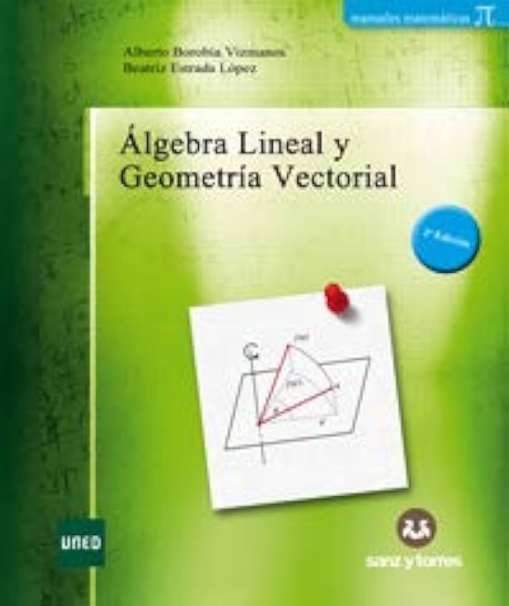
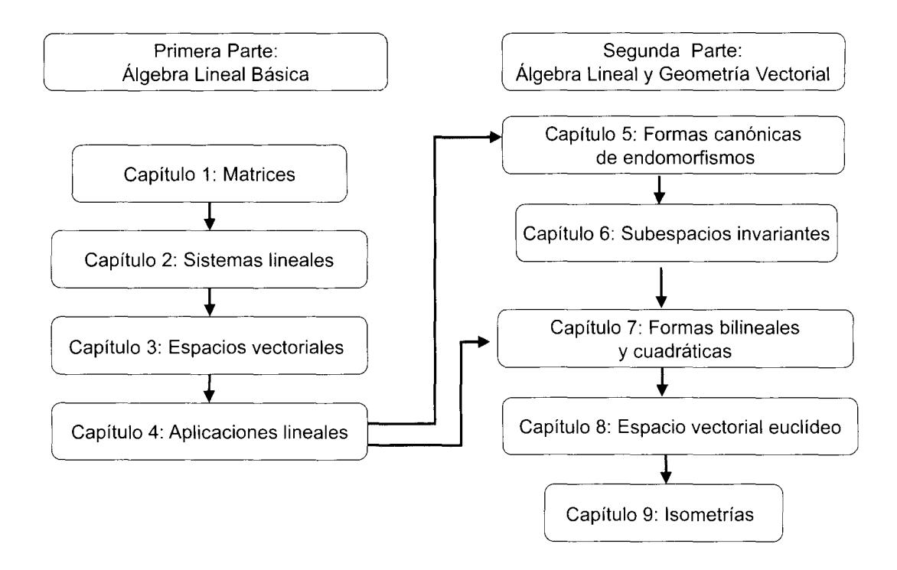

# Álgebra Lineal y Geometría Vectorial

## Alberto Borobia Vizmanos 
## Beatriz Estrada López

Departamento de Matemáticas Fundamentales 
Facultad de Ciencias
Universidad Nacional de Educación a Distancia

---
# ÁLGEBRA LINEAL Y GEOMETRÍA VECTORIAL

El editor no se hace responsable de las opiniones recogidas, comentarios y manifestaciones vertidas por las autores. La presente obra recoge exclusivamente la opinión de su autor como manifestación de su derecho de libertad de expresión.

La Editorial se opone expresamente a que cualquiera de las páginas de esta obra o partes de ella sean utilizadas para la realización de resúmenes de prensa.

Cualquier forma de reproducción, distribución, comunicación pública o transformación de esta obra solo puede ser realizada con la autorización de sus titulares, salvo excepción prevista por la ley. Diríjase a CEDRO (Centro Español de Derechos Reprográficos) si necesita fotocopiar o escanear algún fragmento de esta obra.

Por tanto, este libro no podrá ser reproducido total o parcialmente, ni transmitirse por procedimientos electrónicos, mecánicos, magnéticos o por sistemas de almacenamiento y recuperación informáticos o cualquier otro medio, quedando prohibidos su préstamo, alquiler o cualquier otra forma de cesión de uso del ejemplar, sin el permiso previo, por escrito, del titular o titulares del copyright.

© Alberto Borobia Vizmanos y Beatriz Estrada López

© EDITORIAL SANZY TORRES, S. L.

Vereda de los Barros, 17
Pol. Ind. Ventorro del Cano – 28925 Alcorcón (Madrid)
902 400 416 - 91 323 71 10
www.sanzytorres.com
libreria@sanzytorres.com
www.editorialsanzytorres.com
editorial@sanzytorres. com

ISBN: 978-84-17765-04-0 Depósito legal: M-27178-2019

Portada: Javier Rojo Abuín

Composición: Autores

Impresión: Medianil Gráfico, S. L., c/ Edison, 23, Pol. Ind. San Marcos, 28906 Getafe (Madrid)

Encuadernación: Felipe Méndez, S. A., c/Del Carbón, 6 v 8, Pol. Ind. San José de Valderas 2, 28918 Leganés (Madrid)

---
A Rosana

A mis padres

---
## Prólogo de la primera edición

Los temas desarrollados en el libro se han ajustado para cubrir el temario de un curso anual de Álgebra Lineal del Grado en Matemáticas de la Facultad de Ciencias de la UNED, repartido en dos asignaturas cuatrimestrales: Álgebra Lineal I (Capítulos 1 al 4) y Álgebra Lineal II (Capítulos 5 al 9). La experiencia docente en estas asignaturas sugiere la utilización de un texto único que maneje la misma notación y tenga una presentación de resultados adecuada para la enseñanza a distancia. Hay gran cantidad de libros que se ajustan al temario que se presenta en los Capítulos 1 al 4, cuyos contenidos son los propios de las asignaturas de Álgebra Lineal de las distintas Facultades de Ciencias e Ingenierías. No así en lo referente a los Capítulos 5 y 6, que no estaban entre los estándares de los contenidos de Álgebra Lineal impartidos en primeros cursos de Licenciaturas.

El libro está específicamente elaborado para estudiantes de primer curso de la UNED, que estudian la mayor parte del tiempo sin tener contacto con un profesor. Se ha procurado incluir todo tipo de explicaciones y ejemplos sencillos que faciliten la comprensión de los conceptos. También se incluyen un buen número de ejercicios propuestos en cada capítulo y todos ellos están resueltos al final. La metodología que se aconseja es la de intentar resolverlos uno mismo, con la experiencia de los ejemplos detalladamente resueltos que se han visto a lo largo del desarrollo de los temas, y sólo consultar las soluciones tras haber realizado un esfuerzo personal. Muchos de estos ejercicios (no todos) están extraídos de exámenes de años anteriores, por lo que suponen una buena referencia del nivel de exigencia esperado.

Entrando en materia, y simplificando en exceso, podríamos definir el Álgebra como aquella disciplina dentro de las Matemáticas que se dedica a la resolución de ecuaciones algebraicas: lineales, cuadráticas, cúbicas, con una o varias incógnitas... Es mucho simplificar, sí, y se descubrirá enseguida el por qué. Pero sí es cierto que con el objetivo de la resolución de ecuaciones se han desarrollado las teorías algebraicas.

El Álgebra Lineal se interesa por las ecuaciones lineales, que son ecuaciones con varias incógnitas y todas ellas de grado 1. Y por resolver varias ecuaciones que tienen que cumplirse a la vez, que son los sistemas lineales. El estudio de las propiedades que cumplen las soluciones de los sistemas lineales nos lleva de lo concreto a lo general: que es el estudio de los espacios vectoriales. Un espacio vectorial es una estructura algebraica abstracta cuyos elementos cumplen las mismas propiedades que cumplen las soluciones de los sistemas lineales homogéneos. Podríamos decir que los espacios vectoriales son el medio ambiente en el que viven los objetos que estudia el Álgebra Lineal.

Las matrices juegan un papel central en el estudio de los espacios vectoriales finitos y los sistemas lineales. De las matrices, que también son elementos de un espacio vectorial, nos vamos a servir en todos los capítulos para representar de una manera cómoda los sistemas lineales y los vectores de los espacios vectoriales. Tan cómoda que facilitarán mucho el trabajo de cálculo y demostración de propiedades. Por ello, hemos decidido introducirlas en el primer capítulo, cosa poco frecuente en los textos de Álgebra Lineal, y disponer de ellas desde el principio.

Una vez introducidas las matrices y las operaciones y propiedades correspondientes, en el Capítulo 2 resolvemos los sistemas lineales representándolos matricialmente. En el Capítulo 3 se introduce formalmente la estructura algebraica de espacio vectorial a cuyos elementos llamamos vectores. Los espacios vectoriales finitos, que son los que estudiaremos, tienen la propiedad de que con un conjunto finito de vectores llamado base podemos obtener y representar todos los vectores del espacio, de modo que lo que le pase a los vectores de la base será determinante para concluir propiedades en el conjunto del espacio vectorial. El Capítulo 4 se dedica a las aplicaciones propias entre espacios vectoriales denominadas aplicaciones lineales, que también representaremos matricialmente para estudiar sus propiedades.

En la segunda parte del libro: Capítulos 5 a 9, se desarrollan los contenidos de la asignatura Álgebra Lineal II y aumenta el nivel de dificultad. Una de las labores de las Matemáticas en sus distintas disciplinas, y en general de la Ciencia, consiste en la clasificación de objetos para determinar sus parecidos y diferencias sustanciales. En el Capítulo 5 se lleva a cabo la clasificación de las aplicaciones lineales de un espacio vectorial en sí mismo, a las que llamaremos endomorfismos. Dos endomorfismos serán de la misma clase si tienen la misma representación matricial canónica. En el Capítulo 6 seguimos estudiando propiedades que comparten endomorfismos de la misma clase como son los subespacios invariantes. En estos capítulos estamos estudiando Geometría Vectorial con herramientas algebraicas.

En el Capítulo 7 se introducen un tipo de aplicaciones en espacios vectoriales que transforman parejas de vectores y se denominan aplicaciones bilineales. Estudiaremos sus propiedades más importantes y las clasificaremos. Las formas bilineales simétricas y definidas positivas permiten definir una operación con vectores del espacio denominada producto escalar. En los capítulos Capítulo 8 y 9 trabajaremos con espacios vectoriales euclídeos, que son aquéllos en los que se dispone de un producto escalar, que permite establecer una forma de medir longitudes y ángulos entre vectores. Estaremos estudiando Geometría Vectorial Euclídea. En particular, en el Capítulo 9 se clasificarán los endomorfismos de un espacio vectorial euclídeo que conservan las longitudes y ángulos entre vectores, a los que llamaremos isometrías vectoriales o transformaciones ortogonales.

Los autores Profesores Titulares Departamento de Matemáticas Fundamentales UNED Madrid, julio de 2015.

---
## Prólogo de la segunda edición

La mayor parte de los cambios realizados en esta segunda edición del libro han estado motivados por las sugerencias de los estudiantes del Grado en Matemáticas de la UNED que lo han utilizado durante varios cursos. A ellos agradecemos su crítica constructiva. En este sentido, hemos incluido más detalles en muchas demostraciones para facilitar su comprensión, y más ejemplos para ilustrar conceptos y métodos.

También ha supuesto un cambio importante la inclusión de más de 40 ejercicios nuevos. Algunos han aparecido en exámenes de Álgebra Lineal, por lo que el nivel de exigencia es muy representativo para los estudiantes. Esto ha supuesto un aumento significativo del número de páginas, aunque no se han añadido nuevos contenidos.

Los autores Profesores Titulares Departamento de Matemáticas Fundamentales UNED Madrid, julio de 2019.

---
### Mapa Conceptual

El siguiente esquema refleja la relación de dependencia entre los contenidos de los distintos capítulos del libro.

---

### Tabla de símbolos
| Símbolo                                                    | Significado                                                                                     |     |     |
| ---------------------------------------------------------- | ----------------------------------------------------------------------------------------------- | --- | --- |
| $\mathbb{K}$                                               | Cuerpo.                                                                                         |     |     |
| $\mathbb{R}$                                               | Cuerpo de los números reales.                                                                   |     |     |
| $\mathbb{C}$                                               | Cuerpo de los números complejos.                                                                |     |     |
| $\mathbb{K}^n$                                             | Producto cartesiano $\mathbb{K} \times \cdots \times \mathbb{K}$                                |     |     |
| $\mathbb{K}[x]$                                            | Conjunto de polinomios en la indeterminada $x$ con coeficientes en $\mathbb{K}$.                |     |     |
| $\mathbb{K}_n[x]$                                          | Conjunto de polinomios de $\mathbb{K}[x]$ con grado menor o igual que $n$.                      |     |     |
| $\mathfrak{M}_{m \times n}(\mathbb{K})$                    | Matrices de tamaño $m \times n$ con entradas en $\mathbb{K}$.                                   |     |     |
| $\mathfrak{M}_n(\mathbb{K})$                               | Matrices de orden $n$ con entradas en $\mathbb{K}$.                                             |     |     |
| $a_{ij}$ o $[A]_{ij}$                                      | Entrada en la fija $i$ y en la columna $j$ de la matriz $A$.                                    |     |     |
| $A_{ij}$                                                   | Submatriz obtenida eliminando la fija $i$ y la columna $j$ de la matriz $A$.                    |     |     |
| $A^t, \overline{A}, A^*$                                   | Matriz traspuesta, matriz conjugada y matriz traspuesta conjugada de la matriz A.               |     |     |
| $A \sim_f B$                                               | La matriz A es equivalente por filas a la matriz B.                                             |     |     |
| $A \sim_c B$                                               | La matriz $A$ es equivalente por columnas a la matriz $B$.                                      |     |     |
| $A \sim B$                                                 | La matriz $A$ es equivalente a la matriz $B$.                                                   |     |     |
| $H_f(A), H_c(A)$                                           | Formas de Hermite por filas y por columnas de la matriz $A$.                                    |     |     |
| $\text{rg}(A)$                                             | Rango de la matriz $A$.                                                                         |     |     |
| $\text{rg}\{v_1,\ldots,v_n\}$                              | Rango del conjunto de vectores $\{v_1, \ldots, v_n\}$.                                          |     |     |
| $\text{det}(A)$                                            | Determinante de la matriz $A$.                                                                  |     |     |
| $\text{Adi}(A)$                                            | Matriz adjunta de la matriz $A$.                                                                |     |     |
| $\Delta_k(A)$                                              | Menor principal de orden $k$ de la matriz $A$.                                                  |     |     |
| $\alpha_{ij}$                                              | Adjunto de la entrada $a_{ij}$ de la matriz $A$.                                                |     |     |
| $\delta_{ij}$                                              | Delta de Kronecker.                                                                             |     |     |
| $AX = B$                                                   | Representación matricial de un sistema lineal.                                                  |     |     |
| $V$                                                        | Espacio vectorial.                                                                              |     |     |
| $V^*$                                                      | Espacio dual del espacio vectorial V.                                                           |     |     |
| $\mathcal{B} = \{v_1, \dots, v_n\}$                        | Base de un espacio vectorial de dimensión $n$.                                                  |     |     |
| $L(v_1,\ldots,v_n)$                                        | Subespacio vectorial generado por los vectores $v_1, \ldots, v_n$.                              |     |     |
| $A - B$                                                    | El conjunto formado por los elementos de $A$ que no pertenecen a $B$.                           |     |     |
| $A \subseteq B$                                            | El conjunto A está contenido en el conjunto B pudiendo ser $A = B$.                             |     |     |
| $A \subsetneq B$                                           | El conjunto A está contenido en el conjunto B siendo $A \neq B$.                                |     |     |
| $U \cap W$                                                 | Espacio vectorial intersección de los subespacios vectoriales $U$ y $W$.                        |     |     |
| $U+W$                                                      | Espacio vectorial suma de los subespacios vectoriales $U \text{ y } W$.                         |     |     |
| $U \oplus W$                                               | Espacio vectorial suma directa de los subespacios vectoriales $U \text{ y } W$.                 |     |     |
| $U \stackrel{\perp}{\oplus} W$                             | Espacio vectorial suma directa ortogonal de los subespacios vectoriales $U \times W$.           |     |     |
| $V/U$                                                      | Espacio vectorial cociente del espacio vectorial $V$ módulo el subespacio vectorial $U$.        |     |     |
| $\mathfrak{M}_{\mathcal{B}\mathcal{B}'}$                   | Matriz de cambio de base de $\mathcal{B} \text{ a } \mathcal{B}'$.                              |     |     |
| $\mathfrak{M}_{\mathcal{B}}\{v_1 \vert \cdots \vert v_n\}$ | Matriz de coordenadas de $\{v_1, \ldots, v_n\}$ respecto de la base $\mathcal{B}$ por columnas. |     |     |
| $\mathfrak{M}_{\mathcal{B}\mathcal{B}'}(f)$                | Matriz de la aplicación lineal $f$ respecto de las bases $\mathcal{B} \vee \mathcal{B}'$.       |     |     |
| $\mathfrak{M}_{\mathcal{B}}(f)$                            | Matriz del endomorfismo $f$ respecto de la base $\mathcal{B}$.                                  |     |     |
| $\text{Ker}(f)$                                            | Núcleo de la aplicación lineal $f$.                                                             |     |     |
| $\text{Im}(f)$                                             | Imagen de la aplicación lineal $f$.                                                             |     |     |
| $f\vert_U$                                                 | Aplicación restricción de $f$ al subespacio vectorial $U$.                                      |     |     |
| $\mathcal{L}(U,V)$                                         | Espacio vectorial de las aplicaciones lineales  $f:U\to V$.                                     |     |     |
| $\mathcal{L}(V)$                                           | Espacio vectorial de los endomorfismos del espacio vectorial $V$.                               |     |     |
| $GL(V)$                                                    | Grupo general lineal formado por los automorfismos del espacio vectorial $V$.                   |     |     |
| $GL(n, \mathbb{K})$                                        | Grupo de matrices regulares de orden $n$ con entradas en  $\mathbb{K}$ .                        |     |     |
| $\lambda$                                                  | Autovalor de una aplicación lineal.                                                             |     |     |
| $p_f(\lambda)$                                             | Polinomio característico del endomorfismo $f$.                                                  |     |     |
| $m_f(\lambda)$                                             | Polinomio mínimo del endomorfismo $f$.                                                          |     |     |
| $V_{\lambda}$                                              | Subespacio propio asociado al autovalor  $\lambda$ .                                            |     |     |
| $K^i(\lambda)$                                             | Subespacio generalizado *i*-ésimo asociado al autovalor $\lambda$ .                             |     |     |
| $M(\lambda)$                                               | Subespacio máximo asociado al autovalor $\lambda$.                                              |     |     |
| $J, J_{\mathbb{R}}$                                        | Matriz de Jordan y matriz de Jordan real.                                                       |     |     |
| $\mathcal{BL}(V)$                                          | Espacio vectorial formado por las formas bilineales del espacio vectorial $V$.                  |     |     |
| $\Phi$                                                     | Forma cuadrática.                                                                               |     |     |
| $\mathfrak{M}_{\mathcal{B}}(\Phi)$                         | Matriz de la forma cuadrática $\Phi$ respecto de la base $\mathcal{B}$.                         |     |     |
| $sg(\Phi)$, $sg(f)$                                        | Signatura de la forma cuadrática $\Phi$ y signatura de la forma bilineal $f$.                   |     |     |
| $U^c$                                                      | Subespacio conjugado del subespacio vectorial $U$.                                              |     |     |
| $(V, <, >)$                                                | Espacio vectorial euclídeo.                                                                     |     |     |
| $\langle u, v \rangle$                                     | Producto escalar de los vectores $u$ por $v$.                                                   |     |     |
| $\vert \vert v \vert \vert$                                 | Norma del vector $v$.                                                                           |     |     |
| $G_{\mathcal{B}}$ | Matriz de un producto escalar (o matriz de Gram) respecto de la base  $\mathcal{B}$. |
| $u \perp v$ | El vector $u$ es ortogonal al vector $v$. |
| $U^{\pm}$ | Subespacio ortogonal al subespacio vectorial $U$. |
| $\mathcal{O}(V)$ | Grupo ortogonal del espacio vectorial euclídeo $V$. |
| $u \wedge v$ | Producto vectorial de los vectores $u$ por $v$. |
| $[u, v, w]$ | Producto mixto de los vectores $u$, $v$ y $w$. |
| $\angle(u,v)$ | Angulo entre los vectores  $u$ y $v$ . |

---
## Índice general

| #     | Contenido                                          |     |
| ----- | ----- | ------------------------------------------ | --- |
| 1.    | **Matrices**                                           | 1   |
| 1.1.  | Operaciones con matrices                           | 5   |
| 1.2.  | Método de Gauss                                    | 16  |
| 1.3.  | El rango de una matriz                             | 34  |
| 1.4.  | La inversa de una matriz cuadrada                  | 42  |
| 1.5.  | El determinante de una matriz cuadrada             | 53  |
| 1.6.  | Ejercicios propuestos                              | 72  |
| 2.    | **Sistemas lineales**                                 | 75  |
| 2.1.  | Sistemas lineales equivalentes                     | 78  |
| 2.2.  | Discusión y resolución de sistemas lineales        | 81  |
| 2.3.  | Factorización LU                                   | 93  |
| 2.4.  | Ejercicios propuestos                              | 97  |
| 3.    | **Espacios vectoriales**                               | 99  |
| 3.1.  | Dependencia e independencia lineal                 | 104 |
| 3.2.  | Sistemas generadores                               | 109 |
| 3.3.  | Bases                                              | 112 |
| 3.4.  | Rango de un conjunto de vectores                   | 120 |
| 3.5.  | Matriz de cambio de base                           | 125 |
| 3.6.  | Subespacios vectoriales                            | 128 |
| 3.7.  | Ecuaciones paramétricas e implícitas               | 134 |
| 3.8.  | Intersección y suma de subespacios vectoriales     | 141 |
| 3.9.  | El espacio cociente módulo un subespacio vectorial | 149 |
| 3.10. | Ejercicios propuestos                              | 153 |
| 4.    | **Aplicaciones lineales**                              | 157 |
| 4.1.  | El núcleo y la imagen de una aplicación lineal.    | 167 |
| 4.2.  | Tipos de aplicaciones lineales                     | 169 |
| 4.3.  | Matriz de una aplicaciém lineal                    | 176 |
| 4.4.  | Endormorfismos                                     | 184 |
| 4.5.  | Proyecciones y simetrías                           | 186 |
| 4.6.  | El espacio dual                                    | 192 |
| 4.7.  | Ejercicios propuestos                              | 196 |
| 5.    | **Formas canónicas de endomorfismos**              | 199 |
| 5.1.  | Invariantes lineales                               | 199 |
| 5.2.  | Autovalores y autovectores. Endomorfismos diagonalizables | 200 |
| 5.3.  | Forma canónica de Jordan                                  | 211 |
| 5.4.  | Forma de Jordan Real                                      | 231 |
| 5.5.  | Ejercicios propuestos                                     | 240 |
| 6.    | **Subespacios invariantes**                                   | 243 |
| 6.1.  | Rectas e hiperplanos invariantes                          | 245 |
| 6.2.  | Descomposición de subespacios invariantes                 | 251 |
| 6.3.  | Subespacios invariantes y polinomios                      | 258 |
| 6.4.  | Ejercicios propuestos                                     | 268 |
| 7.    | **Formas bilineales y cuadráticas**                           | 271 |
| 7.1.  | Introducción                                                         | 271 |
| 7.2.  | Matriz de una forma bilineal                                         | 275 |
| 7.3.  | Formas cuadráticas                                                   | 279 |
| 7.4.  | Diagonalización de formas bilineales simétricas y formas cuadráticas | 283 |
| 7.5.  | Diagonalización por congruencia                                      | 291 |
| 7.6.  | Clasificación de formas bilineales simétricas y cuadráticas reales   | 294 |
| 7.7.  | Formas sesquilineales                                                | 299 |
| 7.8.  | Ejercicios propuestos                                                | 302               |
| 8.    | **Espacio vectorial euclídeo**                                           | 305               |
| 8.1.  | Producto escalar                                                     | 305               |
| 8.2.  | Matriz de un producto escalar                                        | 308               |
| 8.3.  | Norma y ángulo                                                       | 310               |
| 8.4.  | Ortogonalidad. Bases ortogonales y ortonormales                      | 313               |
| 8.5.  | Subespacios ortogonales. Proyección ortogonal                        | 318               |
| 8.6.  | Producto vectorial                                                   | 324               |
| 8.7.  | Diagonalización por semejanza ortogonal                              | 329               |
| 8.8.  | Autovalores y signatura de una matriz simétrica real                 | 333               |
| 8.9.  | Solución aproximada de un sistema lineal incompatible                | 335               |
| 8.10. | Descomposiciones matriciales                                         | 341               |
| 8.11. | Producto hermítico                                                   | 345               |
| 8.12. | Ejercicios propuestos                                                | 346               |
| 9     | **Isometrías vectoriales**                                               | 349               |
| 9.1.  | Definición y caracterizaciones                                       | 349               |
| 9.2.  | Clasificación de isometrías                                          | 355               |
| 9.3.  | Isometrías de un espacio euclídeo bidimensional                      | 359               |
| 9.4.  | Isometrias de un espacio euclídeo tridimensional                     | 362               |
| 9.4.  | Isometrias de diffespacio edendeo tridimensional                     | 367               |
| 9.6.  | Ejercicios propuestos                                                | 372 |
|       | **Soluciones de los ejercicios**                                         | 375               |

---
