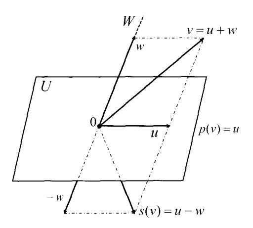

# Capítulo 4: Aplicaciones lineales

El capítulo anterior lo dedicamos al estudio de los espacios vectoriales. Recordamos que las operaciones esenciales que definen a un espacio vectorial son dos: se pueden sumar vectores y se puede multiplicar un vector por un escalar. Es natural estudiar aquellas aplicaciones entre espacios vectoriales que respetan estas operaciones, esto es, que a la suma de vectores le hagan corresponder la suma de sus imágenes y que al producto de un escalar por un vector le hagan corresponder el escalar por la imagen del vector. Este tipo de aplicaciones son conocidas como aplicaciones lineales.

#### Definición 4.1

Una aplicación  $f: U \to V$  entre  $\mathbb{K}$  –espacios vectoriales es una **aplicación lineal** si para todo  $u, w \in U$  y todo  $\alpha \in \mathbb{K}$  se cumplen las propiedades:

(i) 
$$f(u+w) = f(u) + f(w)$$
 y (ii)  $f(\alpha u) = \alpha f(u)$ 

O, equivalentemente, si para cualesquiera  $u, w \in U$  y  $\alpha, \beta \in \mathbb{K}$  se cumple la propiedad.

(iii) 
$$f(\alpha u + \beta w) = \alpha f(u) + \beta f(w)$$

Probamos la equivalencia entre ambas definiciones:

(i),  $(ii) \Rightarrow (iii)$ . Tenemos que  $f(\alpha u + \beta w) = f(\alpha u) + f(\beta w) = \alpha f(u) + \beta f(w)$ , donde la primera igualdad se sigue de (i) y la segunda igualdad de (ii).

 $(iii) \Rightarrow (i), (ii)$ . Tomando  $\alpha = \beta = 1$  se sigue (i), y tomando  $\beta = 0$  se sigue (ii).

Denotamos  $\mathcal{L}(U, V)$  al conjunto de las aplicaciones lineales entre dos  $\mathbb{K}$ -espacios vectoriales U y V.

$$\mathcal{L}(U,V) \equiv \{\ f: U \to V\ : \ f \ \text{es una aplicación lineal}\ \}$$

#### Ejemplo 4.2

Veamos algunos ejemplos de aplicaciones lineales:

1. Si U es un subespacio vectorial de V, entonces la **inclusión** 

$$\begin{array}{cccc} i: & U & \longrightarrow & V \\ & u & \mapsto & i(u) = u \end{array}$$

es lineal puesto que para cualesquiera  $u, w \in U$  y  $\alpha, \beta \in \mathbb{K}$  se cumple

$$i(\alpha u + \beta w) = \alpha u + \beta w = \alpha i(u) + \beta i(w)$$

En particular, si U = V a esta aplicación se la llama **identidad** y se denota por Id:  $V \to V$ .

2. La aplicación nula  $0: U \to V$  que a todo vector  $u \in U$  le hace corresponder vector  $0_V$  (el cero de V) es lineal ya que

$$0(\alpha u + \beta w) = 0_V$$
 y  $\alpha 0(u) + \beta 0(w) = \alpha 0_V + \beta 0_V = 0_V$ 

3. Para cualquier escalar  $\lambda \in \mathbb{K}$  la homotecia de razón  $\lambda$  dada por

$$\begin{array}{cccc} h: & V & \longrightarrow & V \\ & v & \mapsto & h(v) = \lambda v \end{array}$$

es lineal puesto que para cualesquiera  $u, w \in V$  y  $\alpha, \beta \in \mathbb{K}$  se cumple

$$h(\alpha u + \beta w) = \lambda(\alpha u + \beta w) = \alpha \lambda u + \beta \lambda w = \alpha h(u) + \beta h(w)$$

4. La trasposición de matrices

$$t: \mathfrak{M}_{m \times n}(\mathbb{K}) \longrightarrow \mathfrak{M}_{n \times m}(\mathbb{K})$$
  
 $A \mapsto t(A) = A^t$ 

es lineal puesto que para cualesquiera  $A, B \in \mathfrak{M}_{m \times n}(\mathbb{K})$  y  $\alpha, \beta \in \mathbb{K}$  se cumple

$$t(\alpha A + \beta B) = (\alpha A + \beta B)^t = (\alpha A)^t + (\beta B)^t = \alpha A^t + \beta B^t = \alpha t(A) + \beta t(B)$$

5. Dada la matriz  $A \in \mathfrak{M}_{m \times n}(\mathbb{K})$  la aplicación

$$F_A: \mathfrak{M}_{n \times p}(\mathbb{K}) \longrightarrow \mathfrak{M}_{m \times p}(\mathbb{K})$$
  
 $B \mapsto F_A(B) = AB$ 

es lineal puesto que para cualesquiera  $B, C \in \mathfrak{M}_{n \times p}(\mathbb{K})$  y  $\alpha, \beta \in \mathbb{K}$  se cumple

$$F_A(\alpha B + \beta C) = A(\alpha B + \beta C) = \alpha AB + \beta AC = \alpha F_A(B) + \beta F_A(C)$$

6. Toda matriz  $A \in \mathfrak{M}_{m \times n}(\mathbb{K})$  define una aplicación lineal

$$f_A: \mathbb{K}^n \longrightarrow \mathbb{K}^m$$

$$x \mapsto f_A(x) = y$$

Al vector  $x=(x_1,\ldots,x_n)\in\mathbb{K}^n$  le asociamos la matriz columna X de tamaño  $n\times 1$  cuyas entradas son las componentes de x, calculamos AX=Y y a la matriz columna Y de tamaño  $m\times 1$  le asociamos el vector  $y=(y_1,\ldots,y_m)\in\mathbb{K}^m$  cuyas componentes son las entradas de Y.

7. La aplicación que a cada polinomio real de  $\mathbb{R}[x]$  le asigna su derivada

$$D: \mathbb{R}[x] \longrightarrow \mathbb{R}[x]$$

$$p(x) \mapsto D(p(x)) = p'(x)$$

es lineal puesto que para cualesquiera  $p(x), q(x) \in \mathbb{R}[x]$  y  $\alpha, \beta \in \mathbb{R}$  se cumple

$$D(\alpha p(x) + \beta q(x)) = (\alpha p(x) + \beta q(x))' = \alpha p'(x) + \beta q'(x) = \alpha D(p(x)) + \beta D(q(x))$$

8. La aplicación que a cada función real continua en el intervalo [a, b] le asigna su integral

$$Int: C[a,b] \longrightarrow \mathbb{R}$$

$$f \mapsto Int(f) = \int_a^b f(x) dx$$

es lineal puesto que para cualesquiera  $f,g\in C[a,b]$  y  $\alpha,\beta\in\mathbb{R}$  se cumple

$$Int(\alpha f + \beta g) = \int_{a}^{b} (\alpha f(x) + \beta g(x)) dx = \alpha \int_{a}^{b} f(x) dx + \beta \int_{a}^{b} g(x) dx = \alpha Int(f) + \beta Int(g)$$

9. Si U es un subespacio vectorial de V y V/U el espacio cociente de V módulo U, entonces la aplicación

$$\pi: V \longrightarrow V/U$$
 $v \mapsto \pi(v) = v + U$ 

es lineal puesto que para cualesquiera  $v, w \in V$  y  $\alpha, \beta \in \mathbb{K}$  se cumple

$$\pi(\alpha v + \beta w) = (\alpha v + \beta w) + U = \alpha v + U + \beta w + U$$
$$= \alpha(v + U) + \beta(w + U) = \alpha \pi(v) + \beta \pi(w)$$

#### Ejemplo 4.3

Decida en cada caso si la función dada es una aplicación lineal de  $\mathbb{R}^2$  en  $\mathbb{R}^2$ :

1. 
$$f(x_1, x_2) = (-x_2, 3x_1 + 2x_2)$$
.

2. 
$$q(x_1, x_2) = (x_1^2, x_1 + x_2).$$

**Solución:** Sean  $u = (u_1, u_2)$ ,  $v = (v_1, v_2) \in \mathbb{R}^2$  y  $\alpha, \beta \in \mathbb{R}$ .

(1) En este caso tenemos que

$$f(\alpha u + \beta v) = f(\alpha(u_1, u_2) + \beta(v_1, v_2))$$

$$= f(\alpha u_1 + \beta v_1, \alpha u_2 + \beta v_2)$$

$$= (-(\alpha u_2 + \beta v_2), 3(\alpha u_1 + \beta v_1) + 2(\alpha u_2 + \beta v_2))$$

$$= \alpha(-u_2, 3u_1 + 2u_2) + \beta(-v_2, 3v_1 + 2v_2)$$

$$= \alpha f(u_1, u_2) + \beta f(v_1, v_2) = \alpha f(u) + \beta f(v)$$

v aplicando la Definición 4.1 concluimos que f es una aplicación lineal.

(2) La función q no respeta el producto por escalares. Vamos a verlo:

$$g(\alpha u) = g(\alpha u_1, \alpha u_2) = ((\alpha u_1)^2, \alpha u_1 + \alpha u_2) = (\alpha^2 u_1^2, \alpha u_1 + \alpha u_2)$$
  

$$\alpha g(u) = \alpha g(u_1, u_2) = \alpha(u_1^2, u_1 + u_2) = (\alpha u_1^2, \alpha u_1 + \alpha u_2)$$

Si comparamos ambos vectores vemos que las primeras coordenadas no coinciden

$$\alpha^2 u_1^2 \neq \alpha u_1^2$$

ya que no se cumple la igualdad, por ejemplo, para  $\alpha=2$  y  $u_1=1.$  Y por lo tanto

$$g(\alpha u + \beta v) \neq \alpha g(u) + \beta g(v)$$

y q no es una aplicación lineal.

Una forma alternativa de demostrar que una aplicación no es lineal consiste en encontrar vectores concretos para los que no se cumpla alguna de las dos propiedades de la definición de aplicación lineal. En el caso de la función q tenemos, por ejemplo, que

$$g(2(1.1)) = g(2.2) = (4.4)$$
  $y$   $2g(1.1) = 2(1.2) = (2.4)$ .

Por tanto no se cumple  $q(\alpha u) = \alpha q(u)$  para u = (1,1) y  $\alpha = 2$ , y concluimos que q no es lineal.  $\square$ 

### Propiedades básicas de las aplicaciones lineales

#### Proposición 4.4

Sea  $f: U \to V$  una aplicación lineal. Son ciertas las afirmaciones:

- 1.  $f(0_U) = 0_V$ .
- 2.  $f(\alpha_1 u_1 + \dots + \alpha_n u_n) = \alpha_1 f(u_1) + \dots + \alpha_n f(u_n) \quad \forall u_1, \dots, u_n \in U \text{ y } \forall \alpha_1, \dots, \alpha_n \in \mathbb{K}.$
- 3. f preserva la dependencia lineal.

**Demostración:** 1. Sea  $u \in U$ . Como  $0_U = u - u$  entonces  $f(0_U) = f(u - u) = f(u) - f(u) = 0_V$ .

2. Aplicamos de forma reiterada las propiedades que definen a una aplicación lineal:

$$f(\alpha_1 u_1 + \alpha_2 u_2 + \dots + \alpha_n u_n) = f(\alpha_1 u_1) + f(\alpha_2 u_2 + \dots + \alpha_n u_n)$$

$$\vdots$$

$$= f(\alpha_1 u_1) + f(\alpha_2 u_2) + \dots + f(\alpha_n u_n)$$

$$= \alpha_1 f(u_1) + \alpha_2 f(u_2) + \dots + \alpha_n f(u_n)$$

3. Que f preserva la dependencia lineal quiere decir que si  $u_1, \ldots, u_n$  son vectores de U linealmente dependientes, entonces  $f(u_1), \ldots, f(u_n)$  son vectores de V linealmente dependientes. Veámoslo. Sean  $u_1, \ldots, u_n$  vectores de U linealmente dependientes, entonces existen  $\alpha_1, \ldots, \alpha_n \in \mathbb{K}$  no todos nulos tales que

$$\alpha_1 u_1 + \dots + \alpha_n u_n = 0_U$$

Entonces

$$\alpha_1 f(u_1) + \dots + \alpha_n f(u_n) = f(\alpha_1 u_1 + \dots + \alpha_n u_n) = f(0_U) = 0_V$$

y por lo tanto  $f(u_1), \ldots, f(u_n)$  son linealmente dependientes.  $\square$ 

#### Ejemplo 4.5

La aplicación  $h:\mathbb{R}^2\to\mathbb{R}^2$ dada por

$$h(x_1, x_2) = (x_1 + 1, 3x_1 + x_2)$$

no es lineal ya que  $h(0,0)=(1,0)\neq (0,0)$ .

La propiedad 2 del anterior resultado nos dice que toda aplicación lineal transforma combinaciones lineales de vectores de U en combinaciones lineales de sus imágenes, que son vectores de V. Como consecuencia se tiene el siguiente resultado.

#### Proposición 4.6

Una aplicación lineal queda determinada de forma única conociendo las imágenes de los vectores de una base. Es decir, sean U y V dos  $\mathbb{K}$  –espacios vectoriales,  $\mathcal{B} = \{u_1, \dots u_n\}$  una base de U y  $v_1, \dots, v_n$  vectores de V; entonces existe una única aplicación lineal  $f: U \to V$  tal que  $f(u_i) = v_i$  para  $i = 1, \dots, n$ .

**Demostración:** Sea f la aplicación definida por

$$f(x) = x_1 f(u_1) + \dots + x_n f(u_n)$$

para todo vector  $x = (x_1, \dots, x_n)_{\mathcal{B}}$  de U, con  $f(u_i) = v_i$  para  $i = 1, \dots, n$ . Comprobamos que f es lineal. Sean  $x = (x_1, \dots, x_n)_{\mathcal{B}}, y = (y_1, \dots, y_n)_{\mathcal{B}} \in U$  y  $\alpha, \beta \in \mathbb{K}$ , entonces

$$f(\alpha x + \beta y) = f((\alpha x_1 + \beta y_1, \dots, \alpha x_n + \beta y_n)_{\mathcal{B}})$$

$$= (\alpha x_1 + \beta y_1) f(u_1) + \dots + (\alpha x_n + \beta y_n) f(u_n)$$

$$= \alpha (x_1 f(u_1) + \dots + x_n f(u_n)) + \beta (y_1 f(u_1) + \dots + y_n f(u_n))$$

$$= \alpha f(x) + \beta f(y)$$

Demostremos la unicidad. Sea  $g: U \to V$  otra aplicación lineal tal que  $g(u_i) = v_i$  para  $i = 1, \ldots, n$ . Entonces, como ambas son lineales, para todo  $x = (x_1, \ldots, x_n)_{\mathcal{B}} \in U$  se cumple

$$f(x) = x_1 f(u_1) + \dots + x_n f(u_n) = x_1 v_1 + \dots + x_n v_n = x_1 g(u_1) + \dots + x_n g(u_n) = g(x)$$

#### Ejemplo 4.7

Sean  $f, g: \mathbb{R}^2 \to \mathbb{R}^2$  aplicaciones lineales.

- 1. Si f(1,0) = (3,2) y f(0,1) = (-1,1) calcule f(x,y) para cualquier vector  $(x,y) \in \mathbb{R}^2$ .
- 2. Si g(-2,1)=(1,2) y g(1,-1)=(0,1) calcule g(x,y) para cualquier vector  $(x,y)\in\mathbb{R}^2$ .

Solución: 1. Conocemos el valor que toma f en cada uno de los vectores de la base canónica. Por ser f una aplicación lineal tenemos que

$$f(x,y) = f(x(1,0) + y(0,1)) = xf(1,0) + yf(0,1) = x(3,2) + y(-1,1) = (3x - y, 2x + y)$$

2. Conocemos el valor que toma g en cada uno de los vectores de una base distinta de la canónica. Entonces también es sencillo, pero no tan immediato, calcular la imagen de un vector cualquiera. Como  $\{(-2,1),(1,-1)\}$  es una base de  $\mathbb{R}^2$  entonces todo  $(x,y) \in \mathbb{R}^2$  se puede expresar como una combinación lineal de (-2,1) y (1,-1). Esto es.

$$(x, y) = \alpha(-2, 1) + \beta(1, -1)$$

o lo que es lo mismo

$$\begin{cases} x = -2\alpha + \beta \\ y = \alpha - \beta \end{cases}$$

que es un sistema compatible determinado en las incógnitas  $\alpha$  y  $\beta$  cuya solución única es

$$(\alpha, \beta) = (-x - y, -x - 2y)$$

Por ser g una aplicación lineal tenemos que

$$g(x,y) = g((-x-y)(-2,1) + (-x-2y)(1,-1))$$

$$= (-x-y)g(-2,1) + (-x-2y)g(1,-1)$$

$$= (-x-y)(1,2) + (-x-2y)(0,1)$$

$$= (-x-y, -3x-4y) \square$$

### Operaciones con aplicaciones lineales

Sean U, V, W subespacios vectoriales sobre  $\mathbb{K}$ . Sean

$$f: U \to V, g: U \to V \text{ y } h: V \to W$$

aplicaciones lineales, y sea  $\lambda$  un escalar de  $\mathbb{K}$ .

La suma de las aplicaciones lineales f y g es la aplicación f+g definida por

$$\begin{array}{cccc} f+g: & U & \longrightarrow & V \\ & u & \mapsto & (f+g)(u) = f(u) + g(u) \end{array}$$

El producto del escalar  $\lambda$  por la aplicación lineal f es la aplicación  $\lambda f$  definida por

$$\begin{array}{cccc} \lambda f: & U & \longrightarrow & V \\ & u & \mapsto & (\lambda f)(u) = \lambda f(u) \end{array}$$

La composición de las aplicaciones lineales f y h es la aplicación  $h \circ f$  definida por

$$
\begin{array}{cccc}
h \circ f: & U  & \longrightarrow  & W \\
& u & \mapsto & (h \circ f)(u) = h(f(u))
\end{array}
$$

La composición  $h \circ f$  se lee de derecha a izquierda, por lo que nos referiremos a ella como f compuesta con h. Primero actúa f transformando los vectores de U en vectores de V y a continuación actúa h transformando los vectores de V en vectores de W. Lo visualizamos en el siguiente esquema:
$$
\begin{array}{ccccccc}
h \circ f : &
U &
\xrightarrow{\;f\;} &
V &
\xrightarrow{\;h\;} &
W
\\[0.8ex]
&
u &
\longmapsto &
f(u) &
\longmapsto &
h(f(u))
\end{array}
$$
#### Proposición 4.8
Sean
$$
f: U \to V, \quad g: U \to V \quad y \quad h: V \to W$$

aplicaciones lineales entre K –espacios vectoriales. Entonces

- 1. La suma f + g es una aplicación lineal.
- 2. El producto  $\lambda f$  es una aplicación lineal.
- 3. La composición  $h \circ f$  es una aplicación lineal.

**Demostración:** Sean  $u_1, u_2 \in U$  y  $\alpha, \beta \in \mathbb{K}$  entonces:

$$(f+g)(\alpha u_{1} + \beta u_{2}) = f(\alpha u_{1} + \beta u_{2}) + g(\alpha u_{1} + \beta u_{2})$$

$$= \alpha f(u_{1}) + \beta f(u_{2}) + \alpha g(u_{1}) + \beta g(u_{2})$$

$$= \alpha (f(u_{1}) + g(u_{1})) + \beta (f(u_{2}) + g(u_{2}))$$

$$= \alpha (f+g)(u_{1}) + \beta (f+g)(u_{2})$$

$$(\lambda f)(\alpha u_{1} + \beta u_{2}) = \lambda f(\alpha u_{1} + \beta u_{2}) = \lambda (\alpha f(u_{1}) + \beta f(u_{2}))$$

$$= \alpha \lambda f(u_{1}) + \beta \lambda f(u_{2}) = \alpha (\lambda f)(u_{1}) + \beta (\lambda f)(u_{2})$$

$$(h \circ f)(\alpha u_{1} + \beta u_{2}) = h(f(\alpha u_{1} + \beta u_{2})) = h(\alpha f(u_{1}) + \beta f(u_{2}))$$

$$= \alpha h(f(u_{1})) + \beta h(f(u_{2})) = \alpha (h \circ f(u_{1})) + \beta (h \circ f(u_{2}))$$

Se puede comprobar que en  $\mathcal{L}(U,V)$  la operación interna suma de aplicaciones y la operación externa producto de un escalar por una aplicación cumplen las ocho propiedades del espacio vectorial.

#### Proposición 4.9

Sean U y V dos espacios vectoriales sobre  $\mathbb{K}$ . El conjunto  $\mathcal{L}(U,V)$  de aplicaciones lineales de U en V tiene estructura de  $\mathbb{K}$  —espacio vectorial con las operaciones suma y producto por escalares.

El siguiente objetivo es estudiar cómo las aplicaciones lineales transforman los subespacios vectoriales.

#### Definición 4.10

Sea  $f:U\to V$  una aplicación entre los conjuntos U y V. Sean  $U'\subseteq U$  y  $V'\subseteq V$ .

- El conjunto **imagen** de U' por f es  $f(U') = \{f(u) : u \in U'\} \subseteq V$ .
- El conjunto imagen inversa o recíproca de V' por f es  $f^{-1}(V') = \{u \in U : f(u) \in V'\} \subseteq U$ .

**Observación:** En la definición del conjunto imagen recíproca  $f^{-1}(V')$  de un conjunto V',  $f^{-1}$  no denota a la aplicación inversa de f, de la que hablaremos más adelante. A la aplicación f no se le exige que sea biyectiva y por tanto no tiene por qué existir su inversa. Por ejemplo, si  $f: \mathbb{R}^2 \to \mathbb{R}$  es la aplicación nula, f(x,y) = 0 para todo  $(x,y) \in V$ , no existe aplicación inversa ya que f no es biyectiva; y el conjunto imagen recíproca (o inversa) de  $\{0\} \subseteq V$  por f es

$$f^{-1}(\{0\}) = \{(x,y) \in \mathbb{R}^2 : f(x,y) = 0\} = \mathbb{R}^2$$

#### Teorema 4.11

Sea  $f:U\to V$  una aplicación lineal. Son ciertas las afirmaciones:

- 1. La imagen por f de un subespacio vectorial de U es un subespacio vectorial de V. Además, si  $U' = L(u_1, ..., u_k)$  entonces  $f(U') = L(f(u_1), ..., f(u_k))$ , con dim  $U' \ge \dim f(U')$ .
- 2. La imagen inversa por f de un subespacio vectorial de V es un subespacio vectorial de U.

**Demostración:** 1. Sea U' un subespacio vectorial de U. En primer lugar f(U') es un subconjunto no vacío de V puesto que  $f(0_U) = 0_V \in f(U')$ . Por otro lado, si  $v_1$  y  $v_2$  son vectores de f(U') entonces existen vectores  $u_1$  y  $u_2$  de U' tales que  $f(u_1) = v_1$  y  $f(u_2) = v_2$ . De manera que si  $\alpha_1$  y  $\alpha_2$  son elementos de  $\mathbb{K}$  entonces

$$\alpha_1 v_1 + \alpha_2 v_2 = \alpha_1 f(u_1) + \alpha_2 f(u_2) = f(\alpha_1 u_1 + \alpha_2 u_2)$$

también es un vector de f(U'). Y por tanto f(U') es un subespacio vectorial de V. Supongamos que dim U' = k y  $U' = L(u_1, \ldots, u_k)$ , entonces para todo  $u \in U'$  existen escalares  $\alpha_1, \ldots, \alpha_k$  tales que

$$u = \alpha_1 u_1 + \cdots + \alpha_k u_k$$

v por linealidad de f se tiene que

$$f(u) = f(\alpha_1 u_1 + \dots + \alpha_n u_n) = \alpha_1 f(u_1) + \dots + \alpha_n f(u_n)$$

Luego  $\{f(u_1), \ldots, f(u_n)\}$  es un sistema generador de f(U') y dim  $f(U') \le k = \dim U'$ .

2. Sea V' un subespacio vectorial de V, entonces su imagen inversa  $f^{-1}(V')$  es un subconjunto no vacío de U puesto que  $0_U \in f^{-1}(\{0_V\})$ . Por otro lado, si  $u_1$  y  $u_2$  son vectores de  $f^{-1}(V')$  entonces existen vectores  $v_1$  y  $v_2$  de V' tales que  $f(u_1) = v_1$  y  $f(u_2) = v_2$ . De manera que si  $\alpha_1$  y  $\alpha_2$  son elementos de  $\mathbb{K}$  entonces

$$f(\alpha_1 u_1 + \alpha_2 u_2) = \alpha_1 f(u_1) + \alpha_2 f(u_2) = \alpha_1 v_1 + \alpha_2 v_2 \in V'$$

y, por tanto,  $\alpha_1 u_1 + \alpha_2 u_2 \in f^{-1}(V')$ . Luego  $f^{-1}(V')$  es un subespacio vectorial de U.  $\square$ 

Observación: Hemos visto que una aplicación lineal conserva la dependencia lineal. El siguiente ejemplo muestra que no ocurre lo mismo con la independencia lineal, es decir, que una aplicación lineal no siempre transforma vectores linealmente independientes en vectores linealmente independientes.

Ejemplo 4.12

Sea f la aplicación lineal definida por

$$f: \mathbb{R}^4 \longrightarrow \mathbb{R}^3 (x_1, x_2, x_3, x_4) \mapsto (y_1, y_2, y_3) = (x_1 + x_2, x_1 + x_2, x_1 + x_2 + x_3)$$

Si U = L((1,0,0,0),(0,1,0,0)) entonces la imagen por f de U es

$$f(U) = L(f(1,0,0.0), f(0,1.0,0)) = L((1,1.1), (1.1.1)) = L((1,1.1))$$

y por tanto

$$\dim(f(U)) = 1 < \dim(U) = 2$$

La aplicación f ha transformado el plano U de  $\mathbb{R}^4$  en la recta L((1,1,1)) de  $\mathbb{R}^3$ .

Observamos que dos vectores linealmente independientes de  $\mathbb{R}^4$ , (1.0,0,0) y (0,1,0.0), se transforman en el mismo vector (1,1,1) de  $\mathbb{R}^3$ . Y por lo tanto f no transforma vectores linealmente independientes en vectores linealmente independientes.

Ahora vamos a calcular el conjunto imagen inversa del plano  $P \equiv \{y_3 = 0\}$  de  $\mathbb{R}^3$ :

$$f^{-1}(P) = \{(x_1, x_2, x_3, x_4) \in \mathbb{R}^4 : f(x_1, x_2, x_3, x_4) \in P \}$$
  
=  $\{(x_1, x_2, x_3, x_4) \in \mathbb{R}^4 : (x_1 + x_2, x_1 + x_2, x_1 + x_2 + x_3) \in P \}$ 

El vector  $(x_1 + x_2, x_1 + x_2, x_1 + x_2 + x_3)$  pertence a P si su tercera componente es igual a 0, es decir

$$f^{-1}(P) = \{(x_1, x_2, x_3, x_4) \in \mathbb{R}^4 : x_1 + x_2 + x_3 = 0\}$$

En este caso

$$f^{-1}(P) \equiv \{x_1 + x_2 + x_3 = 0\}$$

es un hiperplano de  $\mathbb{R}^4$ .  $\square$ 

## 4.1. El núcleo y la imagen de una aplicación lineal

Asociados a una aplicación lineal  $f: U \to V$  hay dos subespacios vectoriales relevantes que nos van a aportar información para clasificar las aplicaciones lineales en distintos tipos. Se trata de:

• El **núcleo de** f, formado por todos aquellos vectores de U cuya imagen por f es el vector 0:

$$Ker(f) = \{u \in U : f(u) = 0\} = f^{-1}(\{0\})$$

• La imagen de f, formado por todos aquellos vectores de V que son imagen por f de algún vector de U:

$$\operatorname{Im}(f) = \{ v \in V : v = f(u) \text{ para algún } u \in U \} = f(U)$$

Del Teorema 4.11 se sigue que si  $U = L(u_1, \dots, u_n)$  entonces  $Im(f) = L(f(u_1), \dots, f(u_n))$ .

El núcleo de f y la imagen de f son subespacios vectoriales por ser, respectivamente, imagen inversa e imagen por f de subespacios vectoriales. Sus dimensiones están relacionadas con la dimensión de U.

#### Teorema 4.13: Fórmula de dimensiones

Para toda aplicación lineal  $f: U \to V$  se cumple la igualdad:

$$\dim(U) = \dim(\operatorname{Ker}(f)) + \dim(\operatorname{Im}(f))$$

**Demostración:** Sea  $\{u_1, \ldots, u_r\}$  una base de Ker(f) y sea

$$\{u_1,\ldots,u_r;u'_1,\ldots,u'_s\}$$

una extensión de la base de Ker(f) a una base de U. Consideramos sus imágenes por f:

$$\{f(u_1), \dots, f(u_r); f(u_1'), \dots, f(u_s')\} = \{0, \dots, 0; f(u_1'), \dots, f(u_s')\}$$

El Teorema 4.11 nos dice que  $\{f(u'_1), \ldots, f(u'_s)\}$  es un sistema generador de  $\operatorname{Im}(f) = f(U)$ . Ve amos que es una base. Para eso veremos que los vectores  $f(u'_1), \ldots, f(u'_s)$  son linealmente independientes. Supongamos que existen  $\gamma_1, \ldots, \gamma_s \in \mathbb{K}$  no todos nulos tales que  $\gamma_1 f(u'_1) + \cdots + \gamma_s f(u'_s) = 0$ . Entonces

$$f(\gamma_1 u_1' + \dots + \gamma_s u_s') = \gamma_1 f(u_1') + \dots + \gamma_s f(u_s') = 0$$

Luego  $\gamma_1 u_1' + \dots + \gamma_s u_s'$  es un vector no nulo de  $\operatorname{Ker}(f)$  que no pertenece a  $L(u_1, \dots, u_r) = \operatorname{Ker}(f)$ . Contradicción. Es decir,  $\{f(u_1'), \dots, f(u_s')\}$  es una base de  $\operatorname{Im}(f)$  y

$$\dim(U) = r + s = \dim(\operatorname{Ker}(f)) + \dim(\operatorname{Im}(f))$$

#### Ejemplo 4.14

Sea  $f: \mathbb{K}^3 \to \mathbb{K}^2$  la aplicación lineal dada por

$$f(x_1, x_2, x_3) = (x_1 + 2x_2 + 3x_3, 2x_1 + 4x_2 + 6x_3)$$

Vamos a determinar los subespacios núcleo e imagen de de f:

$$\operatorname{Ker}(f) = \{(x_1, x_2, x_3) \in \mathbb{K}^3 : f(x_1, x_2, x_3) = (0, 0)\} 
= \{(x_1, x_2, x_3) \in \mathbb{K}^3 : x_1 + 2x_2 + 3x_3 = 0, 2x_1 + 4x_2 + 6x_3 = 0\}$$

Las dos ecuaciones que definen a Ker(f) son redundantes, pues son proporcionales. Eliminamos una de las ecuaciones y así nos quedamos con la ecuación implícita

$$Ker(f) \equiv \{ x_1 + 2x_2 + 3x_3 = 0 \}$$

Ahora podemos aplicar la fórmula de dimensiones (véase la página 135):

$$\dim \operatorname{Ker}(f) = \dim \mathbb{R}^3 - n^{\circ}$$
 ecuaciones implícitas =  $3 - 1 = 2$ 

Para calcular el subespacio imagen de f consideramos una base del subespacio origen  $\mathbb{K}^3$ , por ejemplo la canónica

$$\mathcal{B} = \{(1,0,0), (0,1,0), (0,0,1)\}$$

Entonces, el subespacio imagen de f es

$$Im(f) = f(\mathbb{K}^3) = L(f(1.0,0), f(0,1,0), f(0,0.1))$$
$$= L((1.2), (2.4), (3,6))$$
$$= L((1,2))$$

Obteniendo que  $\mathrm{Im}(f)$  es un subespacio de dimensión 1.

Comprobamos que se cumple la fórmula de dimensiones del Teorema 4.13:

$$\dim(\mathbb{R}^3) = \dim(\operatorname{Ker}(f)) + \dim(\operatorname{Im}(f)) = 2 + 1 = 3 \qquad \Box$$

## 4.2. Tipos de aplicaciones lineales

Sea  $f:A\to B$  una aplicación entre dos conjuntos cualesquiera A y B, recordamos que:

- f es **inyectiva** si para cada  $a_1, a_2 \in A$  con  $a_1 \neq a_2$  se cumple que  $f(a_1) \neq f(a_2)$ .
- f es sobreyectiva si para cada  $b \in B$  existe un  $a \in A$  tal que f(a) = b. Esto es, si f(A) = B.
- f es biyectiva si es a la vez invectiva y sobrevectiva.

Si  $f: A \to B$  es una aplicación biyectiva, entonces para todo  $a \in A$  existe un único  $b \in B$  tal que f(a) = b, y viceversa, para todo  $b \in B$  existe un único  $a \in A$  tal que f(a) = b. Una aplicación biyectiva establece un emparejamiento, una relación uno a uno, entre todos los elementos de A y todos los de B. En tal caso, se puede definir la aplicación **inversa** de f, y se denota por  $f^{-1}$ , del siguiente modo

$$f^{-1}: \ B \longrightarrow A$$
 
$$b \mapsto f^{-1}(b) = a \qquad \text{donde $a$ es el único elemento de $A$ tal que $f(a) = b$}$$

Si  $f:A\to B$  es biyectiva, entonces  $f^{-1}:B\to A$  es la única aplicación que cumple

$$f^{-1} \circ f = \operatorname{Id}_A$$
 y  $f \circ f^{-1} = \operatorname{Id}_B$ 

Lo representamos en los siguiente esquemas

$$f^{-1} \circ f: A \xrightarrow{f} B \xrightarrow{f^{-1}} A \qquad f \circ f^{-1}: B \xrightarrow{f^{-1}} A \xrightarrow{f} B$$

$$a \mapsto f(a) = b \mapsto f^{-1}(b) = a \qquad f \circ f^{-1}: B \xrightarrow{f^{-1}} A \xrightarrow{f} B$$

#### Proposición 4.15

La aplicación inversa de una aplicación lineal biyectiva es una aplicación lineal biyectiva.

**Demostración:** Sean  $f: U \to V$  una aplicación lineal biyectiva,  $v_1$  y  $v_2$  vectores de V y  $u_1$  y  $u_2$  los únicos vectores de U tales que  $f(u_1) = v_1$  y  $f(u_2) = v_2$ . Si  $\alpha, \beta \in \mathbb{K}$  entonces

$$f(\alpha u_1 + \beta u_2) = \alpha f(u_1) + \beta f(u_2) = \alpha v_1 + \beta v_2$$

v por lo tanto

$$f^{-1}(\alpha v_1 + \beta v_2) = \alpha u_1 + \beta u_2 = \alpha f^{-1}(v_1) + \beta f^{-1}(v_2)$$

luego  $f^{-1}$  es lineal. Además, como consecuencia de su definición,  $f^{-1}$  es biyectiva por serlo f.  $\square$ 

Sea  $f:U\to V$  una aplicación lineal, también denominada **homomorfismo**, decimos que:

- f es un monomorfismo si f es un homomorfismo inyectivo.
- f es un epimorfismo si f es un homomorfismo sobreyectivo.
- $\bullet \ f$ es un isomorfismo si fes un homomorfismo biyectivo.

Una aplicación lineal u homomorfismo vectorial es una aplicación entre espacios vectoriales que respeta la estructura de espacio vectorial. El concepto homomorfismo se extiende también a otras estructuras algebraicas. Una aplicación entre anillos que respeta las operaciones de los anillos es un homomorfismo de anillos, una aplicación entre grupos que se comporta bien respecto a las operaciones de los grupos es un homomorfismo de grupos, etc.

### Monomorfismos v epimorfismos

#### Proposición 4.16

Sea  $f: U \to V$  una aplicación lineal. Son equivalentes las afirmaciones:

- 1. f es un monomorfismo.
- 2. f preserva la independencia lineal.
- 3. La imagen por f de una base de U es una base de Im(f).
- 4.  $\dim(U) = \dim(\operatorname{Im}(f))$ .
- 5.  $Ker(f) = \{0\}.$

**Demostración:**  $1 \Rightarrow 2$ . Tenemos que ver que si  $u_1, \ldots, u_m$  son linealmente independientes en U entonces  $f(u_1), \ldots, f(u_m)$  son linealmente independientes en V. Supongamos que  $f(u_1), \ldots, f(u_m)$  son linealmente dependientes en V. Entonces existen  $\alpha_1, \ldots, \alpha_m \in \mathbb{K}$  no todos nulos tales que

$$0 = \alpha_1 f(u_1) + \dots + \alpha_s f(u_s) = f(\alpha_1 u_1 + \dots + \alpha_m u_m)$$

Como f(0) = 0 y  $f(\alpha_1 u_1 + \cdots + \alpha_m u_m) = 0$ , entonces existen dos vectores distintos con la misma imagen, luego f no es inyectiva. Contradicción.

- $2 \Rightarrow 3$ . Sea  $\{u_1, \ldots, u_m\}$  una base de U, entonces  $\operatorname{Im}(f) = L(f(u_1), \ldots, f(u_m))$ , es decir los vectores  $\{f(u_1), \ldots, f(u_m)\}$  son un sistema generador de  $\operatorname{Im}(f)$ . Como f preserva la independencia lineal,  $f(u_1), \ldots, f(u_m)$  son linealmente independientes y forman una base de  $\operatorname{Im}(f)$ .
- $3 \Rightarrow 4$ . Inmediato.
- $4 \Rightarrow 5$ . De la fórmula de dimensiones se deduce  $\dim(\operatorname{Ker}(f)) = \dim(U) \dim(\operatorname{Im}(f)) = 0$ , luego  $\operatorname{Ker}(f) = \{0\}$ .
- 5 ⇒ 1. Procedemos por reducción al absurdo: supongamos que  $\text{Ker}(f) = \{0\}$  y que f no es inyectiva. entonces existen  $u_1, u_2 \in U$  con  $u_1 \neq u_2$  tales que  $f(u_1) = f(u_2)$ . Luego  $f(u_1 u_2) = f(u_1) f(u_2) = 0$  y  $u_1 u_2$  es un vector no nulo de Ker(f). Por tanto  $\text{Ker}(f) \neq \{0\}$ . lo que contradice la hipótesis de partida.  $\square$

#### Proposición 4.17

Una aplicación lineal  $f:U\to V$  es un epimorfismo si y sólo si la imagen por f de un sistema generador de U es un sistema generador de V.

**Demostración:** Por definición tenemos que f es epimorfismo si y sólo si f(U) = V. Por otro lado, si  $U = L(u_1, \ldots, u_m)$  entonces el subespacio imagen de f viene dado por

$$Im(f) = f(U) = L(f(u_1), \dots f(u_m))$$

Por tanto Im(f) = V si y sólo si  $\{f(u_1), \dots, f(u_m)\}$  es un sistema generador de V.  $\square$ 

#### Ejemplo 4.18

Consideramos la aplicación:

$$
\begin{array}{cccc}
f: & \mathbb{R}_3[x] & \xrightarrow{} & \mathbb{R}^2 \\
& p & \mapsto & (p(1), p(2))
\end{array}
$$

Compruebe que f es una aplicación lineal. ¿Es f un monomorfismo? ¿Es f un epimorfismo?

**Solución:** Para cualesquiera  $p, q \in \mathbb{R}_3[x]$  y  $\alpha, \beta \in \mathbb{R}$  se cumple

$$
\begin{array}{rcl}
f(\alpha p + \beta q) & = & ((\alpha p + \beta q)(1), (\alpha p + \beta q)(2)) \\
& = & (\alpha p(1) + \beta q(1), \alpha p(2) + \beta q(2)) \\
& = & (\alpha p(1), \alpha p(2)) + (\beta q(1), \beta q(2)) \\
& = & \alpha (p(1), p(2)) + \beta (q(1), q(2)) \\
& = & \alpha f(p) + \beta f(q)
\end{array}
$$
y por tanto f es una aplicación lineal. Vamos a calcular el núcleo de f:

$$Ker(f) = \{ p \in \mathbb{R}_3[x] : p(1) = p(2) = 0 \}$$

El Ker(f) está formado por los polinomios de grado menor o igual que 3 que tienen a 1 y a 2 como raíz. Esto implica que Ker $(f) \neq \{0\}$  y por tanto f no es un monomorfismo. Por otro lado, consideramos

$$\{1, x, x^2, x^3\},$$

que es un sistema generador de  $\mathbb{R}_3[x]$ , y sus imágenes por f

$$\{f(1), f(x), f(x^2), f(x^3)\} = \{(1,1), (1,2), (1,4), (1,8)\}$$

Este último conjunto es un sistema generador de  $\mathbb{R}^2$  ya que contiene dos vectores linealmente independientes. Es decir,

$$Im(f) = L(f(1), f(x), f(x^2), f(x^3)) = L((1, 1), (1, 2), (1, 4), (1, 8)) = L((1, 1), (1, 2)) = \mathbb{R}^2$$

De la Proposición 4.17 se sigue que f es un epimorfismo.  $\square$ 

### Isomorfismos

Diremos que dos espacios vectoriales U y V son **isomorfos**. y lo denotaremos por  $U \simeq V$ , si existe un isomorfismo entre U y V. Un isomorfismo  $f:U\to V$ , que recordamos es una aplicación lineal biyectiva, permite establecer una relación uno a uno entre los vectores de U y los de V de modo que las propiedades que se cumplen en el espacio vectorial U tendrán sus correspondientes en V.

Los isomorfismos se utilizan en muchos ámbitos de las matemáticas para simplificar el estudio de problemas del siguiente modo: si U es un espacio vectorial cuyos elementos tienen cierta complejidad, y existe un isomorfismo entre U y un espacio vectorial V de estructura más sencilla, entonces podemos demostrar enunciados aparentemente más complejos en U demostrándolos en V de manera más fácil.

A continuación damos algunos resultados que caracterizan los isomorfismos y sus propiedades.

#### Proposición 4.19

Una aplicación lineal  $f: U \to V$  es un isomorfismo si y sólo si Ker(f) = 0 e Im(f) = V.

**Demostración:** f es inyectiva si y sólo si Ker(f) = 0 y f es sobrevectiva si y sólo si Im(f) = V.  $\square$ 

#### Proposición 4.20

Sea f una aplicación lineal entre espacios vectoriales de igual dimensión. Son equivalentes:

- 1. f es monomorfismo.
- 2. f es epimorfismo.
- 3. f es isomorfismo.

**Demostración:** Sean U y V dos  $\mathbb{K}$  –espacios vectoriales tales que  $\dim(U) = \dim(V) = n$ , y  $f: U \to V$  una aplicación lineal.

 $1 \Rightarrow 2$ . Si f es invectiva entonces

$$\dim(\operatorname{Im}(f)) = \dim(U) - \dim(\operatorname{Ker}(f)) = n - 0 = n$$

Como  $\dim(V) = n$  entonces  $\operatorname{Im}(f) = V$  y f es epimorfismo.

 $2 \Rightarrow 3$ . Si f es sobreyectiva entonces

$$\dim(\operatorname{Ker}(f)) = \dim(U) - \dim(\operatorname{Im}(f)) = \dim(U) - \dim(V) = n - n = 0$$

y f también es inyectiva. Por tanto, f es isomorfismo.

 $3 \Rightarrow 1$ . Obvio.  $\square$ 

#### Teorema 4.21

Ser isomorfo es una relación de equivalencia entre K-espacios vectoriales.

**Demostración:** Para cualesquiera  $\mathbb{K}$ -espacios vectoriales U, V y W se cumplen las propiedades:

- 1. Reflexiva: U es isomorfo a U. La identidad  $\mathrm{Id}: U \to U$  es un isomorfismo por ser una aplicación lineal biyectiva.
- 2. Simétrica: si U es isomorfo a V entonces V es isomorfo a U.
  Sea f: U → V un isomorfismo. Entonces f es biyectiva y f-1: V → U es biyectiva. En la Proposición 4.15 vimos que que f-1 es además una aplicación lineal. Luego f-1 es un isomorfismo.
- 3. Transitiva: si U es isomorfo a V y V es isomorfo a W, entonces U es isomorfo a W. Sean  $f:U\to V$  y  $g:V\to W$  isomorfismos. En la Proposición 4.9 vimos que la composición de aplicaciones lineales es aplicación lineal. Y como f y g son biyectivas entonces  $g\circ f:U\to V$  es biyectiva. Por lo tanto  $g\circ f$  es un isomorfismo.  $\square$

Podemos clasificar los espacios vectoriales isomorfos por su dimensión.

#### Teorema 4.22

Dos K-espacios vectoriales son isomorfos si y sólo si tienen igual dimensión.

**Demostración:**  $\Rightarrow$ ) Un isomorfismo  $f:U\to V$  es inyectivo y sobreyectivo, entonces

$$\dim(U) = \dim(\operatorname{Im}(f)) = \dim(V)$$

 $\Leftarrow$ ) Supongamos  $\dim(U) = \dim(V) = n$  y sean  $\{u_1, \ldots, u_n\}$  una base de U y  $\{v_1, \ldots, v_n\}$  una base de V. Toda aplicación lineal está caracterizada por la imagen de los elementos de una base. Sea  $f: U \to V$  la aplicación lineal dada por  $f(u_i) = v_i$  para  $i = 1, \ldots, n$ . Entonces  $\dim(U) = \dim(\operatorname{Im}(f))$  y, por la Proposición 4.16, f es inyectiva. Además  $V = \operatorname{Im}(f)$  y por tanto f es sobreyectiva. Luego f es un isomorfismo.  $\square$ 

#### Ejemplo 4.23 
Los espacios vectoriales  $\mathbb{K}^{mn}$ ,  $\mathbb{K}_{mn-1}[x]$  y  $\mathfrak{M}_{m\times n}(\mathbb{K})$  son  $\mathbb{K}$ -espacios vectoriales de dimensión mn. Por el Teorema 4.22 son isomorfos. Podemos definir isomorfismos entre ellos considerando las aplicaciones lineales que transforman los vectores de la base canónica de uno de ellos en los vectores la base canónica del otro. En concreto para m = n = 2 el esquema

$$\begin{array}{cccccccccccccccccccccccccccccccccccc$$

nos indica los isomorfismos correspondientes.  $\Box$ 

El Teorema 4.22 nos dice que dos K—espacios vectoriales que tienen la misma dimensión son isomorfos. Eso indica que como espacios vectoriales tienen la misma estructura. Pero es importante entender que en general pueden corresponder a objetos matemáticos distintos, con propiedades que tienen sentido en uno de ellos y no en el otro. Por ejemplo, en el Ejemplo 4.23 vimos que  $\mathfrak{M}_2(\mathbb{K})$  y  $\mathbb{K}_3[x]$  son isomorfos. Lo que hace que  $\mathfrak{M}_2(\mathbb{K})$  y  $\mathbb{K}_3[x]$  sean isomorfos es la suma de vectores (matrices o polinomios) y el producto por escalares de K. Aparte de eso, cada uno de ellos tiene distintas propiedades. Por ejemplo, el producto de dos matrices de  $\mathfrak{M}_2(\mathbb{K})$  es una matriz de  $\mathfrak{M}_2(\mathbb{K})$  y, sin embargo, esta operación no se corresponde con ninguna operación en  $\mathbb{K}_3[x]$ . De hecho, sí que está definido el producto de dos polinomios de  $\mathbb{K}_3[x]$  pero el resultado no tiene por qué ser un polinomio de  $\mathbb{K}_3[x]$  ya que su grado puede ser mayor que 3.

Todo espacio vectorial V de dimensión n es isomorfo a  $\mathbb{K}^n$ . Ya hemos utilizado este hecho para estudiar propiedades del espacio vectorial V traduciéndolas en propiedades de elementos de  $\mathbb{K}^n$  con los que es más sencillo trabajar. Lo hemos hecho mediante el isomorfismo de coordenadas. Véase la página 118. Si  $(x_1, \ldots, x_n)$  son las coordenadas de un vector  $v \in V$  respecto a una base  $\mathcal{B} = \{v_1, \ldots, v_n\}$  entonces la aplicación lineal

$$f_{\mathcal{B}}: V \longrightarrow \mathbb{K}^n$$

$$v = (x_1, \dots, x_n)_{\mathcal{B}} \mapsto (x_1, \dots, x_n)$$

es un isomorfismo ya que los espacios tienen la misma dimensión y la aplicación es inyectiva pues dos vectores distintos tienen coordenadas distintas. Esta aplicación que denominamos **isomorfismo** de coordenadas nos ha permitido, por ejemplo, representar los subespacios vectoriales de cualquier espacio V mediante ecuaciones lineales homogéneas.

### Primer teorema de isomorfía

Sea  $f: U \to V$  una aplicación lineal. Dado que  $\operatorname{Ker}(f)$  es un subespacio vectorial de U podemos construir el subespacio cociente  $U/\operatorname{Ker}(f)$  en el que las clases de equivalencia tienen la forma  $u+\operatorname{Ker}(f)$  con  $u \in U$ , de manera que dos clases  $u_1 + \operatorname{Ker}(f)$  y  $u_2 + \operatorname{Ker}(f)$  son iguales si  $u_1 - u_2 \in \operatorname{Ker}(f)$ .

#### Teorema 4.24: Primer Teorema de Isomorfía

Si  $f \in \mathcal{L}(U,V)$  entonces  $U/\operatorname{Ker}(f)$  e  $\operatorname{Im}(f)$  son isomorfos. Un isomorfismo lo da la aplicación

$$\begin{array}{ccc} \widetilde{f}: & U/\operatorname{Ker}(f) & \longrightarrow & \operatorname{Im}(f) \\ & u+\operatorname{Ker}(f) & \mapsto & f(u) \end{array}$$

**Demostración:** Veamos en primer lugar que  $U/\operatorname{Ker}(f)$  e  $\operatorname{Im}(f)$  son isomorfos. Por el Teorema 3.72

$$\dim(U/\operatorname{Ker}(f)) = \dim(U) - \dim(\operatorname{Ker}(f))$$

y por el Teorema 4.13

$$\dim(\operatorname{Im}(f)) = \dim(U) - \dim(\operatorname{Ker}(f))$$

Luego  $\dim(U/\operatorname{Ker}(f))=\dim(\operatorname{Im}(f))$ y por el Teorema 4.22 son isomorfos.

A continuación veamos que  $\tilde{f}$  es un isomorfismo entre  $U/\operatorname{Ker}(f)$  e  $\operatorname{Im}(f)$ . Primero vemos que la aplicación está bien definida, es decir que no depende del representante de la clase de equivalencia que se tome: si  $u_1 + \operatorname{Ker}(f) = u_2 + \operatorname{Ker}(f)$  tiene que ocurrir que  $\tilde{f}(u_1 + \operatorname{Ker}(f)) = \tilde{f}(u_2 + \operatorname{Ker}(f))$ . En efecto, como  $u_1 - u_2 \in \operatorname{Ker}(f)$ , entonces  $f(u_1 - u_2) = 0$  y por linealidad de f se tiene que  $f(u_1) = f(u_2)$  y así  $\tilde{f}(u_1 + \operatorname{Ker}(f)) = \tilde{f}(u_2 + \operatorname{Ker}(f))$ .

Por otro lado comprobamos que es lineal. Sean  $u_1 + \operatorname{Ker}(f), u_2 + \operatorname{Ker}(f) \in U/\operatorname{Ker}(f)$  y  $\alpha_1, \alpha_2 \in \mathbb{K}$ . Entonces
$$

\begin{aligned}
\tilde{f}\bigl(\alpha_1(u_1+\operatorname{Ker}(f))
+\alpha_2(u_2+\operatorname{Ker}(f))\bigr)
&=
\tilde{f}\bigl((\alpha_1u_1+\alpha_2u_2)+\operatorname{Ker}(f)\bigr)
\\
&=
f(\alpha_1u_1+\alpha_2u_2)
=
\alpha_1f(u_1)+\alpha_2f(u_2)
\\
&=
\alpha_1\tilde{f}(u_1+\operatorname{Ker}(f))
+\alpha_2\tilde{f}(u_2+\operatorname{Ker}(f)).
\end{aligned}

$$

Finalmente, comprobamos que es inyectiva, y como  $\dim(U/\operatorname{Ker}(f)) = \dim(\operatorname{Im}(f))$  también será bi-yectiva. Supongamos  $u_1 + \operatorname{Ker}(f) \neq u_2 + \operatorname{Ker}(f)$  y veamos que sus imágenes por  $\widetilde{f}$  son distintas:

$$
\begin{aligned}
u_1+\operatorname{Ker}(f)\neq u_2+\operatorname{Ker}(f)
&\Longleftrightarrow
u_1-u_2\notin\operatorname{Ker}(f)
\Longleftrightarrow
f(u_1-u_2)\neq0
\\
&\Longleftrightarrow
f(u_1)-f(u_2)\neq0
\Longleftrightarrow
f(u_1)\neq f(u_2)
\\
&\Longleftrightarrow
\tilde{f}(u_1+\operatorname{Ker}(f))
\neq
\tilde{f}(u_2+\operatorname{Ker}(f)).
\qquad \square
\end{aligned}

$$
Obviamente f y  $\widetilde{f}$  están relacionadas ya que  $\widetilde{f}$  se define a partir de f. A continuación vamos a hacer esta relación más evidente. Definimos las aplicaciones lineales
$$
\begin{array}{rcccc}
\pi : &
U &
\longrightarrow &
U/\operatorname{Ker}(f)
\\[0.8ex]
&
u &
\longmapsto &
u+\operatorname{Ker}(f)
\end{array}
\qquad\qquad
\text{e} :
\qquad
\begin{array}{cccc}
\iota : & \operatorname{Im}(f) &
\longrightarrow &
V
\\[0.8ex]
& v &
\longmapsto &
v
\end{array}
$$

donde  $\pi$ es un epimorfismo e i (inclusión de  $\mathrm{Im}(f)$  en V)es un monomorfismo. Comprobamos que para todo  $u\in U$ 

$$(i \circ \widetilde{f} \circ \pi)(u) = (i \circ \widetilde{f})(u + \operatorname{Ker}(f)) = i(f(u)) = f(u)$$

y por lo tanto

$$f = i \circ \widetilde{f} \circ \pi$$

A esta expresión se la denomina **descomposición canónica** de f. Toda aplicación lineal es igual a la composición de un epimorfismo  $\pi$  con un isomorfismo  $\tilde{f}$  y con un monomorfismo i. Esta descomposición queda reflejada en el siguiente diagrama commutativo:

$$\begin{array}{ccc} 
U & \stackrel{f}{\longrightarrow} & V \\
\pi\!\downarrow & & \uparrow{i} & \\ U/\operatorname{Ker}(f) & \stackrel{\widetilde{f}}{\longrightarrow} & \operatorname{Im}(f) \end{array}$$

Nota: Se dice que el diagrama commuta para expresar que  $f=i\circ\widetilde{f}\circ\pi.$ 

## 4.3. Matriz de una aplicación lineal

Sean  $f \in \mathcal{L}(U, V)$ ,  $\mathcal{B} = \{u_1, \dots, u_n\}$  una base de U.  $\mathcal{B}' = \{v_1, \dots, v_m\}$  una base de V,

$$x = (x_1, \dots, x_n)_{\mathcal{B}} = x_1 u_1 + \dots + x_n u_n$$

la expresión en coordenadas de  $x \in U$  respecto de  $\mathcal{B}$  y

$$f(x) = y = (y_1, \dots, y_m)_{\mathcal{B}'} = y_1 v_1 + \dots + y_m v_m$$

la expresión en coordenadas de su imagen  $f(x) \in V$  respecto de  $\mathcal{B}'$ .

Vamos a construir una matriz que transforma las coordenadas de x respecto de  $\mathcal{B}$  en las coordenadas de f(x) = y respecto de  $\mathcal{B}'$ . Para ello necesitamos conocer las coordenadas de las imágenes por f de los vectores de  $\mathcal{B}$  respecto de  $\mathcal{B}'$ . Si

$$
\begin{array}{c}
f(u_1) = a_{11}v_1 + \dots + a_{1m}v_m \\
\vdots \\
f(u_n) = a_{n1}v_1 + \dots + a_{nm}v_n
\end{array}
$$

Entonces

$$
\begin{array}{rcl}
f(x) & = & f(x_1u_1 + \dots + x_nu_n) \\
& = & x_1f(u_1) + \dots + x_nf(u_n) \\
& = & x_1(a_{11}v_1 + \dots + a_{1m}v_m) + \dots + x_n(a_{n1}v_1 + \dots + a_{nm}v_m) \\
& = & (a_{11}x_1 + \dots + a_{n1}x_n)v_1 + \dots + (a_{1m}x_1 + \dots + a_{nm}x_n)v_m
\end{array}
$$

De la unicidad de las coordenadas de f(x) respecto de  $\mathcal{B}'$  se sigue que

$$\begin{cases} a_{11}x_1 + \dots + a_{n1}x_n = y_1 \\ \vdots \\ a_{1m}x_1 + \dots + a_{nm}x_n = y_m \end{cases}$$
$$(4.1)$$

que en forma matricial es

$$\begin{pmatrix} a_{11} & \cdots & a_{n1} \\ \vdots & \ddots & \vdots \\ a_{1m} & \cdots & a_{nm} \end{pmatrix} \begin{pmatrix} x_1 \\ \vdots \\ x_n \end{pmatrix} = \begin{pmatrix} y_1 \\ \vdots \\ y_m \end{pmatrix}$$

$$(4.2)$$

#### Definición 4.25

La matriz de la izquierda de la Ecuación (4.2) se denota  $\mathfrak{M}_{\mathcal{BB}'}(f)$  y se denomina

matriz de 
$$f$$
 respecto de las bases  $\mathcal{B} = \{u_1, \dots, u_n\}$  de  $U$  y  $\mathcal{B}' = \{v_1, \dots, v_m\}$  de  $V$ 

Es de tamaño  $m \times n$  y su columna j está formada por las coordenadas de  $f(u_j)$  respecto de  $\mathcal{B}'$ .

Observamos que  $\mathfrak{M}_{\mathcal{B}\mathcal{B}'}(f)$  coincide con la matriz de coordenadas de  $\{f(u_1),\ldots,f(u_n)\}$  respecto de  $\mathcal{B}'$  por columnas (página 123):

$$\mathfrak{M}_{\mathcal{B}\,\mathcal{B}'}(f) = \mathfrak{M}_{\mathcal{B}'}\{f(u_1) \mid \dots \mid f(u_n)\}$$

Para toda base  $\mathcal{B} = \{u_1, \dots, u_n\}$  de U, el subespacio imagen de f es  $\mathrm{Im}(f) = L(f(u_1), \dots, f(u_n))$ . Entonces el rango de la matriz de f es igual a su dimensión

$$\operatorname{rg}(\mathfrak{M}_{\mathcal{BB}'}(f)) = \dim(\operatorname{Im}(f))$$

Sean X la matriz columna de coordenadas de x respecto de  $\mathcal{B}$  e Y la matriz columna de coordenadas de f(x) respecto de  $\mathcal{B}'$ . La ecuación (4.2) se puede escribir de forma abreviada

$$\mathfrak{M}_{\mathcal{B}\mathcal{B}'}(f)X = Y \tag{4.3}$$

Se denomina expresión analítica o ecuaciones de f respecto de las bases  $\mathcal{B}$  y  $\mathcal{B}'$  a cualquiera de las expresiones equivalentes (4.1), (4.2) o (4.3).

#### Ejemplo 4.26: Matriz de la aplicación identidad

Si f = Id entonces  $\mathfrak{M}_{\mathcal{B}\mathcal{B}'}(\text{Id})$  es la matriz que transforma las coordenadas de x respecto de  $\mathcal{B}$  en las coordenadas de Id(x) = x respecto de  $\mathcal{B}'$  y por lo tanto es la matriz de cambio de base de  $\mathcal{B}$  a  $\mathcal{B}'$ . Esto es.

$$\mathfrak{M}_{\mathcal{B}\,\mathcal{B}'}(\mathrm{Id}) = \mathfrak{M}_{\mathcal{B}\,\mathcal{B}'} \qquad \square$$

#### Ejemplo 4.27 
Sea  $\mathcal{B} = \{u_1, u_2\}$  una base de U y sea  $\mathcal{B}' = \{v_1, v_2, v_3\}$  una base de V. Sean dos aplicaciones lineales f y g de U en V definidas por

$$
\begin{array}{lcl}
\begin{array}{l}
f(u_1) = 3v_1 + 6v_2 - 3v_3 \\
f(u_2) = v_1 + 5v_2 - v_3
\end{array}
& \text{y} &
\begin{array}{l}
g(3u_1 - 2u_2) = 3v_1 + 6v_2 - 3v_3 \\
g(4u_1 - 3u_2) = v_1 + 5v_2 - v_3
\end{array}
\end{array}
$$

Calcule  $\mathfrak{M}_{\mathcal{B}\mathcal{B}'}(f)$  y  $\mathfrak{M}_{\mathcal{B}\mathcal{B}'}(g)$ .

**Solución:** La columna j de  $\mathfrak{M}_{\mathcal{BB}'}(f)$  está formada por las coordenadas de  $f(u_j)$  respecto de  $\mathcal{B}'$ . Como

$$f(u_1) = 3v_1 + 6v_2 - 3v_3 = (3, 6, -3)_{\mathcal{B}'}$$
  
$$f(u_2) = v_1 + 5v_2 - v_3 = (1, 5, -1)_{\mathcal{B}'}$$

entonces

$$\mathfrak{M}_{\mathcal{B}\,\mathcal{B}'}(f) = \begin{pmatrix} \boxed{3} & \boxed{1} \\ 6 & \boxed{5} \\ -3 & \boxed{-1} \end{pmatrix}$$

A partir del rango de esta matriz podemos determinar si f es inyectiva y/o sobreyectiva. Como  $\operatorname{rg}(\mathfrak{M}_{\mathcal{BB}'}(f))=2$ , entonces  $\dim(\operatorname{Im}(f))=2$  y, por tanto,  $\operatorname{Im}(f)\neq V$ . Es decir, f no es sobreyectiva. Por otro lado,  $\dim(U)=\dim(\operatorname{Im}(f))$  implica que f es inyectiva.

Para calcular  $\mathfrak{M}_{\mathcal{B}\mathcal{B}'}(g)$  tendremos en cuenta que conocemos las imágenes por g de  $w_1 = 3u_1 - 2u_2$  y de  $w_2 = 4u_1 - 3u_2$ . Necesitamos, por lo tanto, conocer las coordenadas de  $u_1$  y de  $u_2$  respecto de la base  $\{w_1, w_2\}$  de U. Vamos a calcularlas:

$$u_1 = \alpha w_1 + \beta w_2 = \alpha (3u_1 - 2u_2) + \beta (4u_1 - 3u_2) = (3\alpha + 4\beta)u_1 + (-2\alpha - 3\beta)u_2 \Rightarrow (\alpha, \beta) = (3, -2)u_2 = \alpha w_1 + \beta w_2 = \alpha (3u_1 - 2u_2) + \beta (4u_1 - 3u_2) = (3\alpha + 4\beta)u_1 + (-2\alpha - 3\beta)u_2 \Rightarrow (\alpha, \beta) = (4, -3)u_2 + \beta (4u_1 - 3u_2) = (3\alpha + 4\beta)u_1 + (-2\alpha - 3\beta)u_2 \Rightarrow (\alpha, \beta) = (4, -3)u_1 + (-3\alpha - 3\beta)u_2 \Rightarrow (\alpha, \beta) = (3\alpha + 4\beta)u_1 + (-3\alpha - 3\beta)u_2 \Rightarrow (\alpha, \beta) = (3\alpha + 4\beta)u_1 + (-3\alpha - 3\beta)u_2 \Rightarrow (\alpha, \beta) = (3\alpha + 4\beta)u_1 + (-3\alpha - 3\beta)u_2 \Rightarrow (\alpha, \beta) = (3\alpha + 4\beta)u_1 + (-3\alpha - 3\beta)u_2 \Rightarrow (\alpha, \beta) = (3\alpha + 4\beta)u_1 + (-3\alpha - 3\beta)u_2 \Rightarrow (\alpha, \beta) = (3\alpha + 4\beta)u_1 + (-3\alpha - 3\beta)u_2 \Rightarrow (\alpha, \beta) = (3\alpha + 4\beta)u_1 + (-3\alpha - 3\beta)u_2 \Rightarrow (\alpha, \beta) = (3\alpha + 4\beta)u_1 + (-3\alpha - 3\beta)u_2 \Rightarrow (\alpha, \beta) = (3\alpha + 4\beta)u_1 + (-3\alpha - 3\beta)u_2 \Rightarrow (\alpha, \beta) = (3\alpha + 4\beta)u_1 + (-3\alpha - 3\beta)u_2 \Rightarrow (\alpha, \beta) = (3\alpha + 4\beta)u_1 + (-3\alpha - 3\beta)u_2 \Rightarrow (\alpha, \beta) = (3\alpha + 4\beta)u_1 + (-3\alpha - 3\beta)u_2 \Rightarrow (\alpha, \beta) = (3\alpha + 4\beta)u_1 + (-3\alpha - 3\beta)u_2 \Rightarrow (\alpha, \beta) = (3\alpha + 4\beta)u_1 + (-3\alpha - 3\beta)u_2 \Rightarrow (\alpha, \beta) = (3\alpha + 4\beta)u_1 + (-3\alpha - 3\beta)u_2 \Rightarrow (\alpha, \beta) = (3\alpha + 4\beta)u_1 + (-3\alpha - 3\beta)u_2 \Rightarrow (\alpha, \beta) = (3\alpha + 4\beta)u_1 + (-3\alpha - 3\beta)u_2 \Rightarrow (\alpha, \beta) = (3\alpha + 4\beta)u_1 + (-3\alpha - 3\beta)u_2 \Rightarrow (\alpha, \beta) = (3\alpha + 4\beta)u_1 + (-3\alpha - 3\beta)u_2 \Rightarrow (\alpha, \beta) = (3\alpha + 3\beta)u_2 + (3\alpha + 3\beta)u_2 \Rightarrow (\alpha, \beta) = (3\alpha + 3\beta)u_2 + (3\alpha + 3\beta)u_2 + (3\alpha + 3\beta)u_2 \Rightarrow (\alpha, \beta) = (3\alpha + 3\beta)u_2 + (3\alpha + 3\beta)u_2 \Rightarrow (\alpha, \beta) = (3\alpha + 3\beta)u_2 + (3\alpha + 3\beta)u_2 \Rightarrow (\alpha, \beta) = (3\alpha + 3\beta)u_2 + (3\alpha + 3\beta)u_2 \Rightarrow (\alpha, \beta) = (3\alpha + 3\beta)u_2 + (3\alpha + 3\beta)u_2 \Rightarrow (\alpha, \beta) = (3\alpha + 3\beta)u_2 + (3\alpha + 3\beta)u_2 \Rightarrow (\alpha, \beta) = (3\alpha + 3\beta)u_2 + (3\alpha + 3\beta)u_2 \Rightarrow (\alpha, \beta) = (3\alpha + 3\beta)u_2 \Rightarrow (\alpha, \beta) = (3\alpha + 3\beta)u_2 \Rightarrow (\alpha, \beta) = (3\alpha + 3\beta)u_2 \Rightarrow (\alpha, \beta) = (3\alpha + 3\beta)u_2 \Rightarrow (\alpha, \beta) = (3\alpha + 3\beta)u_2 \Rightarrow (\alpha, \beta) = (3\alpha + 3\beta)u_2 \Rightarrow (\alpha, \beta) = (3\alpha + 3\beta)u_2 \Rightarrow (\alpha, \beta) = (3\alpha + 3\beta)u_2 \Rightarrow (\alpha, \beta) = (3\alpha + 3\beta)u_2 \Rightarrow (\alpha, \beta) = (3\alpha + 3\beta)u_2 \Rightarrow (\alpha, \beta) = (3\alpha + 3\beta)u_2 \Rightarrow (\alpha, \beta) = (3\alpha + 3\beta)u_2 \Rightarrow (\alpha, \beta) = (3\alpha + 3\beta)u_2 \Rightarrow (\alpha, \beta) = (3\alpha + 3\beta)u_2 \Rightarrow (\alpha, \beta) = (3\alpha + 3\beta)u_2 \Rightarrow (\alpha, \beta) = (3\alpha + 3\beta)u_2 \Rightarrow (\alpha, \beta) = (3\alpha + 3\beta)u_2 \Rightarrow (\alpha, \beta) = (3\alpha + 3\beta)u_2 \Rightarrow (\alpha, \beta) = (3\alpha + 3\beta)u_2 \Rightarrow (\alpha, \beta) = (3\alpha + 3\beta)u_2 \Rightarrow (\alpha, \beta) = (3\alpha + 3\beta)u_2 \Rightarrow (\alpha, \beta) = (3\alpha + 3\beta)u_2 \Rightarrow (\alpha, \beta) = (3\alpha + 3\beta)u_2 \Rightarrow (\alpha, \beta) = (3\alpha + 3\beta)u_2 \Rightarrow (\alpha, \beta) = (3\alpha + 3\beta)u_2 \Rightarrow (\alpha, \beta) = (3\alpha + 3\beta)u_2 \Rightarrow (\alpha, \beta) = (3\alpha + 3\beta)u_2 \Rightarrow (\alpha, \beta)$$

Ahora podemos calcular la imagen por g de los vectores  $u_1$  y  $u_2$  de la base  $\mathcal{B}$ :

$$g(u_1) = 3g(w_1) - 2g(w_2) = 3(3v_1 + 6v_2 - 3v_3) - 2(v_1 + 5v_2 - v_3) = 7v_1 + 8v_2 - 7v_3 = (7.8. - 7)g(v_2) = 4g(w_1) - 3g(w_2) = 4(3v_1 + 6v_2 - 3v_3) - 3(v_1 + 5v_2 - v_3) = 9v_1 + 9v_2 - 9v_3 = (9.9. - 9)g(v_1) - 3g(w_2) = 4(3v_1 + 6v_2 - 3v_3) - 3(v_1 + 5v_2 - v_3) = 9v_1 + 9v_2 - 9v_3 = (9.9. - 9)g(v_1) - 3g(w_2) = 4(3v_1 + 6v_2 - 3v_3) - 3(v_1 + 5v_2 - v_3) = 9v_1 + 9v_2 - 9v_3 = (9.9. - 9)g(v_1) - 3g(w_2) = 4(3v_1 + 6v_2 - 3v_3) - 3(v_1 + 5v_2 - v_3) = 9v_1 + 9v_2 - 9v_3 = (9.9. - 9)g(v_1) - 3g(w_2) = 4(3v_1 + 6v_2 - 3v_3) - 3(v_1 + 5v_2 - v_3) = 9v_1 + 9v_2 - 9v_3 = (9.9. - 9)g(v_1) - 3g(w_2) = 4(3v_1 + 6v_2 - 3v_3) - 3(v_1 + 5v_2 - v_3) = 9v_1 + 9v_2 - 9v_3 = (9.9. - 9)g(v_1) - 3g(w_2) = 4(3v_1 + 6v_2 - 3v_3) - 3(3v_1 + 6v_2 - 3v_3) - 3(3v_1 + 6v_2 - 3v_3) - 3(3v_1 + 6v_2 - 3v_3) - 3(3v_1 + 6v_2 - 3v_3) - 3(3v_1 + 6v_2 - 3v_3) - 3(3v_1 + 6v_2 - 3v_3) - 3(3v_1 + 6v_2 - 3v_3) - 3(3v_1 + 6v_2 - 3v_3) - 3(3v_1 + 6v_2 - 3v_3) - 3(3v_1 + 6v_2 - 3v_3) - 3(3v_1 + 6v_2 - 3v_3) - 3(3v_1 + 6v_2 - 3v_3) - 3(3v_1 + 6v_2 - 3v_3) - 3(3v_1 + 6v_2 - 3v_3) - 3(3v_1 + 6v_2 - 3v_3) - 3(3v_1 + 6v_2 - 3v_3) - 3(3v_1 + 6v_2 - 3v_3) - 3(3v_1 + 6v_2 - 3v_3) - 3(3v_1 + 6v_2 - 3v_3) - 3(3v_1 + 6v_2 - 3v_3) - 3(3v_1 + 6v_2 - 3v_3) - 3(3v_1 + 6v_2 - 3v_3) - 3(3v_1 + 6v_2 - 3v_3) - 3(3v_1 + 6v_2 - 3v_3) - 3(3v_1 + 6v_2 - 3v_3) - 3(3v_1 + 6v_2 - 3v_3) - 3(3v_1 + 6v_2 - 3v_3) - 3(3v_1 + 6v_2 - 3v_3) - 3(3v_1 + 6v_2 - 3v_3) - 3(3v_1 + 6v_2 - 3v_3) - 3(3v_1 + 6v_2 - 3v_3) - 3(3v_1 + 6v_2 - 3v_3) - 3(3v_1 + 6v_2 - 3v_3) - 3(3v_1 + 6v_2 - 3v_3) - 3(3v_1 + 6v_2 - 3v_3) - 3(3v_1 + 6v_2 - 3v_3) - 3(3v_1 + 6v_2 - 3v_3) - 3(3v_1 + 6v_2 - 3v_3) - 3(3v_1 + 6v_2 - 3v_3) - 3(3v_1 + 6v_2 - 3v_3) - 3(3v_1 + 6v_2 - 3v_3) - 3(3v_1 + 6v_2 - 3v_3) - 3(3v_1 + 6v_2 - 3v_3) - 3(3v_1 + 6v_2 - 3v_3) - 3(3v_1 + 6v_2 - 3v_3) - 3(3v_1 + 6v_2 - 3v_3) - 3(3v_1 + 6v_2 - 3v_3) - 3(3v_1 + 6v_2 - 3v_3) - 3(3v_1 + 6v_2 - 3v_3) - 3(3v_1 + 6v_2 - 3v_3) - 3(3v_1 + 6v_2 - 3v_3) - 3(3v_1 + 6v_2 - 3v_3) - 3(3v_1 + 6v_3 - 3v_3) - 3(3v_1 + 6v_3 - 3v_3) - 3(3v_1 + 6v_3$$

Y finalmente ya podemos construir  $\mathfrak{M}_{\mathcal{BB}'}(q)$ :

$$\mathfrak{M}_{\mathcal{B}\mathcal{B}'}(g) = \begin{pmatrix} 7 & 9\\ 8 & 9\\ -7 & -9 \end{pmatrix}$$

Como antes.  $\operatorname{rg}(\mathfrak{M}_{BB'}(q)) = 2 = \dim(\operatorname{Im}(f)) = 2$  implica que q es invectiva y no sobreyectiva.  $\square$ 

#### Ejemplo 4.28

Encontrar la matriz en las bases canónicas de la aplicación derivación

$$D: \ \mathbb{R}_3[x] \longrightarrow \ \mathbb{R}_2[x]$$
$$p(x) \mapsto D(p(x)) = p'(x)$$

que a cada polinomio real de  $\mathbb{R}_3[x]$  le asigna su derivada.

**Solución:** Las imágenes por D de los vectores de  $\mathcal{B} = \{1, x, x^2, x^3\}$  respecto de  $\mathcal{B}' = \{1, x, x^2\}$  son

$$D(1) = 0 = (0, 0, 0)_{\mathcal{B}'}.$$
  $D(x) = 1 = (1, 0, 0)_{\mathcal{B}'}.$   
 $D(x^2) = 2x = (0, 2, 0)_{\mathcal{B}'}.$   $D(x^3) = 3x^2 = (0, 0, 3)_{\mathcal{B}'}.$ 

De manera que

$$\mathfrak{M}_{\mathcal{B}\mathcal{B}'}(D) = \begin{pmatrix} 0 & 1 & 0 & 0 \\ 0 & 0 & 2 & 0 \\ 0 & 0 & 0 & 3 \end{pmatrix}$$

Vamos a determinar si D es inyectiva y o sobreyectiva a partir del rango de esta matriz. Como  $\operatorname{rg}(\mathfrak{M}_{\mathcal{B}\mathcal{B}'}(D))=3$ , entonces  $\dim(\operatorname{Im}(D))=3$  y, por tanto.  $\operatorname{Im}(D)=\mathbb{R}_2[x]$  y D es sobreyectiva. Por otro lado,  $\dim(\mathbb{R}_3[x])=4\neq\dim(\operatorname{Im}(D))$  implica que D no es invectiva.  $\square$ 

A la matriz de una aplicación lineal  $f: \mathbb{K}^n \to \mathbb{K}^m$  respecto de las bases canónicas de  $\mathbb{K}^n$  y  $\mathbb{K}^m$  la denotaremos de forma simplificada como  $\mathfrak{M}(f)$ .

Siempre que se dé la matriz de una aplicación lineal sin especificar las bases a las que esté referida se supondrá que éstas son las bases canónicas.

### Matrices de una aplicación respecto de distintas bases

En esta sección veremos cómo están relacionadas las matrices de una aplicación lineal en distintas bases. En esta relación están implicadas, como cabría esperar, las matrices de cambio de base.

#### Teorema 4.29

Sea  $f \in \mathcal{L}(U, V)$ . Para todas las bases  $\mathcal{A}, \mathcal{A}'$  de  $U y \mathcal{B}, \mathcal{B}'$  de V se cumple la igualdad

$$\mathfrak{M}_{\mathcal{A}'\mathcal{B}'}(f) = \mathfrak{M}_{\mathcal{B}\mathcal{B}'} \,\mathfrak{M}_{\mathcal{A}\mathcal{B}}(f) \,\mathfrak{M}_{\mathcal{A}'\mathcal{A}} \tag{4.4}$$

**Demostración:**  $\mathfrak{M}_{\mathcal{A}'\mathcal{A}}$  transforma las coordenadas de un vector u de U respecto de  $\mathcal{A}'$  en las coordenadas de u respecto de  $\mathcal{A}$ . Posteriormente, la matriz  $\mathfrak{M}_{\mathcal{A}\mathcal{B}}(f)$  transforma las coordenadas de u respecto de  $\mathcal{A}$ en las coordenadas de $f(u)$ respecto de $\mathcal{B}$. Y finalmente la matriz $\mathfrak{M}_{\mathcal{B}\mathcal{B}'}$ transforma las coordenadas de $f(u)$ respecto de  $\mathcal{B}$ en coordenadas de $f(u)$ respecto de $\mathcal{B'}$. Es decir, el producto de las tres matrices transforma las coordendas de $u$ respecto de $\mathcal{A}$ en las coordenadas de $f(u)$ respecto de $\mathcal{B'}$. Y esto es precisamente lo que hace la matriz $\mathfrak{M}_{\mathcal{A'}'\mathcal{B'}}(f)$. $\square$

El Teorema 4.29 nos da la relación entre  $\mathfrak{M}_{\mathcal{A}'\mathcal{B}'}(f)$  y  $\mathfrak{M}_{\mathcal{A}\mathcal{B}}(f)$  vía las matrices de cambio de base  $\mathfrak{M}_{\mathcal{A}'\mathcal{A}}$  y  $\mathfrak{M}_{\mathcal{B}\mathcal{B}'}$ . Esta relación queda reflejada de forma gráfica en el siguiente diagrama commutativo:

$$\begin{array}{ccc}
\mathcal{A}' & \xrightarrow{\mathfrak{M}_{\mathcal{A}'\mathcal{B}'}(f)} & \mathcal{B}' \\
\mathfrak{M}_{\mathcal{A}'\mathcal{A}} \downarrow & & \uparrow \mathfrak{M}_{\mathcal{B}\mathcal{B}'} \\
\mathcal{A} & \xrightarrow{\mathfrak{M}_{\mathcal{A}\mathcal{B}}(f)} & \mathcal{B}
\end{array} (4.5)$$

Toda matriz de cambio de base es la matriz de la aplicación identidad, esto es

$$\mathfrak{M}_{\mathcal{A}'\mathcal{A}} = \mathfrak{M}_{\mathcal{A}'\mathcal{A}}(\mathrm{Id}_U)
\quad \text{y} \quad \mathfrak{M}_{\mathcal{B}\mathcal{B}'} = \mathfrak{M}_{\mathcal{B}\mathcal{B}'}(\mathrm{Id}_V)
$$
Luego el producto matricial de la Ecuación (4.4) se corresponde con la composición de aplicaciones

$$f = \operatorname{Id}_V \circ f \circ \operatorname{Id}_U$$

que queda reflejada en el diagrama conmutativo

$$
\begin{array}{ccc}
U & \stackrel{f}{\longrightarrow} & V \\ 
\operatorname{Id}_{U} \downarrow & & \uparrow \operatorname{Id}_{V} \\ 
U & \stackrel{f}{\longrightarrow} & V 
\end{array}
$$

y que tiene en cuenta las bases con las que se trabaja.

#### Ejemplo 4.30
Sea  $f:\mathbb{K}^3\longrightarrow\mathbb{K}^2$  la aplicación lineal cuya expresión analítica en las bases

canónicas es

$$f(x_1, x_2, x_3) = (x_1 + 3x_2 + 5x_3, 2x_1 + 2x_2 + 7x_3)$$

y sean

$$\mathcal{A}' = \{(1, 1, 1), (1, 1, 0), (0, 1, 1)\}$$
 y  $\mathcal{B}' = \{(1, 1), (4, 3)\}$ 

bases de  $\mathbb{K}^3$  y  $\mathbb{K}^2$  respectivamente. Calcule  $\mathfrak{M}_{\mathcal{A}'\mathcal{B}'}(f)$ .

Solución 1: Calculamos la matriz pedida a partir de la matriz de f en las bases canónicas  $\mathcal{A}$  y  $\mathcal{B}$  de  $\mathbb{K}^3$  y  $\mathbb{K}^2$  respectivamente. La matriz de f en estas bases se obtiene fácilmente calculando las imágenes

$$f(1.0,0) = (1,2), f(0.1,0) = (3,2) y f(0,0.1) = (5.7)$$

de los vectores de la base canónica:

$$\mathfrak{M}_{\mathcal{AB}}(f) = \begin{pmatrix} 1 & 3 & 5 \\ 2 & 2 & 7 \end{pmatrix}$$

Utilizamos las matrices de cambio de base y por el Teorema 4.29 se tiene

$$\begin{array}{rcl} \mathfrak{M}_{\mathcal{A}'\mathcal{B}'}(f) & = & \mathfrak{M}_{\mathcal{B}\mathcal{B}'} \, \mathfrak{M}_{\mathcal{A}\mathcal{B}}(f) \, \mathfrak{M}_{\mathcal{A}'\mathcal{A}} \\ & = & \mathfrak{M}_{\mathcal{B}'\mathcal{B}}^{-1} \, \mathfrak{M}_{\mathcal{A}\mathcal{B}}(f) \, \mathfrak{M}_{\mathcal{A}'\mathcal{A}} \\ & = & \begin{pmatrix} 1 & 4 \\ 1 & 3 \end{pmatrix}^{-1} \begin{pmatrix} 1 & 3 & 5 \\ 2 & 2 & 7 \end{pmatrix} \begin{pmatrix} 1 & 1 & 0 \\ 1 & 1 & 1 \\ 1 & 0 & 1 \end{pmatrix} \\ & = & \begin{pmatrix} 17 & 4 & 12 \\ -2 & 0 & -1 \end{pmatrix} \end{array}$$

Solución 2: Aplicamos directamente la Definición 4.25. Calculamos las coordenadas respecto de  $\mathcal{B}'$  de las imágenes de los vectores de  $\mathcal{A}'$ :

$$f(1,1,1) = (9,11) = a_{11}(1,1) + a_{12}(4,3) \Rightarrow (a_{11},a_{12}) = (17,-2)$$

$$f(1,1,0) = (4,4) = a_{21}(1,1) + a_{22}(4,3) \Rightarrow (a_{21},a_{22}) = (4,0)$$

$$f(0,1,1) = (8,9) = a_{31}(1,1) + a_{32}(4,3) \Rightarrow (a_{31},a_{32}) = (12,-1)$$

que determinan las columnas de la matriz pedida

$$\mathfrak{M}_{\mathcal{A}'\mathcal{B}'}(f) = \begin{pmatrix} 17 & 4 & 12 \\ -2 & 0 & -1 \end{pmatrix} \qquad \Box$$

En este ejemplo hemos hecho un cambio de base tanto en el espacio de partida como en el de llegada. En otros casos, como en el siguiente ejemplo, se hará únicamente en uno de los dos.

#### Ejemplo 4.31
Sean  $\mathcal{A}' = \{u_1, u_2, u_3\}$  una base de  $U, \mathcal{B}' = \{v_1, v_2\}$  una base de  $V, y f : U \to V$  una aplicación lineal definida por

$$f(u_1 + 3u_2 + 2u_3) = v_1 + 3v_2$$
,  $f(u_2 + u_3) = -v_1 + v_2$ ,  $f(u_1 + u_3) = 4v_1 + 2v_2$ 

Calcule la matriz de f respecto de las bases  $\mathcal{A}' y \mathcal{B}'$ .

**Solución:** Con los datos sobre la aplicación lineal obtenemos de forma inmediata la matriz de f respecto de las bases  $\mathcal{A} = \{u_1 + 3u_2 + 2u_3, u_2 + u_3, u_1 + u_3\}$  y  $\mathcal{B}'$ 

$$\mathfrak{M}_{\mathcal{AB}'}(f) = \begin{pmatrix} 1 & -1 & 4 \\ 3 & 1 & 2 \end{pmatrix}$$

Si conocemos la matriz  $\mathfrak{M}_{\mathcal{AB}'}(f)$  y queremos calcular la matriz  $\mathfrak{M}_{\mathcal{A}'\mathcal{B}'}(f)$ , entonces sólo tenemos que hacer un cambio de base en el espacio de partida, U, de la base  $\mathcal{A}'$  a la base  $\mathcal{A}$  para obtener la matriz. No hay que hacer cambio de base en V. Es conveniente representarlo en un esquema como en (4.5)

$$

\begin{array}{lcl}
\begin{array}{ccc}
A'
&
\xrightarrow{\mathcal{M}_{A'B'}(f)}
&
B'
\\[2.5ex]
\mathcal{M}_{A'A} \downarrow
&
&
\begin{array}{c}
\uparrow \mathcal{M}_{B'B'}=I_2
\end{array}
\\[2.5ex]
A
&
\xrightarrow{\mathcal{M}_{AB'}(f)}
&
B'
\end{array}
&
\begin{array}{c}
\longrightarrow\\[3.8ex]
\\[3.8ex]
\longrightarrow
\end{array}
&
\begin{array}{l}
\text{la matriz que queremos calcular}
\\[3.8ex]
\text{no hay cambio de base en }V
\\[3.8ex]
\text{la matriz que conocemos}
\end{array}
\end{array}

$$

Entonces

$$\mathfrak{M}_{\mathcal{A}'\mathcal{B}'}(f) = \mathfrak{M}_{\mathcal{B}'\mathcal{B}'}\,\mathfrak{M}_{\mathcal{A}\mathcal{B}'}(f)\,\mathfrak{M}_{\mathcal{A}'\mathcal{A}}$$

Como  $\mathfrak{M}_{\mathcal{B}'\mathcal{B}'}=I_2$  y como las matrices de cambio de base cumplen  $\mathfrak{M}_{\mathcal{A}'\mathcal{A}}=\mathfrak{M}_{\mathcal{A}\mathcal{A}'}^{-1}$  tenemos que

$$\mathfrak{M}_{\mathcal{A}'\mathcal{B}'}(f) = \mathfrak{M}_{\mathcal{A}\mathcal{B}'}(f)\,\mathfrak{M}_{\mathcal{A}\mathcal{A}'}^{-1} = \begin{pmatrix} 1 & -1 & 4 \\ 3 & 1 & 2 \end{pmatrix} \begin{pmatrix} 1 & 0 & 1 \\ 3 & 1 & 0 \\ 2 & 1 & 1 \end{pmatrix}^{-1} = \begin{pmatrix} 4 & -1 & 0 \\ 1 & 0 & 1 \end{pmatrix} \qquad \Box$$

Las matrices  $\mathfrak{M}_{\mathcal{BB}'}$  y  $\mathfrak{M}_{\mathcal{A}'\mathcal{A}}$  de la igualdad (4.4) son invertibles. Del Teorema 1.53 se sigue que

$$\operatorname{rg}(\mathfrak{M}_{\mathcal{A}'\mathcal{B}'}(f)) = \operatorname{rg}(\mathfrak{M}_{\mathcal{A}\mathcal{B}}(f))$$

El rango de cualquier matriz de una aplicación lineal no depende de las bases a las que esté referida.

#### Definición 4.32

El rango de una aplicación lineal $f$, $rg(f)$, es el rango de cualquiera de sus matrices.

#### La matriz de la composición de aplicaciones lineales

#### Proposición 4.33

Sean  $f \in \mathcal{L}(U, V)$ ,  $g \in \mathcal{L}(V, W)$ , y  $\mathcal{A}$ ,  $\mathcal{B}$  y  $\mathcal{C}$  bases de U, V y W respectivemente. Entonces

$$\mathfrak{M}_{\mathcal{AC}}(g \circ f) = \mathfrak{M}_{\mathcal{BC}}(g) \ \mathfrak{M}_{\mathcal{AB}}(f)$$

**Demostración:**  $\mathfrak{M}_{\mathcal{AB}}(f)$  transforma las coordenadas de un vector x de U respecto de  $\mathcal{A}$  en las coordenadas de f(x) respecto de  $\mathcal{B}$ . Posteriormente,  $\mathfrak{M}_{\mathcal{BC}}(g)$  transforma las coordenadas de f(x) respecto de  $\mathcal{B}$  en las coordenadas de g(f(x)) respecto de  $\mathcal{C}$ . Es decir, el producto de las dos matrices transforma las coordenadas de x respecto de  $\mathcal{A}$  en las coordenadas de  $g \circ f(x)$  respecto de  $\mathcal{C}$ . Y esto es precisamente lo que hace la matriz  $\mathfrak{M}_{\mathcal{AC}}(g \circ f)$  de f compuesta con g. Matricialmente:

$$\mathfrak{M}_{\mathcal{BC}}(g)\,\mathfrak{M}_{\mathcal{AB}}(f)X = \mathfrak{M}_{\mathcal{BC}}(g)Y = Z$$

donde X, Y y Z son los matrices columna de coordenadas de x, f(x) y  $g \circ f(x)$  respecto de A, B y C respectivamente.  $\square$ 

El resultado anterior se visualiza en el siguiente esquema:

$$

\begin{array}{ccccc}
U &
\xrightarrow{\;f\;} &
V &
\xrightarrow{\;g\;} &
W
\\[1.2ex]
x &
\longmapsto &
f(x) &
\longmapsto &
g\circ f(x)
\\[2.5ex]
X &
\xrightarrow{\;\mathcal{M}_{AB}(f)\;} &
Y &
\xrightarrow{\;\mathcal{M}_{BC}(g)\;} &
Z
\end{array}

$$

### La dimensión de $\mathcal{L}(U,V)$

Fijadas dos base  $\mathcal{A}$  y  $\mathcal{B}$  de U y V podemos considerar la aplicación que asocia a cada aplicación lineal entre dos espacios vectoriales su matriz respecto de dichas bases. Esta aplicación nos ayuda a calcular la dimensión del espacio vectorial  $\mathcal{L}(U,V)$  de las aplicaciones lineales entre U y V.

#### Teorema 4.34

Sean U y V K—espacios vectoriales. Si  $\dim(U) = n$  y  $\dim(V) = m$  entonces  $\dim(\mathcal{L}(U, V)) = mn$ . Además, si  $\mathcal{A}$  es base de U y  $\mathcal{B}$  es base de V entonces la siguiente aplicación es un isomorfismo:

$$\begin{array}{cccc} \widetilde{\mathfrak{M}}_{\mathcal{AB}} : & \mathcal{L}(U,V) & \longrightarrow & \mathfrak{M}_{m\times n}(\mathbb{K}) \\ f & \mapsto & \mathfrak{M}_{\mathcal{AB}}(f) \end{array}$$

**Demostración:** Basta probar que  $\widetilde{\mathfrak{M}}_{\mathcal{AB}}$  es isomorfismo, pues de ahí se sigue que  $\dim(\mathcal{L}(U,V)) = mn$ .

Veamos primero que  $\widetilde{\mathfrak{M}}_{\mathcal{AB}}$  es lineal. Sean  $f,g:U\to V$  aplicaciones lineales con

$$\mathfrak{M}_{\mathcal{AB}}(f) = \begin{pmatrix} a_{11} & \cdots & a_{n1} \\ \vdots & \ddots & \vdots \\ a_{1m} & \cdots & a_{nm} \end{pmatrix}, \quad \mathfrak{M}_{\mathcal{AB}}(g) = \begin{pmatrix} b_{11} & \cdots & b_{n1} \\ \vdots & \ddots & \vdots \\ b_{1m} & \cdots & b_{nm} \end{pmatrix}$$

Sea  $\mathcal{A} = \{u_1, \dots, u_n\}$ . En la columna j de  $\mathfrak{M}_{\mathcal{A}\mathcal{B}}(f)$  aparecen las coordenadas de  $f(u_j)$  respecto de  $\mathcal{B}$ , y en la columna j de  $\mathfrak{M}_{\mathcal{A}\mathcal{B}}(g)$  las coordenadas de  $g(u_j)$  respecto de  $\mathcal{B}$ . Entonces en la columna j de

$$\alpha \mathfrak{M}_{\mathcal{A}\mathcal{B}}(f) + \beta \mathfrak{M}_{\mathcal{A}\mathcal{B}}(g) = \begin{pmatrix} \alpha a_{11} + \beta b_{11} & \cdots & \alpha a_{n1} + \beta b_{n1} \\ \vdots & \ddots & \vdots \\ \alpha a_{1m} + \beta b_{1m} & \cdots & \alpha a_{nm} + \beta b_{nm} \end{pmatrix}$$

aparecen las coordenadas de  $(\alpha f + \beta g)(u_i)$  respecto de  $\mathcal{B}$ . Por lo tanto

$$\widetilde{\mathfrak{M}}_{\mathcal{A}\mathcal{B}}(\alpha f + \beta g) = \alpha \widetilde{\mathfrak{M}}_{\mathcal{A}\mathcal{B}}(f) + \beta \widetilde{\mathfrak{M}}_{\mathcal{A}\mathcal{B}}(g)$$

Por otra parte,  $\widetilde{\mathfrak{M}}_{\mathcal{A}\mathcal{B}}$  es inyectiva dado que para cada aplicación lineal f está definida una única matriz  $\mathfrak{M}_{\mathcal{A}\mathcal{B}}(f)$ . Es decir, si f y g son aplicaciones lineales distintas, entonces  $\mathfrak{M}_{\mathcal{A}\mathcal{B}}(f) \neq \mathfrak{M}_{\mathcal{A}\mathcal{B}}(g)$ . Y también es sobreyectiva, ya que dada una matriz cualquiera

$$C = \begin{pmatrix} c_{11} & \cdots & c_{n1} \\ \vdots & \ddots & \vdots \\ c_{1m} & \cdots & c_{nm} \end{pmatrix} \in \mathfrak{M}_{m \times n}(\mathbb{K})$$

podemos construir la aplicación

$$f_C: U \longrightarrow V$$
  
 $(x_1,\ldots,x_n)_{\mathcal{A}} \mapsto (y_1,\ldots,y_m)_{\mathcal{B}}$ 

donde

$$\begin{pmatrix} y_1 \\ \vdots \\ y_m \end{pmatrix} = \begin{pmatrix} c_{11} & \cdots & c_{n1} \\ \vdots & \ddots & \vdots \\ c_{1m} & \cdots & c_{nm} \end{pmatrix} \begin{pmatrix} x_1 \\ \vdots \\ x_n \end{pmatrix}$$

de manera que  $\widetilde{\mathfrak{M}}_{\mathcal{AB}}(f_C) = \mathfrak{M}_{\mathcal{AB}}(f_C) = C$ .  $\square$ 

## 4.4. Endormorfismos

Un **endomorfismo** es un aplicación lineal de un espacio vectorial en sí mismo. Y un **automorfismo** es un endomorfismo que, además, es isomorfismo. Al conjunto de endomorfismos de un  $\mathbb{K}$ -espacio vectorial V lo denotaremos  $\mathcal{L}(V,V)$  o simplemente  $\mathcal{L}(V)$ .

Para determinar la matriz de un endomorfismo  $f: V \to V$ , dado que el espacio de partida coincide con el espacio de llegada, se considerará en ambos la misma base  $\mathcal{B}$ . Llamaremos **matriz de** f **respecto de**  $\mathcal{B}$  a la matriz  $\mathfrak{M}_{\mathcal{B}\mathcal{B}}(f)$  que escribiremos de manera simplificada como  $\mathfrak{M}_{\mathcal{B}}(f)$ . Si dim(V) = n entonces  $\mathfrak{M}_{\mathcal{B}}(f)$  es una matriz cuadrada de orden n.

El siguiente resultado, que es una consecuencia directa del Terorema 4.29, nos dice cómo están relacionadas las matrices  $\mathfrak{M}_{\mathcal{B}}(f)$  y  $\mathfrak{M}_{\mathcal{B}'}(f)$  de un endomorfismo f respecto de dos base distintas: son matrices semejantes (véase la definición en la página 46).

#### Corolario 4.35

Sea  $f \in \mathcal{L}(V)$ . Para todas las bases  $\mathcal{B} y \mathcal{B}'$  de V se cumple la igualdad

$$\mathfrak{M}_{\mathcal{B}'}(f) = \mathfrak{M}_{\mathcal{B}\mathcal{B}'} \,\, \mathfrak{M}_{\mathcal{B}}(f) \,\, \mathfrak{M}_{\mathcal{B}'\mathcal{B}} \tag{*}$$

por lo que las matrices de un endomorfismo en distintas bases son matrices semejantes.

Vamos a denotar a  $\mathfrak{M}_{\mathcal{B}'}(f)$  por A, a  $\mathfrak{M}_{\mathcal{B}}(f)$  por B y a  $\mathfrak{M}_{\mathcal{B}'\mathcal{B}}$  por P. Obsérvese que  $P^{-1} = \mathfrak{M}_{\mathcal{B}\mathcal{B}'}$ . Entonces la expresión (\*) queda más sencilla:

$$A = P^{-1}BP$$

apreciándose mejor la relación de semejanza. El esquema (4.5) que representa el cambio de base, ahora es el siguiente diagrama commutativo

$$\begin{array}{ccc}
\mathcal{B}' & \xrightarrow{A} & \mathcal{B}' \\
P \downarrow & & \uparrow \\
\mathcal{B} & \xrightarrow{B} & \mathcal{B}
\end{array}$$

#### Ejemplo 4.36

Sea  $\mathcal{C}$  la base canónica de  $\mathbb{R}^3$  v sea

$$C' = \{ u_1 = (1, 1, 0), u_2 = (1, 0, 1), u_3 = (0, -1, 2) \}$$

otra base de  $\mathbb{R}^3$ . Sea f un endomorfismo de  $\mathbb{R}^3$  cuya matriz respecto a la base canónica  $\mathcal C$  de  $\mathbb{R}^3$  es

$$\mathfrak{M}_{\mathcal{C}}(f) = \begin{pmatrix} 1 & 0 & 0 \\ 1 & 0 & -1 \\ -2 & 2 & 3 \end{pmatrix}$$

4.4. Endormorfismos

Calcule la matriz  $\mathfrak{M}_{\mathcal{C}'}(f)$  de f respecto de  $\mathcal{C}'$ .

Solución: Tenemos que calcular

$$\mathfrak{M}_{C'}(f) = \mathfrak{M}_{C'C}^{-1} \, \mathfrak{M}_{C}(f) \, \mathfrak{M}_{C'C}$$

Si denotamos a  $\mathfrak{M}_{\mathcal{C}'}(f)$  por A, a  $\mathfrak{M}(f)$  por B y a  $\mathfrak{M}_{\mathcal{C}'\mathcal{C}}$  por P entonces

$$A = P^{-1}BP$$

$$= \begin{pmatrix} 1 & 1 & 0 \\ 1 & 0 & -1 \\ 0 & 1 & 2 \end{pmatrix}^{-1} \begin{pmatrix} 1 & 0 & 0 \\ 1 & 0 & -1 \\ -2 & 2 & 3 \end{pmatrix} \begin{pmatrix} 1 & 1 & 0 \\ 1 & 0 & -1 \\ 0 & 1 & 2 \end{pmatrix}$$

$$= \begin{pmatrix} -1 & 2 & 1 \\ 2 & -2 & -1 \\ -1 & 1 & 1 \end{pmatrix} \begin{pmatrix} 1 & 0 & 0 \\ 1 & 0 & -1 \\ -2 & 2 & 3 \end{pmatrix} \begin{pmatrix} 1 & 1 & 0 \\ 1 & 0 & -1 \\ 0 & 1 & 2 \end{pmatrix} = \begin{pmatrix} 1 & 0 & 0 \\ 0 & 1 & 0 \\ 0 & 0 & 2 \end{pmatrix}$$

es la matriz que nos piden.

El Corolario 4.35 nos dice que las matrices de un endomorfismo respecto de dos bases distintas son semejantes. Argumentamos en sentido contrario. Como cualquier matriz invertible representa a la matriz de un cambio de base entonces toda matriz semejante a la matriz de un endomorfismo es la matriz del mismo endomorfismo respecto de una base distinta. En el siguiente capítulo, veremos cómo entre todas las matrices semejantes que representan a un mismo endomorfismo podemos escoger una en concreto con una estructura lo más sencilla posible, que aportará información geométrica que caracterizará al endomorfismo. Se trata de la matriz canónica asociada al endomorfismo.

### Grupo general lineal

El **grupo general lineal** de un  $\mathbb{K}$ -espacio vectorial V de dimensión n es el conjunto de automorfismos de V. Se denota GL(V) y se trata de un grupo no commutativo para la composición de aplicaciones.

El conjunto de matrices invertibles de  $\mathfrak{M}_n(\mathbb{K})$  se denota por GL(n) y es otro grupo no conmutativo para la operación producto de matrices.

Ambos grupos están relacionados ya que un endomorfismo f es un automorfismo (es decir, biyectivo) si y sólo si f es inyectivo si y sólo si  $\operatorname{Ker}(f) = \{0\}$ . Si  $\mathcal{B}$  es una base de V entonces unas ecuaciones del  $\operatorname{Ker}(f)$  son de la forma  $\mathfrak{M}_{\mathcal{B}}(f)X = 0$ , por lo que  $\operatorname{Ker}(f) = \{0\}$  si y sólo si  $\operatorname{det} \mathfrak{M}_{\mathcal{B}}(f) \neq 0$ . Es decir, f es un automorfismo de V si y sólo si cualquier matriz de f es invertible.

Estos grupos son de hecho isomorfos. Fijada una base  $\mathcal{B}$ , el isomorfismo es como el definido en el Teorema 4.34:

$$\widetilde{\mathfrak{M}}_{\mathcal{B}}: GL(V) \rightarrow GL(n)$$
 $f \mapsto \mathfrak{M}_{\mathcal{B}}(f)$ 

De modo que, fijada una base  $\mathcal{B}$  en V, cada automorfismo de V tiene asociada una matriz invertible de orden n y, viceversa, cada matriz invertible de orden n tiene asociado un automorfismo de V.

## 4.5. Proyecciones y simetrías

Dedicamos esta sección al estudio de dos endomorfismos destacados de un espacio vectorial.

#### Definición 4.37

Sean V un  $\mathbb{K}$  -espacio vectorial y U y W subespacios suplementarios en V ( $U \oplus W = V$ ). Para cada  $v \in V$  existen  $u \in U$  y  $w \in W$  únicos tales que v = u + w. Definimos los endomorfismos:

- (1) Proyección  $p: V \to V$  de base U y dirección W como p(v) = u.
- (2) Simetría  $s: V \to V$  de base U y dirección W como s(v) = u w.

En la Figura 4.1 se ilustran la proyección

$$\begin{array}{ccc} p: U \oplus W & \longrightarrow & U \oplus W \\ u+w & \mapsto & u \end{array}$$

y la simetría

$$\begin{array}{cccc} s: U \oplus W & \longrightarrow & U \oplus W \\ u+w & \mapsto & u-w \end{array}$$

en el caso en el que U es un plano v W una recta de  $\mathbb{R}^3$ .

Veamos cómo transforman estos endomorfismos[^1] los vectores de la base U y los de la dirección W. Sean  $u \in U$  y  $w \in W$ . La descomposición de u y w como suma de un vector de U y otro de W es

$$u = u + 0 \quad \text{y} \quad  w = 0 + w  $$
 

Entonces:

(1) Por la definición de proyección se tiene

$$
p(u) = p(u+0) = u 
\quad \text{y} \quad  
p(w) = p(0+w) = 0 
$$

es decir

$$
\begin{array}{cr}
p(u) = u
\quad \text{para todo} \quad
u \in U$
\quad \text{y} \quad  
p(w) = 0
\quad \text{para todo} \quad
w \in W  
& \text{(4.6)}
\end{array}
$$

(2) Por la definición de simetría

$$
s(u) = s(u+0) = u - 0 = u
\quad \text{y} \quad  
s(w) = s(0+w) = 0 - w = -w
$$ 

es decir

$$
\begin{array}{cr}
s(u) = u
\quad \text{para todo} \quad  
u \in U
\quad \text{y} \quad
s(w) = -w
\quad \text{para todo} \quad
w \in W  
&
(4.7)
\end{array}
$$

Figura 4.1: Proyección y simetría

### Matriz de una proyección

Sea p una proyección de V de base U y dirección W. Entonces  $V = U \oplus W$  y podemos formar una base  $\mathcal{B}$  de V uniendo dos bases:  $\mathcal{B}_U = \{u_1, \dots, u_k\}$  de U y  $\mathcal{B}_W = \{w_{k+1}, \dots, w_n\}$  (véase la Proposición 3.66). La matriz de p respecto de la base  $\mathcal{B} = \{u_1, \dots, u_k, w_{k+1}, \dots, w_n\}$  es

$$\mathfrak{M}_{\mathcal{B}}(p) = \left(\begin{array}{c|c} I_k & 0 \\ \hline 0 & 0 \end{array}\right)$$

ya que  $p(u_i) = u_i$  para  $i = 1, ..., k \ y \ p(w_j) = 0$  para j = k + 1, ..., n.

#### Ejemplo 4.38
Sea  $\mathcal{B} = \{v_1, v_2, v_3\}$  una base de V. Vamos a determinar la matriz respecto de  $\mathcal{B}$  de la provección p de V de base  $U = L(v_1 + 5v_3, 2v_1 + v_2 + 6v_3)$  y dirección  $W = L(3v_1 + 4v_2)$ .

La matriz de p respecto de la base  $\mathcal{B}' = \{u_1 = (1,0,5)_{\mathcal{B}}, u_2 = (2,1,6)_{\mathcal{B}}, w_1 = (3,4,0)_{\mathcal{B}}\}$  con  $u_1, u_2 \in U$  y  $w_1 \in W$  es

$$\mathfrak{M}_{\mathcal{B}'}(p) = \left(\begin{array}{ccc} 1 & 0 & 0 \\ 0 & 1 & 0 \\ 0 & 0 & 0 \end{array}\right)$$

ya que  $p(u_1) = u_1 = (1,0,0)_{\mathcal{B}'}$ ,  $p(u_2) = u_2 = (0,1,0)_{\mathcal{B}'}$ ,  $p(w_1) = 0 = (0,0,0)_{\mathcal{B}'}$ . Para obtener la matriz de p respecto de la base  $\mathcal{B}$  hacemos el cambio de base  $\mathfrak{M}_{\mathcal{B}}(p) = \mathfrak{M}_{\mathcal{B}'} \mathfrak{B} \mathfrak{M}_{\mathcal{B}'}(p) \mathfrak{M}_{\mathcal{B}\mathcal{B}'}$ 

$$\mathfrak{M}_{\mathcal{B}}(p) = \begin{pmatrix} 1 & 2 & 3 \\ 0 & 1 & 4 \\ 5 & 6 & 0 \end{pmatrix} \begin{pmatrix} 1 & 0 & 0 \\ 0 & 1 & 0 \\ 0 & 0 & 0 \end{pmatrix} \begin{pmatrix} 1 & 2 & 3 \\ 0 & 1 & 4 \\ 5 & 6 & 0 \end{pmatrix}^{-1}$$

$$= \begin{pmatrix} 1 & 2 & 3 \\ 0 & 1 & 4 \\ 5 & 6 & 0 \end{pmatrix} \begin{pmatrix} 1 & 0 & 0 \\ 0 & 1 & 0 \\ 0 & 0 & 0 \end{pmatrix} \begin{pmatrix} -24 & 18 & 5 \\ 20 & -15 & -4 \\ -5 & 4 & 1 \end{pmatrix} = \begin{pmatrix} 16 & -12 & -3 \\ 20 & -15 & -4 \\ 0 & 0 & 1 \end{pmatrix}$$

#### Proposición 4.39

Si  $p:V\to V$  es una provección de base U y dirección W entonces  $\mathrm{Im}(p)=U$  y  $\mathrm{Ker}(p)=W$ .

**Demostración:** Para todo  $v \in V$  existen dos únicos  $u \in U$  y  $w \in W$  tales que v = u + w y p(v) = u. Vemos que

- $U \subseteq \operatorname{Im}(p)$  ya que p(U) = U, e  $\operatorname{Im}(p) \subseteq U$  ya que  $p(v) = u \in U$ . Luego  $U = \operatorname{Im}(p)$ .
- $W \subseteq \text{Ker}(p)$  ya que p(W) = 0. y  $\text{Ker}(p) \subseteq W$  ya que si p(v) = 0 entonces  $v = 0 + w \in W$ . Luego W = Ker(p)

#### Proposición 4.40

Un endomorfismo p es una proyección si y sólo si  $p^2 = p$ .

**Demostración:**  $\Rightarrow$ ) Sea p la proyección de base U y dirección W. Para cada  $v \in V$  existen  $u \in U$  y  $w \in W$  tales que v = u + w y p(v) = u. Entonces

$$p^{2}(v) = p(p(v)) = p(u) = u$$

 $\Leftarrow$ ) Asumimos que  $p^2=p.$  Todo  $v\in V$ lo podemos escribir com ov=p(v)+(v-p(v))donde $p(v)\in {\rm Im}(p)$ y  $v-p(v)\in {\rm Ker}(p)$ y a que

$$p(v - p(v)) = p(v) - p^{2}(v) = p(v) - p(v) = 0$$

Entonces, V = Im(p) + Ker(p) y por la fórmula de dimensiones se tiene que la suma es directa. Por otro lado, como p(v) es la componente de v en Im(p) entonces p es la proyección de base Im(p) y dirección Ker(p).  $\square$ 

De la Proposición 4.40 se deduce que una matriz M de orden n es la matriz de la provección p respecto de una base  $\mathcal{B}$  de V si y sólo si M es idempotente ( $M^2 = M$ ). La matriz del Ejemplo 4.38 lo cumple.

### Matriz de una simetría

Sea s una simetría de V de base U y dirección W. Entonces  $V = U \oplus W$  y podemos formar una base  $\mathcal{B}$  de V uniendo dos bases:  $\mathcal{B}_U = \{u_1, \ldots, u_k\}$  de U y  $\mathcal{B}_W = \{w_{k+1}, \ldots, w_n\}$  de W, igual que hicimos para la proyección. La matriz de la simetría respecto de la base  $\mathcal{B} = \{u_1, \ldots, u_k, w_{k+1}, \ldots, w_n\}$  es

$$\mathfrak{M}_{\mathcal{B}}(s) = \left(\begin{array}{c|c} I_k & 0 \\ \hline 0 & -I_{n-k} \end{array}\right)$$

ya que  $f(u_i) = u_i$  para  $i = 1, \dots, k$  y  $f(w_j) = -w_j$  para  $j = k + 1, \dots, n$ .

#### Ejemplo 4.41
Con los mismos datos del Ejemplo 4.38 calculamos la matriz de la simetría  $s: V \to V$  de base  $U = L(v_1 + 5v_3, 2v_1 + v_2 + 6v_3)$  y dirección  $W = L(3v_1 + 4v_2)$ .

La matriz de s respecto de la misma base  $\mathcal{B}' = \{u_1 = (1,0,5)_{\mathcal{B}}, u_2 = (2,1,6)_{\mathcal{B}}, w_1 = (3,4,0)_{\mathcal{B}}\}$  es

$$\mathfrak{M}_{\mathcal{B}'}(s) = \left(\begin{array}{ccc} 1 & 0 & 0 \ 0 & 1 & 0 \ 0 & 0 & -1 \end{array}\right)$$

ya que  $s(u_1) = u_1 = (1,0,0)_{\mathcal{B}'}$ ,  $s(u_2) = u_2 = (0,1,0)_{\mathcal{B}'}$ ,  $s(w_1) = -w_1 = (0,0,-1)_{\mathcal{B}'}$ . Para obtener la matriz en la base  $\mathcal{B}$  hacemos el cambio de base

$$
\begin{aligned}
\mathcal{M}_{B}(s)
&=
\mathcal{M}_{B'B}\,
\mathcal{M}_{B'}(s)\,
\mathcal{M}_{BB'}
\\[1.5ex]
&=
\begin{pmatrix}
1 & 2 & 3 \\
0 & 1 & 4 \\
5 & 6 & 0
\end{pmatrix}
\begin{pmatrix}
1 & 0 & 0 \\
0 & 1 & 0 \\
0 & 0 & -1
\end{pmatrix}
\begin{pmatrix}
1 & 2 & 3 \\
0 & 1 & 4 \\
5 & 6 & 0
\end{pmatrix}^{-1}
\\[2ex]
&=
\begin{pmatrix}
1 & 2 & 3 \\
0 & 1 & 4 \\
5 & 6 & 0
\end{pmatrix}
\begin{pmatrix}
1 & 0 & 0 \\
0 & 1 & 0 \\
0 & 0 & -1
\end{pmatrix}
\begin{pmatrix}
-24 & 18 & 5 \\
20 & -15 & -4 \\
-5 & 4 & 1
\end{pmatrix}
\\
&=
\begin{pmatrix}
31 & -24 & -6 \\
40 & -31 & -8 \\
0 & 0 & 1
\end{pmatrix}
\qquad\square
\end{aligned}
$$

Definimos los conjuntos de vectores fijos y antifijos de un endomorfismo  $f: V \to V$  como sigue:

$$
Fix(f) = \{v \in V : f(v) = v\}
\quad \text{y} \quad
Fix^{-}(f) = \{v \in V : f(v) = -v\}
$$
 

Es fácil comprobar que estos conjuntos son subespacios vectoriales. El siguiente resultado nos desvela cuál es la relación entre una simetría s y los subespacios vectoriales $Fix(s)$ y  $Fix^-(s)$ .

#### Proposición 4.42

Si s es una simetría entonces s es la la simetría de base Fix(s) y dirección  $Fix^{-}(s)$ .

**Demostración:** Sea s la simetría de base U y dirección W con  $V = U \oplus W$ . Entonces, para cada  $v \in V$  existen dos únicos vectores  $u \in U$  y  $w \in W$  tales que v = u + w y s(v) = u - w. Vemos que

- $U \subseteq Fix(s)$  ya que s(u) = u si  $u \in U$ , y  $W \subseteq Fix^-(s)$  ya que s(w) = -w si  $w \in W$ .
- Sea  $v \in Fix(s)$  donde v = u + w con  $u \in U$  y  $w \in W$ . Como s(v) = v entonces u w = u + w. De aquí se sigue que 2w = 0 y que por tanto w = 0. Luego  $v = u \in U$  y  $Fix(s) \subseteq U$ .
- Sea  $v \in Fix^-(s)$  donde v = u + w con  $u \in U$  y  $w \in W$ . Como s(v) = -v entonces u w = -u w. De aquí se sigue que 2u = 0 y que por tanto u = 0. Luego  $v = w \in W$  y  $Fix^-(s) \subseteq W$ .

Y concluimos que U = Fix(s) y  $W = Fix^{-}(s)$ .

#### Proposición 4.43

Un endomorfismo s es una simetría si y sólo si  $s^2 = \text{Id.}$ 

**Demostración:**  $\Rightarrow$ ) Sea s la simetría de V de base U y dirección W. Entonces  $s^2 = \operatorname{Id}$  ya que para cada  $v \in V$  existen  $u \in U$  y  $w \in W$  únicos tales que v = u + w de manera que

$$s^{2}(v) = s(s(u+w)) = s(u-w) = s(u) - s(w) = u - (-w) = u + w = v$$

 $\Leftarrow$ ) Asumimos que  $s^2 = \text{Id. Dado } v \in V$  podemos escribir v como

$$v = \left(\frac{v}{2} + \frac{s(v)}{2}\right) + \left(\frac{v}{2} - \frac{s(v)}{2}\right)$$

 $\operatorname{con} \frac{v}{2} + \frac{s(v)}{2} \in Fix(s)$  ya que

$$s(\frac{v}{2} + \frac{s(v)}{2}) = \frac{s(v)}{2} + \frac{s^2(v)}{2} = \frac{s(v)}{2} + \frac{v}{2}$$

y con  $\frac{v}{2} - \frac{s(v)}{2} \in Fix^{-}(s)$  ya que

$$s(\frac{v}{2} - \frac{s(v)}{2}) = \frac{s(v)}{2} - \frac{s^2(v)}{2} = \frac{s(v)}{2} - \frac{v}{2}$$

Luego

$$V = Fix(s) + Fix^{-}(s)$$

Para terminar demostraremos que la suma es directa, y para ello basta ver que

$$Fix(s) \cap Fix^{-}(s) = \{0\}$$

En efecto, si  $v \in Fix(s) \cap Fix^-(s)$  entonces s(v) = v y s(v) = -v, que sólo se cumple si v = 0.

De la Proposición 4.43 se deduce que una matriz M es la matriz de una simetría s respecto de una base  $\mathcal{B}$  de V si y sólo si M es una matriz involutiva ( $M^2 = I$ ). La matriz del Ejemplo 4.41 lo cumple.

### Relación entre una proyección y una simetría

Sea V un  $\mathbb{K}$  –espacio vectorial y sean U y W dos subespacios suplementarios en V, es decir  $V = U \oplus W$ . Sean p la proyección y s la simetría con la misma base U y dirección W. Para cada  $v \in V$  existen  $u \in U$  y  $w \in W$  únicos tales que v = u + w. Entonces se cumple

$$p(v) = u = \frac{(u+w) + (u-w)}{2} = \frac{v + s(v)}{2}$$

de donde se tiene la relación

$$s(v) = 2p(v) - v \quad \text{es decir} \quad s = 2p - \text{Id}$$

$$\tag{4.8}$$

#### Ejemplo 4.44
(a) Vamos a comprobar que se cumple la relación (4.8) para la proyección y simetría de los dos ejemplos anteriores que tenían la misma base y dimensión. La relación s = 2p - Id en términos matriciales es

$$2\begin{pmatrix} 16 & -12 & -3 \\ 20 & -15 & -4 \\ 0 & 0 & 1 \end{pmatrix} - \begin{pmatrix} 1 & 0 & 0 \\ 0 & 1 & 0 \\ 0 & 0 & 1 \end{pmatrix} = \begin{pmatrix} 32 & -24 & -6 \\ 40 & -30 & -8 \\ 0 & 0 & 2 \end{pmatrix} - \begin{pmatrix} 1 & 0 & 0 \\ 0 & 1 & 0 \\ 0 & 0 & 1 \end{pmatrix} = \begin{pmatrix} 31 & -24 & -6 \\ 40 & -31 & -8 \\ 0 & 0 & 1 \end{pmatrix}$$

(b) El endomorfismo  $f: \mathbb{K}^3 \to \mathbb{K}^3$  cuya matriz es

$$A = \begin{pmatrix} 3 & -2 & 0 \\ 4 & -3 & 0 \\ 6 & -6 & 1 \end{pmatrix}$$

es una simetría ya que podemos comprobar que  $A^2 = I_3$ ; es decir  $f^2 = \text{Id.}$ 

La base de la simetría f está formada por los vectores fijos

$$U = \{(x, y, z) : \sigma(x, y, z) = (x, y, z)\}$$

y sus ecuaciones vienen dadas por:

$$\begin{pmatrix} 3 & -2 & 0 \\ 4 & -3 & 0 \\ 6 & -6 & 1 \end{pmatrix} \begin{pmatrix} x \\ y \\ z \end{pmatrix} = \begin{pmatrix} x \\ y \\ z \end{pmatrix} \iff \begin{cases} 2x - 2y = 0 \\ 4x - 4y = 0 \\ 6x - 6y = 0 \end{cases} \Leftrightarrow U \equiv \{x - y = 0\}$$

La dirección de f está formada por los vectores antifijos

$$W = \{(x,y,z): \sigma(x,y,z) = -(x,y,z)\}$$

que es el subespacio de ecuaciones:

$$\begin{pmatrix} 3 & -2 & 0 \\ 4 & -3 & 0 \\ 6 & -6 & 1 \end{pmatrix} \begin{pmatrix} x \\ y \\ z \end{pmatrix} = -\begin{pmatrix} x \\ y \\ z \end{pmatrix} \iff \begin{cases} 4x - 2y = 0 \\ 4x - 2y = 0 \\ 6x - 6y + 2z = 0 \end{cases} \iff W \equiv \begin{cases} 2x - y = 0 \\ 3x - 3y + z = 0 \end{cases}$$

## 4.6. El espacio dual

En esta sección estudiamos las aplicaciones lineales de un  $\mathbb{K}$ -espacio vectorial V sobre el cuerpo  $\mathbb{K}$ . Y veremos que el conjunto formado por estas aplicaciones está canónicamente asociado a V.

### Definición 4.45

Una **forma lineal** de un  $\mathbb{K}$ -espacio vectorial V es una aplicación lineal de V en  $\mathbb{K}$ .

El **espacio dual** de V,  $V^*$ , es el conjunto de las formas lineales de V. Es decir,  $V^* = \mathcal{L}(V, \mathbb{K})$ .

- Sea V un  $\mathbb{K}$ -espacio vectorial de dimensión n. Según el Teorema 4.34

$$V^* = \mathcal{L}(V, \mathbb{K}) \simeq \mathfrak{M}_{1 \times n}(\mathbb{K})$$

	y en particular

$$\dim V^* = \dim V = n$$

- Una forma lineal  $f \in V^*$  transforma vectores en escalares. Como toda aplicación lineal, una forma queda completamente determinada si conocemos las imágenes de los vectores de una base  $\mathcal{B} = \{v_1, \ldots, v_n\}$  de V. La matriz de f respecto de la base  $\mathcal{B}$  de V (g la base canónica g les una matriz fila

$$\mathfrak{M}_{\mathcal{B}}(f) = (f(v_1) \cdots f(v_n)) \in \mathfrak{M}_{1 \times n}(\mathbb{K})$$

- Las formas lineales son todas, salvo la nula, sobreyectivas. En efecto, si  $v \in V$  y  $f(v) = a \neq 0$ , entonces todo escalar  $b \in \mathbb{K}$  es imagen por f del vector  $\frac{b}{a}v$ , ya que

$$f(\frac{b}{a}v) = \frac{b}{a}f(v) = \frac{b}{a}a = b$$

- Un ejemplo de forma lineal de  $\mathbb{R}^2$  es la aplicación  $f:\mathbb{R}^2 \to \mathbb{R}$  definida por

$$f(x_1, x_2) = 2x_1 + 3x_2$$

	cuya matriz respecto a las bases canónicas es la matriz fila

$$\mathfrak{M}(f) = (f(1,0) \ f(0,1)) = (2 \ 3) \in \mathfrak{M}_{1 \times 2}(\mathbb{R})$$

### Hiperplanos y formas lineales

Si f es una forma lineal de V entonces el núcleo de f es un hiperplano de V. En efecto, dada una base  $\mathcal{B} = \{v_1, \ldots, v_n\}$  de V y  $x = (x_1, \ldots, x_n)_{\mathcal{B}}$  es un vector cualquiera de V, entonces

$$x \in \text{Ker}(f) \Leftrightarrow f(x) = x_1 f(v_1) + \dots + x_n f(v_n) = 0$$

y dado que  $f(v_i) \in \mathbb{K}$ , entonces esta última expresión es la ecuación implícita de un hiperplano de V.

El recíproco también es cierto, ya que todo hiperplano U de V define una forma lineal. Veámoslo. Si una ecuación implícita de U respecto de la base  $\mathcal{B}$  es:

$$U \equiv \{ a_1x_1 + \ldots + a_nx_n = 0 \}$$

entonces podemos definir la forma lineal  $f_U$  dando las imágenes de los vectores de  $\mathcal{B}$ :

$$f_U(v_1) = a_1, \dots, f_U(v_n) = a_n$$

Observamos que se cumple que  $Ker(f_U) = U$ .

### Base dual

Para cada base  $\mathcal{B}$  de V contruiremos una base  $\mathcal{B}^*$  de V\* asociada a  $\mathcal{B}$ .

#### Definición 4.46

Dada una base  $\mathcal{B} = \{v_1, \dots, v_n\}$  de V se llama base dual de  $\mathcal{B}$  al conjunto

$$\mathcal{B}^* = \{v_1^*, \dots, v_n^*\}$$

de formas lineales de V que están definidas por la regla:

$$v_i^*(v_i) = \delta_{ij}$$
 para  $i, j = 1, \dots, n$ 

donde  $\delta_{ij}$  es la función, conocida como **delta de Kronecker**[^2], dada por

$$\delta_{ij} = \begin{cases} 1 & \text{si} \quad i = j \\ 0 & \text{si} \quad i \neq j \end{cases}$$

Vamos a demostrar que  $\mathcal{B}^*$  tal y como la hemos definido es una base.

#### Proposición 4.47

Si  $\mathcal{B} = \{v_1, \dots, v_n\}$  es una base de V entonces  $\mathcal{B}^* = \{v_1^*, \dots, v_n^*\}$  es una base de  $V^*$ .

**Demostración:** Dado que  $\dim(V^*) = n$ , nos basta con demostrar que  $v_1^*, \ldots, v_n^*$  son linealmente independientes. Sea

$$f = \alpha_1 v_1^* + \dots + \alpha_n v_n^* \in V^*$$
 con  $\alpha_1, \dots, \alpha_n \in \mathbb{K}$ 

Tenemos que demostrar que si f=0 entonces  $\alpha_1=\ldots=\alpha_n=0$ . Si f es la forma lineal nula, entonces para todo  $k\in\{1,\ldots,n\}$ 

$$f(v_k) = (\alpha_1 v_1^* + \dots + \alpha_n v_n^*)(v_k) = \alpha_1 v_1^*(v_k) + \dots + \alpha_n v_n^*(v_k) = \alpha_k = 0$$

Luego  $v_1^*, \ldots, v_n^*$  son linealmente independientes.  $\square$ 

#### Ejemplo 4.48

Dada la base de  $\mathbb{R}^3$ 

$$\mathcal{B} = \{u_1 = (1, 1, 1), u_2 = (1, 1, 0), u_3 = (1, 0, 0)\}$$

vamos a calcular la base dual

$$\mathcal{B}^* = \{u_1^*, u_2^*, u_3^*\}$$

que es aquella que cumple

$$u_i^*(u_i) = \delta_{ij}$$
 para  $1 \le i, j \le 3$ 

Comenzamos calculando  $u_1^*$ . La aplicación lineal  $u_1^*$  será de la forma

$$u_1^*(x_1, x_2, x_3) = ax_1 + bx_2 + cx_3$$

v tiene que cumplir

$$\begin{array}{lll} u_1^*(u_1) = 1 & \Rightarrow & u_1^*(1,1,1) = a+b+c = 1 \\ u_1^*(u_2) = 0 & \Rightarrow & u_1^*(1,1,0) = a+b = 0 \\ u_1^*(u_3) = 0 & \Rightarrow & u_1^*(1,0,0) = a = 0 \end{array}$$

Resolviendo el sistema en las incógnitas a, b y c se obtiene

$$(a, b, c) = (0, 0, 1)$$

y por lo tanto

$$u_1^*(x_1, x_2, x_3) = x_3$$

Del mismo modo se calculan las aplicaciones  $u_2^*$  y  $u_3^*$  que deben cumplir

$$u_2^*(u_1) = 0$$
  $u_2^*(u_2) = 1$   $u_2^*(u_3) = 0$   
 $u_3^*(u_1) = 0$   $u_3^*(u_2) = 0$   $u_3^*(u_3) = 1$ 

y se obtienen las aplicaciones

$$u_2^*(x_1, x_2, x_3) = x_2 - x_3, \quad u_3^*(x_1, x_2, x_3) = x_1 - x_2$$

#### Proposición 4.49

Sean  $\mathcal{B} = \{v_1, \dots, v_n\}$ una base de V y  $\mathcal{B}^* = \{v_1^*, \dots, v_n^*\}$  su base dual. Si

$$v = x_1 v_1 + \dots + x_n v_n \in V$$
  $y \qquad f = \beta_1 v_1^* + \dots + \beta_n v_n^* \in V^*$ 

entonces

$$f(v) = \beta_1 x_1 + \dots + \beta_n x_n$$

**Demostración:** Basta con desarrollar f(v):

$$f(v) = (\beta_1 v_1^* + \dots + \beta_n v_n^*)(x_1 v_1 + \dots + x_n v_n) = \sum_{i,j=1}^n \beta_i x_j v_i^*(v_j) = \beta_1 x_1 + \dots + \beta_n x_n \qquad \Box$$

#### Ejemplo 4.50
Sean  $\mathcal{B} = \{v_1 = (1,2), v_2 = (3,1)\}$  una base de  $\mathbb{R}^2$ ,  $\mathcal{B}^* = \{v_1^*, v_2^*\}$  su base dual y  $f : \mathbb{R}^2 \to \mathbb{R}$  la forma lineal dada por

$$f = 3v_1^* + 4v_2^*$$

Determine el valor de  $f(x_1, x_2)$  para cualquier  $(x_1, x_2) \in \mathbb{R}^2$ .

Solución 1: En primer lugar, determinamos la matriz de f en la base  $\mathcal{B}$  cuyas entradas son los valores  $f(v_1)$  y  $f(v_2)$ :

$$f(v_1) = (3v_1^* + 4v_2^*)(v_1) = 3v_1^*(v_1) + 4v_2^*(v_1) = 3 \cdot 1 + 4 \cdot 0 = 3$$
  
$$f(v_2) = (3v_1^* + 4v_2^*)(v_2) = 3v_1^*(v_2) + 4v_2^*(v_2) = 3 \cdot 0 + 4 \cdot 1 = 4$$

Luego la matriz es  $\mathfrak{M}_{\mathcal{B}}(f) = (3\ 4)$ .

A continuación se calculan las coordenadas de  $(x_1, x_2)$  respecto de  $\mathcal{B}$ . Para ello escribimos

$$(x_1, x_2) = \alpha_1(1, 2) + \alpha_2(3, 1)$$

y resolviendo

$$x_1 = \alpha_1 + 3\alpha_2$$
$$x_2 = 2\alpha_1 + \alpha_2$$

obtenemos

$$(\alpha_1, \alpha_2) = (\frac{-x_1 + 3x_2}{5}, \frac{2x_1 - x_2}{5})$$

Entonces

$$f(x_1, x_2) = f((\alpha_1, \alpha_2)_{\mathcal{B}}) = f((\frac{-x_1 + 3x_2}{5}, \frac{2x_1 - x_2}{5})_{\mathcal{B}}) = (3 \quad 4) \left(\frac{\frac{-x_1 + 3x_2}{5}}{\frac{2x_1 - x_2}{5}}\right) = x_1 + x_2$$

**Solución 2:** Sea  $\{e_1, e_2\}$  la base canónica de  $\mathbb{R}^2$ . Si  $f = \alpha_1 e_1^* + \alpha_2 e_2^*$  entonces

$$f(x_1, x_2) = (\alpha_1 e_1^* + \alpha_2 e_2^*)(x_1 e_1 + x_2 e_2) = \alpha_1 x_1 + \alpha_2 x_2$$

Tenemos que

$$3 = (3v_1^* + 4v_2^*)(v_1) = f(1, 2) = \alpha_1 + 2\alpha_2$$
  
$$4 = (3v_1^* + 4v_2^*)(v_2) = f(3, 1) = 3\alpha_1 + \alpha_2$$

de donde se sigue que  $(\alpha_1, \alpha_2) = (1, 1)$  y por tanto  $f(x_1, x_2) = x_1 + x_2$ .

## 4.7. Ejercicios propuestos

**4.1.** Determine en cada caso si las aplicaciones dadas son lineales
  - a)  $f: \mathbb{K}^2 \to \mathbb{K}$  definida por  $f(x_1, x_2, x_3) = x_1^2$
  - b)  $f: \mathbb{K}_2[x] \to \mathbb{K}_2[x]$  definida por  $f(p(x)) = x^2 p''(x) + x p'(x) + p(x)$
  - c)  $f: \mathbb{K}^2 \to \mathbb{K}^2$  definida por  $f(x_1 x_2) = (|x_1|, x_1 + 2x_2)$
  - d)  $f: V \to V$  definida por  $f(v) = v + v_0$  para todo  $v \in V$ , siendo  $v_0 \neq 0$  un vector fijo de V.
  - e)  $f: \mathfrak{M}_n(\mathbb{K}) \to \mathbb{K}$  definida por  $f(A) = \det(A)$ .

**4.2.** Sea  $f: \mathbb{K}^3 \to \mathbb{K}^2$  una aplicación lineal cuya expresión analítica es

$$f(x_1, x_2, x_3) = (x_1 + 3x_2 + 5x_3, 2x_1 + 2x_2 + 7x_3)$$

Calcule la matriz de la aplicación f respecto de las bases canónicas de  $\mathbb{K}^3$  v  $\mathbb{K}^2$ .

**4.3.** Sean  $f: \mathbb{R}^3 \to \mathbb{R}^2$  y  $g: \mathbb{R}^2 \to \mathbb{R}^4$  applications lineales dadas por

$$f(1.3,2) = (2,2),$$
  $f(0,1.1) = (1.3),$   $f(1,0,1) = (1,1):$   $g(2.1) = (2.1,2,0).$   $g(1.2) = (4.2,4.0)$ 

- a) Calcule  $g \circ f(1, 1, 1)$ .
- b) Calcule la matriz de  $g \circ f$  en las bases canónicas.

**4.4.** Sea f un endomorfismo de  $\mathbb{R}^4$  definido por las propiedades:
1. El núcleo de f es el subespacio vectorial de ecuaciones

$$\begin{cases} 2x + y - z - 2t = 0 \\ z + 2t = 0 \end{cases}$$

2. f(0,0,0.1) = (2.0.0,0) y f(1.0.0,0) = (2,0,2.0).

Resuelva los siguientes problemas sobre f:

- a) Calcule la matriz de f respecto a la base canónica de  $\mathbb{R}^4$ .
- b) Halle una base del subespacio vectorial f(V) para  $V \equiv \{x + y + z + t = 0\}$ .
- c) Calcule la matriz de f respecto a la base

$$W = \{ w_1 = (1, 1, 0, 0), w_2 = (1, -1, 0, 0), w_3 = (0, 0, 1, 1), w_4 = (0, 0, 1, -1) \}$$

**4.5.** Sea  $\mathbb{R}_2[x]$  el espacio vectorial de los polinomios en una indeterminada x con coeficientes reales y grado menor o igual que 2. Sea V un espacio vectorial real y  $\mathcal{B} = \{u_1, u_2, u_3\}$  una base de V. Sea  $f : \mathbb{R}_2[x] \to V$  la aplicación lineal definida por

$$f(1+x+x^2) = 2u_1 + u_3$$
,  $f(1+2x^2) = 3u_1 + u_2$ ,  $f(x+x^2) = u_1 - 2u_2 + 3u_3$ 

- a) Calcule la matriz de f en las bases canónica de  $\mathbb{R}_2[x]$  y  $\mathcal{B}$  de V.
- b) Determine si la aplicación es un isomorfismo.

**4.6.** Sean U y V  $\mathbb{K}$  —espacios vectoriales,  $u_1, \ldots, u_n$  vectores de U y  $v_1, \ldots, v_n$  vectores de V. Por la Proposición 4.6 sabemos que si  $\{u_1, \ldots, u_n\}$  es una base de U, existe una única aplicación lineal  $f: U \to V$  tal que  $f(u_i) = v_i$  para  $i = 1, \ldots, n$ . ¿Qué ocurre si  $\{u_1, \ldots, u_n\}$  es un sistema de generadores de U y no una base?

**4.7.** Utilizando el ejercicio anterior, decida si existe alguna aplicación lineal  $f: \mathbb{K}^3 \to \mathbb{K}^3$  tal que

$$f(1,0,0) = (1,2,3), f(1,1,1) = (0,0,1), f(0,-1,-1) = (1,2,5)$$

**4.8.** Dada la matriz  $A = \begin{pmatrix} 2 & 3 \\ 4 & 5 \end{pmatrix} \in \mathfrak{M}_{2\times 2}(\mathbb{R})$ , encontrar la matriz del endomorfismo

$$\begin{array}{ccc} f_A: & \mathfrak{M}_{2\times 2}(\mathbb{R}) & \longrightarrow & \mathfrak{M}_{2\times 2}(\mathbb{R}) \\ B & \mapsto & f_A(B) = AB \end{array}$$

respecto de la base canónica de  $\mathfrak{M}_{2\times 2}(\mathbb{R})$  dada por

$$\mathcal{B} = \left\{ \begin{pmatrix} 1 & 0 \\ 0 & 0 \end{pmatrix}, \begin{pmatrix} 0 & 1 \\ 0 & 0 \end{pmatrix}, \begin{pmatrix} 0 & 0 \\ 1 & 0 \end{pmatrix}, \begin{pmatrix} 0 & 0 \\ 0 & 1 \end{pmatrix} \right\}$$

**4.9.** Sea  $\mathcal{B} = \{e_1, e_2, e_3\}$  una base de un espacio vectorial V.
  - a) Encuentre las matrices de todas las proyecciones  $\pi: V \to V$  tales que

$$\pi(e_1) = e_1 \ y \ \pi(e_1 + e_2) = e_1 + e_2.$$

- b) Para cada proyección obtenida calcule las ecuaciones implícitas de su base y dirección.

**4.10.** Sean f y g dos endomorfismos de un espacio vectorial V. Demuestre que

$$f \circ g = 0$$
 si y sólo si  $\operatorname{Im}(g) \subseteq \operatorname{Ker}(f)$ 

**4.11.** Sea s una simetría de  $\mathbb{R}^3$  que transforma el vector (1,0,0) en el vector (0,1,0) y deja fijo el vector (0,0,1). Determine la matriz de s respecto de la base canónica de  $\mathbb{R}^3$ , y determine los subespacios base y dirección de s.

**4.12.** Calcule la matriz de la aplicación lineal:

$$f: \quad \mathbb{R}_3[x] \quad \xrightarrow{} \quad \mathbb{R}^2$$

$$p \quad \mapsto \quad (p(1), p(2))$$

con respecto a las bases canónicas y calcule unas ecuaciones implícitas del núcleo de f.

**4.13.** a) Calcule, respecto de la base canónica de  $\mathbb{R}^4$ , la matriz de la proyección p tal que

$$p(1,1,0,0) = (0,1,0,-1), p(1,0,1,0) = (1,1,1,\alpha), \alpha \neq -1$$

- b) ¿Qué ocurre si  $\alpha = -1$ ?

**4.14.** Considere la proyección  $p: \mathbb{R}^4 \to \mathbb{R}^4$  del ejercicio anterior con  $\alpha = 1$ .
  - a) Calcule el subespacio  $p^{-1}(R_1)$  imagen inversa de la recta  $R_1 = L((0,0,0,1))$ .
  - b) Sabiendo que p(1,1,0,0)=(0,1,0,-1) determine un plano P cuya imagen por p sea la recta  $R_2=L((0,1,0,-1))$ .
---
## Notas
[^1]: Es común decir que p es la proyección sobre U en la dirección W y s es la simetría respecto de U en la dirección W.
[^2]: Leopold Kronecker (Legnica, 1823 - Berlin, 1891)