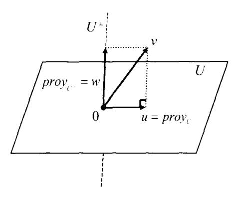
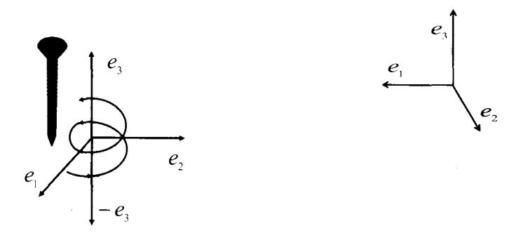
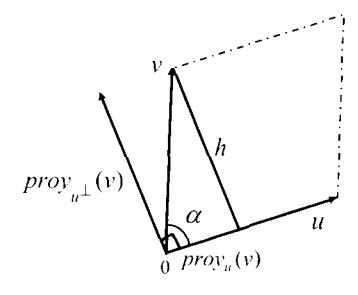
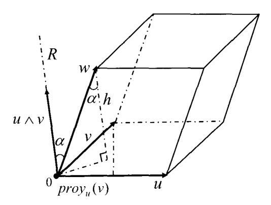
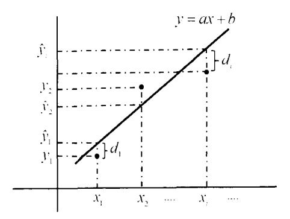
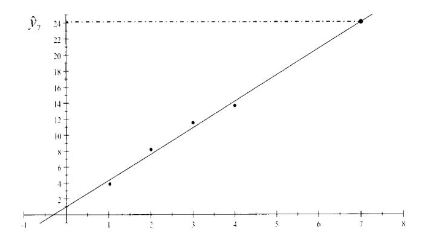
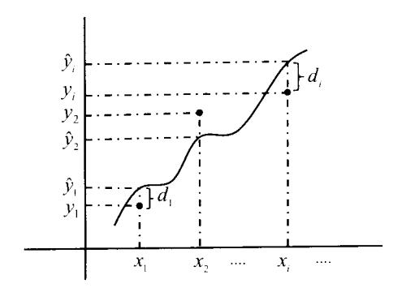

# Capítulo 8

# Espacio vectorial euclídeo

En este capítulo V denotará siempre un espacio vectorial real, es decir, que el cuerpo de escalares sobre el que está definido V será en todo momento  $\mathbb{K} = \mathbb{R}$ . Como ya anticipábamos en el capítulo anterior, en el espacio vectorial euclídeo tendremos definida una tercera operación entre vectores  $u, v \in V$  al que llamaremos producto escalar y denotaremos por < u, v >.

El producto escalar permite definir una forma de medir en el espacio vectorial: medir la longitud de un vector y el ángulo entre vectores. La existencia del concepto de ángulo dará lugar al de ortogonalidad, central en el espacio euclídeo.

Estudiaremos las aplicaciones lineales entre espacios euclídeos  $f:V\to W$  que se comportan bien respecto a los productos escalares en ellos definidos. Es decir, que conservan las medidas: la imagen de un vector f(u) tendrá la misma longitud en W que tuviera el vector u en V; y el ángulo entre dos vectores  $u,v\in V$  será el mismo que el determinado por los vectores imagen  $f(u),f(v)\in W$ .

En particular, nos interesarán las aplicaciones lincales de un espacio vectorial euclídeo V en sí mismo que respeten el producto escalar, a las que llamaremos isometrías vectoriales o aplicaciones ortogonales. Y estaremos estudiando geometría vectorial euclídea cuando estudiemos los invariantes propios de la actuación del grupo formado por las isometrías de un espacio vectorial euclídeo.

# 8.1. Producto escalar

#### Definición 8.1

Un **producto escalar** en un espacio vectorial real V es una forma bilineal  $f:V\times V\to\mathbb{R}$  simétrica y definida positiva.

Se suele utilizar la notación <, > para escribir los productos escalares. Es decir f(u,v) se escribirá < u,v >. Atendiendo a las definiciones del capítulo anterior, tendríamos la siguiente definición equivalente de producto escalar.

### Definición 8.2

Sea V un espacio vectorial real. Una aplicación  $<,>: V \times V \to \mathbb{R}$  es un **producto escalar** si y sólo si para cualesquiera vectores  $u, v, w \in V$  y todo escalar  $\alpha \in \mathbb{R}$ , cumple las siguientes propiedades:

- (1) < u. v > = < v, u >.
- (2) < u + v, w > = < u, w > + < v, w >.
- $(3) < \alpha u, v >= \alpha < u, v >.$
- (4)  $\langle u, u \rangle > 0$  y  $\langle u, u \rangle = 0$  si y sólo si u = 0.

Llamaremos espacio vectorial euclídeo a un espacio vectorial real V en el que hay definido un producto escalar <,>, y lo denotaremos normalmente como un par (V,<,>).

Las propiedades (2) y (3) indican que la aplicación <,> es lineal en su primera componente. La propiedad (1) nos dice que es simétrica, por lo que todo lo que se cumple en la primera componente se cumple también en la segunda, y así, <,> es lineal en sus dos componentes. Ya tenemos que <,> es una forma bilineal simétrica. Finalmente, la propiedad de positividad (4) indica que <,> es definida positiva.

A continuación vemos varios ejemplos de productos escalares que son formas bilineales estudiadas en el capítulo anterior.

Ejemplo 8.3

En el espacio vectorial  $\mathbb{R}^n$  el producto escalar usual o estándar es el siguiente

$$<(x_1,\ldots,x_n),(y_1,\ldots,y_n)>=x_1y_1+\cdots+x_ny_n$$

Con lo visto en el capítulo anterior podemos demostrar que se trata de una forma bilineal definida positiva. En efecto, podemos escribir

$$\langle x, y \rangle = \langle (x_1, \dots, x_n), (y_1, \dots, y_n) \rangle = (x_1, \dots, x_n) I_n \begin{pmatrix} y_1 \\ \vdots \\ y_n \end{pmatrix} = X^t I_n Y$$

Por lo tanto se trata de una forma bilineal simétrica, por serlo  $I_n$ , y definida positiva por el Criterio de Sylvester: Proposición 7.40.  $\square$ 

**Ejemplo 8.4** Sea  $\mathbb{R}_n[x]$  el espacio vectorial de los polinomios en una indeterminada x con coeficientes reales y grado menor o igual que n. Un producto escalar en  $\mathbb{R}_n[x]$  viene definido por

$$\langle p(x), q(x) \rangle = \int_a^b p(x)q(x)dx$$

Luego el par  $(\mathbb{R}_n[x], <, >)$  es un espacio vectorial euclídeo1.

&lt;sup>1Euclides, Grecia 325 - 265 a. de C. Considerado padre de la Geometría.

8.1. Producto escalar 307

En el ejemplo 7.2 vimos que es una forma bilineal. Así, se cumplen las propiedades (2) y (3) de la definición 8.2. La propiedad de simetría (1) se deduce de la propiedad commutativa del producto de polinomios

$$< p(x), q(x) > = \int_{a}^{b} p(x)q(x)dx = \int_{a}^{b} q(x)p(x)dx = < q(x), p(x) >$$

Y la propiedad de positividad (4) se tiene porque la integral definida de una función positiva es un número positivo

$$\langle p(x), p(x) \rangle = \int_a^b p^2(x) dx \ge 0 \quad \text{y} \quad \langle p(x), p(x) \rangle = \int_a^b p^2(x) dx = 0 \Leftrightarrow p(x) = 0 \qquad \Box$$

**Ejemplo 8.5** En el espacio vectorial  $\mathfrak{M}_n(\mathbb{R})$  de las matrices reales cuadradas de orden n, un producto escalar está definido por

$$\langle A, B \rangle = tr(AB^t)$$

En los ejemplos 7.2 vimos que es una forma bilineal. La simetría se deduce de las propiedades de la traza y la traspuesta

$$\langle A, B \rangle = \operatorname{tr}(AB^t) = \operatorname{tr}((AB^t)^t) = \operatorname{tr}((B^t)^t A^t) = \operatorname{tr}(BA^t) = \langle B, A \rangle$$

Para comprobar que es definida positiva basta observar que si  $A = (a_{ij})$ , entonces

$$\langle A, A \rangle = \operatorname{tr}(AA^{t}) = a_{11}^{2} + a_{12}^{2} + \dots + a_{nn}^{2} = \sum_{i,j=1}^{n} a_{ij}^{2} \ge 0$$

Además,  $\langle A, A \rangle = 0$  si v sólo si A = 0.

# 8.2. Matriz de un producto escalar

Dado que un producto escalar es una forma bilineal, se define su matriz respecto de una base igual que para las formas bilineales. Supongamos que (V, <, >) es un espacio vectorial euclídeo, dim V = n y sea  $\mathcal{B} = \{v_1, \ldots, v_n\}$  una base de V. Dados dos vectores cualesquiera  $x, y \in V$  vectores cuyas coordenadas respecto de  $\mathcal{B}$  son  $x = (x_1, \ldots, x_n)_{\mathcal{B}}$  e  $y = (y_1, \ldots, y_n)_{\mathcal{B}}$ , entonces

$$< x, y > = < \sum_{i=1}^{n} x_i v_i, \sum_{i=1}^{n} y_j v_j > = \sum_{i,j=1}^{n} x_i y_j < v_i, v_j >$$

y la matriz del producto escalar <,> en la base  $\mathcal{B}$  es la matriz simétrica real de orden n

$$G_{\mathcal{B}} = (\langle v_i, v_j \rangle) = \begin{pmatrix} \langle v_1, v_1 \rangle & \cdots & \langle v_1, v_n \rangle \\ \vdots & \ddots & \vdots \\ \langle v_n, v_1 \rangle & \cdots & \langle v_n, v_n \rangle \end{pmatrix}$$

Esta matriz se suele denominar matriz métrica o matriz de Gram.

La expresión analítica o ecuación del producto escalar <,> en la base  $\mathcal{B}$  es

$$\langle x, y \rangle = (x_1 \dots x_n) G_{\mathcal{B}} \begin{pmatrix} y_1 \\ \vdots \\ y_n \end{pmatrix} = X^t G_{\mathcal{B}} Y$$
 (8.1)

**Ejemplo 8.6** Retomamos aquí el ejemplo 7.6 (b), pág. 275. En el conjunto de matrices  $2 \times 2$  reales consideramos el producto escalar  $\langle A, B \rangle = \text{tr}(AB^t)$  y la base canónica

$$\mathcal{B} = \{ A_1 = \begin{pmatrix} 1 & 0 \\ 0 & 0 \end{pmatrix}, \ A_2 = \begin{pmatrix} 0 & 1 \\ 0 & 0 \end{pmatrix}, \ A_3 = \begin{pmatrix} 0 & 0 \\ 1 & 0 \end{pmatrix}, \ A_4 = \begin{pmatrix} 0 & 0 \\ 0 & 1 \end{pmatrix} \}$$

Vimos que la matriz del producto escalar en dicha base es  $G_{\mathcal{B}} = I_4$ , luego la expresión analítica o ecuación del producto escalar en dicha base es:

$$\langle A,B \rangle = (a_{11} \ a_{12} \ a_{21} \ a_{22}) \ I_4 \begin{pmatrix} b_{11} \\ b_{12} \\ b_{21} \\ b_{22} \end{pmatrix} = a_{11}b_{11} + a_{12}b_{12} + a_{21}b_{21} + a_{22}b_{22}$$

igual que el producto escalar usual en  $\mathbb{R}^4$ .

Como comprobamos en aquel ejercicio, el producto escalar de las matrices

$$A = \begin{pmatrix} 1 & 2 \\ 3 & 4 \end{pmatrix} y B = \begin{pmatrix} 5 & 6 \\ 7 & 8 \end{pmatrix}$$

podemos calcularlo sustituyendo en la ecuación anterior sus coordenadas en  $\mathcal{B}$ . Es decir, como  $A = (1, 2, 3, 4)_{\mathcal{B}}$  y  $B = (5, 6, 7, 8)_{\mathcal{B}}$  entonces

$$\langle A, B \rangle = 1 \cdot 5 + 2 \cdot 6 + 3 \cdot 7 + 4 \cdot 8 = 70$$

### Matrices de un producto escalar en distintas bases

Las matrices de un producto escalar en distintas bases se calculan exactamente igual que se hizo en la sección 7.2 y se tiene entre ellas una relación de congruencia. Si  $\mathcal{B} = \{v_1, \ldots, v_n\}$  y  $\mathcal{B}' = \{u_1, \ldots, u_n\}$  son dos bases de un espacio vectorial euclídeo (V, <, >), y las matrices del producto escalar <, > en dichas bases son

$$G_{\mathcal{B}}$$
 y  $G_{\mathcal{B}'}$ 

entonces

$$G_{\mathcal{B}'} = P^t G_{\mathcal{B}} P$$
, con  $P$  matriz de cambio de base de  $\mathcal{B}'$  a  $\mathcal{B}$  (8.2)

Ejemplo 8.7

 $\mathbb{R}^2$  se considera el producto escalar definido por

$$\langle (x_1, x_2), (y_1, y_2) \rangle = x_1y_1 - x_1y_2 - x_2y_1 + 2x_2y_2$$

Sean  $\mathcal{B} = \{(1,0),(0,1)\}$  la base canónica y  $\mathcal{B}' = \{u_1 = (1,2), u_2 = (3,4)\}$ . La matriz  $G_{\mathcal{B}}$  del producto escalar en la base canónica se obtiene calculando

$$\langle (1,0),(1,0) \rangle = 1, \langle (1,0),(0,1) \rangle = \langle (0,1),(1,0) \rangle = -1, \langle (0,1),(0,1) \rangle = 2$$

Por lo que

$$G_{\mathcal{B}} = \left(\begin{array}{cc} 1 & -1 \\ -1 & 2 \end{array}\right)$$

De modo que  $G_{\mathcal{B}'}$  se obtiene considerando la matriz  $P=\mathfrak{M}_{\mathcal{B}'\mathcal{B}}$  de cambio de base de  $\mathcal{B}'$  a  $\mathcal{B}$ :

$$P = \begin{pmatrix} 1 & 3 \\ 2 & 4 \end{pmatrix}$$

v haciendo el producto

$$G_{\mathcal{B}'} = P^t G_{\mathcal{B}} P = \begin{pmatrix} 1 & 2 \\ 3 & 4 \end{pmatrix} \begin{pmatrix} 1 & -1 \\ -1 & 2 \end{pmatrix} \begin{pmatrix} 1 & 3 \\ 2 & 4 \end{pmatrix} = \begin{pmatrix} 5 & 9 \\ 9 & 17 \end{pmatrix}$$

También se puede obtener directamente la matriz del producto escalar en la base  $\mathcal{B}'$  calculando los productos escalares

$$\langle u_1, u_1 \rangle = 5, \langle u_1, u_2 \rangle = \langle u_2, u_1 \rangle = 9, \langle u_2, u_2 \rangle = 17$$

# 8.3. Norma y ángulo

### Definición 8.8

Sea (V, <, >) un espacio vectorial euclídeo. Se define la **norma** o **longitud** de un vector  $v \in V$  como el número real no negativo

$$||v|| = \sqrt{\langle v, v \rangle}$$

Un vector de norma 1 se denomina vector unitario.

Las primeras propiedades de la norma se deducen directamente de las del producto escalar.

### Proposición 8.9

### Propiedades de la norma

- (1) ||v|| > 0 para todo  $v \neq 0_V$  y  $||0_V|| = 0$ .
- $(2) ||\alpha v|| = |\alpha| \cdot ||v||$
- (3)  $||u+v||^2 = ||u||^2 + ||v||^2 + 2 < u, v >$
- (4)  $|< u, v>| \leq ||u|| \cdot ||v||$  (Desigualdad de Cauchy-Schwartz)
- (5)  $||u+v|| \leq ||u|| + ||v||$  (Desigualdad triangular o de Minkowski)
- (6)  $||u+v||^2 = ||u||^2 + ||v||^2$  si y sólo si  $\langle u, v \rangle = 0$  (Teorema de Pitágoras)
- (7)  $||u+v||^2 + ||u-v||^2 = 2(||u||^2 + ||v||^2)$  (Ley del paralelogramo)

**Demostración:** La propiedad (1) se deduce directamente por ser el producto escalar una forma bilineal definida positiva. Para la propiedad (2) basta desarrollar la norma

$$||\alpha v|| = \sqrt{<\alpha v, \, \alpha v>} = \sqrt{\alpha^2 < v, v>} = |\alpha| \cdot \sqrt{< v, v>} = |\alpha| \cdot ||v||$$

$$(3) ||u+v||^2 = \langle u+v, u+v \rangle = \langle u, u \rangle + \langle u, v \rangle + \langle v, u \rangle + \langle v, v \rangle = ||u||^2 + ||v||^2 + 2\langle u, v \rangle.$$

(4) Para u=0 o v=0 la propiedad se cumple trivialmente. Supongamos que u y v son vectores no nulos y consideremos el vector  $w=\frac{u}{||u||}+\frac{v}{||v||}$ . Si escribimos el producto escalar < w, w> obtenemos

$$0 \le <\frac{u}{||u||} + \frac{v}{||v||}, \quad \frac{u}{||u||} + \frac{v}{||v||}> = \frac{\langle u, u \rangle}{||u||^2} + \frac{\langle v, v \rangle}{||v||^2} + 2\frac{\langle u, v \rangle}{||u|| ||v||} = 2 + 2\frac{\langle u, v \rangle}{||u|| ||v||}$$

$$\Rightarrow 1 \ge -\frac{\langle u, v \rangle}{||u|| ||v||} \Rightarrow -\langle u, v \rangle \le ||u|| \cdot ||v||$$

Si hacemos el mismo desarrollo para el vector  $w = \frac{u}{||u||} - \frac{v}{||v||}$ , obtenemos  $< u, v > \le ||u|| \cdot ||v||$ , de donde se deduce la desigualdad de Cauchy-Schwartz.

(5) Por la propiedad (3) la norma del vector u + v es

$$||u+v||^2 = ||u||^2 + ||v||^2 + 2 < u, v >$$

Teniendo en cuenta la desigualdad de Cauchy-Schwartz se obtiene

$$||u+v||^2 \le ||u||^2 + ||v||^2 + 2||u|| ||v|| = (||u|| + ||v||)^2$$

Como las cantidades son positivas, entonces  $||u+v|| \le ||u|| + ||v||$ .

La demostración de las propiedades 6 y 7 se propone en el Ejercicio 8.3.  $\Box$ 

**Ejemplo 8.10** (1) En  $\mathbb{R}^n$ , respecto al producto escalar usual, la norma de  $x=(x_1,\ldots,x_n)$  tiene la siguiente expresión:

$$||x|| = \sqrt{\langle x, x \rangle} = \sqrt{x_1^2 + \dots + x_n^2}$$

(2) En el espacio vectorial  $\mathbb{R}_2[x]$  de los polinomios de grado menor o igual que 2 con coeficientes reales en una indeterminada x, respecto al producto escalar  $\langle p(x), q(x) \rangle = \int_0^1 p(x) \cdot q(x) \, dx$ , la norma del vector  $p(x) = 3x^2 + 1$  se obtiene del siguiente modo

$$||p(x)||^{2} = \langle p(x), p(x) \rangle = \int_{0}^{1} p^{2}(x)dx = \int_{0}^{1} (3x^{2} + 1)^{2}dx = \int_{0}^{1} (9x^{4} + 6x^{2} + 1)dx$$
$$= \frac{9}{5}x^{5} + 2x^{3} + x \Big]_{0}^{1} = \frac{24}{5} \implies ||p(x)|| = \sqrt{\frac{24}{5}} = \frac{2\sqrt{30}}{5} \qquad \Box$$

# Ángulo entre vectores

En un espacio vectorial euclídeo (V, <, >), considerando la desigualdad de Cauchy-Schwartz para vectores no nulos se deduce que

$$\frac{|< u, v>|}{||u||\cdot||v||} \leq 1$$

por lo que prescindiendo del valor absoluto se tiene

$$-1 \le \frac{\langle u, v \rangle}{||u|| \cdot ||v||} \le 1$$

La función coseno en el intervalo  $[0, \pi]$  es decreciente y va tomando de forma continua todos los valores entre 1 y -1. Se define el **ángulo entre dos vectores** no nulos u y v de V como

$$\angle(u, v) = \arccos\left(\frac{\langle u, v \rangle}{||u|| \cdot ||v||}\right) \quad \text{con} \quad \angle(u, v) \in [0, \pi]$$

o lo que es lo mismo

$$\cos \angle(u,v) = \frac{\langle u,v\rangle}{||u||\cdot||v||} \quad \text{o también} \quad \langle u,v\rangle = ||u||\cdot||v||\cdot\cos\angle(u,v)$$

**Ejemplo 8.11** En  $\mathbb{R}^2$  el ángulo entre los vectores u = (1,1) y v = (2,0), respecto al producto escalar usual, lo podemos calcular como sigue:

$$\frac{\langle u, v \rangle}{||u|| \cdot ||v||} = \frac{\langle (1, 1), (2, 0) \rangle}{||(1, 1)|| \cdot ||(2, 0)||} = \frac{1 \cdot 2 + 1 \cdot 0}{\sqrt{1 + 1}\sqrt{2^2 + 0}} = \frac{\sqrt{2}}{2}$$

entonces

$$\angle(u,v) = \arccos\frac{\sqrt{2}}{2} = \frac{\pi}{4}$$

Mientras que el ángulo que forman los mismos vectores respecto al producto escalar

$$\langle (x_1, x_2), (y_1, y_2) \rangle = x_1 y_1 - x_1 y_2 - x_2 y_1 + 2x_2 y_2$$

es

$$\cos(\measuredangle(u,v)) = \frac{\langle u,v \rangle}{||u||\cdot||v||} = \frac{1\cdot 2 - 1\cdot 0 - 1\cdot 2 + 2\cdot 1\cdot 0}{\sqrt{1-1-1+2}\sqrt{4-0-0+0}} = \frac{0}{2}$$

de donde

$$\angle(u,v) = \arccos 0 = \frac{\pi}{2}$$

**Ejemplo 8.12** En  $\mathbb{R}_2[x]$ , considerando el producto escalar  $\langle p(x), q(x) \rangle = \int_0^1 p(x) \cdot q(x) dx$ , calcularemos el ángulo entre los polinomios  $p(x) = 3x^2 + 1$  y q(x) = 1. Determinamos el producto escalar y las normas:

$$||p(x)|| = \frac{2\sqrt{30}}{5}$$

$$||q(x)|| = \sqrt{\int_0^1 q^2(x)dx} = \sqrt{x}\Big|_0^1 = 1$$

$$< p(x), q(x) > = \int_0^1 p(x)q(x)dx = \int_0^1 p(x)dx = x^3 + x\Big|_0^1 = 2$$

y obtenemos el ángulo

$$\angle(p,q) = \arccos(\frac{< p(x), q(x) >}{||p(x)|| \cdot ||q(x)||}) = \arccos(\frac{2}{\frac{2\sqrt{30}}{5} \cdot 1}) = \arccos\frac{\sqrt{30}}{6} \qquad \Box$$

# 8.4. Ortogonalidad. Bases ortogonales y ortonormales

En un espacio vectorial euclídeo (V, <, >), dado que el producto escalar es un forma bilineal, se tiene el concepto de vectores conjugados respecto al producto escalar. En estos espacios, en lugar de utilizar el térnimo conjugado se utiliza el de **ortogonal**.

### Definición 8.13

Sea (V, <, >) un espacio vectorial euclídeo. Dos vectores u y v se dice que son **ortogonales**, y se denota por  $u \perp v$ , si son conjugados por <, >, es decir si

$$< u, v > = 0$$

Un conjunto de vectores no nulos  $\{v_1, \ldots, v_k\}$  es un **conjunto ortogonal** si los vectores son ortogonales dos a dos, es decir:

$$\langle v_i, v_j \rangle = 0$$
 para todo  $i \neq j$ 

Una propiedad de los vectores ortogonales es que son linealmente independientes.

## Proposición 8.14

Sea (V, <, >) un espacio vectorial euclídeo. Si  $\{v_1, \ldots, v_k\}$  es un conjunto ortogonal de vectores entonces  $\{v_1, \ldots, v_k\}$  son linealmente independientes.

**Demostración:** Lo demostramos por reducción al absurdo. Sea  $\{v_1, \ldots, v_k\}$  es un conjunto ortogonal de vectores de V, y supongamos que es linealmente dependiente. Entonces, existe al menos un vector que es combinación lineal de los demás. Podemos suponer, sin perdida de generalidad, que tal vector es  $v_1$ . Es decir

$$v_1 = a_2 v_2 + \dots + a_k v_k \quad \text{con } a_i \in \mathbb{R}$$

Hacemos el producto escalar de  $v_1$  por sí mismo y obtenemos

$$< v_1, v_1 > = < a_2 v_2 + \dots + a_k v_k, v_1 > = a_2 < v_2, v_1 > + \dots + a_k < v_k, v_1 > = a_1 0 + \dots + a_k 0 = 0$$

Pero,  $\langle v_1, v_1 \rangle = 0$  si y sólo si  $v_1 = 0$ , lo que supone una contradicción con la hipótesis de partida ya que  $\{v_1, \ldots, v_k\}$  es un conjunto ortogonal y los vectores no son nulos.  $\square$ 

#### Definición 8.15

Sea (V, <, >) un espacio vectorial euclídeo. Una base ortogonal de V es una base formada por un conjunto ortogonal, y una base ortogonal eu una base ortogonal cuyos vectores son unitarios, es decir, de norma 1.

Ejemplo 8.16 Para el producto escalar usual <,> en  $\mathbb{R}^2$ , la base canónica es una base ortonormal. En efecto se cumple:

$$<(1.0), (0.1)>=<(0,1), (1.0)>=0 \Rightarrow \text{ son una base ortogonal}$$
  
 $<(1.0), (1.0)>=<(0,1), (0.1)>=1 \Rightarrow \text{ son unitarios}$ 

Sin embargo la base canónica o estándar no es ortonormal ni ortogonal para otros productos escalares de  $\mathbb{R}^2$ . Por ejemplo, si consideramos el producto escalar definido por la forma bilineal

$$\langle (x_1, y_1), (x_2, y_2) \rangle = (x_1, y_1) \begin{pmatrix} 2 & -1 \\ -1 & 1 \end{pmatrix} \begin{pmatrix} x_2 \\ y_2 \end{pmatrix}$$

se tiene que los vectores (1,0) y (0,1) no son ortogonales ya que

$$<(1,0),(0,1)>=(1,0)\begin{pmatrix} 2 & -1 \\ -1 & 1 \end{pmatrix}\begin{pmatrix} 0 \\ 1 \end{pmatrix}=-1$$

### Existencia de bases ortogonales

La existencia de bases ortogonales que, recordemos, son bases de vectores conjugados, está garantizada por el Teorema de Existencia 7.28, pág. 288. La demostración constructiva de ese teorema nos aporta un primer método para su obtención con el que hemos practicado en el capítulo anterior.

Un segundo método para obtener una base ortogonal es el de diagonalización por congruencia, resumido en el cuadro de la página 293.

Por cualquiera de los dos métodos, si tenemos una base ortogonal  $\mathcal{B} = \{v_1, \dots, v_n\}$  podemos obtener una ortonormal sin más que dividir los vectores por sus normas:

$$\mathcal{B} = \{v_1, \dots, v_n\}$$
 ortogonal  $\Rightarrow \mathcal{B}' = \{\frac{v_1}{||v_1||}, \dots, \frac{v_n}{||v_n||}\}$  ortonormal

En efecto, por la propiedad 2 de la norma

$$\left\| \frac{v_i}{||v_i||} \right\| = \frac{1}{||v_i||} ||v_i|| = 1$$

Esto es lo que se hizo en la Proposición 7.32, pág. 290. De hecho

Una base es ortogonal si y sólo si la matriz del producto escalar en dicha base es diagonal. Una base es ortonormal si y sólo si la matriz del producto escalar en dicha base es la identidad.

Una **matriz ortogonal** es una matriz cuadrada real cuya inversa es igual a su traspuesta. Esto es, A es ortogonal si  $A^tA = I = AA^t$  o si  $A^{-1} = A^t$ . Las columnas de una matriz ortogonal de orden n son las coordenadas de los vectores de una base ortonormal de  $\mathbb{R}^n$  para el producto escalar usual <,>.

## Proposición 8.17

En un espacio vectorial euclídeo (V, <, >) la matriz de cambio de base entre bases ortonormales es una matriz ortogonal.

**Demostración:** Sean  $\mathcal{B}_1$  y  $\mathcal{B}_2$  bases ortonormales y  $P = \mathfrak{M}_{\mathcal{B}_1 \mathcal{B}_2}$  la matriz de cambio de base de  $\mathcal{B}_1$  a  $\mathcal{B}_2$ . Dado que las matrices del producto escalar <,> en dichas bases son  $G_{\mathcal{B}} = G_{\mathcal{B}'} = I_n$ , entonces:

$$G_{\mathcal{B}_1} = P^t G_{\mathcal{B}_2} P \quad \Rightarrow \quad I_n = P^t I_n P = P^t P \quad \Rightarrow \quad P^t = P^{-1}$$

Uno de los beneficios que aporta el disponer de una base ortogonal es que facilita el cálculo de coordenadas como se muestra en el siguiente resultado

### Proposición 8.18

Sean (V, <, >) un espacio vectorial euclídeo y  $\mathcal{B} = \{v_1, \ldots, v_n\}$  una base ortogonal. Las coordenadas de un vector  $u \in V$  respecto de la base  $\mathcal{B}$  son

$$u = \left(\frac{\langle u, v_1 \rangle}{||v_1||^2}, \dots, \frac{\langle u, v_n \rangle}{||v_n||^2}\right)_{\mathcal{B}}$$
(8.3)

Dichas coordenadas se denominan coeficientes de Fourier de u respecto de  $\mathcal{B}$ .

**Demostración:** Sea  $u \in V$  tal que  $u = (u_1, \ldots, u_n)_{\mathcal{B}}$ . Para cada vector  $v_i$  se cumple

$$< u, v_i > = < u_1 v_1 + \dots + u_n v_v, v_i > = u_i < v_i, v_i >$$

Entonces

$$u_i = \frac{\langle u, v_i \rangle}{\langle v_i, v_i \rangle} = \frac{\langle u, v_i \rangle}{||v_i||^2}$$

#### Método de ortogonalización de Gram-Schmidt

Vemos ahora un tercer método para construir una base ortogonal conocido como Método de ortogonalización de Gram-Schmidt2. En este caso, partiendo de una base dada, se obtiene una ortogonal cuyos vectores mantendrán una interesante relación con los de partida.

&lt;sup>2 Jørgen Pedersen Gram (Dinamarca 1850 – 1916). Erhard Schmidt (Alemania 1876 – 1959)

### Teorema 8.19

### Teorema de Gram-Schmidt

Sean (V, <, >) un espacio vectorial euclídeo y  $\mathcal{B} = \{v_1, \ldots, v_n\}$  una base de V. Entonces los vectores  $\{e_1, \ldots, e_n\}$  definidos por

$$e_{1} = v_{1}$$

$$e_{2} = v_{2} - \frac{\langle v_{2}, e_{1} \rangle}{||e_{1}||^{2}} e_{1}$$

$$...$$

$$e_{i} = v_{i} - \frac{\langle v_{i}, e_{1} \rangle}{||e_{1}||^{2}} e_{1} - \dots - \frac{\langle v_{i}, e_{i-1} \rangle}{||e_{i-1}||^{2}} e_{i-1}, i = 2, \dots, n$$

$$(8.4)$$

forman una base ortogonal de V y satisfacen

$$L(e_1, \dots, e_i) = L(v_1, \dots, v_i)$$
 para todo  $i = 1, \dots, n$  (8.5)

**Demostración:** Haremos la demostración por inducción sobre n. Si n=1 el teorema se cumple trivialmente. Como hipótesis de inducción, supongamos que el resultado es cierto para dimensión k-1, es decir dados  $\{v_1, \ldots, v_{k-1}\}$  linealmente independientes, se cumple que los  $\{e_1, \ldots, e_{k-1}\}$  son un conjunto ortogonal y  $L(e_1, \ldots, e_i) = L(v_1, \ldots, v_i)$  para  $i=1, \ldots, k-1$ .

Veamos en primer lugar que  $e_k$  es ortogonal a  $e_1, \ldots, e_{k-1}$ . Siendo

$$e_k = v_k - \frac{\langle v_k, e_1 \rangle}{||e_1||^2} e_1 - \dots - \frac{\langle v_k, e_{k-1} \rangle}{||e_{k-1}||^2} e_{k-1}$$
 (8.6)

los productos escalares  $\langle e_k, e_i \rangle$  para  $i = 1, \dots, k-1$  son

$$\langle e_k, e_i \rangle = \langle v_k, e_i \rangle - \frac{\langle v_k, e_1 \rangle}{||e_1||^2} \langle e_1, e_i \rangle - \dots - \frac{\langle v_k, e_{k-1} \rangle}{||e_{k-1}||^2} \langle e_{k-1}, e_i \rangle$$

Por ser  $\{e_1, \ldots, e_{k-1}\}$  ortogonales dos a dos se tiene

$$< e_k, e_i > = < v_k, e_i > - \frac{< v_k, e_i >}{||e_i||^2} < e_i, e_i >$$

y teniendo en cuenta que  $||e_i||^2 = \langle e_i, e_i \rangle$ , se obtiene  $\langle e_k, e_i \rangle = 0$ , como queríamos.

Para ver que  $L(e_1, \ldots, e_k) = L(v_1, \ldots, v_k)$ , basta observar que de la definición de  $e_k$  en (8.6) se deduce que  $v_k \in L(e_1, \ldots, e_k)$  y utilizar la hipótesis de inducción  $L(e_1, \ldots, e_{k-1}) = L(v_1, \ldots, v_{k-1})$ .

**Observación:** Si la base  $\mathcal{B} = \{v_1, \dots, v_n\}$  a la que se aplica en método de Gram-Schmidt es ortogonal, entonces el método no cambia los vectores, es decir  $v_i = e_i$ . Si en la base de partida  $\mathcal{B}$  se tienen los primeros k vectores ortogonales, y  $v_{k+1}$  no es ortogonal a alguno de los  $v_1, \dots, v_k$ , entonces el método no altera los k primeros vectores, pero sí  $v_{k+1}$ . Es decir, tras aplicar el método de Gram-Schmidt se obtienen los vectores  $\{v_1, \dots, v_k, e_{k+1}, \dots, e_n\}$  con  $e_{k+1} \neq v_{k+1}$ .

Las bases son conjuntos ordenados de vectores, y el método de ortogonalización de Gram-Schmidt se aplica de forma ordenada empezando por el primer vector de la base de partida. Por ejemplo, obtendremos bases distintas si aplicamos el método a una base  $\{v_1, v_2, v_3\}$  que si lo aplicamos a la base  $\{v_2, v_1, v_3\}$ .

Ejemplo 8.20

Sobre la propiedad (8.5) del Método de Gram-Schmidt.

Vamos a determinar una base ortogonal  $\mathcal{B} = \{e_1, e_2, e_3, e_4\}$  de  $\mathbb{R}^4$  tal que  $e_1$  pertenezca a la recta R, y los vectores  $e_2$  y  $e_3$  pertenezcan al hiperplano H con

$$R \equiv \{x_1 + x_2 = 0, x_3 = 0, x_4 = 0\}$$

$$H \equiv \{x_1 + x_2 + x_3 + x_4 = 0\}$$

En primer lugar, calcularemos una base de  $\mathbb{R}^4$ ,  $\mathcal{B}' = \{v_1, v_2, v_3, v_4\}$ , tal que cumpla las condiciones pedidas a los vectores del enunciado, salvo la ortogonalidad, es decir:

$$v_1 \in R \ \mathbf{v} \ v_2, v_3 \in H$$

Después aplicaremos a  $\mathcal{B}'$  el método de Gram-Schmidt y obtendremos la base  $\mathcal{B} = \{e_1, e_2, e_3, e_4\}$  pedida, ya que por la propiedad (8.5) del Teorema de Gram-Schmidt se cumplirá:

$$L(v_1) = L(e_1) = R,$$
  $L(v_1, v_2, v_3) = L(e_1, e_2, e_3) = H$ 

Así, tomemos  $v_1 = (1, -1, 0, 0) \in R$ . A continuación tomamos  $v_2, v_3 \in H$  linealmente independientes de  $v_1$  (esto lo podemos hacer porque dim H = 3 y  $R \subseteq H$ ). Unas ecuaciones paramétricas de H son

$$H \equiv \{x_1 = -\alpha_2 - \alpha_3 - \alpha_4, x_2 = \alpha_2, x_3 = \alpha_3, x_4 = \alpha_4\}$$

Dando valores a los parámetros obtenemos los vectores

$$v_2 = (0, 0, 1, -1)$$
 y  $v_3 = (0, 1, -1, 0)$ 

(nótese que se ha tomado  $v_2$  ortogonal a  $v_1$ . Y finalmente, completamos la base de  $\mathbb{R}^4$  con un cuarto vector linealmente independiente de los anteriores  $v_4 = (1, 1, 0, 0)$ .

Ahora aplicamos el método de Gram-Schmidt a  $\mathcal{B}'$  para obtener la base ortogonal  $\mathcal{B} = \{e_1, e_2, e_3, e_4\}$ 

$$e_{2} = v_{2} \quad \text{(Por ser } v_{1} \text{ y } v_{2} \text{ ortogonales)}$$

$$e_{3} = v_{3} - \frac{\langle v_{3}, e_{1} \rangle}{||e_{1}||^{2}} e_{1} - \frac{\langle v_{3}, e_{2} \rangle}{||e_{2}||^{2}} e_{2}$$

$$= (0, 1, -1, 0) - \frac{-1}{2} (1, -1, 0, 0) - \frac{-1}{2} (0, 0, 1, -1) = (\frac{1}{2}, \frac{1}{2}, -\frac{1}{2}, -\frac{1}{2})$$

$$e_{4} = v_{4} - \frac{\langle v_{4}, e_{1} \rangle}{||e_{1}||^{2}} e_{1} - \frac{\langle v_{4}, e_{2} \rangle}{||e_{2}||^{2}} e_{2} - \frac{\langle v_{4}, e_{3} \rangle}{||e_{3}||^{2}} e_{3}$$

$$= (1, 1, 0, 0) - 0 \cdot e_{1} - 0 \cdot e_{2} - (\frac{1}{2}, \frac{1}{2}, -\frac{1}{2}, -\frac{1}{2}) = (\frac{1}{2}, \frac{1}{2}, \frac{1}{2}, \frac{1}{2}) \quad \Box$$

# 8.5. Subespacios ortogonales. Proyección ortogonal

En un espacio vectorial euclídeo (V, <, >) al conjugado de un subconjunto de vectores  $S \subset V$  (pág. 285) lo llamaremos ortogonal de S y lo denotaremos  $S^{\perp}$ . Volvemos a repetir algunas definiciones y propiedades que se estudiaron para el conjugado, ahora ya sin demostrar porque ya se hizo entonces.

### Definición 8.21

Sea (V, <, >) un espacio vectorial euclídeo. Dados dos subconjuntos S y T de V se dice que son **ortogonales**, y se denota por  $S \perp T$  si se cumple que todos los vectores de S son ortogonales a todos los de T. Es decir < s, t >= 0 para todo  $s \in S, t \in T$ .

Dado un subconjunto  $S \subset V$  llamaremos **ortogonal de** S. y lo denotaremos por  $S^{\perp}$  al conjunto conjugado de S por <. >:

$$S^{\perp} = \{ v \in V : \ v \perp s \text{ para todo } s \in S \}$$

El ortogonal de un conjunto de vectores cumple todas las propiedades que se estudiaron sobre los subespacios conjugados, véanse las proposiciones 7.24 y 7.26, pág. 287. Destacamos aquí algunas de ellas, teniendo en cuenta que la forma bilineal, que es el producto escalar, es no degenerada.

## Propiedades del subespacio ortogonal

- (1) Si S es un subconjunto de V, entonces  $S^{\perp}$  es un subespacio vectorial de V y  $L(S)^{\perp}=S^{\perp}$ .
- (2) Si  $U = L(v_1, ..., v_k)$  entonces  $U^{\perp} = \{v \in V : v \perp v_1, ..., v \perp v_k\}$ .
- (3)  $(U+W)^{\perp} = U^{\perp} \cap W^{\perp}$ .

# Proposición 8.22

Si U es un subespacio vectorial de V, entonces se tiene la siguiente descomposición en suma directa:

$$V = U \oplus U^{\perp}$$

Y como consecuencia  $(U^{\perp})^{\perp} = U$ .

**Demostración:** Sean  $\mathcal{B}$  una base ortonormal de V,  $\{u_1, \ldots, u_k\}$  una base de U y  $x \in V$ . Consideramos coordenadas en  $\mathcal{B}$ :  $u_i = (u_{i1}, \ldots, u_{in})_{\mathcal{B}}$  y  $x = (x_1, \ldots, x_n)_{\mathcal{B}}$ . El producto escalar <,> de V se comporta como el producto usual en  $\mathbb{R}^n$ .

Así,  $x \in U^{\perp}$  si y sólo si  $x \perp u_1, \, \ldots, \, x \perp u_k$  si y sólo si

$$\langle x, u_1 \rangle = 0 \Leftrightarrow u_{11}x_1 + \dots + u_{1n}x_n = 0$$

 $\langle x, u_k \rangle = 0 \Leftrightarrow u_{k1}x_1 + \dots + u_{kn}x_n = 0$ 

Las k ecuaciones son linealmente independientes, por serlo los vectores  $u_1, \ldots, u_k$ , luego son unas ecuaciones implícitas del subespacio ortogonal, y se tiene dim  $U^{\perp} = n - k$ .

Solo falta ver que  $U \cap U^{\perp} = \{0\}$ . Para ello, observamos que si x es un vector no nulo de la intersección, entonces es ortogonal a todos los vectores de U por pertenecer a  $U^{\perp}$ , de donde x será ortogonal a sí mismo:  $\langle x, x \rangle = 0$ , lo cual es imposible.  $\square$ 

Por ser  $U^{\perp}$  un suplementario de U, también se le suele llamar en otros textos suplemento o complemento ortogonal de U.

**Ejemplo 8.23** En  $\mathbb{R}_2[x]$  se considera el producto escalar  $\langle p, q \rangle = \int_0^1 p \cdot q \, dx$ . Sea U el subespacio vectorial generado por los polinomios  $x^2 - 2$  y x + 1. Vamos a determinar unas ecuaciones implícitas del subespacio ortogonal de U referidas a la base canónica  $B = \{1, x, x^2\}$ .

El subespacio  $U^{\perp}$  está determinado por los polinomios de  $\mathbb{R}_2[x]$  que son ortogonales a todos los de U, o equivalentemente a los dos vectores que generan  $U: x^2 - 2$  y x + 1. Formalmente:

$$U^{\perp} = \{a + bx + cx^2 : a + bx + cx^2 \perp x^2 - 2, a + bx + cx^2 \perp x + 1\}$$
$$= \{a + bx + cx^2 : \langle a + bx + cx^2, x^2 - 2 \rangle = 0, \langle a + bx + cx^2, x + 1 \rangle = 0\}$$

Calculamos los productos escalares

$$< a + bx + cx^{2}, \ x^{2} - 2 > = \int_{0}^{1} (a + bx + cx^{2})(x^{2} - 2)dx = -\frac{5}{3}a - \frac{3}{4}b - \frac{7}{15}c$$
  
 $< a + bx + cx^{2}, \ x + 1 > = \int_{0}^{1} (a + bx + cx^{2})(x + 1)dx = \frac{3}{2}a + \frac{5}{6}b + \frac{7}{12}c$ 

Así, unas ecuaciones implícitas de  $U^{\pm}$  son:

$$U^{\perp} \equiv \left\{ -\frac{5}{3}a - \frac{3}{4}b - \frac{7}{15}c = 0, \quad \frac{3}{2}a + \frac{5}{6}b + \frac{7}{12}c = 0 \right\} \qquad \Box$$

## Proyección ortogonal

Dado U un subespacio vectorial de V, la descomposición  $V=U\oplus U^{\perp}$  permite definir una aplicación proy $_U:V\to V$  que es la proyección de base U y dirección  $U^{\perp}$ , como se hizo en la Sección 4.5. En concreto, todo vector  $v\in V$  se puede escribir de forma única como v=u+w con  $u\in U$  y  $w\in U^{\perp}$ . Llamamos **proyección ortogonal sobre** U a la aplicación

$$\operatorname{proy}_U: V \to V \\ v \mapsto u$$

Si  $v \in U$ , entonces v = v + 0 y  $\text{proy}_U(v) = v$ . Si  $v \in U^{\perp}$  entonces v = 0 + v y  $\text{proy}_U(v) = 0$ . Por lo que

$$\operatorname{Im}(\operatorname{proy}_U) = \operatorname{Ker}(\operatorname{proy}_U - \operatorname{Id}) = U \quad \text{y} \quad \operatorname{Ker}(\operatorname{proy}_U) = U^\perp$$

Así,  $\operatorname{proy}_U(v)$  es el único vector  $u \in V$  que cumple  $u \in U$  y  $v-u \in U^{\perp}$ . Si consideramos la proyección sobre el subespacio  $U^{\perp}$ , en las mismas condiciones que antes, puesto que  $(U^{\perp})^{\perp} = U$ , tenemos que  $\operatorname{proy}_{U^{\perp}}(v) = w$  y para todo  $v \in V$  se tiene

$$v = u + w = \operatorname{proy}_{U}(v) + \operatorname{proy}_{U^{\pm}}(v)$$

Figura 8.1: Proyección ortogonal sobre U

### Definición 8.24

Sean (V, <, >) un espacio vectorial euclídeo, U un subespacio vectorial de V y v un vector cualquiera de V. Llamaremos **proyección ortogonal del vector** v **sobre el subespacio** U, y se denota por  $\operatorname{proy}_U(v)$ , al único vector tal que

$$\operatorname{proy}_{U}(v) \in U \ \ \mathbf{y} \ \ v - \operatorname{proy}_{U}(v) \in U^{\perp}$$

**Ejemplo 8.25** En  $\mathbb{R}^3$ , vamos a determinar la proyección ortogonal del vector v = (2, 1, 1) sobre el plano  $U \equiv \{x - y = 0\}$ . Por ser la proyección un vector de U será de la forma  $(\alpha, \alpha, \beta)$ , con  $\alpha, \beta \in \mathbb{R}$ . Entonces,

$$\text{proy}_U(2,1,1) = (\alpha,\,\alpha,\,\beta)$$
si y sólo si $(2,1,1) - (\alpha,\,\alpha,\,\beta) \in U^\perp$ 

Determinamos unas ecuaciones de  $U^{\perp}$  a partir de una base de U=L((1,1,0),(0,0,1))

$$U^{\perp} = \{ (x, y, z) : (x, y, z) \perp (1, 1, 0), (x, y, z) \perp (0, 0, 1) \} \equiv \{ x + y = 0, z = 0 \}$$

Así.

$$(2-\alpha,1-\alpha,1-\beta)\in U^\perp \iff 2-\alpha+1-\alpha=0,\ 1-\beta=0 \iff \alpha=\frac{3}{2},\ \beta=1$$

y el vector proyección es  $\operatorname{proy}_U(2,1,1)=(\frac{3}{2},\frac{3}{2},1)$ . Obtenemos el vector proyección de (2,1,1) sobre  $U^{\perp}$  que es  $\operatorname{proy}_{U^{\perp}}(2,1,1)=(2,1,1)-\operatorname{proy}_U(2,1,1)=(\frac{1}{2},-\frac{1}{2},0)$ .

La matriz de la aplicación  $\operatorname{proy}_U: \mathbb{R}^3 \to U$  la podemos calcular sabiendo que las imágenes de los vectores de una base  $\mathcal{B}' = \{u_1, u_2, u_3\} \operatorname{con} u_1, u_2 \in U, u_3 \in U^{\perp} \operatorname{son} f(u_1) = u_1, f(u_2) = u_2, f(u_3) = 0.$  Podemos considerar  $\mathcal{B}' = \{(1, 1, 0), (0, 0, 1), (1, -1, 0)\}$ :

$$\mathfrak{M}_{\mathcal{B}'}(\text{proy}_U) = \begin{pmatrix} 1 & 0 & 0 \\ 0 & 1 & 0 \\ 0 & 0 & 0 \end{pmatrix}$$

Y la matriz en la base canónica  $\mathcal{B}$  se obtiene haciendo el cambio de base

$$\mathfrak{M}_{\mathcal{B}}(\text{proy}_{U}) = \mathfrak{M}_{\mathcal{B}'\mathcal{B}} \mathfrak{M}_{\mathcal{B}'}(\text{proy}_{U}) \mathfrak{M}_{\mathcal{B}\mathcal{B}'} \\
= \begin{pmatrix} 1 & 0 & 1 \\ 1 & 0 & -1 \\ 0 & 1 & 0 \end{pmatrix} \begin{pmatrix} 1 & 0 & 0 \\ 0 & 1 & 0 \\ 0 & 0 & 0 \end{pmatrix} \begin{pmatrix} 1 & 0 & 1 \\ 1 & 0 & -1 \\ 0 & 1 & 0 \end{pmatrix}^{-1} = \begin{pmatrix} \frac{1}{2} & \frac{1}{2} & 0 \\ \frac{1}{2} & \frac{1}{2} & 0 \\ 0 & 0 & 1 \end{pmatrix} \qquad \square$$

El siguiente resultado nos aporta un método alternativo para calcular la proyección de un vector sobre un subespacio, utilizando coeficientes de Fourier.

### Proposición 8.26

Sean (V, <, >) un espacio vectorial euclídeo, U un subespacio vectorial de V y  $\mathcal{B} = \{u_1, \ldots, u_k\}$  una base ortogonal de U. Dado un vector cualquiera  $v \in V$  se tiene que

$$\operatorname{proy}_{U}(v) = \frac{\langle v, u_{1} \rangle}{||u_{1}||^{2}} u_{1} + \dots + \frac{\langle v, u_{k} \rangle}{||u_{k}||^{2}} u_{k}$$

**Demostración:** Ampliemos la base ortogonal  $\mathcal{B}$  de U añadiendo, por el Teorema de ampliación a una base, vectores  $v_{k+1}, \ldots, v_n$  hasta obtener una base  $\mathcal{B}' = \{u_1, \ldots, u_k, v_{k+1}, \ldots, v_n\}$  de V. Aplicando a  $\mathcal{B}'$  el Método de Gram-Schmidt se obtiene una base ortogonal  $\mathcal{B}'' = \{u_1, \ldots, u_k, u_{k+1}, \ldots, u_n\}$  con  $\{u_{k+1}, \ldots, u_n\}$  base ortogonal de  $U^{\perp}$ . Entonces, por la Proposición 8.18, tenemos que

$$v = \underbrace{a_1 u_1 + \dots + a_k u_k}_{\in U} + \underbrace{a_{k+1} u_{k+1} + \dots + a_n u_n}_{\in U^{\perp}}, \quad a_i = \frac{\langle v, u_i \rangle}{||u_i||^2}$$

Como la descomposición de un vector v como suma de dos vectores v=u+w con  $u\in U$  y  $w\in U^{\perp}$  es única, entonces:

$$\operatorname{proy}_{U}(v) = a_{1}u_{1} + \dots + a_{k}u_{k}, \ a_{i} = \frac{\langle v, u_{i} \rangle}{||u_{i}||^{2}} \ \operatorname{para} \ i = 1, \dots, k$$

También podemos afirmar que

$$\operatorname{proy}_{U^{\perp}}(v) = a_{k+1}u_{k+1} + \dots + a_nu_n, \quad a_j = \frac{\langle v, u_j \rangle}{||u_j||^2} \quad \text{para } j = k+1, \dots, n$$

**Ejemplo 8.27** En el ejemplo anterior tenemos que una base ortogonal de U es la base que hemos considerado  $\mathcal{B}_U = \{u_1 = (1, 1, 0), u_2 = (0, 0, 1)\}$ , por lo tanto

$$\operatorname{proy}_{\ell}(2,1,1) = \frac{\langle (2,1,1), (1,1,0) \rangle}{||(1,1,0)||^2} (1,1,0) + \frac{\langle (2,1,1), (0,0,1) \rangle}{||(0,0,1)||^2} (0,0,1)$$
$$= \frac{3}{2} (1,1,0) + \frac{1}{1} (0,0,1) = \left(\frac{3}{2}, \frac{3}{2}, 1\right)$$

El vector provección ortogonal de (2,1,1) sobre  $U^{\perp}$  es

$$\operatorname{proy}_{U^{+}}(2,1,1) = (2,1,1) - \operatorname{proy}_{U}(2,1,1) = \left(\frac{1}{2}, -\frac{1}{2}, 0\right)$$

### Distancia

A partir de la norma, podemos introducir el concepto de distancia entre vectores o de distancia de un vector a un subespacio vectorial del siguiente modo:

Distancia entre los vectores v y u: dist(v, u) = ||v - u||.

Distancia de un vector v a un subespacio vectorial U:  $dist(v, U) = min\{||v - u||, u \in U\}$ .

Se cumple que el mínimo en el conjunto anterior se alcanza cuando  $u = \text{proy}_U(v)$ , es decir que podemos interpretar la proyección de un vector v sobre un subespacio U como el vector de U que está a distancia mínima de v. Demostramos esto en el siguiente resultado.

# Proposición 8.28

Sean (V,<,>) un espacio vectorial euclídeo y U un subespacio vectorial de V. Entonces, para todo  $v\in V$  se cumple que

$$\operatorname{dist}(v,U) = ||v - \operatorname{proy}_U(v)||$$

**Demostración:** Sean  $v \in V$  y  $u \in U$ . Se tiene

$$\begin{aligned} ||v - u||^2 &= ||v - \operatorname{proy}_{U}(v) + \operatorname{proy}_{U}(v) - u||^2 \\ &= ||v - \operatorname{proy}_{U}(v)||^2 + ||\operatorname{proy}_{U}(v) - u||^2 + 2 < v - \operatorname{proy}_{U}(v), \operatorname{proy}_{U}(v) - u > 0 \end{aligned}$$

El último sumando es 0 ya que los vectores  $v - \text{proy}_U(v) \in U^{\perp}$  y  $\text{proy}_U(v) - u \in U$  son ortogonales. Por lo tanto

$$||v - u||^2 \ge ||v - \text{proy}_{U}(v)||^2$$

y por tratarse de cantidades positivas

$$||v-u|| \ge ||v-\operatorname{proy}_U(v)||$$
, para todo  $u \in U$ 

v así se tiene el resultado deseado.  $\square$ 

### Espacios normados y espacios métricos

En un  $\mathbb{K}$  –espacio vectorial V (de dimensión finita o infinita) con  $\mathbb{K} = \mathbb{R}$  o  $\mathbb{C}$ , una **norma** es una aplicación  $||\cdot||: V \to \mathbb{K}$  que cumple las siguientes propiedades:

- (1) ||v|| > 0 para todo  $v \neq 0_V |y| ||0_V|| = 0$ .
- (2)  $||\alpha v|| = |\alpha| \cdot ||v||$  si  $\alpha \in \mathbb{K}$ .
- (3)  $||u+v|| \le ||u|| + ||v||$ .

donde  $|\alpha|$  denota el valor absoluto si  $\alpha \in \mathbb{R}$  o bien el módulo si  $\alpha \in \mathbb{C}$ .

Un  $\mathbb{K}$  –espacio vectorial dotado de una norma se denomina **espacio normado**.

Por lo que hemos visto, un espacio vectorial euclídeo es un espacio normado ya que el producto escalar  $\langle . \rangle$  permite definir una norma del siguiente modo  $||v|| = \sqrt{\langle v, v \rangle}$ . Pero también existen espacios normados que no son euclídeos. Es decir, existen normas que no provienen de ningún producto escalar. Un ejemplo de ello es la norma ||(x,y)|| = |x| + |y| en  $\mathbb{R}^2$ . No proviene de ningún producto escalar porque no cumple la Ley de paralelogramo, véase pág. 310.

En un conjunto cualquiera E no vacío, una **distancia o métrica** es una aplicación  $d: E \times E \to \mathbb{R}$  que cumple, para todo  $x, y, z \in E$ , las siguientes propiedades:

- (1) d(x,y) = d(y,x).
- (2)  $d(x,y) \ge 0$ .
- (3) d(x, y) = 0 si y sólo si x = y.
- (4)  $d(x,y) \leq d(x,z) + d(z,y)$ . Desigualdad triangular.

Un conjunto E en el que hay definida una distancia se denomina **espacio métrico**.

En un espacio normado, a partir de una norma se puede definir una distancia, tal y como hemos hecho anteriormente:  $\operatorname{dist}(u,v) = ||u-v||$ . Es fácil ver que cumple las propiedades 1 a 4 (por eso la hemos llamado distancia). De modo que podemos afirmar que un espacio normado es también un espacio métrico. Sin embargo, los espacios métricos son un concepto más genérico ya que ni siquiera se les exige tener una estructura algebraica. Estos espacios se estudiarán en cursos posteriores.

# 8.6. Producto vectorial

El producto vectorial es una operación que se define sólo en un espacio vectorial euclídeo tridimensional V. Se trata de una operación que asocia a un par de vectores u y v, otro vector  $u \wedge v$  que es ortogonal a ambos, entre otras propiedades. Pero para definir esta operación necesitamos conocer el concepto de orientación de una base. Como todo espacio vectorial euclídeo tridimensional es isomorfo a  $\mathbb{R}^3$ , podemos utilizar directamente este espacio para ilustrar los conceptos geométricos que se tratan en esta sección.

### Orientación de una base

En lo que sigue V denotará un espacio vectorial euclídeo de dimensión 3 y  $\mathcal{B} = \{e_1, e_2, e_3\}$  una base ortonormal de V. Imaginemos el movimiento consistente en girar el vector  $e_1$  hasta hacerlo coincidir con  $e_2$ , dejando fijo el tercer vector  $e_3$ . Entonces si el sentido en el que se desenrosca un tornillo como el de la Figura 8.2 colocado en la dirección perpendicular al plano  $L(e_1, e_2)$  es exactamente el de  $e_3$ , se dice que la base  $\mathcal{B}$  está positivamente orientada, mientras que si el sentido es el opuesto entonces estará negativamente orientada.

Figura 8.2: Regla del tornillo (izda.) y Regla de la mano derecha (dcha.).

Consideremos ahora la base  $\mathcal{B}' = \{e_1, e_2, -e_3\}$ , también ortonormal. En este caso el sentido de desplazamiento del tornillo es el opuesto al del vector  $-e_3$ , y se dice que  $\mathcal{B}'$  está negativamente orientada.

Otro método para definir la orientación se sigue de la conocida como regla de la mano derecha:  $\mathcal{B} = \{e_1, e_2, e_3\}$  está positivamente orientada si la dirección que apunta el dedo pulgar de la mano derecha es igual al de  $e_3$ , cuando el resto de dedos se desplazan desde  $e_1$  hasta  $e_2$ .

La base canónica de  $\mathbb{R}^3$  está positivamente orientada. Una forma práctica de determinar si una base  $\mathcal{B}$  ortonormal está orientada positivamente es viendo si el determinante de la matriz de cambio de base de  $\mathcal{B}$  a la base canónica es positivo.

#### Definición 8.29

El **producto vectorial** de dos vectores u y v linealmente independientes, de un espacio vectorial euclídeo tridimensional V, se define como el vector  $u \wedge v \in V$  que cumple las siguientes condiciones:

- (1)  $u \wedge v$  es ortogonal a  $u \vee a v$ .
- (2)  $||u \wedge v|| = ||u|| \, ||v|| \operatorname{sen} \angle (u, v).$
- (3) La orientación de  $\{u, v, u \land v\}$  es positiva.

Si u y v son linealmente dependientes, entonces  $u \wedge v = 0$ .

El siguiente resultado indica cómo calcular el producto vectorial de dos vectores dados.

### Proposición 8.30

Sea  $\mathcal{B}$  una base ortonormal positivamente orientada de V. Para todo par de vectores de V,  $u = (u_1, u_2, u_3)_{\mathcal{B}}$  y  $v = (v_1, v_2, v_3)_{\mathcal{B}}$ , se cumple que

$$u \wedge v = \left(\det \begin{pmatrix} u_2 & u_3 \\ v_2 & v_3 \end{pmatrix}, -\det \begin{pmatrix} u_1 & u_3 \\ v_1 & v_3 \end{pmatrix}, \det \begin{pmatrix} u_1 & u_2 \\ v_1 & v_2 \end{pmatrix} \right)_{\mathcal{B}}$$
(8.7)

**Demostración:** Vamos a ver que el vector w con las coordenadas del enunciado de la proposición cumple las tres propiedades del producto vectorial de u por v:

(1) Vemos que vector w es ortogonal a u y a v.

w es ortogonal la u si y sólo si < w, u>=0. Desarrollando el producto escalar se obtiene

$$\langle w, u \rangle = \left( \det \begin{pmatrix} u_2 & u_3 \\ v_2 & v_3 \end{pmatrix}, -\det \begin{pmatrix} u_1 & u_3 \\ v_1 & v_3 \end{pmatrix}, \det \begin{pmatrix} u_1 & u_2 \\ v_1 & v_2 \end{pmatrix} \right) \begin{pmatrix} u_1 \\ u_2 \\ u_3 \end{pmatrix}$$

$$= u_1 \det \begin{pmatrix} u_2 & u_3 \\ v_2 & v_3 \end{pmatrix} - u_2 \det \begin{pmatrix} u_1 & u_3 \\ v_1 & v_3 \end{pmatrix} + u_3 \det \begin{pmatrix} u_1 & u_2 \\ v_1 & v_2 \end{pmatrix}$$

$$= \det \begin{pmatrix} u_1 & u_2 & u_3 \\ u_1 & u_2 & u_3 \\ v_1 & v_2 & v_3 \end{pmatrix} = 0$$
(8.8)

Del mismo modo, se demuestra que w es ortogonal a v ya que

$$\langle w, v \rangle = \det \begin{pmatrix} v_1 & v_2 & v_3 \\ u_1 & u_2 & u_3 \\ v_1 & v_2 & v_3 \end{pmatrix} = 0$$

(2) La norma de  $u \wedge v$  es igual a la norma de w:

$$||u \wedge v||^{2} = ||u||^{2} ||v||^{2} \operatorname{sen}^{2} \angle(u, v) = ||u||^{2} ||v||^{2} (1 - \cos^{2} \angle(u, v))$$

$$= ||u||^{2} ||v||^{2} (1 - \frac{\langle u, v \rangle^{2}}{||u||^{2} ||v||^{2}}) = ||u||^{2} ||v||^{2} - \langle u, v \rangle^{2}$$

$$= (u_{1}^{2} + u_{2}^{2} + u_{3}^{2})(v_{1}^{2} + v_{2}^{2} + v_{3}^{2}) - (u_{1}v_{1} + u_{2}v_{2} + u_{3}v_{3})^{2}$$

$$= (u_{1}v_{2} - v_{1}u_{2})^{2} + (u_{3}v_{1} - v_{3}u_{1})^{2} + (u_{2}v_{3} - v_{2}u_{3})^{2}$$

$$= \left[ \det \begin{pmatrix} u_{1} & u_{2} \\ v_{1} & v_{2} \end{pmatrix} \right]^{2} + \left[ \det \begin{pmatrix} u_{1} & u_{3} \\ v_{1} & v_{3} \end{pmatrix} \right]^{2} + \left[ \det \begin{pmatrix} u_{2} & u_{3} \\ v_{2} & v_{3} \end{pmatrix} \right]^{2}$$

$$= ||w||^{2}$$

(3) Si u y v son linealmente independientes, de la propiedad (1) se deduce que  $\{u, v, w\}$  son linealmente independientes, por lo que forman una base. Se comprueba que  $\det(u, v, u \wedge v) > 0$ , por lo que la base está positivamente orientada.  $\square$ 

**Observaciones:** (i) Dados u y v linealmente independientes, existen dos posibles vectores que cumplen las propiedades (1) y (2) de la definición de producto vectorial, a saber:  $u \wedge v$  y el opuesto  $-(u \wedge v)$ . Es la propiedad (3) la que no cumpliría el vector  $-(u \wedge v)$ . Es decir: si  $\{u, v, u \wedge v\}$  tiene orientación positiva, por las propiedades del determinante,  $\{u, v, -(u \wedge v)\}$  tendrá orientación negativa.

(ii) Un modo de recordar cómo se calcula el producto vectorial en términos de coordenadas consiste en considerar el siguiente determinante que desarrollado por la primera fila es

$$\det \begin{pmatrix} i & j & k \\ u_1 & u_2 & u_3 \\ v_1 & v_2 & v_3 \end{pmatrix} = i \det \begin{pmatrix} u_2 & u_3 \\ v_2 & v_3 \end{pmatrix} - j \det \begin{pmatrix} u_1 & u_3 \\ v_1 & v_3 \end{pmatrix} + k \det \begin{pmatrix} u_1 & u_2 \\ v_1 & v_2 \end{pmatrix}$$

siendo las coordenadas de  $u \wedge v$  los coeficientes de i, j, k. Esta notación proviene de la Física, que denota por i, j, k a los vectores de la base canónica de  $\mathbb{R}^3$ .

(iii) La propiedad (2) que define al producto vectorial tiene la siguiente interpretación en  $\mathbb{R}^3$ : la longitud o norma del vector  $u \wedge v$  es igual al área del paralelogramo que determinan los vectores u y v. En efecto, si tenemos en cuenta la Figura 8.3 podemos observar que el área del paralelogramo determinado por u y v es igual al producto de la longitud de la base ||u|| por la altura  $h = ||v|| \operatorname{sen} \alpha$ .

Figura 8.3: El ángulo entre u y v es  $\alpha = \angle(u, v)$ .

### Ejemplo 8.31

# Construcción de una base ortonormal positivamente orientada

Dados los vectores  $u=(\frac{1}{\sqrt{3}},\frac{1}{\sqrt{3}},\frac{1}{\sqrt{3}})$  y  $v=(\frac{1}{\sqrt{2}},-\frac{1}{\sqrt{2}},0)$  ortogonales y unitarios de  $\mathbb{R}^3$ , podemos construir una base ortonormal positivamente orientada añadiendo el producto vectorial  $w=u\wedge v$ . La base  $\mathcal{B}=\{u,v,w\}$  tiene orientación positiva por la propiedad (3) del producto vectorial y el vector w es unitario ya que

$$||w||=||u||\,||v||\operatorname{sen} \angle(u,v)=1\cdot 1\cdot \operatorname{sen} \frac{\pi}{2}=1$$

Calculamos las componentes de w según la Proposición 8.30

$$w = u \wedge v = \left( \det \begin{pmatrix} \frac{1}{\sqrt{3}} & \frac{1}{\sqrt{3}} \\ -\frac{1}{\sqrt{2}} & 0 \end{pmatrix}, -\det \begin{pmatrix} \frac{1}{\sqrt{3}} & \frac{1}{\sqrt{3}} \\ \frac{1}{\sqrt{2}} & 0 \end{pmatrix}, \det \begin{pmatrix} \frac{1}{\sqrt{3}} & \frac{1}{\sqrt{3}} \\ \frac{1}{\sqrt{2}} & -\frac{1}{\sqrt{2}} \end{pmatrix} \right) = \left( \frac{1}{\sqrt{6}}, \frac{1}{\sqrt{6}}, \frac{-2}{\sqrt{6}} \right) \quad \Box$$

## Proposición 8.32

### Propiedades del producto vectorial

Para cualesquiera vectores u, v y w de V y para todo  $\alpha \in \mathbb{R}$  se cumple

- (1)  $u \wedge v = 0$  si y sólo si u y v son linealmente dependientes.
- (2)  $u \wedge v = -(v \wedge u)$ .
- (3)  $u \wedge (v + w) = u \wedge v + u \wedge w$ .
- (4)  $(\alpha u) \wedge v = u \wedge \alpha v = \alpha(u \wedge v)$ .

Estas propiedades del producto vectorial se deducen de las propiedades de los determinantes, son de fácil comprobación y se dejan al lector como ejercicio (véase Ejercicio 8.15.) Basta considerar coordenadas y la expresión (8.7).

La ecuación (8.8) en la demostración anterior nos proporciona un modo de definir otra operación con vectores en V.

## Definición 8.33

Sea  $\mathcal{B}$  una base ortonormal positivamente orientada de V y sean  $u=(u_1,u_2,u_3)_{\mathcal{B}}$ ,  $v=(v_1,v_2,v_3)_{\mathcal{B}}$  y  $w=(w_1,w_2,w_3)_{\mathcal{B}}$  tres vectores de V. Se define el **producto mixto** de u,v y w como

$$[u, v, w] = \langle u \wedge v, w \rangle = \det \begin{pmatrix} u_1 & u_2 & u_3 \\ v_1 & v_2 & v_3 \\ w_1 & w_2 & w_3 \end{pmatrix}$$

Para que esté bien definido hay que ver que no depende de la base escogida. En efecto, si tomamos otra base  $\mathcal{B}'$  ortonormal y positivamente orientada, y las coordenadas de u, v y w son

$$u = (u'_1, u'_2, u'_3)_{\mathcal{B}'}, \ v = (v'_1, v'_2, v'_3)_{\mathcal{B}'}, \ w = (w'_1, w'_2, w'_3)_{\mathcal{B}'}$$

entonces

$$\begin{pmatrix} u_1 & v_1 & w_1 \\ u_2 & v_2 & w_2 \\ u_3 & v_3 & w_3 \end{pmatrix} = P \begin{pmatrix} u'_1 & v'_1 & w'_1 \\ u'_2 & v'_2 & w'_2 \\ u'_3 & v'_3 & w'_3 \end{pmatrix}$$

siendo P la matriz de cambio de base de  $\mathcal{B}'$  a  $\mathcal{B}$ . De la Proposición 8.17 se sigue que P es ortogonal, y por tanto

$$\det(P) = \det(P^t) = \det(P^{-1}) \implies \det(P) = \pm 1$$

Por ser las bases ortonormales y positivamente orientadas det(P) = 1, y por lo tanto

$$\det \begin{pmatrix} u_1 & v_1 & w_1 \\ u_2 & v_2 & w_2 \\ u_3 & v_3 & w_3 \end{pmatrix} = \det \begin{pmatrix} u'_1 & v'_1 & w'_1 \\ u'_2 & v'_2 & w'_2 \\ u'_3 & v'_3 & w'_3 \end{pmatrix}$$

El producto mixto en  $\mathbb{R}^3$ :

$$\begin{bmatrix} ., ] : \mathbb{R}^3 \times \mathbb{R}^3 \times \mathbb{R}^3 \to \mathbb{R} \\ (u, v, w) \mapsto [u, v, w] = \langle u \wedge v, w \rangle$$

cumple las siguientes propiedades, que se deducen fácilmente de las del determinante:

- (1) Es una forma multilineal, esto es, es lineal en cada una de sus componentes.
- (2) Cambia de signo si se permutan dos vectores [u, v, w] = -[v, u, w] = -[w, v, u] = -[u, w, v].

# Proposición 8.34

El volumen del paralelepípedo determinado por tres vectores linealmente independientes u, v y w de  $\mathbb{R}^3$  es igual al valor absoluto del producto mixto de dichos vectores:

$$\mathrm{Vol} = |\left[u, v, w\right]|$$

**Demostración:** Consideremos tres vectores linealmente independientes  $u=(u_1,u_2,u_3), v=(v_1,v_2,v_3)$  y  $w=(w_1,w_2,w_3)$  de  $\mathbb{R}^3$ . El volumen del paralelepípedo es Vol $=B\cdot h$ , con B igual al área de la base (determinada por u y v) y h la altura (véase Figura). El área de la base es  $B=||u\wedge v||$  y la altura viene determinada por la proyección del vector w sobre la recta R ortogonal al plano L(u,v). Véase la Figura 8.4 . Dicha recta está generada por el vector  $u\wedge v$ , que es ortogonal a u y v, de modo que podemos determinar h del siguiente modo:

$$h = ||\operatorname{proy}_R(w)|| = ||w|| \cos \alpha, \text{ donde } \alpha = \measuredangle(u \land v, w)$$

Así

$$Vol = B \cdot h = ||u \wedge v|| \cdot ||w|| \cos \alpha = |\langle u \wedge v, w \rangle| = |[u, v, w]| \qquad \Box$$

Figura 8.4: Paralelepípedo cuyas aristas están determinadas por  $u, v \vee w$ .

# 8.7. Diagonalización por semejanza ortogonal

En esta sección estudiamos otro método para diagonalizar endomorfismos aprovechando el concepto de ortogonalidad. Se aplicará a los endomorfismos simétricos. O en términos exclusivamente matriciales a la diagonalización por semejanza de matrices simétricas.

#### Definición 8.35

Sea (V, <, >) un espacio vectorial euclídeo . Un endomorfismo  $f: V \to V$  se dice que es simétrico si cumple < u, f(v) > = < f(u), v > para todo  $u, v \in V$ .

### Proposición 8.36

Sea (V, <, >) un espacio vectorial euclídeo. Un endomorfismo  $f: V \to V$  es **simétrico** si y sólo si su matriz respecto a cualquier base  $\mathcal B$  ortonormal de V es simétrica.

**Demostración:** Sean  $A = \mathfrak{M}_{\mathcal{B}}(f)$ ,  $x = (x_1, \dots, x_n)_{\mathcal{B}}$ ,  $y = (y_1, \dots, y_n)_{\mathcal{B}} \in V$  y X, Y las matrices columna de coordenadas de x e y en  $\mathcal{B}$ . Las coordenadas en  $\mathcal{B}$  de las imágenes f(x) y f(y) son las entradas de las matrices columna AX y AY, respectivamente.

Dado que la matriz del producto escalar en una base ortonormal es la identidad, se tiene

$$\langle x, y \rangle = X^t I_n Y = X^t Y$$

Así, el endomorfismo es simétrico si y sólo si  $\langle x, f(y) \rangle = \langle f(x), y \rangle$ , equivalentemente

$$X^t A Y = (AX)^t Y \Leftrightarrow X^t A Y = X^t A^t Y$$

La última ecuación se cumple para todo X e Y si y sólo si  $A = A^t$ .  $\square$ 

Vamos a estudiar propiedades de los autovalores y autovectores de los endomorfismos simétricos.

## Proposición 8.37

Si f es un endomorfismo simétrico de un espacio vectorial euclídeo, entonces

- (1) Todos los autovalores de f son reales.
- (2) Los subespacios propios asociados a autovalores distintos son ortogonales.

**Demostración:** (1) Sea f un endomorfismo simétrico de (V, <, >) y  $\lambda = a + bi \in \mathbb{C}$  una raíz del polinomio característico de f. Vamos a demostrar que b = 0 y así  $\lambda$  será real. Consideramos el endomorfismo  $\hat{f}$ , extensión compleja de f, y un autovector u + iv de  $\hat{f}$  asociado a  $\lambda$ . Entonces

$$\hat{f}(u+iv) = (a+bi)(u+iv) \Leftrightarrow f(u)+if(v) = au-bv+i(av+bu)$$

de donde f(u) = au - bv y f(v) = av + bu.

Como f es simétrico entonces

$$< f(u), v > = < u, f(v) >$$

Y desarrollando se obtiene

$$< f(u). v> = < u. f(v) > \Leftrightarrow < au - bv. v > = < u. av + bu >$$
  
 $\Leftrightarrow a < u. v > -b < v. v > = a < u. v > +b < u. u >$   
 $\Leftrightarrow b(< v. v > + < u. u >) = 0$   
 $\Leftrightarrow b = 0$ 

(2) Sean  $V_{\lambda_1}$  y  $V_{\lambda_2}$  subespacios propios asociados a dos autovalores  $\lambda_1 \neq \lambda_2$  de f. Para ver que son conjuntos ortogonales sean  $u_1 \in V_{\lambda_1}$  y  $u_2 \in V_{\lambda_2}$  no nulos y veamos que son ortogonales. Por ser f simétrico

$$< f(u_1), u_2 > = < u_1, f(u_2) > \Leftrightarrow < \lambda_1 u_1, u_2 > = < u_1, \lambda_2 u_2 > \Leftrightarrow \lambda_1 < u_1, u_2 > = \lambda_2 < u_1, u_2 > = < < u_1, u_2 > = < < < < < < < < < < < < < < < < < <$$

Como  $\lambda_1 \neq \lambda_2$ , entonces la última igualdad se cumple si y sólo si  $\langle u_1, u_2 \rangle = 0$ .  $\square$ 

### Teorema 8.38

#### Teorema espectral

Sea f un endomorfismo simétrico de un espacio vectorial euclídeo (V, <, >) de dimensión finita.  $V \neq 0$ . Entonces, existe una base ortonormal de V formada por autovectores de f.

**Demostración:** Sean  $\lambda_1, \ldots, \lambda_k$  los autovalores reales y distintos de f con multiplicidades algebraicas  $a_i$  y geométricas  $g_i$ ,  $i = 1, \ldots, k$ . Vamos a demostrar que f es diagonalizable, es decir,  $a_i = g_i$ .

Una vez demostrado, bastará tomar una base ortonormal  $\mathcal{B}_i$  de cada subespacio propio  $V_{\lambda_i}$  y tener en cuenta que los subespacios propios son ortogonales y que se tiene la descomposición

$$V = V_{\lambda_1} \in \cdots \oplus V_{\lambda_k}$$

Entonces,  $\mathcal{B} = \mathcal{B}_1 \cup \cdots \cup \mathcal{B}_k$  será una base ortonormal de autovectores.

Vamos a proceder por reducción al absurdo suponiendo que f no es diagonalizable, es decir que para algún i se cumple  $g_i < a_i$ , por lo que

$$g_1 + \cdots + g_k = r < n$$
 y  $V_{\lambda_1} \oplus \cdots \oplus V_{\lambda_k} = U \neq V$ 

Consideremos la descomposición en suma directa

$$V = U \oplus U^{\perp}$$

Vamos a ver que  $U^{\perp}$  es un subespacio invariante por f. Sea  $u \in U^{\perp}$ , entonces para todo  $v \in U$  se cumple  $\langle u, v \rangle = 0$ . Entonces, dado que  $f(v) \in U$  se tiene  $\langle u, f(v) \rangle = 0$  y por ser f simétrico  $\langle f(u), v \rangle = 0$ , es decir  $f(u) \in U^{\perp}$ . Por ser  $U^{\perp}$  invariante, podemos considerar el endomorfismo simétrico

$$f|_{U^{\perp}}:U^{\perp}\to U^{\perp}$$

que tendrá sus autovalores reales y algún autovector. Dado que los autovectores de  $f|_{U^{\perp}}$  son también autovectores de f, llegamos a una contradicción, pues todos los autovectores de f generan U.  $\square$ 

Podríamos enunciar el Teorema Espectral en términos matriciales del siguiente modo:

Toda matriz simétrica real A de orden n es **ortogonalmente diagonalizable**, es decir, existe una matriz ortogonal P y una matriz diagonal D tal que  $D = P^{-1}AP = P^{t}AP$ .

Es decir, que A es congruente y semejante a la vez a una matriz diagonal D.

### Ejemplo 8.39

Realizamos la diagonalización por semejanza ortogonal del endomorfismo simétrico f de  $\mathbb{R}^3$  cuya matriz es

$$A = \begin{pmatrix} 0 & 0 & 1 \\ 0 & 1 & 0 \\ 1 & 0 & 0 \end{pmatrix}$$

Comenzamos determinando los autovalores

$$p_f(\lambda) = \det(A - \lambda I) = \begin{pmatrix} -\lambda & 0 & 1\\ 0 & 1 - \lambda & 0\\ 1 & 0 & -\lambda \end{pmatrix} = -\lambda^3 + \lambda^2 + \lambda - 1 = -(\lambda + 1)(\lambda - 1)^2$$

Así que se tienen dos autovalores: 1 (doble) y -1 (simple). Los subespacios propios son:

$$V_{1} = \operatorname{Ker}(f - \operatorname{Id}) = \{(x, y, z) : \begin{pmatrix} -1 & 0 & 1 \\ 0 & 0 & 0 \\ 1 & 0 & -1 \end{pmatrix} \begin{pmatrix} x \\ y \\ z \end{pmatrix} = 0\} \Rightarrow V_{1} \equiv \{x - z = 0\}$$

$$V_{-1} = \operatorname{Ker}(f + \operatorname{Id}) = \{(x, y, z) : \begin{pmatrix} 1 & 0 & 1 \\ 0 & 2 & 0 \\ 1 & 0 & 1 \end{pmatrix} \begin{pmatrix} x \\ y \\ z \end{pmatrix} = 0\} \Rightarrow V_{-1} \equiv \{x + z = 0, y = 0\}$$

Nótese que ahora tenemos dos métodos para calcular  $V_{-1}$ : como lo hemos hecho, o teniendo en cuenta que  $V_{-1} = V_1^{\perp}$ . Seguimos.

Una base ortogonal de  $V_1$  es  $\{(1,0,1), (0,1,0)\}$ , y una base de  $V_{-1}$  es  $\{(1,0,-1)\}$ . Normalizando se tiene la base ortonormal de autovectores

$$\mathcal{B}' = \{(\frac{1}{\sqrt{2}}, 0, \frac{1}{\sqrt{2}}), (0, 1, 0), (\frac{1}{\sqrt{2}}, 0, -\frac{1}{\sqrt{2}})\}$$

Sea  $P = \mathfrak{M}_{\mathcal{B}'\mathcal{B}}$  con  $\mathcal{B}$  la base canónica

$$P = \begin{pmatrix} \frac{1}{\sqrt{2}} & 0 & \frac{1}{\sqrt{2}} \\ 0 & 1 & 0 \\ \frac{1}{\sqrt{2}} & 0 & -\frac{1}{\sqrt{2}} \end{pmatrix}$$

que es ortogonal. Entonces  $P^{-1}=P^t$  y  $D=\mathfrak{M}_{\mathcal{B}'}(f)=P^{-1}AP=P^tAP$ :

$$D = \begin{pmatrix} 1 & 0 & 0 \\ 0 & 1 & 0 \\ 0 & 0 & -1 \end{pmatrix} = \begin{pmatrix} \frac{1}{\sqrt{2}} & 0 & \frac{1}{\sqrt{2}} \\ 0 & 1 & 0 \\ \frac{1}{\sqrt{2}} & 0 & -\frac{1}{\sqrt{2}} \end{pmatrix}^{t} \begin{pmatrix} 0 & 0 & 1 \\ 0 & 1 & 0 \\ 1 & 0 & 0 \end{pmatrix} \begin{pmatrix} \frac{1}{\sqrt{2}} & 0 & \frac{1}{\sqrt{2}} \\ 0 & 1 & 0 \\ \frac{1}{\sqrt{2}} & 0 & -\frac{1}{\sqrt{2}} \end{pmatrix}$$

# 8.8. Autovalores y signatura de una matriz simétrica real

En esta sección vemos la relación existente entre los autovalores de una matriz simétrica real y su signatura. El resultado principal, la Regla de Descartes, permite determinar la signatura a partir del polinomio característico.

Sea A una matriz simétrica real de orden n. La signatura de A es el par (p,q) de elementos positivos y negativos de cualquier matriz diagonal congruente con A. Por el Teorema espectral, existe una matriz P ortogonal y una matriz diagonal D tales que:

$$D = P^t A P \quad \text{con} \quad P^t = P^{-1}$$

Como A y D son semejantes, entonces las columnas de la matriz P son autovectores de la matriz A y los elementos de la diagonal de D son los autovalores (todos números reales) de A.

Como A y D son congruentes entonces

p: es el número de autovalores positivos de la matriz A q: es el número de autovalores negativos de la matriz A

en ambos casos contados con su multiplicidad.

Además, para determinar la signatura (p,q) de A no necesitamos conocer sus autovalores (lo cual puede suponer un trabajo considerable o resultar imposible) sino sólo la cantidad de autovalores positivos y negativos. Para ello será de gran utilidad el siguiente resultado sobre raíces de polinomios.

#### Teorema 8.40

### Regla de Descartes

Sea  $p(x) = a_n x^n + a_{n-1} x^{n-1} + \dots + a_1 x + a_0$ , con  $a_i \in \mathbb{R}$  para  $i = 0, \dots, n$  y  $a_n \neq 0$ , un polinomio de grado n que tiene n raíces reales, no necesariamente distintas. Consideramos la sucesión formada por sus coeficientes

$$(a_n, a_{n-1}, \ldots, a_0)$$

y eliminamos los que sean iguales a 0. Entonces, el número de raíces positivas de p(x), contadas con su multiplicidad, es igual al número de cambios de signo entre los coeficientes consecutivos de la sucesión obtenida.

En realidad la Regla de Descartes3 es un resultado más general que aquí hemos particularizado para polinomios que tienen todas las raíces reales, por ser lo que nos interesa en este contexto. Tampoco se incluye la demostración por ser de naturaleza muy distinta a los contenidos de este texto.

&lt;sup>3René Descartes, Francia 1596-1650

## Ejemplo 8.41

Consideremos la matriz simétrica real

$$A = \begin{pmatrix} 1 & 1/2 & 1\\ 1/2 & 1 & -1\\ 1 & -1 & 1 \end{pmatrix}$$

El polinomio característico de A es

$$\det(A - \lambda I) = \det\begin{pmatrix} 1 - \lambda & 1/2 & 1\\ 1/2 & 1 - \lambda & -1\\ 1 & -1 & 1 - \lambda \end{pmatrix} = -\lambda^3 + 3\lambda^2 - \frac{3}{4}\lambda - \frac{9}{4}$$

Sabemos, por la Proposición 8.37, que este polinomio tiene todas sus raíces reales, por lo que podemos aplicar la Regla de Descartes. Consideramos la sucesión formada por los coeficientes no nulos del polinomio:

$$(a_3, a_2, a_1, a_0) = (-1, 3, -\frac{3}{4}, -\frac{9}{4}) = (-, +, -, -)$$

El número de cambios de signo entre los términos consecutivos de esta sucesión es 2:

Por lo tanto, tiene 2 raíces positivas. Como el polinomio no es múltiplo de  $\lambda$ , no tiene a 0 como raíz, por lo que la tercera raíz es negativa, y se concluye que la signatura de la matriz es (2,1).

Hemos determinado la signatura sin tener que calcular autovalores, que es un problema muy difícil en general.

En este caso los autovalores son

$$\lambda_1 = \frac{3 + \sqrt{33}}{4} > 0$$
,  $\lambda_2 = \frac{3 - \sqrt{33}}{4} < 0$ ,  $\lambda_3 = \frac{3}{2} > 0$ 

y podemos afirmar que existe una matriz ortogonal P tal que

$$P^{-1}AP = P^{t}AP = \begin{pmatrix} \frac{3+\sqrt{33}}{4} & 0 & 0\\ 0 & \frac{3-\sqrt{33}}{4} & 0\\ 0 & 0 & \frac{3}{2} \end{pmatrix}. \quad \Box$$

**Observación**: En el capítulo anterior, cuando hemos hecho la diagonalización por congruencia de una matriz simétrica real A, determinamos una matriz diagonal D y una matriz regular P, no necesariamente ortogonal, con:

$$D = P^t A P = \operatorname{diag}(d_1, \dots, d_n)$$

Si P no es ortogonal, los elementos  $d_i$  de la matriz diagonal D no tienen por qué ser autovalores de A. En el Ejemplo 7.34, pág. 292, la matriz  $D = \text{diag}(2, \frac{5}{2}, \frac{2}{5})$  es congruente con A. pero 2,  $\frac{5}{2}$ ,  $\frac{2}{5}$  no son autovalores de A.

Dos matrices semejantes tienen los mismos autovalores.

Dos matrices congruentes pueden tener autovalores distintos.

# 8.9. Solución aproximada de un sistema lineal incompatible.

En esta sección, vamos a utilizar la norma euclídea en  $\mathbb{R}^n$  para obtener soluciones aproximadas de sistemas lineales incompatibles. Previamente vemos un resultado importante para los desarrollos posteriores.

### Proposición 8.42

Sea A una matriz real de orden  $m \times n$  y rango r. Entonces, las matrices  $AA^t$  de orden m y  $A^tA$  de orden n son simétricas, semidefinidas positivas, de rango r, y tienen los mismos autovalores positivos.

**Demostración:** Consideremos la matriz simétrica  $AA^l$ , de orden m, como la matriz de una forma bilineal en  $\mathbb{R}^m$ . Entonces, si para todo vector  $x = (x_1, \ldots, x_m) \in \mathbb{R}^m$  denotamos por X a la matriz columna de las coordenadas de x, se tiene:

$$X^t A A^t X = (X^t A)(A^t X) = (A^t X)^t (A^t X)$$

Si  $y = (y_1, \dots, y_n)$  es el vector cuyas coordenadas son las de la matriz columna  $Y = A^t X$ , entonces

$$X^{t}AA^{t}X = Y^{t}Y = y_{1}^{2} + \dots + y_{n}^{2} = ||y|| \ge 0$$

por lo que  $AA^t$  es semidefinida positiva. Del mismo modo se demuestra que  $A^tA$  también lo es.

Por otro lado, para demostrar que A y  $A^tA$  tienen el mismo rango es suficiente demostrar que los sistemas lineales AX = 0 y  $A^tAX = 0$  tienen las mismas soluciones. Para ello basta observar que

$$AX = 0 \Rightarrow A^t AX = 0 \text{ y}$$
  
 $A^t AX = 0 \Rightarrow X^t A^t AX = 0 \Rightarrow (AX)^t (AX) = ||AX|| = 0 \Rightarrow AX = 0$ 

En la igualdad (\*) se está considerando la norma de la matriz columna AX como vector de  $\mathbb{R}^m$ . Con la misma técnica se demuestra que el rango de  $AA^t$  es igual al de A.

Finalmente, se demuestra que  $AA^t$  y  $A^tA$  tienen los mismos autovalores positivos. Sea  $\lambda > 0$  un autovalor de  $A^tA$ , entonces existe  $X \neq 0$  tal que  $A^tAX = \lambda X$ . Esto implica que  $AX \neq 0$  y

$$A^t A X = \lambda X \implies A A^t (AX) = \lambda (AX)$$

luego  $\lambda$  es autovalor de  $AA^t$  y AX es un autovector asociado. Del mismo modo se prueba que los autovalores de  $AA^t$  son también autovalores de  $A^tA$ .  $\square$ 

Particularizando este resultado al caso en que la matriz A tiene rango máximo por columnas o por filas se tiene el siguiente resultado.

### Corolario 8.43

Sea A una matriz real de orden  $m \times n$ . Entonces:

- (1) Si A tiene rango máximo por columnas, es decir rg A = n, entonces la matriz  $A^t A$  es regular ya que rg $(A^t A) = n$ .
- (2) Si A tiene rango máximo por filas, es decir rg A=m, entonces la matriz  $AA^t$  es regular ya que rg $(AA^t)=m$ .

Sistemas incompatibles: Supongamos que AX = B es un sistema lineal de m ecuaciones y n incógnitas incompatible y rg A = n. Las columnas de A se pueden interpretar como vectores linealmente independientes de  $\mathbb{R}^m$  a los que denominamos  $a_1, \ldots, a_n$  y que denotaremos por

$$A = (a_1 \mid a_2 \mid \cdots \mid a_n).$$

Si el sistema no tiene solución es porque la columna de términos independientes B, considerada como un vector de  $\mathbb{R}^m$ , no pertenece al subespacio generado por los vectores  $a_1, \ldots, a_n$ . Esto es exactamente lo que afirma el Teorema de Rouché-Frobënius para el caso rg  $A < \operatorname{rg}(A|B)$ .

Buscamos una solución aproximada del sistema, que llamaremos  $\widehat{X}$ , en el sentido de que  $A\widehat{X}$  y B sean "parecidas" o "cercanas". Una forma de medir la proximidad nos la aporta la norma euclídea en  $\mathbb{R}^m$ , es decir, buscaremos  $\widehat{X}$  de modo que la norma  $||B - A\widehat{X}||$  sea mínima.

Si interpretamos un vector AX como una combinación lineal de los vectores columna de A:  $a_1, \ldots, a_n$ , entonces AX es un vector cualquiera del subespacio generado por dichos vectores  $U = L(a_1, \ldots, a_n)$ . Así

$$\min ||B - AX|| = \operatorname{dist}(B.U) = ||B - \operatorname{proy}_U(B)||$$

donde las igualdades se deducen de la Proposición 8.28, pág. 322.

Entonces, se toma como una solución aproximada del sistema AX = B el vector  $\widehat{X}$  tal que  $A\widehat{X} = \operatorname{proy}_U(B)$ . El vector  $A\widehat{X}$  es la proyección ortogonal sobre U de B si y sólo si  $A\widehat{X} - B$  es un vector ortogonal a todos los de U o equivalentemente ortogonal a los vectores  $a_1, \ldots, a_n$ . En términos matriciales:

$$A^{t}(A\widehat{X} - B) = 0 \quad \Leftrightarrow \quad A^{t}A\widehat{X} = A^{t}B \tag{8.9}$$

Si A es una matriz de rango máximo por columnas, es decir rgA=n. entonces por el Corolario 8.43. la matriz simétrica  $A^tA$  tiene inversa, y multiplicando por dicha inversa en (8.9) se tiene que  $\widehat{X}=(A^tA)^{-1}A^tB$ .

### Definición 8.44

Se denomina solución aproximada por mínimos cuadrados del sistema lineal incompatible AX = B con rg A igual al número de columnas, a la solución del sistema compatible determinado  $A^t A \hat{X} = A^t B$ , que es

$$\widehat{X} = (A^t A)^{-1} A^t B$$

Ejemplo 8.45

Consideremos el siguiente sistema lineal

$$\begin{array}{ccc} x_1 & +x_2 & = 10 \\ 2x_1 & -x_2 & = 9 \\ x_1 & = 4 \end{array}$$

Si llamamos (A|B) a la matriz ampliada, entonces se tiene que

$$\det(A|B) = \det\begin{pmatrix} 1 & 1 & 10 \\ 2 & -1 & 9 \\ 1 & 0 & 4 \end{pmatrix} = 7 \implies \operatorname{rg}(A) = 2 < \operatorname{rg}(A|B) = 3$$

y el sistema es incompatible. Calculamos

$$A^{t}A = \begin{pmatrix} 1 & 2 & 1 \\ 1 & -1 & 0 \end{pmatrix} \begin{pmatrix} 1 & 1 \\ 2 & -1 \\ 1 & 0 \end{pmatrix} = \begin{pmatrix} 6 & -1 \\ -1 & 2 \end{pmatrix}$$

y su inversa

$$(A^t A)^{-1} = \begin{pmatrix} \frac{2}{11} & \frac{1}{11} \\ \frac{1}{11} & \frac{6}{11} \end{pmatrix}$$

Entonces, la solución aproximada por mínimos cuadrados es

$$\widehat{X} = (A^t A)^{-1} A^t B = \begin{pmatrix} \frac{2}{11} & \frac{1}{11} \\ \frac{1}{11} & \frac{6}{11} \end{pmatrix} \begin{pmatrix} 1 & 2 & 1 \\ 1 & -1 & 0 \end{pmatrix} \begin{pmatrix} 10 \\ 9 \\ 4 \end{pmatrix} = \begin{pmatrix} \frac{65}{11} \\ \frac{38}{11} \end{pmatrix}$$

## Ajustes de datos por mínimos cuadrados

A continuación describimos un tipo de problema que tiene muchas aplicaciones en distintos ámbitos de la investigación y de cualquier actividad en la que se recogen datos resultado de la evolución de una variable determinada a lo largo del tiempo.

Supongamos que tenemos un conjunto de parejas de números reales que son puntos del plano  $\mathbb{R}^2$  no alineados:

$$(x_1,y_1),\ldots,(x_n,y_n)$$

y que representan datos obtenidos en alguna medición. Por ejemplo, podemos pensar en x una variable que mide el tiempo e  $y_n = y(x_n)$  los valores observados de la variable y en cada tiempo  $x_n$ , tras realizar un experimento.

#### Ajuste lineal

Si representamos los puntos en el plano  $\mathbb{R}^2$ , se denomina **recta de mínimos cuadrados**, a la recta que mejor se ajusta a los datos en el sentido que se describe a continuación. Si la ecuación de la recta es y = ax + b, consideramos los puntos  $(x_i, \hat{y}_i)$  sobre dicha recta, es decir

$$\widehat{y}_i = ax_i + b$$

entonces se busca que la suma de las distancias  $d_i$  entre los puntos  $(x_i, y_i)$  y  $(x_i, \hat{y}_i)$  sea mínima

$$d_i = |y_i - \widehat{y}_i|$$

Figura 8.5: Ajuste lineal de datos.

Considerando los puntos y las diferencias

$$y_i - \widehat{y}_i = y_i - (ax_i + b) = d'_i$$

podemos representar los datos matricialmente del siguiente modo

$$\begin{pmatrix} y_1 \\ y_2 \\ \vdots \\ y_n \end{pmatrix} - \begin{pmatrix} x_1 & 1 \\ x_2 & 1 \\ \vdots & 1 \\ x_n & 1 \end{pmatrix} \begin{pmatrix} a \\ b \end{pmatrix} = \begin{pmatrix} d'_1 \\ d'_2 \\ \vdots \\ d'_n \end{pmatrix}$$

y escribimos de forma abreviada Y - AX = D'.

Determinar la recta de mínimos cuadrados y=ax+b es equivalente a encontrar la matriz  $X=\left(\begin{smallmatrix}a\\b\end{smallmatrix}\right)$  tal que ||Y-AX||=||D'|| sea mínima

$$||Y - AX|| = ||D'|| = \sqrt{{d'_1}^2 + \dots + {d'_n}^2} = \sqrt{{d_1}^2 + \dots + {d_n}^2}$$

Entonces, X es la solución por mínimos cuadrados del sistema incompatible AX = Y, es decir

$$X = (A^t A)^{-1} A^t Y$$

El sistema AX = Y es incompatible pues se han supuesto los puntos de partida no alineados.

En un cultivo de laboratorio se estudia la evolución de la población de un microorganismo. Se mide el número de individuos cada hora y se obtienen los siguientes datos:

| Tiempo medido en horas:   | 1 | 2 | 3  | 4  |
|---------------------------|---|---|----|----|
| Miles de microorganismos: | 4 | 8 | 11 | 14 |

Vamos a determinar cuál será la población aproximada al cabo de 7 horas.

Si llamamos  $x_i = i$  a la variable que mide el tiempo en horas e  $y_i$  a la población observada en cada instante  $x_i$ , medida en miles de organismos, entonces tenemos los pares de puntos:

$$(x_1, y_1) = (1, 4), (x_2, y_2) = (2, 8), (x_3, y_3) = (3, 11), (x_4, y_4) = (4, 14)$$

Se representan los puntos en el plano  $\mathbb{R}^2$  y se ve que están relativamente alineados, por lo que parece plausible que el desarrollo de la población se ajuste a un modelo lineal.

Figura 8.6: Recta de mínimos cuadrados.

Para determinar la recta de mínimos cuadrados correspondiente se tiene:

$$A = \begin{pmatrix} 1 & 1 \\ 2 & 1 \\ 3 & 1 \\ 4 & 1 \end{pmatrix}, \quad Y = \begin{pmatrix} 4 \\ 8 \\ 11 \\ 14 \end{pmatrix}$$

Si y = ax + b es la recta que se ajusta a los datos, entonces:

$$\begin{pmatrix} a \\ b \end{pmatrix} = (A^t A)^{-1} A^t Y$$

Hacemos los cálculos y se obtiene

$$A^{t}A = \begin{pmatrix} 1 & 2 & 3 & 4 \\ 1 & 1 & 1 & 1 \end{pmatrix} \begin{pmatrix} 1 & 1 \\ 2 & 1 \\ 3 & 1 \\ 4 & 1 \end{pmatrix} = \begin{pmatrix} 30 & 10 \\ 10 & 4 \end{pmatrix}, \quad (A^{t}A)^{-1} = \begin{pmatrix} \frac{1}{5} & -\frac{1}{2} \\ -\frac{1}{2} & \frac{3}{2} \end{pmatrix},$$

de donde

$$\begin{pmatrix} a \\ b \end{pmatrix} = (A^t A)^{-1} A^t Y = \begin{pmatrix} \frac{1}{5} & -\frac{1}{2} \\ -\frac{1}{2} & \frac{3}{2} \end{pmatrix} \begin{pmatrix} 1 & 2 & 3 & 4 \\ 1 & 1 & 1 & 1 \end{pmatrix} \begin{pmatrix} 4 \\ 8 \\ 11 \\ 14 \end{pmatrix} = \begin{pmatrix} \frac{33}{10} \\ 1 \end{pmatrix}$$

Entonces, la recta que mejor se ajusta a los datos, según el método de mínimos cuadrados, es

$$y = \frac{33}{10}x + 1$$

(véase la Figura 8.6). Tomando la recta como modelo de evolución de la población ¿cuál sería la población esperada al cabo de 7 horas? El valor esperado sería  $\hat{y}_7 = y(x_7) = \frac{33}{10} \, 7 + 1 = 24.1$ . Es decir, a las 7 horas habría unos 24.100 individuos en el cultivo.

### Ajuste polinomial

Si en lugar de una recta se desea obtener una función polinomial de grado k que se ajuste a los datos  $(x_1, y_1), \ldots, (x_n, y_n)$ , pongamos

$$y = a_k x^k + a_{k-1} x^{k-1} + \dots + a_1 x + a_0$$

entonces, tenemos que minimizar la suma de distancias  $d_i = |y_i - \hat{y}_i|$  con

$$\hat{y}_i = a_k x_i^k + a_{k-1} x_i^{k-1} + \dots + a_1 x_i + a_0$$

Sea  $d'_i = y_i - \widehat{y}_i$ , entonces

$$\begin{pmatrix} y_1 \\ y_2 \\ \vdots \\ y_n \end{pmatrix} - \begin{pmatrix} x_1^k & x_1^{k-1} & x_1 & 1 \\ x_2^k & x_2^{k-1} & x_2 & 1 \\ \vdots & & & 1 \\ x_n^k & x_n^{k-1} & x_n & 1 \end{pmatrix} \begin{pmatrix} a_k \\ a_{k-1} \\ \vdots \\ a_0 \end{pmatrix} = \begin{pmatrix} d_1' \\ d_2' \\ \vdots \\ d_n' \end{pmatrix}$$

y de forma abreviada Y-AX=D'. Entonces, ||Y-AX|| es mínima para

$$X = (A^t A)^{-1} A^t Y$$

**Observación**: tanto en el caso lineal como en el polinomial, la matriz A tiene que tener rango igual al número de columnas, para que tenga sentido hablar de la inversa de  $A^tA$ . El único caso en el que esto no ocurre es si los puntos están alineados (caso de ajuste lineal) o están sobre una curva polinomial de grado k (ajuste polinomial), en cuyo caso el problema no tendría sentido. En ambas situaciones se tendría D = 0 e Y = AX, con lo que X sería la solución de un sistema compatible.

Figura 8.7: Ajuste polinomial de datos.

# 8.10. Descomposiciones matriciales

En el capítulo 2, vimos la descomposición LU de una matriz, como una herramienta para optimizar la resolución de sistemas lineales. Ahora, con nuevas herramientas, como la diagonalización de matrices a través del cálculo de autovalores y autovectores, y la norma euclídea, vamos a ver otro tipo de descomposiciones que tienen también interesantes aplicaciones en la resolución eficiente de sistemas lineales, entre otras.

# Factorización QR

Si A es una matriz de orden  $m \times n$  y rg A = n, entonces podemos considerar las columnas de A como vectores linealmente independientes de  $\mathbb{R}^m$  a los que denominamos  $v_1, \ldots, v_n$  y que denotaremos por

$$A = (v_1 \mid v_2 \mid \dots \mid v_n)$$

Si aplicamos el método de Gram-Schmidt a los vectores  $v_1, \ldots, v_n$ , obtenemos un conjunto de vectores ortogonales dos a dos y linealmente independientes  $e_1, \ldots, e_n$  del siguiente modo:

$$e_{1} = v_{1}$$

$$e_{2} = v_{2} - \frac{\langle v_{2}, e_{1} \rangle}{||e_{1}||^{2}} e_{1}$$

$$...$$

$$e_{j} = v_{j} - \frac{\langle v_{j}, e_{1} \rangle}{||e_{1}||^{2}} e_{1} - \dots - \frac{\langle v_{j}, e_{j-1} \rangle}{||e_{j-1}||^{2}} e_{j-1} \quad \text{para } j = 2, \dots, n$$

$$(8.10)$$

Si despejamos los vectores  $v_i$  en las ecuaciones anteriores tenemos:

$$v_1 = e_1$$
  
 $v_2 = b_{12}e_1 + e_2$   
...  
 $v_j = b_{1j}e_1 + \dots + b_{j-1,j}e_{j-1} + e_j$  con  $b_{ij} = \frac{\langle v_j, e_i \rangle}{||e_i||^2}$  para  $j = 2, \dots, n$ 

Si llamamos P a la matriz de orden  $m \times n$  cuyas columnas son las coordenadas de los vectores ortogonales  $e_1, \ldots, e_n \in \mathbb{R}^m$ , es decir:  $P = (e_1 \mid e_2 \mid \cdots \mid e_n)$ , entonces se tiene la siguiente descomposición

$$A = (v_1 \mid v_2 \mid \dots \mid v_n) = (e_1 \mid e_2 \mid \dots \mid e_n) \begin{pmatrix} 1 & b_{12} & b_{13} & \dots & b_{1n} \\ 0 & 1 & b_{23} & \dots & b_{2n} \\ 0 & 0 & 1 & \dots & b_{3n} \\ \vdots & \vdots & \vdots & \ddots & \vdots \\ 0 & 0 & 0 & \dots & 1 \end{pmatrix} = PB$$

Si queremos convertir P en una matriz ortogonal, podemos hacerlo normalizando sus columnas, es decir dividiendo los vectores por sus normas, pero si dividimos, también tenemos que multiplicar para que el producto A = PB no se altere. En definitiva

$$A = \left(\frac{e_1}{||e_1||} \left| \frac{e_2}{||e_2||} \right| \cdots \left| \frac{e_n}{||e_n||}\right) \underbrace{\begin{pmatrix} ||e_1|| & \cdots & 0 \\ \vdots & ||e_2|| & \vdots \\ & & \ddots & \\ 0 & \cdots & & ||e_n|| \end{pmatrix} \begin{pmatrix} 1 & b_{12} & b_{13} & \cdots & b_{1n} \\ 0 & 1 & b_{23} & \cdots & b_{2n} \\ 0 & 0 & 1 & \cdots & b_{3n} \\ \vdots & \vdots & \vdots & \ddots & \vdots \\ 0 & 0 & 0 & \cdots & 1 \end{pmatrix}}_{R}$$

donde  $Q=(\frac{e_1}{||e_1||}\,|\,\frac{e_2}{||e_2||}\,|\,\cdots\,|\,\frac{e_n}{||e_n||})$  es una matriz ortogonal y R una matriz triangular superior

$$A = QR = \left(\frac{e_1}{||e_1||} | \cdots | \frac{e_n}{||e_n||}\right) \begin{pmatrix} r_{11} & r_{12} & \cdots & r_{1n} \\ 0 & r_{22} & \cdots & r_{2n} \\ \vdots & \vdots & \ddots & \vdots \\ 0 & 0 & \cdots & r_{nn} \end{pmatrix}, \ r_{ij} = \frac{\langle v_j, e_i \rangle}{||e_i||}, \ j \ge i$$

Si llamamos  $\{u_1, \ldots, u_n\}$  a la base ortonormal  $u_i = \frac{e_i}{||e_i||}$ , entonces la descomposición matricial es

$$A = QR = (u_1 \mid \dots \mid u_n) \begin{pmatrix} r_{11} & r_{12} & \dots & r_{1n} \\ 0 & r_{22} & \dots & r_{2n} \\ \vdots & \vdots & \ddots & \vdots \\ 0 & 0 & \dots & r_{nn} \end{pmatrix}, \ r_{ij} = \langle v_j, u_i \rangle, \ j \ge i$$

y tenemos la factorización QR de la matriz A

A = QR. Q ortogonal v R triangular superior v regular.

Esta descomposición matricial, al igual que la factorización LU, sirve para resolver sistemas lineales AX = B de modo más eficiente cuando se resuelven baterías de sistemas en los que la matriz de coeficientes es común y la matriz de términos independientes va variando; pero además tiene la propiedad de evitar los errores derivados del redondeo cuando el método de Gauss lo lleva a cabo un ordenador.

• Si tenemos un sistema lineal compatible AX = B y la descomposición A = QR, entonces multiplicando en QRX = B por la izquierda por la inversa de Q, que es  $Q^t$ , se tiene el sistema escalonado equivalente

$$RX = Q^t B (8.11)$$

que es un sistema escalonado de fácil resolución despejando variables de abajo hacia arriba. Una vez calculadas R y Q, otros sistemas lineales del tipo AX = B' se resuelven a través del sistema escalonado equivalente  $RX = Q^t B'$ .

• Si tenemos un sistema lineal incompatible AX = B, la factorización QR de A nos da la solución aproximada por mínimos cuadrados, que es la solución  $\hat{X}$  del sistema compatible:

$$A^t A \widehat{X} = A^t B$$

En efecto, si sustituimos A por su factorización, obtenemos:

$$(QR)^t (QR)\widehat{X} = (QR)^t B$$

o bien

$$R^{t}(Q^{t}Q)R\widehat{X} = R^{t}Q^{t}B \Rightarrow R^{t}R\widehat{X} = R^{t}Q^{t}B$$

y como  $R^t$  es una matriz regular, multiplicando por la izquierda por la inversa, se simplifica quedando el sistema escalonado:  $R\widehat{X} = Q^t B$ , como en (8.11).

# Descomposición en valores singulares

El Teorema espectral asegura que para una matriz simétrica A existe una descomposición de la forma  $A = PDP^t$  donde P es una matriz ortogonal cuyas columnas forman una base ortonormal de autovectores de A y D es la matriz diagonal cuyos elementos de la diagonal son los autovalores de A.

En esta sección presentamos una descomposición parecida para una matriz real cualquiera A, que tendrá la forma  $A = Q^t \Sigma P$  siendo P y Q ortogonales y  $\Sigma$  diagonal. El resultado se basa en que  $AA^t$  y  $A^tA$  son simétricas, semidefinidas positivas y tienen los mismos autovalores positivos (véase la Proposición 8.42, pág. 335).

#### Teorema 8.47

Sea A una matriz real de tamaño  $m \times n$  y rango r. Entonces, existen matrices ortogonales Q de orden m y P de orden n tales que

$$A = Q\Sigma P^t$$

siendo  $\Sigma = \operatorname{diag}(\sigma_1, \dots, \sigma_r, 0, \dots, 0)$  y  $\sigma_i = \sqrt{\lambda_i}$  donde  $\lambda_1, \dots, \lambda_r$  son los autovalores no nulos de  $A^tA$  (no necesariamente distintos). Los números  $\sigma_1, \dots, \sigma_r$  se denominan valores singulares de A.

**Demostración:** Sean  $\lambda_1, \ldots, \lambda_r$  los autovalores no nulos de la matriz simétrica  $A^tA$ . Por el Teorema Espectral (pág. 330) sabemos que existe una base ortonormal de autovectores  $\{v_1, \ldots, v_n\}$  del endomorfismo f de matriz  $A^tA$ , tal que

$$A^t A = PDP^t$$

Con  $D = \operatorname{diag}(\lambda_1, \ldots, \lambda_r, 0, \ldots, 0)$  y P matriz ortogonal cuyas columnas son las coordenadas de los autovectores de f, con  $v_i$  autovector asociado a  $\lambda_i$ ,  $i = 1, \ldots, r$  y  $v_{r+1}, \ldots, v_n$  autovectores asociados al autovalor  $\lambda = 0$ : lo que escribimos como  $P = (v_1 | \cdots | v_r | v_{r+1} | \cdots | v_n)$ .

Calculamos la norma de los vectores  $A(v_i)$ , para  $i = 1, \ldots, r$ :

$$||Av_i||^2 = (Av_i)^t (Av_i) = v_i^t (A^t A)v_i = v_i^t \lambda_i v_i = \lambda_i v_i^t v_i = \lambda_i ||v_i|| = \lambda_i$$

por lo que los vectores  $u_i = \frac{Av_i}{\sqrt{\lambda_i}}$  son unitarios. Llamamos  $\sigma_i = \sqrt{\lambda_i}$  y consideramos que están ordenados de forma decreciente:  $\sigma_1 \geq \sigma_2 \geq \cdots \geq \sigma_r > 0$ , Podemos ver, además, que los vectores  $u_i = \frac{Av_i}{\sigma_i}$  son ortogonales dos a dos:

$$< u_i, u_j> = u_i^t u_i = \frac{(Av_i)^t}{\sigma_i} \frac{(Av_j)}{\sigma_j} = \frac{1}{\sigma_i \sigma_j} v_i^t (A^t A) v_j = \frac{1}{\sigma_i \sigma_j} \lambda_j v_i^t v_j = \frac{1}{\sigma_i \sigma_j} \lambda_j < v_i, v_j> = \delta_{ij}$$

Completamos el conjunto  $\{u_1, \ldots, u_r\}$  con n-r vectores hasta obtener una base ortonormal de  $\mathbb{R}^n$   $\{u_1, \ldots, u_r, u_{r+1}, \ldots, u_n\}$ . Si llamamos Q a la matriz cuyas columnas son las coordenadas de dichos vectores  $Q = (u_1 | \cdots | u_n)$ , entonces se cumple que:

$$Q^tAP = \begin{pmatrix} \sigma_1 & & & & & & \\ & \ddots & & & & & \\ & & \sigma_r & & & & \\ & & \sigma_r & & & \\ & & & 0 & & \\ & & & \ddots & \\ & & & 0 \end{pmatrix}$$

Veámoslo. Si llamamos  $\Sigma$  a la matriz  $Q^tAP$  entonces, para  $j=1,\ldots,r$  el elemento (i,j) de  $\Sigma$  es

$$[\Sigma]_{ij} = u_i^t A v_j = (\frac{1}{\sigma_i} A v_i)^t A v_j = \frac{1}{\sigma_i} v_i^t (A^t A) v_j = \frac{1}{\sigma_i} v_i^t (\lambda_j \ v_j) = \frac{\lambda_j}{\sigma_i} v_i^t v_j = \frac{\lambda_j}{\sigma_i} \langle v_i, v_j \rangle$$

Como  $\{v_1, \ldots, v_n\}$  es una base ortonormal, entonces

$$\Sigma_{ij} = \begin{cases} \frac{\lambda_j}{\sigma_i} = \sigma_i & \text{si } i = j \\ 0 & \text{si } i \neq j \end{cases}$$

Para  $j = r + 1, \dots, n$  el elemento (i, j) de  $\Sigma$  es

$$\Sigma_{ij} = u_i^t A v_j = \left(\frac{1}{\sigma_i} A v_i\right)^t A v_j = \frac{1}{\sigma_i} v_i^t (A^t A) v_j = 0$$

donde la última igualdad se tiene por ser  $v_i$  autovector de  $A^tA$  asociado al autovalor 0.  $\Box$ 

La descomposición en valores singulares tiene muchas aplicaciones, tanto dentro de las matemáticas, y en especial en el cálculo numérico, como en muchas otras ramas de las ciencias, ingenierías, economía. Por ejemplo en el tratamiento computacional de imágenes: puede verse un artículo ilustrativo en La Gaceta de la RSME, Vol. 13 (2010), Núm. 2. Págs. 317 – 336; y también se utiliza en el diseño de los algoritmos con los que Google registra datos de acceso para ordenar las páginas de internet.

8.11. Producto hermítico 345

# 8.11. Producto hermítico

El concepto equivalente al de producto escalar en espacios vectoriales complejos recibe el nombre de producto hermítico y como ya adelantamos en el capítulo anterior se trata de una forma hermítica definida positiva. Las propiedades que lo definen son las siguientes:

### Definición 8.48

Sea V un espacio vectorial complejo. Una aplicación  $<,>: V \times V \to \mathbb{C}$  se dice que es un **producto** hermítico si para todo  $u, v, w \in V$  y  $\alpha \in \mathbb{C}$  cumple las siguientes propiedades:

- $(1) < u, v > = \overline{\langle v, u \rangle}.$
- (2)  $\langle u + v, w \rangle = \langle u, w \rangle + \langle v, w \rangle$ .
- (3)  $\langle \alpha u, v \rangle = \alpha \langle u, v \rangle$ .
- (4)  $\langle u, u \rangle > 0$  y  $\langle u, u \rangle = 0$  si y sólo si u = 0.

Un espacio vectorial complejo dotado de un producto hermítico es un espacio hermítico.

Obsérvese que sólo difiere del producto escalar en la primera propiedad, que permite obtener, al realizar el producto de un vector por sí mismo un número real

$$\langle u, u \rangle = \overline{\langle u, u \rangle} \Leftrightarrow \langle u, u \rangle \in \mathbb{R}$$

y de este modo poder hacer la comparación sobre positividad en la propiedad (4).

De las propiedades (1) y (3) se deduce que

$$\langle u, \alpha v \rangle = \overline{\langle \alpha v, u \rangle} = \overline{\alpha} \langle v, u \rangle = \overline{\alpha} \langle v, u \rangle = \overline{\alpha} \langle u, v \rangle$$

y no se tiene linealidad en la segunda componente, como sí ocurría en el producto escalar.

El producto hermítico canónico en  $\mathbb{C}^n$  es

$$\langle x, y \rangle = x_1 \overline{y}_1 + \dots + x_n \overline{y}_n$$

donde  $x = (x_1, \ldots, x_n), y = (y_1, \ldots, y_n) \in \mathbb{C}^n$ .

Un producto hermítico en  $\mathfrak{M}_n(\mathbb{C})$  es  $\langle A, B \rangle = \operatorname{tr}(A\overline{B}^t)$ .

Todo producto hermítico define una norma en V del mismo modo que el producto escalar en los espacios reales  $||v|| = \sqrt{\langle v, v \rangle}$ . La norma estándar en  $\mathbb{C}^n$  es

$$||x|| = \sqrt{\langle x, x \rangle} = \sqrt{x_1 \overline{x}_1 + \dots + x_n \overline{x}_n} = \sqrt{|x_1|^2 + \dots + |x_n|^2}$$

Pero no está entre nuestros objetivos ir más allá en el estudio de estos espacios.

# 8.12. Ejercicios propuestos

**8.1.** Scan (V, <, >) un espacio vectorial euclídeo y  $u, v \in V$  vectores cualesquiera. Demuestre que

$$u = v$$
 si y sólo si  $\langle u, w \rangle = \langle v, w \rangle$  para todo  $w \in V$ 

**8.2.** Sean  $U_1 \subsetneq U_2$  subespacios vectoriales de (V, <, >). Demuestre que existe un vector no nulo  $v \in U_2$  tal que  $v \perp U_1$ .

**8.3.** Sea (V, <, >) un espacio vectorial euclídeo y  $u, v \in V$ . Demuestre las siguientes propiedades:
  - a)  $||u+v||^2 = ||u||^2 + ||v||^2$  si y sólo si  $\langle u, v \rangle = 0$ . Teorema de Pitágoras.
  - b)  $||u+v||^2 + ||u-v||^2 = 2(||u||^2 + ||v||^2)$ . Ley del Paralelogramo.
  - c) ||u|| = ||v|| si y sólo si u + v y u v son ortogonales. Deducir que un paralelogramo es un rombo si y sólo si sus diagonales son perpendiculares.

**8.4.** Sean V y W dos espacios vectoriales reales y  $f:W\to V$  una aplicación lineal. Si <.> es un producto escalar en V demuestre que la aplicación (.):  $W\times W\to \mathbb{R}$  definida por (u,v)=< f(u). f(v)> es un producto escalar si y sólo si f es inyectiva.

**8.5.** Determine la expresión analítica en la base canónica de un producto escalar en  $\mathbb{R}^3$  para el cual la base  $\{(1,1,1),(1,1,0),(1,0,0)\}$  sea ortonormal.

**8.6.** Escriba la ecuación de un producto escalar en  $\mathbb{R}^3$  que no esté referido a una base ortogonal.

**8.7.** En el espacio vectorial euclídeo de las matrices cuadradas reales de orden 2, con el producto escalar  $\langle A, B \rangle = \operatorname{tr}(A \cdot B^t)$ , determine si los siguientes subespacios vectoriales son ortogonales:

$$U_1 \equiv \{x_1 + x_2 = 0, \ x_2 + x_3 - 2x_4 = 0\}$$

$$U_2 = \{\lambda \begin{pmatrix} 1 & 0 \\ -1 & -1 \end{pmatrix} : \ \lambda \in \mathbb{R}\}$$

**8.8.** Aplique el método de Gram-Schmidt a la base  $\mathcal{B}_1 = \{v_1 = (1, 1, 0), v_2 = (0, 1, 0), v_3 = (0, 0, 1)\}$  para determinar una base ortogonal de  $\mathbb{R}^3$ . Aplíquelo a la base  $\mathcal{B}_2 = \{v_2, v_3, v_1\}$  y compare las dos bases ortogonales obtenidas.

**8.9.** Utilice el método de Gram-Schmidt para determinar una base ortogonal del hiperplano  $H \equiv \{2x_1 + 4x_2 x_3 + 3x_4 = 0\}$  de  $\mathbb{R}^4$ , de modo que los dos primeros vectores pertenezcan al plano  $P \equiv \{2x_1 + 4x_2 x_3 + 3x_4 = 0, x_4 = 0\}$  contenido en H.

**8.10.** Sea V un espacio vectorial real de dimensión 3 y <. > un producto escalar en V cuya matriz de Gram es

$$\begin{pmatrix} 2 & -1 & 0 \\ -1 & 1 & 1/2 \\ 0 & 1/2 & 2 \end{pmatrix}$$

Calcule proyección ortogonal del vector (1, 1, 1) sobre el plano de ecuación x + 2y = 0.

**8.11.** En el espacio vectorial euclídeo  $\mathbb{R}^4$  se consideran el subespacio  $U \equiv \{x_1 + x_2 + x_3 + x_4 = 0\}$  y el vector v = (1, 1, 0, 0). Determine dos vectores  $u \in U$  y  $w \in U^{\perp}$  tales que v = u + w.

**8.12.** En el espacio vectorial euclídeo  $\mathbb{R}^4$  se considera el subespacio  $U \equiv \{x_1 + x_4 = 0, x_2 + x_3 = 0\}$ .
  - a) Halle una base ortogonal de U.
  - b) Encuentre la proyección sobre U de los vectores  $v \in \mathbb{R}^4$  que forman un ángulo de  $60^0$  con  $e_1 = (1,0,0,0)$  y de  $90^0$  con  $e_3 = (0,0,1,0)$ .

**8.13.** Determine los vectores  $(x, y, z) \in \mathbb{R}^3$  tales que su proyección ortogonal sobre el plano de ecuación x y = 0 forme un ángulo de  $180^0$  con el vector (0, 0, 1).

**8.14.** Dado el producto escalar de  $\mathbb{R}^3$  definido por:

$$\langle (x_1, x_2, x_3), (y_1, y_2, y_3) \rangle = 2x_1y_1 + x_1y_2 + x_2y_1 + x_2y_2 + 2x_3y_3$$

- a) Determine una base ortonormal del plano  $U \equiv \{x_2 + x_3 = 0\}.$
- b) Determine el conjunto S de vectores  $v = (x_1, x_2, x_3)$  tales que su proyección ortogonal sobre el plano  $U \equiv \{x_2 + x_3 = 0\}$  es el vector (1, 0, 0). ¿Es S un subespacio vectorial?
- c) Determine si existen en S vectores unitarios.

**8.15.** Demuestre las siguientes propiedades del producto vectorial en  $\mathbb{R}^3$ . Para cualesquiera vectores u, v y w de  $\mathbb{R}^3$  y para todo  $\alpha \in \mathbb{R}$  se cumple
  - a)  $u \wedge v = 0$  si y sólo si u y v son linealmente dependientes.
  - b)  $u \wedge v = -(v \wedge u)$ .
  - c)  $u \wedge (v + w) = u \wedge v + u \wedge w$ .
  - $d) (\alpha u) \wedge v = u \wedge \alpha v = \alpha(u \wedge v).$

**8.16.** Determine un vector u de  $\mathbb{R}^3$  que forma un ángulo de  $90^0$  con el vector v = (1, 1, 1) y tal que el paralelogramo que determinan u y v tenga área igual a 3.

**8.17.** Determine una matriz diagonal D y una matriz ortogonal P tales que  $D = P^t A P$ , siendo A la siguiente matriz

$$A = \begin{pmatrix} 1 & 1 & 0 \\ 1 & 2 & 1 \\ 0 & 1 & 1 \end{pmatrix}$$

**8.18.** Determine si las siguientes matrices reales y simétricas son congruentes

$$A = \left(\begin{array}{ccc} 3 & 3 & 1 \\ 3 & 3 & 1 \\ 1 & 1 & 3 \end{array}\right), \qquad B = \left(\begin{array}{ccc} 3 & 3 & 4 \\ 3 & 3 & 4 \\ 4 & 4 & 4 \end{array}\right)$$

