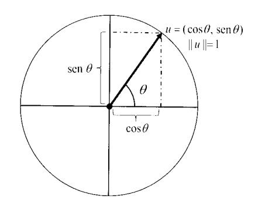
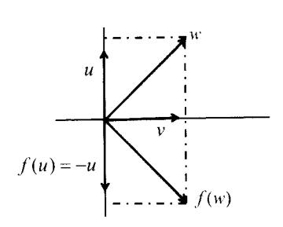
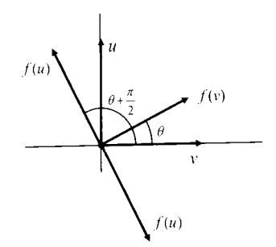
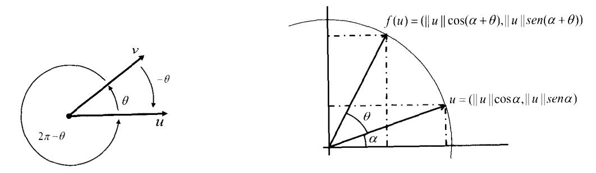
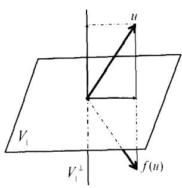
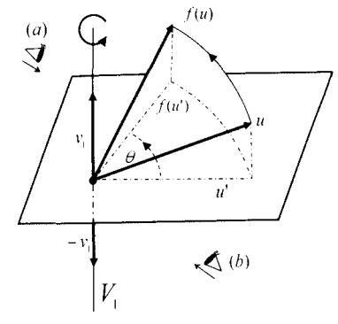
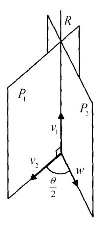

# Capítulo 9: Isometrías vectoriales

En esta sección estudiamos los endomorfismos de un espacio vectorial euclídeo que conservan las longitudes de vectores y los ángulos entre vectores. Para ello basta exigirles que conserven el producto escalar, lo que se define formalmente del siguiente modo

## 9.1. Definición y caracterizaciones

#### Definición 9.1
> Sean $(V, \langle , \rangle)$ y $(V', \langle , \rangle ')$ dos espacios vectoriales euclídeos. Una aplicación lineal  $f: V \to V'$  es una **isometría vectorial** o **transformación ortogonal** si cumple
> $$\langle u, v \rangle = < f(u), f(v) \rangle'  \quad \text{para todo} \quad  u, v \in V $$

Si $f$ es una isometría vectorial entonces conserva la norma y, por tanto, el ángulo entre vectores. En efecto, si  $u, v \in V$ , entonces:

$$||v|| = \sqrt{\langle v, v \rangle} = \sqrt{\langle f(v), f(v) \rangle'} = ||f(v)||' \tag{9.1}$$

lo que leemos diciendo que la longitud de $v$ es igual a la longitud de su imagen $f(v)$. Y respecto a los ángulos

$$\cos \angle(u, v) = \frac{\langle u, v \rangle}{||u|| \cdot ||v||} = \frac{\langle f(u), f(v) \rangle'}{||f(u)||' \cdot ||f(v)||'} = \cos \angle(f(u), f(v)) \tag{9.2}$$

Además, por conservar la norma se tiene que si  $v \in \text{Ker}(f)$  entonces
$$||v|| = ||f(v)||' = ||0_{V'}||' = 0 \Leftrightarrow v = 0_V$$

por lo que toda isometría es inyectiva. Y, claro, si los espacios vectoriales $V$ y $V'$ tuvieran la misma dimensión, entonces sería biyectiva.

También se cumple que una isometría vectorial $f$ transforma una base ortonormal  $\mathcal{B} = \{v_1, \ldots, v_n\}$  en otra base ortonormal  $\mathcal{B}' = \{f(v_1), \ldots, f(v_n)\}$ . Lo que se deduce trivialmente de que conserva la norma, los ángulos entre vectores, y la independencia lineal por ser inyectiva.

Hemos demostrado las siguientes propiedades

#### Proposición 9.2: Propiedades de las isometrías
> Sean $(V, \langle , \rangle)$ y $(V', \langle , \rangle ')$ dos espacios vectoriales euclídeos y  $f: V \to V'$  una isometría vectorial. Entonces, $f$ cumple las siguientes propiedades:
> 
> (1) Conserva la norma: ||u|| = ||f(u)||' para todo  $u \in V$ .
> (2) Conserva los ángulos:  $\angle(u,v) = \angle(f(u),f(v))$ .
> (3) Es invectiva.
> (4) Si $\dim V = \dim V'$ , entonces $f$ es un isomorfismo.
> (5) Transforma una base ortonormal de $V$ en una base ortonormal de $V'$.

En la definición que hemos dado de isometría vectorial, hemos exigido dos condiciones: que sea aplicación lineal y que conserve el producto escalar. Vamos a ver que la primera condición se deduce de la segunda y, por tanto, podríamos no haberla incluido en la definición.

#### Teorema 9.3: Caracterizaciones de las isometrías
> Sean $(V, \langle , \rangle)$ y $(V', \langle , \rangle ')$ dos espacios vectoriales euclídeos y  $f: V \to V'$  una aplicación. Las siguientes afirmaciones son equivalentes
> 
> (1) $f$ es una isometría vectorial.
> (2) $f$ conserva el producto escalar.
> (3) $f$ es lineal y conserva la norma.

#### Demostración:

- $(1) \Rightarrow (2)$  Se tiene por definición.
- (2)  $\Rightarrow$  (3) Supongamos que $f$ conserva el producto escalar, por lo que automáticamente conserva la norma. Para demostrar que es lineal vamos a comprobar que para todo  $u, v \in V$  y todo  $a \in \mathbb{R}$  los vectores $f(u+v)-f(u)-f(v)$ y $f(au)-af(u)$ tienen norma cero: de lo cual deduciremos que ambos vectores son el vector cero de V', de donde

$$f(u+v) = f(u) + f(v) \quad y \quad f(au) = af(u)$$

Sean  $u, v \in V$  vectores cualesquiera, entonces

$$||f(u+v)-f(u)-f(v)||'^2 = \langle f(u+v)-f(u)-f(v), f(u+v)-f(u)-f(v) \rangle'$$

Desarrollando el miembro derecho de la ecuación, aplicando las propiedades del producto escalar, obtenemos:

$$
\begin{array}{c}
\langle f(u+v), f(u+v) \rangle' + \langle f(u), f(u) \rangle ' + \langle f(v), f(v) \rangle' \\
-2 \langle f(u+v), f(u) \rangle ' -2 \langle f(u+v), f(v) \rangle ' +2 \langle f(u), f(v) \rangle '
\end{array}
$$

Ahora usamos que $f$ preserva el producto escalar y se tiene

$$
\begin{array}{l}
\langle u+v,\, u+v \rangle +\langle u,u \rangle + \langle v,v  \rangle -2\langle u+v,u \rangle -2\langle u+v,v\rangle + 2\langle u,v \rangle \\
= 2\langle u,u \rangle +2 \langle u,v \rangle +2\langle v,v \rangle -2\langle u,u \rangle -2\langle v,u \rangle -2\langle u,v \rangle\\
-2\langle v,v \rangle +2\langle u,v \rangle =0
\end{array}
$$

Análogamente se demuestra que  $||f(au) - af(u)||^2 = 0$ .

(3)  $\Rightarrow$  (1) Si $f$ es lineal y conserva la norma, se tiene que $||u+v|| = ||f(u+v)||$ para todo  $u, v \in V$ . Entonces

$$||u+v||^2 = \langle u+v, u+v \rangle = ||u||^2 + ||v||^2 + 2 \langle u, v \rangle$$

У

$$
\begin{align}
||f(u+v)||^{2} &= \langle f(u+v), f(u+v) \rangle' = \langle f(u) + f(v), f(u) + f(v) \rangle' \\
&= ||f(u)||^{2} + ||f(v)||^{2} + 2 \langle f(u), f(v) \rangle' = ||u||^{2} + ||v||^{2} + 2 \langle f(u), f(v) \rangle'
\end{align}
$$

Teniendo en cuenta ambas ecuaciones se tiene  $\langle u, v \rangle = \langle f(u), f(v) \rangle'$ .  $\square$ 

#### Ejemplo 9.4 (SEGUIR AQUÍ)
En el espacio vectorial euclídeo  $\mathbb{R}^3$  con el producto escalar usual, nos preguntamos si existe alguna isometría $f$ que transforme el vector (1,1,0) en el vector (1,1,1). La respuesta es no, porque los vectores tienen distinta longitud o norma. Si $f(1,1,0) = (1,1,1)$, como $f$ conserva la norma debería ser $||f(1,1,0)|| = ||(1,1,0)||$.

¿Existirá una isometría $f$ en  $\mathbb{R}^2$  que transforme la base canónica  $\mathcal{B}$  en la base  $\mathcal{B}' = \{(\frac{1}{\sqrt{2}}, \frac{1}{\sqrt{2}}), (1, 0)\}$ . La respuesta es no, porque las isometrías conservan los ángulos, por lo que el ángulo entre los vectores de la base canónica, que es  $\frac{\pi}{2}$ , debería ser igual al ángulo entre los vectores imagen  $(\frac{1}{\sqrt{2}}, \frac{1}{\sqrt{2}})$  y (1, 0), que en este caso es  $\frac{\pi}{4}$ .  $\square$ 

#### Composición de isometrías

Sean  $(V,<,>),\ (V',\langle,>')$  y $(V'',\langle,\rangle'')$ tres espacios vectoriales euclídeos. Sean  $f:V\to V'$  y  $g:V'\to V''$  isometrías. La composición

$$g \circ f : V \to V''$$

es una isometría vectorial va que

$$\langle u, v \rangle = \langle f(u), f(v) \rangle' = \langle g(f(u)), g(f(v)) \rangle'' = \langle g \circ f(u), g \circ f(v) \rangle''$$

Nuestro estudio se va a centrar en las isometrías que actúan dentro de un espacio vectorial euclídeo $(V,\langle,\rangle)$, es decir los endomorfismos  $f:V\to V$  que conservan longitudes y ángulos, que como sabemos por las propiedades anteriores son isomorfismos.

Se denomina **grupo ortogonal**  $\mathcal{O}(V)$  al conjunto de los isomorfismos ortogonales o isometrías de $V$. que para la operación composición de aplicaciones tiene estructura de grupo. Por ser la composición de isometrías una isometría, se tiene que el grupo ortogonal  $\mathcal{O}(V)$  es un subgrupo del grupo lineal general $GL(V)$ formado por los isomorfismos de $V$.

En esta sección estaremos estudiando la geometría vectorial euclídea. Desde el punto de vista de F. Klein, esta geometría es el estudio de las propiedades que permanecen invariantes en un espacio vectorial euclídeo $V$, cuando actúan en él las transformaciones del grupo ortogonal  $\mathcal{O}(V)$ .

#### Matriz de una isometría $f \in \mathcal{O}(V)$

Recordemos que cuando hablamos de la matriz de un endomorfismo  $f:V\to V$  respecto de una base  $\mathcal{B}$ , es porque se tiene en cuenta la misma base en el espacio de partida y en el de llegada. Vamos a estudiar las propiedades de las matrices de isometrías vectoriales.

#### Proposición 9.5
> Sea $f$ un endomorfismo de un espacio vectorial euclídeo $(V, \langle , \rangle )$. Entonces, son equivalentes las siguientes afirmaciones:
> 
> (1) $f$ es una isometría de $V$.
> (2) Dada una base cualquiera  $\mathcal{B}$  de $V$, si  $A = \mathfrak{M}_{\mathcal{B}}(f)$  y  $G_{\mathcal{B}}$  es la matriz del producto escalar en dicha base, entonces:  $G_{\mathcal{B}} = A^t G_{\mathcal{B}} A$ .
> (3) Si  $\mathcal{B}$  es una base ortonormal de $V$ y  $A = \mathfrak{M}_{\mathcal{B}}(f)$ , entonces $A$ es una matriz ortogonal, es decir,  $AA^t = I$ .
> (4) $f$ transforma una base ortonormal de $V$ en otra base ortonormal de $V$.

**Demostración:**

(1)  $\Rightarrow$  (2). Si $f$ es una isometría de $V$,  $x = (x_1, \ldots, x_n)_{\mathcal{B}}$ ,  $y = (y_1, \ldots, y_n)_{\mathcal{B}} \in V$ , y $X$ e $Y$ las matrices columna de coordenadas de $x$ e $y$ respecto a  $\mathcal{B}$ , entonces
$$\langle f(x), f(y) \rangle = (AX)^t G_{\mathcal{B}}(AY) = X^t (A^t G_{\mathcal{B}} A) Y \quad \text{ y } \quad \langle x, y \rangle= X^t G_{\mathcal{B}} Y$$

Así
$$\langle f(x), f(y) \rangle = \langle x, y \rangle \quad \text{para todo} \quad   x, y \in V \quad \text{si y sólo si} \quad A^t G_{\mathcal{B}} A = G_{\mathcal{B}} $$

 $(2) \Rightarrow (3)$ . Si  $\mathcal{B}$  es una base ortonormal de $V$, entonces la matriz del producto escalar en dicha base es  $G_{\mathcal{B}} = I$ . Si  $A = \mathfrak{M}_{\mathcal{B}}(f)$ , entonces
$$A^t G_{\mathcal{B}} A = G_{\mathcal{B}} \Rightarrow A^t A = I$$

(3)  $\Rightarrow$  (4). Supongamos que  $\mathcal{B} = \{v_1, \dots, v_n\}$  es una base ortonormal de $V$ y A, la matriz de $f$ en dicha base, es ortogonal. Sean  $X_i$  las matrices columna de coordenadas de  $v_i$  en  $\mathcal{B}$ . Entonces

$$< f(v_i), f(v_j) >= (AX_i)^t A X_j = X_i^t A^t A X_j = X_i^t X_j = < v_i, v_j >= \delta_{ij}$$

por lo que $\{f(v_1), \ldots, f(v_n)\}$  es una base ortonormal.

 $(4) \Rightarrow (1)$ . Supongamos que $f$ transforma la base ortonormal  $\mathcal{B} = \{v_1, \dots, v_n\}$  en la base ortonormal  $\mathcal{B}' = \{f(v_1), \dots, f(v_n)\}$ . Sean  $x = (x_1, \dots, x_n)_{\mathcal{B}}, y = (y_1, \dots, y_n)_{\mathcal{B}}$  vectores cualesquiera de $V$, entonces

$$
\begin{align}
\langle f(x), f(y) \rangle &= \langle f(\sum_{i=1}^{n} x_i v_i), f(\sum_{j=1}^{n} y_j v_j) \rangle = \langle \sum_{i=1}^{n} x_i f(v_i), \sum_{j=1}^{n} y_j f(v_j) \rangle \\
&= \sum_{i,j=1}^{n} x_i y_j \langle f(v_i), f(v_j) \rangle = x_1 y_1 + \dots + x_n y_n = \langle x, y \rangle
\end{align}
$$

Por lo tanto, $f$ es una isometría pues conserva el producto escalar.  $\Box$ 

#### Ejemplo 9.6
Sea $f$ el endomorfismo de  $\mathbb{R}^2$  definido por  $f(1,1) = (-1,1), \ f(1,2) = (-1,2).$  Vamos a ver que se trata de una isometría de  $\mathbb{R}^2$  comprobando que se cumple la caracterización (2) de la proposición. La matriz de $f$ en la base  $\mathcal{B} = \{(1,1), (1,2)\}$  es

$$A = \mathfrak{M}_{\mathcal{B}}(f) = \begin{pmatrix} -3 & -4 \\ 2 & 3 \end{pmatrix}$$

y se obtiene calculando

$$f(1,1) = (-1,1) = -3(1,1) + 2(1,2), \quad f(1,2) = (-1,2) = -4(1,1) + 3(1,2)$$

La matriz del producto escalar (el usual por defecto) en la base  $\mathcal B$  es

$$G_{\mathcal{B}} = \begin{pmatrix} \langle (1,1), (1,1) \rangle & \langle (1,1), (1,2) \rangle \\ \langle (1,2), (1,1) \rangle & \langle (1,2), (1,2) \rangle \end{pmatrix} = \begin{pmatrix} 2 & 3 \\ 3 & 5 \end{pmatrix}$$

Tenemos que $f$ es isometría si y sólo si  $G_{\mathcal{B}} = A^t G_{\mathcal{B}} A$ 

$$A^t G_{\mathcal{B}} A = \begin{pmatrix} -3 & -4 \\ 2 & 3 \end{pmatrix}^t \begin{pmatrix} 2 & 3 \\ 3 & 5 \end{pmatrix} \begin{pmatrix} -3 & -4 \\ 2 & 3 \end{pmatrix} = \begin{pmatrix} -3 & 2 \\ -4 & 3 \end{pmatrix} \begin{pmatrix} 0 & 1 \\ 1 & 3 \end{pmatrix} = \begin{pmatrix} 2 & 3 \\ 3 & 5 \end{pmatrix} = G_{\mathcal{B}}$$

También vamos a comprobar que es una isometría utilizando la caracterización (3). Para ello tenemos que obtener la matriz de $f$ en una base ortonormal. Por ejemplo, nos sirve la canónica  $\mathcal{B}_c = \{(1,0),(0,1)\}$ . Hacemos el cambio de base utilizando la matriz de paso  $P = \mathfrak{M}_{\mathcal{BB}_c}$ :

$$\mathfrak{M}_{\mathcal{B}_c}(f) = P \, \mathfrak{M}_{\mathcal{B}}(f) \, P^{-1} = \begin{pmatrix} 1 & 1 \\ 1 & 2 \end{pmatrix} \begin{pmatrix} -3 & -4 \\ 2 & 3 \end{pmatrix} \begin{pmatrix} 1 & 1 \\ 1 & 2 \end{pmatrix}^{-1} = \begin{pmatrix} -1 & 0 \\ 0 & 1 \end{pmatrix}$$

A continuación, comprobamos que se trata de una matriz ortogonal:

$$\begin{pmatrix} -1 & 0 \\ 0 & 1 \end{pmatrix} \begin{pmatrix} -1 & 0 \\ 0 & 1 \end{pmatrix}^t = I_2 \qquad \Box$$

Otra propiedad importante de las isometrías vectoriales tiene que ver con la forma de sus autovalores, que se deduce de la condición de preservar la norma. Lo enunciamos en el siguiente resultado.

#### Teorema 9.7: Autovalores de las isometrías
> Sea  $f \in \mathcal{O}(V)$ . Entonces, las raíces del polinomio característico de $f$ sólo pueden ser números reales o complejos de módulo 1. Es decir:
> 
> $$\lambda = 1, \ \lambda = -1 \text{ o bien } \lambda = \cos \theta \pm i \sin \theta, \ \theta \in (0, \pi)$$

**Demostración:** Sea  $\lambda \in \mathbb{R}$  un autovalor de $f$ y $v$ un autovector no nulo asociado a  $\lambda$ . Entonces, como $f$ conserva la norma, se tiene

$$||v|| = ||f(v)|| = ||\lambda v|| = |\lambda| \cdot ||v||$$

de donde  $|\lambda| = 1$ , es decir  $\lambda = 1$  o -1. Supongamos que el polinomio característico de $f$ tiene alguna raíz compleja  $\lambda = a + bi$ , y consideremos una base ortonormal de $V$ respecto a la cual la matriz de $f$ es una matriz A ortogonal:  $AA^t = I$ .

Considerando A como la matriz de un endomorfismo de  $\mathbb{C}^n$  se tiene que  $\lambda$  es autovalor de A y existe  $X \in \mathfrak{M}_{n \times 1}(\mathbb{C})$  no nula tal que:

$$AX = \lambda X$$

Trasponiendo y tomando conjugados se tiene:

$$X^t A^t = X^t A^{-1} = \lambda X^t  \quad \text{y} \quad  \bar{A}\bar{X} = A\bar{X} = \bar{\lambda}\bar{X} $$

De las dos ecuaciones se deduce

$$X^t A^{-1} A X = \lambda X^t \bar{\lambda} \ddot{X}$$

de donde

$$X^t \bar{X} = \lambda \bar{\lambda} X^t \bar{X} \implies \lambda \lambda = 1$$

Por lo tanto el módulo de  $\lambda$  será  $|\lambda| = \sqrt{\lambda \lambda} = 1$ , es decir  $a^2 + b^2 = 1$ . Los números complejos de módulo 1 están sobre la circunferencia unidad, y se pueden escribir de la forma  $\cos \theta \pm i \sin \theta$ .  $\theta \in (0, \pi)$ . Véase la Figura 9.1: el número complejo  $\cos \theta + i \sin \theta$  de mólulo 1 representado como un vector unitario  $u = (\cos \theta, \sin \theta)$  de  $\mathbb{R}^2$ .  $\square$ 

Figura 9.1: Vectores unitarios en  $\mathbb{R}^2$ 

## 9.2. Clasificación de isometrías

En esta sección vamos a hacer la clasificación métrica de las isometrías en el sentido de ver cuándo dos isometrías son -salvo cambio de base ortonormal- la misma. Para ello estudiaremos invariantes, igual que hicimos en la clasificación lineal de endomorfismos.

#### Definición 9.8
> Sean  $f, g \in \mathcal{O}(V)$  isometrías vectoriales de $(V, \langle , \rangle )$. Diremos que $f$ y $g$ son **métricamente equivalentes** si y sólo si existe otra isometría h tal que  $f = h^{-1} \circ g \circ h$ .
>
> Dos matrices A y B son **ortogonalmente semejantes** si y sólo si existe una matriz ortogonal P tal que  $A = P^{-1}BP$ .

De la definición se sigue que dos isometrías son métricamente equivalentes si y sólo si sus matrices (referidas a bases ortonormales) son ortogonalmente semejantes.

#### Proposición 9.9
> Sea  $f \in \mathcal{O}(V)$  una isometría vectorial de $(V, \langle , \rangle )$. Si $U$ es un subespacio vectorial $f$-invariante, entonces también  $U^{\perp}$  es $f$-invariante.

**Demostración:** Como U es invariante por  $f$, entonces  $f(U) \subseteq U$ . Como $f$ es una biyección, entonces conserva las dimensiones y se tiene que $f(U) = U$. Sea $v$ un vector de  $U^{\perp}$  y veamos que  $f(v) \in U^{\perp}$ ; en tal caso  $U^{\perp}$  será $f$-invariante. Para todo  $u \in U$  se tiene que  $\langle v, u \rangle = 0$ , y como $f$ conserva el producto escalar  $\langle f(v), f(u) \rangle = \langle v, u \rangle = 0$  para todo  $u \in U$ . Entonces $f(v)$ es ortogonal a $f(u)$ para todo  $u \in U$ , es decir  $f(v) \in f(U)^{\perp} = U^{\perp}$ .  $\square$ 

Llamaremos suma directa ortogonal y la denotaremos por  $U \stackrel{\perp}{\oplus} W$  al caso en que se tenga una suma directa  $U \oplus W$  y los subespacios $U$ y $W$ sean ortogonales.

Vamos a comenzar estudiando cómo son las isometrías en un plano o subespacio de dimensión 2.

#### Proposición 9.10
> Sea  $f \in \mathcal{O}(V)$  y $U$ un plano $f$-invariante, entonces existe una base ortonormal  $\mathcal{B}_U$  de $U$ tal que la matriz de la restricción de $f$ a $U$,  $f|_U: U \to U$ , en dicha base, es de la forma
> 
> $$\begin{pmatrix} 1 & 0 \\ 0 & 1 \end{pmatrix}, \quad \begin{pmatrix} -1 & 0 \\ 0 & -1 \end{pmatrix}, \quad \begin{pmatrix} 1 & 0 \\ 0 & -1 \end{pmatrix} \quad \text{o bien} \quad \begin{pmatrix} \cos \theta & -\sin \theta \\ \sin \theta & \cos \theta \end{pmatrix} \quad \cos \theta \in (0,\pi) \cup (\pi,2\pi)$$

**Demostración:** En primer lugar, observamos que si $f$ es una isometría de $V$, entonces  $f|_U$  es una isometría de $U$. Por lo que respecto a una base de $U$ ortonormal la matriz de  $f|_U$  es ortogonal. Distinguimos los siguientes casos:

(1) Si  $f|_U$  tiene alguna recta invariante  $R = L(u_1) \subsetneq U$ , entonces  $R^{\perp} = L(u_2)$  también es invariante (tomamos  $u_1$  y  $u_2$  de norma 1). Las rectas invariantes están generadas por autovectores, y dado que los autovalores reales de  $f|_U$  pueden ser sólo 1 o -1, entonces la matriz en la base  $\mathcal{B}_U = \{u_1, u_2\}$  será de la forma:

$$\begin{pmatrix} 1 & 0 \\ 0 & 1 \end{pmatrix} , \quad  \begin{pmatrix} -1 & 0 \\ 0 & -1 \end{pmatrix} , \quad  \begin{pmatrix} 1 & 0 \\ 0 & -1 \end{pmatrix} \quad \text{o bien} \quad \begin{pmatrix} -1 & 0 \\ 0 & 1 \end{pmatrix} $$

Las dos últimas son equivalentes como matrices de Jordan.

(2) Supongamos ahora que  $f|_U$  no tiene ninguna recta invariante. Entonces, no tiene autovalores reales, y tiene un par de autovalores complejos  $\lambda$  y  $\bar{\lambda}$  conjugados de norma 1:

$$\lambda = \cos \theta + i \sin \theta \quad \text{con} \quad \sin \theta \neq 0$$

Así, la matriz de Jordan real es la matriz ortogonal de la forma

$$J_{\mathbb{R}}(f|_{U}) = \begin{pmatrix} \cos \theta & -\sin \theta \\ \sin \theta & \cos \theta \end{pmatrix} \quad \text{para} \quad \theta \in (0, \pi) \cup (\pi, 2\pi) \tag{9.3}$$

Si  $\mathcal{B}' = \{u, v\}$  es una base tal que  $\mathfrak{M}_{\mathcal{B}'}(f) = J_{\mathbb{R}}$  entonces  $\mathcal{B}'$  es ortonormal pues $f$ es isometría y las imágenes  $\{f(u), f(v)\}$  cuyas coordenadas respecto de  $\mathcal{B}'$  son las columnas de  $J_{\mathbb{R}}$ , forman una base ortonormal.  $\square$ 

**Observación:** La matriz  $\begin{pmatrix} -1 & 0 \\ 0 & -1 \end{pmatrix}$  es un caso particular de la matriz (9.3) cuando  $\theta = \pi$ .

#### Proposición 9.11
> Sea  $f \in \mathcal{O}(V)$  una isometría vectorial de $(V, \langle , \rangle )$. Entonces, se puede obtener una descomposición de $V$ en suma directa ortogonal de rectas  $R_i$  y planos  $P_i$  irreducibles $f$-invariantes:
>
> $$ V = R_1 \mathbin{\overset{\perp}{\oplus}} \cdots \mathbin{\overset{\perp}{\oplus}} R_k \mathbin{\overset{\perp}{\oplus}} P_1 \mathbin{\overset{\perp}{\oplus}} \cdots \mathbin{\overset{\perp}{\oplus}} P_l $$

**Demostración:** Vamos a hacer la demostración por inducción en la dimensión de $V$. Para $n=1$ el resultado se cumple trivialmente ya que el propio $V$ es una recta $f$-invariante. En el caso $n=2$, que corresponde a un plano, el resultado se sigue de la Proposición 9.10. Supongamos que el resultado es cierto para espacios de dimensión hasta n-1. Sea $V$ un espacio vectorial euclídeo de dimensión n y  $f \in \mathcal{O}(V)$ .

- (1) Si $f$ tiene algún autovalor real  $\lambda=1$  o -1, entonces podemos considerar un autovector unitario $v$ y tenemos una recta $f$-invariante R=L(v). Entonces, se tiene la descomposición en subespacios ortogonales $f$-invariantes  $V=R \stackrel{\perp}{\oplus} R^{\perp}$ . Aplicando la hipótesis de inducción a  $R^{\perp}$  de dimensión n-1, obtenemos el resultado deseado.
- (2) Supongamos que $f$ no tiene autovalores reales, en cuyo caso no tiene rectas invariantes. Por la Proposición 6.3, $f$ tiene un plano $P$ invariante, y como no tiene rectas invariantes entonces dicho plano es irreducible. Entonces tenemos la descomposición  $V = P \oplus P^{\perp}$ . Aplicando la hipótesis de inducción a  $P^{\perp}$  de dimensión $n-2$, obtenemos el resultado deseado.  $\square$

#### Teorema 9.12: Matriz de Jordan real de una isometría
> Sea  $f \in \mathcal{O}(V)$  una isometría vectorial de $(V, \langle , \rangle )$. Entonces, respecto a cierta base ortonormal, la matriz de Jordan real de $f$ es de la forma

$$
\begin{align}
\left(
\begin{array}{cccccccc}
1 & & & & & & & \\
& \ddots & & & & & & \\
& & 1 & & & & & \\
& & & -1 & & & & \\
& & & & \ddots & & & \\
& & & & & -1 & & \\
& & & & & & C(\lambda_1) & \alpha_{1} & \\
& & & & & & & \ddots \\
& & & & & & & & C(\lambda_1) \\
& & & & & & & & & \ddots \\
& & & & & & & & & & C(\lambda_r) & \alpha_{r} \\
& & & & & & & & & & & \ddots \\
& & & & & & & & & & & & C(\lambda_r)
\end{array}
\right) \\

\text{donde} \;\lambda_j = \cos \theta_j + i \sin \theta_j ,  \quad C(\lambda_j) = \begin{pmatrix} \cos \theta_j & -\sin \theta_j \\ \sin \theta_j & \cos \theta_j \end{pmatrix} , \quad  \theta_j \in (0, \pi) \cup (\pi, 2\pi) .
\end{align}
$$

**Demostración:** Por el resultado anterior, tenemos que eligiendo una base ortonormal en cada una de las rectas y planos de la descomposición en subespacios invariantes, podríamos obtener una matriz de $f$ diagonal por bloques, con bloques de tamaño 1 o 2. El resultado se obtiene sin más que observar que: (i) las rectas invariantes están generadas por autovectores asociados a los autovalores 1 y -1; (ii) en cada plano invariante  $P_j$  irreducible podemos elegir una base ortonormal tal que

$$\mathfrak{M}(f|_{P_j}) = \begin{pmatrix} \cos \theta_j & -\sin \theta_j \\ \sin \theta_j & \cos \theta_j \end{pmatrix}$$

e (iii) la matriz de Jordan real es única salvo permutación de bloques.

#### Rotaciones y reflexiones

La matriz de una isometría, respecto de una base ortonormal, es una matriz $A$ ortogonal:  $AA^t = I$ . Si consideramos determinantes, tenemos det  $A \det A^t = \det^2 A = 1$ . luego $\det A = 1 \text{ o } -1$.

#### Definición 9.13
> Sea $f$ una isometría de un espacio vectorial euclídeo $(V, \langle, \rangle)$, y $A$ una matriz de $f$ respecto a una base ortonormal. Se dice que $f$ es una **rotación** si $\det A = 1$, y que $f$ es una **reflexión** si det A = -1. El grupo  $\mathcal{O}^+(V)$  formado por las isometrías con determinante 1, llamado **grupo** de **rotaciones** de $V$, es un subgrupo del grupo ortogonal  $\mathcal{O}(V)$ .

El conjunto  $\mathcal{O}^-(V)$  formado por las reflexiones de $V$ no es un subgrupo de  $\mathcal{O}(V)$ , ya que la composición de dos reflexiones es una rotación. Si $f$ y $g$ son dos reflexiones con matrices ortogonales  $\mathfrak{M}_{\mathcal{B}}(f)$  y  $\mathfrak{M}_{\mathcal{B}}(g)$ , respectivamente, entonces:

$$\det(\mathfrak{M}_{\mathcal{B}}(g \circ f)) = \det(\mathfrak{M}_{\mathcal{B}}(g)) \cdot \det(\mathfrak{M}_{\mathcal{B}}(f)) = (-1)(-1) = 1$$

Las rotaciones conservan la orientación y las reflexiones la invierten.

#### Simetrías ortogonales

Sea  $\sigma: V \to V$  una simetría de base B y dirección D, subespacios de $V$ tales que  $V = B \oplus D$ . Diremos que  $\sigma$  es una **simetría ortogonal** si la base y la dirección son subespacios ortogonales  $B^{\perp} = D$ . Así, una simetría ortogonal queda completamente determinada dando la base $B$ o la dirección $D$.

#### Proposición 9.14

Sea $(V, \langle , \rangle )$ un espacio vectorial euclídeo y  $\sigma:V\to V$  una simetría. Entonces,  $\sigma$  es una isometría si y sólo si es una simetría ortogonal.

**Demostración:** Si tomamos una base ortonormal  $\{v_1, \ldots, v_s\}$  del subespacio base B de la simetría y otra base  $\{v_{s+1}, \ldots, v_n\}$  ortonormal del subespacio dirección $D$, entonces la matriz de  $\sigma$  en la base  $C = \{v_1, \ldots, v_s, v_{s+1}, \ldots, v_n\}$  es

$$\mathfrak{M}_{\mathcal{C}}(\sigma) = 
\begin{pmatrix} 
1 &  & {}_s & & & & & \\ 
& \ddots &  & & & & & & \\ 
& & 1 & & & & & \\ 
& & & -1 & & {}_{n-s} & & & \\ 
& & & & \ddots \\
& & & & & -1 & 
\end{pmatrix}$$

ya que  $\sigma(v_i) = v_i$ ,  $i = 1, \ldots, s$ ; y  $\sigma(v_i) = -v_i$ ,  $i = s+1, \ldots, n$ . Si $B$ y $D$ fuesen ortogonales, entonces

 $\mathcal{C}$  sería una base ortonormal, y puesto que la matriz de  $\sigma$  en dicha base es ortogonal, entonces se trata de una isometría.

Por otro lado si  $\sigma$  es una simetría y su base B y dirección D no son ortogonales, entonces tendríamos que no conserva los ángulos ya que si tomamos un vectores  $u \in B$  y  $v \in D$  que no sean ortogonales  $\angle(u,v) = \theta \neq \frac{\pi}{2}$ , entonces  $\angle(\sigma(u),\sigma(v)) = \angle(u,-v) = \pi - \theta$ . Estos ángulos son distintos, luego  $\sigma$  no sería una isometría.  $\square$ 

## 9.3. Isometrías de un espacio euclídeo bidimensional

En esta sección vamos a clasificar las isometrías de un espacio vectorial euclídeo $V$ de dimensión 2. Como sabemos, $V$ es isométrico a  $\mathbb{R}^2$  por lo que mediante isomorfismos de coordenadas podemos trabajar en $V$ igual que en  $\mathbb{R}^2$ . Así, vamos a describir directamente las isometrías del plano vectorial euclídeo  $\mathbb{R}^2$  donde podremos ilustrarlas geométricamente.

Por lo visto en la sección anterior, respecto de una base ortonormal, toda isometría $f$ de  $\mathbb{R}^2$  distinta de la identidad tendrá alguna de las siguientes matrices de Jordan real:

$$J_1 = \begin{pmatrix} 1 & 0 \\ 0 & -1 \end{pmatrix} \quad \text{o} \quad J_2 = \begin{pmatrix} \cos \theta & -\sin \theta \\ \sin \theta & \cos \theta \end{pmatrix} ,  \quad \theta \in (0, 2\pi)$ $$

Como estas matrices son ortogonales, representan a todas las clases de equivalencia de isometrías métricamente (u ortogonalmente) equivalentes.

No obstante, en esta sección vamos a hacer una construcción geométrica de estas mismas matrices desde otro punto de vista. Vamos a utilizar subespacios invariantes por la isometría: en particular el subespacio  $V_1$  formado por los vectores fijos. Suponemos que  $f$, isometría de  $\mathbb{R}^2$ , no es la identidad. Entonces, podemos distinguir dos casos según que $f$ tenga vectores fijos (no nulos), es decir, 1 sea autovalor de $f$ o no.

## Caso 1: $f$ tiene vectores fijos (no nulos).

Entonces,  $V_1 = L(v)$  para algún vector  $v \neq 0$ , que podemos tomarlo de norma 1. Obsérvese que no puede ocurrir dim  $V_1 = 2$  porque en tal caso  $V_1 = \mathbb{R}^2$  y $f$ sería la identidad.

Formamos una base de  $\mathbb{R}^2$  ortonormal  $\mathcal{B} = \{v, u\}$  tomando un vector  $u \in L(v)^{\perp}$ . Como $f(v) = v$, entonces  $\langle f(u), f(v) \rangle = \langle f(u), v \rangle$ , y como $f$ conserva los ángulos  $\langle f(u), f(v) \rangle = \langle u, v \rangle$ . Así

$$\langle f(u), v \rangle = \langle u, v \rangle = 0$$

y $f(u)$ es un vector ortogonal a $V$ de norma 1. Las únicas posibilidades son $f(u) = u$ o bien $f(u) = -u$, ya que  $f(u) \in L(v)^{\perp} = L(u)$ . Descartamos la primera opción pues no puede ser  $u \in V_1 = L(v)$ . Finalmente, la matriz de $f$ en la base  $\mathcal{B}$  es

$$\mathfrak{M}_{\mathcal{B}}(f) = \begin{pmatrix} 1 & 0 \\ 0 & -1 \end{pmatrix}$$

Se trata de una simetría ortogonal de base una recta  $L(v) = V_1$ , por lo que la dirección es la recta  $L(v)^{\perp} = V_{-1}$ . El determinante es -1, luego es una reflexión.

¿Cómo transforma los vectores una simetría ortogonal respecto a una recta? Los vectores de la base quedan siempre fijos, como en cualquier simetría, y los vectores de la dirección se transforman en sus opuestos. Si $w$ es un vector que no está en la base ni en la dirección, entonces $w = au + bv$, y su imagen $f(w) = af(u) + bf(v) = -au + bv$. Véase la Figura 9.2, izquierda.

|                |      |
| -------------------------------------------- | ---------------------------------- |
| Izda.: Simetría ortogonal de base $L(v)$  | Dcha.: Posibles imágenes de $f(u)$ |
Figura 9.2

#### Caso 2: $f$ no tiene vectores fijos (no nulos)

Consideramos las posibles imágenes de los vectores de una base ortonormal que, sin pérdida de generalidad, puede ser la base canónica  $\mathcal{B} = \{v = (1,0), u = (0,1)\}$ . El vector imagen  $f(1,0) = (x,y) \neq (1,0)$  será un vector de norma 1. Los vectores unitarios tienen componentes (x,y) que cumplen  $x^2 + y^2 = 1$ , es decir, las componentes son puntos de la circunferencia unidad, que como sabemos se pueden escribir de la forma  $x = \cos \theta$ ,  $y = \sin \theta$ , con  $\theta \in (0, 2\pi)$ . Véase la Figura 9.1.

Fijada la imagen de $v$, entonces igual que en el caso anterior, la imagen de $u$ será un vector f(u) de norma 1 $v$ ortogonal a $f(v)$, de donde se tienen dos posibilidades (Figura 9.2, derecha).

$$
\begin{align}
(a) \quad & f(u) = (\cos(\theta + \frac{\pi}{2}), \ \sin(\theta + \frac{\pi}{2})) = (-\sin\theta, \ \cos\theta) \\
(b) \quad & f(u) = (-\cos(\theta + \frac{\pi}{2}), \ -\sin(\theta + \frac{\pi}{2})) = (\sin\theta, \ -\cos\theta)
\end{align}$$

Vamos a ver que el segundo caso (b) no puede darse ya que en tal caso la isometría tendría vectores fijos, contradiciendo la hipótesis. En efecto en el caso (b) la matriz de la isometría en la base canónica sería

$$\begin{pmatrix}
\cos\theta & \sin\theta \\
\sin\theta & -\cos\theta
\end{pmatrix}$$

y el conjunto de vectores fijos  $V_1$  serían los (x, y) tales que

$$\begin{pmatrix} \cos \theta & \sin \theta \\ \sin \theta & -\cos \theta \end{pmatrix} \begin{pmatrix} x \\ y \end{pmatrix} = \begin{pmatrix} x \\ y \end{pmatrix}$$

o bien

$$\begin{pmatrix} \cos \theta - 1 & \sin \theta \\ \sin \theta & -\cos \theta - 1 \end{pmatrix} \begin{pmatrix} x \\ y \end{pmatrix} = \begin{pmatrix} 0 \\ 0 \end{pmatrix}$$

La última matriz tiene rango 1, pues su determinante es:  $-\cos^2\theta + 1 - \sin^2\theta = 0$ , por lo que el último sistema tiene infinitas soluciones, que se corresponden con una recta de vectores fijos, y estaríamos en el caso 1.

Así, la matriz de la isometría que no deja vectores fijos no nulos es la correspondiente al caso (a)

$$\begin{pmatrix} \cos \theta & -\sin \theta \\ \sin \theta & \cos \theta \end{pmatrix}, \quad \theta \in (0, 2\pi) \tag{9.4}$$

Este tipo de isometría se denomina **rotación de ángulo**  $\theta$ , y siempre se considera que el sentido de giro es el sentido positivo: el contrario a las agujas del reloj.

Si consideramos los vectores $u$ y $v$ de la figura, el giro que transforma $u$ en $v$ es el giro  $g_1$  de ángulo  $\theta$ , mientras que el giro  $g_2$  que trasforma $v$ en u es el de ángulo  $2\pi - \theta$ . No se puede transformar $v$ en u haciendo un giro en el sentido de las agujas del reloj (podríamos decir, con ángulo  $-\theta$ ). Véase Figura 9.3 (Izquierda).

Figura 9.3: Izda.: Sentido de giro. Deha.: Imagen del vector u por la rotación de ángulo  $\theta$ .

Una base  $\mathcal{B}'$  de  $\mathbb{R}^2$  diremos que está **positivamente orientada** si el determinante de la matriz de cambio de base  $\mathcal{B}'$  a la base canónica  $\mathcal{B}$  es positivo.

Toda rotación de  $\mathbb{R}^2$  de ángulo  $\theta$ , respecto de cualquier base ortonormal positivamente orientada, tiene la misma matriz: de la forma (9.4). Veámoslo. Sea  $u \in \mathbb{R}^2$  un vector cualquiera, no necesariamente unitario. Entonces se puede escribir de la forma

$$u = (||u||\cos \alpha, \ ||u|| \sin \alpha)$$

Si $f$ es una rotación de ángulo  $\theta$ , entonces ||u|| = ||f(u)|| y

$$f(u) = (||u||\cos(\alpha + \theta), ||u||\sin(\alpha + \theta))$$

Figura 9.3. Desarrollando el coseno y seno de la suma de los ángulos

$$f(u) = (||u||(\cos\alpha\cos\theta - \sin\alpha\sin\theta), ||u||(\sin\alpha\cos\theta + \sin\theta\cos\alpha))$$
$$= \left(\begin{pmatrix}\cos\theta & -\sin\theta\\ \sin\theta & \cos\theta\end{pmatrix} \begin{pmatrix} ||u||\cos\alpha\\ ||u||\sin\alpha\end{pmatrix}\right)^t$$

#### Ejemplo 9.15

Vamos a determinar la matriz en la base canónica de la simetría ortogonal de  $\mathbb{R}^2$  con base la recta R de ecuación x + y = 0, por dos métodos distintos.

Método 1: Si tomamos una base ortonormal  $\mathcal{B} = \{v, u\}$  de  $\mathbb{R}^2$  tal que tomando un vector  $v \in R$  y  $u \in \mathbb{R}^\perp$ , entonces la matriz de $f$ en dicha base es:

$$\mathfrak{M}_{\mathcal{B}}(f) = \begin{pmatrix} 1 & 0 \\ 0 & -1 \end{pmatrix}$$

Podemos tomar  $\mathcal{B} = \{v = (1/\sqrt{2}, -1/\sqrt{2}), u = ((1/\sqrt{2}, 1/\sqrt{2}))\}$ . Considerando la matriz P del cambio de base de  $\mathcal{B}$  a la canónica,  $\mathcal{B}'$  obtenemos la matriz pedida:

$$\mathfrak{M}_{\mathcal{B}'}(f) = P\mathfrak{M}_{\mathcal{B}}(f)P^{t} = \begin{pmatrix} 1/\sqrt{2} & 1/\sqrt{2} \\ -1/\sqrt{2} & 1/\sqrt{2} \end{pmatrix} \begin{pmatrix} 1 & 0 \\ 0 & -1 \end{pmatrix} \begin{pmatrix} 1/\sqrt{2} & -1/\sqrt{2} \\ 1/\sqrt{2} & 1/\sqrt{2} \end{pmatrix} = \begin{pmatrix} 0 & -1 \\ -1 & 0 \end{pmatrix}$$

Método 2: Sea

$$\begin{pmatrix} a & b \\ c & d \end{pmatrix}$$

la matriz de la simetría en la base canónica. Consideramos el vector  $(1,-1) \in R$  y se debe cumplir f(1,-1)=(1,-1) por lo que

$$\begin{pmatrix} a & b \\ c & d \end{pmatrix} \begin{pmatrix} 1 \\ -1 \end{pmatrix} = \begin{pmatrix} 1 \\ -1 \end{pmatrix} \Rightarrow a - b = 1, c - d = -1$$

Tomando un vector ortogonal a R. por ejemplo (1,1) se tiene f(1,1) = -(1,1), de donde

$$\begin{pmatrix} 1+b & b \\ -1+d & d \end{pmatrix} \begin{pmatrix} 1 \\ 1 \end{pmatrix} = \begin{pmatrix} -1 \\ -1 \end{pmatrix} \Rightarrow b = -1, d = 0, a = 0, c = -1$$

Se obtiene la misma matriz que antes. $\quad \Box$

## 9.4. Isometrías de un espacio euclídeo tridimensional

Estudiar las isometrías de un espacio vectorial euclídeo tridimensional es equivalente a hacerlo con las isometrías de  $\mathbb{R}^3$ . Utilizaremos este espacio para ilustrar el estudio geométricamente. Podemos obtener las posibles formas de Jordan reales de una isometría, en dimensión 3, utilizando el Teorema 9.12.

Como en el caso bidimensional, la clave para la clasificación métrica de las isometrías será el subespacio invariante  $V_1$  formado por los vectores que quedan fijos. Sea  $f: \mathbb{R}^3 \to \mathbb{R}^3$  una isometría, entonces tenemos la siguiente distinción de casos:

#### Caso 1: $\dim V_1 = 3$ . Todos los vectores quedan fijos

Entonces, tenemos el caso trivial de la aplicación identidad.

#### Caso 2: $\dim V_1 = 2$ . $f$ tiene un plano de vectores fijos

Sea  $\{v_1, v_2\}$  una base ortonormal del plano  $V_1$ , y completemos esta base hasta formar una base ortonormal  $\mathcal{B} = \{v_1, v_2, v_3\}$  de  $\mathbb{R}^3$ . Tenemos, que la recta  $V_1^{\perp} = L(v_3)$  es también un subespacio invariante. Por lo que la división del espacio total en suma de subespacios ortogonales invariantes:

$$\mathbb{R}^3 = V_1 \oplus V_1^{\perp}$$

hace que la matriz de $f$ respecto a dicha base sea diagonal por bloques (Proposición 5.21, pág. 212)

$$
\left(
\begin{array}{c|c}
B_{2\times 2} & 0 \\ 
\hline 0 & B_{1\times 1} 
\end{array}
\right)
$$

Para determinar la matriz basta observar que  $f(v_1) = v_1 = (1, 0, 0)_{\mathcal{B}}$ ,  $f(v_2) = v_2 = (0, 1, 0)_{\mathcal{B}}$  y por ser  $L(v_3)$  una recta invariante, y los únicos autovalores reales de $f$ son 1 o -1, entonces  $f(v_3) = v_3$  o bien  $f(v_3) = -v_3$ . Descartamos la primera opción pues si  $v_3$  fuese un vector fijo de  $f$, entonces dim  $V_1 = 3$ . Así,  $f(v_3) = -v_3 = (0, 0, -1)_{\mathcal{B}}$ , y la matriz de $f$ queda

$$
\left(
\begin{array}{cc|c}
1 & 0 & 0 \\
0 & 1 & 0 \\
\hline
0 & 0 & -1
\end{array}
\right)
$$

Se trata de una simetría ortogonal de base un plano. El determinante es -1, por lo que es una reflexión.

Figura 9.4: Simetría ortogonal de base el plano  $V_1$ .

### Caso 3: $\dim V_1 = 1$ . $f$ tiene una recta de vectores fijos

Introducimos el concepto de orientación de una recta. Una **recta orientada** es una recta en la que se ha fijado un vector generador unitario $v$ y la denotaremos por  $\overrightarrow{L}(v)$ . Toda recta admite dos orientaciones ya que contiene exactamente dos vectores unitarios $v$ y $-v$.

Comenzamos fijando una orientación en la recta de vectores fijos:  $V_1 = \overrightarrow{L}(v_1)$ . Después formamos una base ortonormal de  $\mathbb{R}^3$  positivamente orientada  $\mathcal{B} = \{v_1, v_2, v_3\}$ . El plano  $V_1^{\perp} = L(v_2, v_3)$  es invariante por $f$ v  $\mathbb{R}^3 = V_1 \oplus V_1^{\perp}$ .

La matriz de $f$ respecto a dicha base es diagonal por bloques  $\left(\begin{array}{c|c} 1 & 0 \\ \hline 0 & B_{2\times 2} \end{array}\right)$  y la restricción de $f$ al plano  $V_1^{\perp}$  es una isometría de  $V_1^{\perp}$  que no puede dejar vectores fijos no nulos, luego sólo puede ser una rotación en dicho plano. Así, la matriz de $f$ en la base  $\mathcal B$  es

$$\mathfrak{M}_{\mathcal{B}}(f) = \begin{pmatrix} 1 & 0 & 0\\ 0 & \cos\theta & -\sin\theta\\ 0 & \sin\theta & \cos\theta \end{pmatrix} \tag{9.5}$$

Este tipo de isometría se denomina **giro de eje orientado  $\overrightarrow{L}(v_1)$  y ángulo  $\theta$ **.

Consideremos la misma aplicación $f$ y la orientación de  $V_1$  dada por el vector  $-v_1$ . La base ortonormal  $\mathcal{B}' = \{-v_1, v_2, -v_3\}$  está positivamente orientada y la matriz de $f$ en esta base es

$$\mathfrak{M}_{\mathcal{B}'}(f) = \begin{pmatrix} 1 & 0 & 0 \\ 0 & \cos \theta & \sin \theta \\ 0 & -\sin \theta & \cos \theta \end{pmatrix} = \begin{pmatrix} 1 & 0 & 0 \\ 0 & \cos(2\pi - \theta) & -\sin(2\pi - \theta) \\ 0 & \sin(2\pi - \theta) & \cos(2\pi - \theta) \end{pmatrix} \tag{9.6}$$

ya que  $f(-v_1) = -f(v_1) = -v_1 = (1,0,0)_{\mathcal{B}'}$  y

$$
\begin{array}{lll} 
f(v_2) = & & = \cos\theta \, v_2 + \sin\theta \, v_3 & = \cos\theta \, v_2 - \sin\theta \, (-v_3) & = (0,\cos\theta, -\sin\theta) \mathcal{B}' \\ f(-v_3) = & -f(v_3) & = \sin\theta \, v_2 - \cos\theta \, v_3 & = \sin\theta \, v_2 + \cos\theta \, (-v_3) & = (0,\sin\theta,\cos\theta) \mathcal{B}' 
\end{array}$$

Esta segunda matriz se corresponde con el **giro de eje orientado  $\overrightarrow{L}(-v_1)$  y ángulo  $2\pi - \theta$ **.

Las dos matrices canónicas (9.5) y (9.6) corresponden a la misma isometría. La misma aplicación  $f$, que es un giro de eje  $V_1$ , respecto de las dos bases positivamente orientadas  $\mathcal{B}$  y  $\mathcal{B}'$  construidas considerando las distintas orientaciones del eje, admite dos formas de Jordan distintas. Esto ocurre porque la rotación inducida por $f$ en el plano  $V_1^{\perp}$  vista desde la posición que indica (a) en la Figura 9.5 (que se corresponde con la orientación del eje dada por  $v_1$ ) se hace en sentido positivo (antihorario); mientras que vista desde la posición que indica (b) en la Figura 9.5 (que se corresponde con la orientación dada por  $-v_1$ ) el sentido es negativo (horario).

La rotación en sentido negativo de ángulo  $\theta$  es equivalente a la rotación en sentido positivo de ángulo  $2\pi - \theta$ . Véase Figura 9.3. Necesitamos fijar una orientación en el eje para determinar el sentido del giro, salvo en el caso  $\theta = \pi$ .

Figura 9.5: giro de eje la recta  $V_1 = L(v_1)$ .

### Caso 4: $\dim V_1 = 0$ . $f$ no tiene vectores fijos no nulos

Si 1 no es autovalor de  $f$, entonces los posibles formas de Jordan reales de $f$ son:

$$
\begin{array}{ccc}
\begin{pmatrix} 
-1 & 0 & 0 \\ 
0 & -1 & 0 \\ 
0 & 0 & -1
\end{pmatrix} 
& \qquad 
\begin{pmatrix} 
-1 & 0 & 0 \\ 
0 & \cos \theta & -\sin \theta \\ 
0 & \sin \theta & \cos \theta 
\end{pmatrix}, 
& \quad 
\theta \in (0, \pi) \cup (\pi, 2\pi) \\
\quad \text{Si - 1 es autovalor triple} & \quad
\quad \text{Si -1 es autovalor simple}.
\end{array}
$$

Ya que el polinomio característico de $f$ tendrá: o tres raíces reales (sólo puede ser -1 triple), o bien una real (-1 simple) y dos complejas conjugadas de módulo 1.

Podemos considerar la primera matriz como un caso particular de la segunda cuando  $\theta = \pi$  y estudiar la segunda matriz. Si la matriz de $f$ en una base ortonormal positivamente orientada  $\mathcal{B} = \{v_1, v_2, v_3\}$  es como la segunda matriz de arriba, entonces es fácil ver que se tiene la siguiente descomposición:

$$\mathfrak{M}_{\mathcal{B}}(f) = \begin{pmatrix} -1 & 0 & 0 \\ 0 & \cos \theta & -\sin \theta \\ 0 & \sin \theta & \cos \theta \end{pmatrix} = \underbrace{\begin{pmatrix} -1 & 0 & 0 \\ 0 & 1 & 0 \\ 0 & 0 & 1 \end{pmatrix}}_{\sigma: \text{ simetrfa}} \underbrace{\begin{pmatrix} 1 & 0 & 0 \\ 0 & \cos \theta & -\sin \theta \\ 0 & \sin \theta & \cos \theta \end{pmatrix}}_{g: \text{ giro}} = \mathfrak{M}_{\mathcal{B}}(\sigma)\mathfrak{M}_{\mathcal{B}}(g)$$

Podemos escribir $f$ como composición de un giro $g$ de eje orientado  $\overrightarrow{L}(v_1) = V_{-1}$  y ángulo  $\theta$ , y una simetría ortogonal  $\sigma$  de base el plano  $L(v_2, v_3)$ . Además, como las matrices conmutan se tiene:

$$f = \sigma \circ q = q \circ \sigma$$

Haciendo un poco de abuso del lenguaje, se suele decir que $f$ se descompone en el producto conmutable de un giro por una simetría.

Cuando el ángulo de giro es  $\theta = \pi$ , entonces tenemos la matriz  $-I_3$ , luego  $f = -\operatorname{Id}$ . Este tipo de isometría se denomina **simetría central** o simetría respecto al origen (0,0,0).

Este tipo de transformaciones que son composición de giro con simetría ortogonal de base un plano, tienen determinante -1, luego son reflexiones.

#### Ejemplo 9.16
Determinemos la matriz en la base canónica  $\mathcal{B}$  del giro $g$ en  $\mathbb{R}^3$  de eje orientado  $\overrightarrow{L}(v), \ v = (\sqrt{2}/2, \sqrt{2}/2, 0)$  y ángulo  $\theta = \frac{\pi}{2}$ . En primer lugar, por lo que acabamos de ver, sabemos que matriz de Jordan real del giro es

$$J_{\mathbb{R}}(g) = \mathfrak{M}_{\mathcal{B}'}(g) = \begin{pmatrix} 1 & 0 & 0 \\ 0 & \cos\frac{\pi}{2} & -\sin\frac{\pi}{2} \\ 0 & \sin\frac{\pi}{2} & \cos\frac{\pi}{2} \end{pmatrix} = \begin{pmatrix} 1 & 0 & 0 \\ 0 & 0 & -1 \\ 0 & 1 & 0 \end{pmatrix}$$

respecto a una base ortonormal positivamente orientada  $\mathcal{B}' = \{v_1, v_2, v_3\}$  tal que  $v_1 = v$ . Para construir la base  $\mathcal{B}'$  tomamos un vector unitario del plano  $L(v)^{\perp} \equiv x + y = 0$ , por ejemplo:  $v_2 = (0,0,1)$ , y como tercer vector podemos tomar el producto vectorial  $v_3 = v_1 \wedge v_2 = (\sqrt{2}/2, -\sqrt{2}/2, 0)$ , asegurándonos de que la base esté positivamente orientada.

Obtenemos la matriz pedida haciendo el cambio de base. Si consideramos la matriz  $P = \mathfrak{M}_{\mathcal{B}'\mathcal{B}}$  y  $P^t = \mathfrak{M}_{\mathcal{B}\mathcal{B}'}$ , entonces

$$\mathfrak{M}_{\mathcal{B}}(g) = PJ_{\mathbb{R}}(g)P' = \begin{pmatrix} \frac{\sqrt{2}}{2} & 0 & \frac{\sqrt{2}}{2} \\ \frac{\sqrt{2}}{2} & 0 & -\frac{\sqrt{2}}{2} \\ 0 & 1 & 0 \end{pmatrix} \begin{pmatrix} 1 & 0 & 0 \\ 0 & 0 & -1 \\ 0 & 1 & 0 \end{pmatrix} \begin{pmatrix} \frac{\sqrt{2}}{2} & \frac{\sqrt{2}}{2} & 0 \\ 0 & 0 & 1 \\ \frac{\sqrt{2}}{2} & -\frac{\sqrt{2}}{2} & 0 \end{pmatrix} = \begin{pmatrix} \frac{1}{2} & \frac{1}{2} & \frac{\sqrt{2}}{2} \\ \frac{1}{2} & \frac{1}{2} & -\frac{\sqrt{2}}{2} \\ -\frac{\sqrt{2}}{2} & \frac{\sqrt{2}}{2} & 0 \end{pmatrix} \quad \Box$$

#### Ejemplo 9.17

Vamos a clasificar la isometría $f$ de  $\mathbb{R}^3$  cuya matriz en la base canónica es

$$A = \begin{pmatrix} \frac{\sqrt{3}}{2} & 0 & \frac{1}{2} \\ 0 & -1 & 0 \\ -\frac{1}{2} & 0 & \frac{\sqrt{3}}{2} \end{pmatrix}$$

En primer lugar, podemos comprobar que se trata de una isometría pues se cumple  $AA^t = I$ . Por otro lado, det A = -1, luego se trata de una simetría ortogonal de base un plano o la composición de un giro y una simetría. Determinamos el subespacio invariante formado por los vectores fijos  $V_1$ , que es el que determina completamente el tipo de isometría.

$$\operatorname{rg}(A - I) = \operatorname{rg}\begin{pmatrix} \frac{\sqrt{3}}{2} - 1 & 0 & \frac{1}{2} \\ 0 & -2 & 0 \\ -\frac{1}{2} & 0 & \frac{\sqrt{3}}{2} - 1 \end{pmatrix} = 3 \implies \dim V_1 = 0 \implies V_1 = 0$$

Al no tener vectores fijos no nulos, se trata de un giro compuesto con una simetría ortogonal. Para describir geométricamente la isometría determinamos el eje y ángulo del giro y el plano de simetría que será el ortogonal al eje.

El eje de giro es el subespacio  $V_{-1} = \operatorname{Ker}(f + \operatorname{Id})$  :

$$\operatorname{Ker}(f + \operatorname{Id}) = \{(x, y, z) : \begin{pmatrix} \frac{\sqrt{3}}{2} + 1 & 0 & -\frac{1}{2} \\ 0 & 0 & 0 \\ \frac{1}{2} & 0 & \frac{\sqrt{3}}{2} + 1 \end{pmatrix} \begin{pmatrix} x \\ y \\ z \end{pmatrix} = \begin{pmatrix} 0 \\ 0 \\ 0 \end{pmatrix} \}$$

simplificando se tiene  $V_{-1} \equiv \{x = 0, z = 0\}$ . El plano base de la simetría es  $V_{-1}^{\perp} \equiv \{y = 0\}$ . Para determinar el ángulo de giro calculamos la forma de Jordan real de  $f$, respecto de una base ortonormal positivamente orientada  $\mathcal{B}' = \{v_1, v_2, v_3\}$  tal que  $v_1 \in V_{-1}$  y  $v_2, v_3 \in V_{-1}^{\perp}$ . Nos sirve la base

$$\mathcal{B}' = \{v_1 = (0, 1, 0), v_2 = (0, 0, 1), v_3 = (1, 0, 0)\}$$

Considerando la matriz de cambio de base  $P = \mathfrak{M}_{\mathcal{B}'\mathcal{B}}$  se tiene

$$\mathfrak{M}_{\mathcal{B}'}(f) = P^{t}\mathfrak{M}_{\mathcal{B}}(f)P = \begin{pmatrix} 0 & 1 & 0 \\ 0 & 0 & 1 \\ 1 & 0 & 0 \end{pmatrix} \begin{pmatrix} \frac{\sqrt{3}}{2} & 0 & \frac{1}{2} \\ 0 & -1 & 0 \\ -\frac{1}{2} & 0 & \frac{\sqrt{3}}{2} \end{pmatrix} \begin{pmatrix} 0 & 0 & 1 \\ 1 & 0 & 0 \\ 0 & 1 & 0 \end{pmatrix} = \begin{pmatrix} -1 & 0 & 0 \\ 0 & \frac{\sqrt{3}}{2} & -\frac{1}{2} \\ 0 & \frac{1}{2} & \frac{\sqrt{3}}{2} \end{pmatrix}$$

Entonces, con el eje orientado  $\overrightarrow{L}(v_1)$ , el ángulo de giro es  $\theta = \frac{\pi}{6}$  ya que  $\cos \theta = \frac{\sqrt{3}}{2}$ ,  $\sin \theta = \frac{1}{2}$ . $\quad \Box$

## 9.5. Teorema de Cartan-Dieudonné (SEGUIR AQUÍ)

El resultado principal de esta sección será que toda isometría se puede escribir como composición de simetrías ortogonales hiperplano.

Una **simetría ortogonal hiperplano** es una simetría ortogonal cuya base es un hiperplano H de $V$. Un hiperplano es un subespacio vectorial de dimensión n-1, por lo que si formamos una base ortonormal de V

$$\mathcal{B} = \{v_1, \dots, v_{n-1}, v_n\}$$

siendo  $\{v_1,\ldots,v_{n-1}\}$  una base ortonormal de H, entonces la matriz de la simetría ortogonal hiperplano es

$$\begin{pmatrix} 
1 & & & \\ & 
\ddots^{n-1} & & \\ 
& & 1 & \\ & & & -1 
\end{pmatrix}$$

Y podemos afirmar que una simetría hiperplano siempre es una reflexión.

#### Proposición 9.18
> En un espacio vectorial euclídeo dados dos vectores de igual longitud o norma existe una simetría ortogonal hiperplano que transforma uno en otro.

**Demostración:** Sean  $u, v \in V$  vectores de igual longitud: ||u|| = ||v||. En primer, lugar vamos a ver que los vectores $u + v$ y $u - v$ son ortogonales:

$$\langle u+v, u-v \rangle = \langle u, u \rangle - \langle u, v \rangle + \langle v, u \rangle - \langle v, v \rangle = ||u||^2 - ||v||^2 = 0$$

Consideramos la recta $R$ generada por el vector $u-v$, con lo que  $u+v\in R^{\perp}$ , que es un hiperplano. A continuación vemos que la simetría ortogonal  $\sigma$  de base el hiperplano  $R^{\perp}$  transforma $u$ en $v$.

La descomposición en suma directa ortogonal

$$V=R\oplus R^\perp$$

hace que todo vector se pueda descomponer de manera única como suma de uno de $R$ y otro de  $R^{\perp}$ . Le aplicamos esto a u:

$$u = \underbrace{\frac{u-v}{2}}_{\in R} + \underbrace{\frac{u+v}{2}}_{\in R^{\perp}}$$

y así podemos calcular su imagen

$$\sigma(u) = \sigma(\frac{u-v}{2}) + \sigma(\frac{u+v}{2}) = -\frac{u-v}{2} + \frac{u+v}{2} = v \qquad \Box$$

#### Teorema 9.19: Teorema de Cartan-Dieudonné
> Toda isometría $f$ de un espacio vectorial euclídeo $(V, \langle , \rangle )$, de dimensión n, es de la forma
> $$f = \sigma_1 \circ \cdots \sigma_k, \ k \leq n$$
> siendo  $\sigma_i$  simetrías ortogonales hiperplano. Lo que también se expresa diciendo que $f$ se puede descomponer en producto de a lo más $n$ simetrías (ortogonales) hiperplano.

**Demostración:** Hacemos la demostración del Teorema de Cartan-Dieudonné[^1] por inducción en la dimensión de $V$. Si dim V=1, entonces las únicas isometrías son la identidad, Id. y-Id. y se cumple el enunciado trivialmente. Como hipótesis de inducción, supongamos que el resultado es cierto para isometrías en espacios de dimensión hasta $n-1$.

Sea (V, <.>) un espacio vectorial euclídeo de dimensión n y  $f \in \mathcal{O}(V)$ . Distinguiremos dos casos:

Caso 1: si $f$ deja fijo algún vector  $v \neq 0$ , es decir 1 es autovalor de $f$ y v autovector asociado. Consideremos la descomposición en suma directa ortogonal

$$V = L(v) \oplus L(v)^{\perp}$$

La restricción de $f$ al hiperplano  $H=L(v)^{\perp}$  es una isometría de H, que es un subespacio de dimensión $n-1$. Aplicando la hipótesis de inducción a  $f|_H:H\to H$ , tenemos que existen  $\sigma_1,\ldots,\sigma_k$  simetrías hiperplano con  $k\le n-1$  de H tales que  $\sigma_1\cdots\sigma_k=f|_H$ .

Vamos a ver que podemos extender las simetrías hiperplano  $\sigma_i: H \to H$  de base  $H_i$  hiperplano de H a simetrías hiperplano  $\bar{\sigma}_i: V \to V$  tales que

$$\bar{\sigma}_i|_H = \sigma_i \quad \text{y} \quad \bar{\sigma}_1 \circ \dots \circ \bar{\sigma}_k = f \tag{9.7}$$

Si  $\sigma_i: H \to H$  es la simetría de base el hiperplano  $H_i$  de $H$, entonces  $H = H_i \stackrel{\perp}{\oplus} R_i$  con  $H_i^{\perp} = R_i$  la recta dirección de  $\sigma_i$ . Entonces, podemos definir la simetría hiperplano  $\bar{\sigma}_i: V \to V$  de dirección  $R_i$  y base el hiperplano  $R_i^{\perp} = H_i \oplus L(v)$  de $V$, cumpliéndose (9.7).

Caso 2: si $f$ no deja fijo ningún vector no nulo. Entonces, dados un vector  $u \neq 0$  y su imagen $f(u) = v$, puesto que ambos tienen la misma longitud, aplicando la Proposición 9.18, existe una simetría ortogonal hiperplano  $\sigma$  con base H tal que  $\sigma(v) = u$ . Consideramos ahora la isometría  $f \circ \sigma$  que sí deja vectores fijos:  $f \circ \sigma(v) = f(u) = v$ . Siguiendo el razonamiento del caso 1, se tiene  $f \circ \sigma = \sigma_1 \circ \cdots \sigma_k$  con  $k \leq n-1$  y como  $\sigma^2 = \mathrm{Id}$ , llegamos a

$$f = \sigma_1 \circ \cdots \sigma_k \circ \sigma$$

que son a lo más n simetrías hiperplano.  $\square$ 

En el siguiente resultado, consecuencia directa del Teorema de Cartan-Dieudonné, se pone de manifiesto, una vez más, la importancia del subespacio propio asociado al autovalor 1 que está formado por los vectores que quedan fijos por una isometría $f$.

#### Corolario 9.20
> Sean $(V, \langle , \rangle)$ un espacio vectorial euclídeo de dimensión n y  $f \in \mathcal{O}(V)$  una isometría tal que el subespacio propio  $V_1$ , formado por los vectores fijos por  $f$, tiene dimensión  $d \ge 0$ . Entonces, $f$ se puede descomponer en producto de a lo más $n - d$ simetrías (ortogonales) hiperplano.

**Demostración:** Si dim  $V_1=0$ , entonces el resultado se cumple trivialmente por el Teorema de Cartan-Dieudonné. Si dim  $V_1=d>0$ , entonces consideramos la descomposición  $V=V_1\oplus V_1^\perp$  y la restricción de $f$ al subespacio  $V_1^\perp$  de dimensión n-d. Aplicando el Teorema de Cartan-Dieudonné a la isometría  $f|_{V_1^\perp}:V_1^\perp\to V_1^\perp$  tenemos que existen  $\sigma_1,\ldots,\sigma_k$  simetrías hiperplano

$$\sigma_i: V_1^{\perp} \to V_1^{\perp}, \ k \leq n - d, \quad \text{tales que } \sigma_1 \circ \cdots \circ \sigma_k = f|_{V_n^{\perp}}$$

Las isometrías  $\sigma_i: V_1^{\perp} \to V_1^{\perp}$  tienen por base un hiperplano  $H_i$  de  $V_1^{\perp}$ , que es un subespacio de  $V_1^{\perp}$  de dimensión n-d-1, y dirección la recta  $R_i$  con  $V_1^{\perp} = H_i \stackrel{1}{\oplus} R_i$ . Se tiene la descomposición  $V = V_1 \stackrel{1}{\oplus} H_i \stackrel{1}{\oplus} R_i$ .

Ahora, repetimos exactamente la demostración del caso 1 del Teorema de Cartan-Diedonné, extendiendo las isometrías  $\sigma_i$  a isometrías hiperplano  $\bar{\sigma_i}: V \to V$  tales que

$$\bar{\sigma}_i|_{V_i^{\perp}} = \sigma_i \quad \text{y} \quad \bar{\sigma}_1 \circ \dots \circ \bar{\sigma}_k = f \tag{9.8}$$

Para ello basta definir  $\bar{\sigma_i}$  como las simetrías hiperplano de dirección  $R_i$ . La base será el hiperplano ortogonal a  $R_i$  en V:  $R_i^{\perp} = H_i \stackrel{\perp}{\oplus} V_1$ .  $\square$ 

En particular, en dimensión 2 y 3 se tiene el siguiente resultado

#### Corolario 9.21
>
> - Toda rotación en  $\mathbb{R}^2$  se puede descomponer como producto de dos simetrías ortogonales hiperplano, que son simetrías respecto a rectas.
> - Todo giro en en  $\mathbb{R}^3$  se puede descomponer como producto de dos simetrías ortogonales hiperplano, que son simetrías respecto a planos.

Un último ejemplo muestra cómo se puede obtener la descomposición del giro que enuncia el corolario. La descomposición de la rotación en el plano se deja entre los ejercicios propuestos al final del capítulo.

#### Ejemplo 9.22: Descomposición de un giro

Vamos a demostrar que todo giro $g$ de  $\mathbb{R}^3$  de eje orientado  $\overrightarrow{L}(v_1)$  y ángulo  $\theta$  puede descomponerse como  $g = \sigma_1 \circ \sigma_2$ , con  $\sigma_1$  y  $\sigma_2$  simetrías ortogonales hiperplano cuyas bases son planos  $P_1$  y  $P_2$  que se cortan en el eje de giro en un ángulo igual a  $\frac{\theta}{2}$ .

Consideremos una base ortonormal  $\mathcal{B}=\{v_1,v_2,v_3\}$  de  $\mathbb{R}^3$  positivamente orientada, y llamemos  $P_1=L(v_1,v_2)$  de modo que la recta  $R=L(v_1)\subsetneq P_1$ . Si  $\sigma_1$  es la simetría ortogonal de base  $P_1$ , entonces

$$\mathfrak{M}_{\mathcal{B}}(g) = \begin{pmatrix} 1 & 0 & 0 \\ 0 & \cos \theta & -\sin \theta \\ 0 & \sin \theta & \cos \theta \end{pmatrix} \quad \mathbf{y} \quad \mathfrak{M}_{\mathcal{B}}(\sigma_1) = \begin{pmatrix} 1 & 0 & 0 \\ 0 & 1 & 0 \\ 0 & 0 & -1 \end{pmatrix}$$

Como  $\sigma_1$  es una simetría, entonces  $\sigma_1^2 = \text{Id}$ , de donde  $\sigma_1 = \sigma_1^{-1}$ . Entonces:

$$g = \sigma_1 \circ \sigma_2 \iff \sigma_1^{-1} \circ g = \sigma_1 \circ g = \sigma_2$$

Así, podemos calcular la matriz de  $\sigma_2$  en la base  $\mathcal{B}$ 

$$\begin{pmatrix} 1 & 0 & 0 \\ 0 & 1 & 0 \\ 0 & 0 & -1 \end{pmatrix} \begin{pmatrix} 1 & 0 & 0 \\ 0 & \cos \theta & -\sin \theta \\ 0 & \sin \theta & \cos \theta \end{pmatrix} = \begin{pmatrix} 1 & 0 & 0 \\ 0 & \cos \theta & -\sin \theta \\ 0 & -\sin \theta & -\cos \theta \end{pmatrix}$$

Podemos comprobar que se trata de una simetría ya que

$$
\begin{align}
\begin{pmatrix} 
1 & 0 & 0 \\ 
0 & \cos \theta & -\sin \theta \\ 
0 & -\sin \theta & -\cos \theta 
\end{pmatrix}^{2} 
&= 
\begin{pmatrix} 1 & 0 & 0 \\ 0 & \cos^{2} \theta + \sin^{2} \theta & 0 \\ 0 & 0 & \cos^{2} \theta + \sin^{2} \theta 
\end{pmatrix} = I_{3} \\
\det \begin{pmatrix} 1 & 0 & 0 \\ 0 & \cos \theta & -\sin \theta \\ 0 & -\sin \theta & -\cos \theta \end{pmatrix} &= -\cos^{2} \theta - \sin^{2} \theta = -1
\end{align}$$

La base  $P_2$  de esta simetría  $\sigma_2$  es el subespacio  $\operatorname{Ker}(\sigma_2 - \operatorname{Id})$ 

$$\begin{pmatrix} 0 & 0 & 0 \\ 0 & \cos \theta - 1 & -\sin \theta \\ 0 & -\sin \theta & -\cos \theta - 1 \end{pmatrix} \begin{pmatrix} x \\ y \\ z \end{pmatrix} = \begin{pmatrix} 0 \\ 0 \\ 0 \end{pmatrix}$$
$$\begin{cases} (\cos \theta - 1) y - \sin \theta z = 0 \\ -\sin \theta y + (-\cos \theta - 1) z = 0 \end{cases}$$

Una de las ecuaciones es redundante pues el determinante de la matriz de coeficientes del sistema es

$$\det\begin{pmatrix} \cos \theta - 1 & -\sin \theta \\ -\sin \theta & -\cos \theta - 1 \end{pmatrix} = 0$$

Entonces, podemos quedarnos con una de ellas como ecuación del plano  $P_2$  respecto a la base  $\mathcal{B}$ :

$$P_2 \equiv \{(\cos \theta - 1) y - \sin \theta z = 0\} \tag{9.9}$$

Figura 9.6: La recta  $R = P_1 \cap P_2$  es el eje del giro.

Utilizamos las fórmulas trigonométricas del ángulo doble

$$\cos \theta = \cos^2 \frac{\theta}{2} - \sin^2 \frac{\theta}{2}, \quad \sin \theta = 2 \cos \frac{\theta}{2} \sin \frac{\theta}{2}$$

y reescribimos la ecuación (9.9) de  $P_2$  como:

$$(\cos^2\frac{\theta}{2} - \sin^2\frac{\theta}{2} - 1) \ y \ - (2\cos\frac{\theta}{2}\sin\frac{\theta}{2}) \ z = -2\sin^2\frac{\theta}{2} \ y - 2\cos\frac{\theta}{2}\sin\frac{\theta}{2} \ z = 0$$

Como  $\theta \in (0, 2\pi)$  entonces sen  $\frac{\theta}{2} \neq 0$  y dividiendo podemos simplificar la ecuación:

$$P_2 \equiv \{ \sin \frac{\theta}{2} y + \cos \frac{\theta}{2} z = 0 \}$$

Vemos que  $v_1 \in P_2$  por lo que  $P_1 \cap P_2 = R$ . Tomamos una base ortonormal de  $P_2$  que contenga a  $v_1$ . Nos sirve

$$\{v_1 = (1,0,0)_{\mathcal{B}}, \ w = (0,\cos\frac{\theta}{2}, -\sin\frac{\theta}{2})_{\mathcal{B}}\}$$

El ángulo que forman los planos  $P_1$  y  $P_2$  es exactamente el ángulo que forman los vectores  $v_2$  y w. Véase la Figura 9.6. Por lo tanto:

$$\cos \angle (v_2, w) = \frac{\langle v_2, w \rangle}{||v_2|| \cdot ||w||} = \cos \frac{\theta}{2}$$

## 9.6. Ejercicios propuestos

**9.1.** Describa geométricamente la isometría de  $\mathbb{R}^2$  cuya matriz respecto a una base ortonormal es

$$\begin{pmatrix} -\frac{3}{5} & -\frac{4}{5} \\ -\frac{4}{5} & \frac{3}{5} \end{pmatrix}$$

**9.2.** Encuentre la matriz en la base canónica de la simetría de  $\mathbb{R}^3$  que transforma el vector (1, 2, 0) en el vector (-1, -2, 0).

**9.3.** Demuestre que en un espacio vectorial euclídeo de dimensión 2:
  - a) La composición de dos simetrías respecto a dos rectas que se cortan formando un ángulo  $\theta$  es una rotación de ángulo  $2\theta$ .
  - b) La composición de dos rotaciones de ángulos  $\theta_1$  y  $\theta_2$  es otra rotación de ángulo  $\theta_1 + \theta_2$ .

**9.4.** Sea $f$ la isometría vectorial de  $\mathbb{R}^3$  cuya matriz en la base canónica es

$$\begin{pmatrix} -1/2 & -\sqrt{2}/2 & 1/2\\ \sqrt{2}/2 & 0 & \sqrt{2}/2\\ 1/2 & -\sqrt{2}/2 & -1/2 \end{pmatrix}$$

Determine el tipo de isometría y los elementos geométricos que la caracterizan.

**9.5.** Sea $f$ un endomorfismo de  $\mathbb{R}^3$  cuya matriz respecto a la base canónica es

$$A = \mathfrak{M}_{\mathcal{B}}(f) = \begin{pmatrix} \sqrt{2}/2 & 0 & -\sqrt{2}/2 \\ 0 & 1 & 0 \\ \sqrt{2}/2 & 0 & \sqrt{2}/2 \end{pmatrix}$$

Demostrar que es una isometría vectorial y describirla geométricamente.

**9.6.** Encuentre las matrices (en la base canónica) de todas las isometrías vectoriales de  $\mathbb{R}^3$  que dejan invariante el plano de ecuaciones  $x_1 x_2 = 0$ , actuando en él como un giro de ángulo  $\alpha = \pi$ .

**9.7.** En un espacio vectorial euclídeo $V$ tridimensional se considera el endomorfismo $f$ cuya matriz respecto de una base ortonormal y positivamente orientada es  $\mathcal{B}$  es la siguiente:

$$\mathfrak{M}_{\mathcal{B}}(f) = \left(\begin{array}{ccc} 0 & 0 & 1 \ 1 & 0 & 0 \ 0 & 1 & 0 \end{array}\right)$$

- a) Demostrar que $f$ es una isometría y calcular su forma canónica J.
- b) Calcular las matrices  $\mathfrak{M}_{\mathcal{B}}(s_1)$  y  $\mathfrak{M}_{\mathcal{B}}(s_2)$  de dos simetrías hiperplano  $s_1$  y  $s_2$  tales que  $f = s_2 \circ s_1$ .

**9.8.** En un espacio vectorial euclídeo tridimensional, se consideran las isometrías: $g$ un giro de eje R y s una simetría ortogonal de base un plano P. Demuestre que se cumple:
  - a) Si  $R \subsetneq P$ , entonces  $g \circ s$  es una simetría ortogonal con base un plano.
  - b) Si  $R \cap P = \{0\}$ , entonces  $g \circ s = g' \circ s'$  con g' un giro de eje ortogonal al plano base de la simetría s'.

**9.9.** En un espacio vectorial euclídeo, y respecto de una base ortonormal positivamente orientada  $\mathcal{B} = \{v_1, v_2, v_3\}$ , determine la matriz del giro $g$ de eje la recta  $R \equiv \{x + y = 0, z = 0\}$  y ángulo  $\alpha = \frac{\pi}{4}$ . Considérese la orientación  $\overrightarrow{L}((\frac{\sqrt{2}}{2}, -\frac{\sqrt{2}}{2}, 0))$ .

**9.10.** Demuestre que en un espacio vectorial euclídeo $(V, \langle , \rangle )$ de dimensión 2, no existe ninguna isometría que tenga una única recta invariante.

**9.11.** En el espacio vectorial euclídeo  $\mathbb{R}^4$  determine la simetría ortogonal hiperplano que transforma el vector u = (1, -1, 0, 0) en el vector $v = (1, 0, 0, 1)$. Utilice la demostración de la Proposición 9.18.

---
## Notas
[^1]: Élie Joseh Cartan, Francia 1869 - 1951. Jean Alexandre Eugène Dieudonné, Francia 1906-1992.