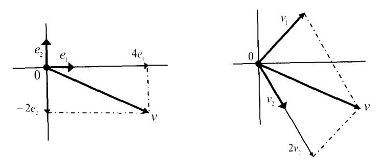
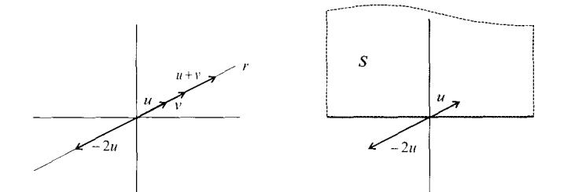
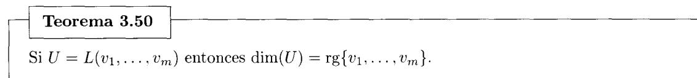
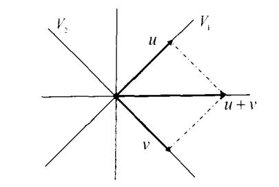
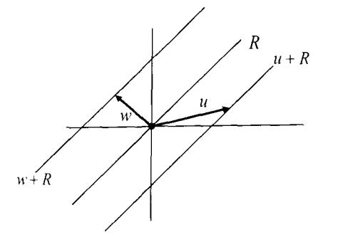

## Capítulo 3

# Espacios vectoriales

Los espacios vectoriales son el medio en el que viven los objetos que estudia el Álgebra Lineal. Son conjuntos cuyos elementos se denominan vectores. Los vectores se pueden sumar y se pueden multiplicar por escalares, y estas operaciones cumplen una serie de propiedades que dotan al conjunto de vectores de estructura algebraica.

El lector ya ha manejado en cursos preuniversitarios vectores en el plano  $\mathbb{R}^2$  y en el espacio  $\mathbb{R}^3$ . También hemos tratado con otra clase de vectores en el primer capítulo, ya que el conjunto  $\mathfrak{M}_{m \times n}(\mathbb{K})$ de matrices de tamaño  $m \times n$  sobre un cuerpo K es un espacio vectorial y las matrices son sus vectores.

En este capítulo estudiaremos la estructura de espacio vectorial, cómo son sus vectores y cómo se opera con ellos. Aparecerán los conceptos de dependencia e independencia lineal de vectores, sistema generador, base y dimensión. Recurriremos a la representación de conjuntos de vectores mediante matrices para estudiar sus propiedades de forma sistemática, y relacionaremos estos espacios con los sistemas de ecuaciones lineales homogéneos.

#### Definición y propiedades de los espacios vectoriales

Un conjunto V no vacío es un **espacio vectorial** sobre un cuerpo  $K$ , o  $K$ -espacio vectorial, si:

En  $V$  está definida una operación interna (suma)

$$
+:\begin{array}{ccc} V \times V & \longrightarrow & V \\ (u,v) & \mapsto & u+v \end{array}
$$

tal que  $(V,+)$  es un grupo abeliano. Esto es, se cumplen las siguientes propiedades:

- 1. Conmutativa:  $u + v = v + u$  para todo  $u, v \in V$
- 2. Asociativa:  $u + (v + w) = (u + v) + w$  para todo  $u, v, w \in V$
- 3. Existe elemento neutro, el  $0 \in V$ , tal que  $u + 0 = u$  para todo  $u \in V$
- 4. Existe elemento opuesto:  $\forall u \in V$ , existe  $-u \in V$  tal que  $u + (-u) = 0$

En  $V$  está definida una operación externa (**producto por escalares**)

$$
\begin{array}{rcl}\n\colon & \mathbb{K} \times V & \longrightarrow & V \\
\hline\n(\alpha, u) & \mapsto & \alpha \cdot u\n\end{array}
$$

que cumple las siguientes propiedades:

- 5. Asociativa:  $\alpha \cdot (\beta \cdot u) = (\alpha \cdot \beta) \cdot u$ , para todo  $\alpha, \beta \in \mathbb{K}$ , v todo  $u \in V$
- 6. El elemento unidad del cuerpo,  $1 \in \mathbb{K}$ , cumple  $1 \cdot u = u$ , para todo  $u \in V$ .
- 7. Distributiva del producto respecto de la suma de vectores:

 $\alpha \cdot (u + v) = \alpha \cdot u + \alpha \cdot v$  para todo  $\alpha \in \mathbb{K}$  v todo  $u, v \in V$ 

8. Distributiva del producto respecto de la suma de escalares:

$$
(\alpha + \beta) \cdot u = \alpha \cdot u + \beta \cdot u
$$
 para todo  $\alpha, \beta \in \mathbb{K}$  y todo  $u \in V$ 

Las propiedades 1 a 8 son las leves o axiomas que definen la estructura de espacio vectorial. Los elementos de un espacio vectorial son los **vectores**, y los del cuerpo  $\mathbb{K}$  los **escalares**. Al elemento neutro del espacio vectorial se le suele llamar el vector nulo o el vector cero.

Aunque la definición está dada para un cuerpo arbitrario  $\mathbb{K}$ , supondremos en todo momento que  $\mathbb{K}$ será  $\mathbb R$  o  $\mathbb C$ . Si  $\mathbb K = \mathbb R$  diremos que V es un **espacio vectorial real**, y si  $\mathbb K = \mathbb C$  que es un **espacio** vectorial compleio.

Ejemplo 3.1

Presentamos algunos espacios vectoriales:

- I. El Teorema 1.2 nos dice que el conjunto  $\mathfrak{M}_{m\times n}(\mathbb{K})$  de matrices de tamaño  $m\times n$  sobre un cuerpo  $\mathbb K$  con la suma de matrices y el producto por escalares tiene estructura de  $\mathbb K$ -espacio vectorial.
- II. Sea K un cuerpo. Para cualquier entero positivo n se define el producto cartesiano

$$
\mathbb{K}^n = \mathbb{K} \times \cdots \times \mathbb{K} = \{ (v_1, \ldots, v_n) : v_1, \ldots, v_n \in \mathbb{K} \}
$$

en el que para todo  $(u_1, \ldots, u_n), (v_1, \ldots, v_n) \in \mathbb{K}^n$  podemos definir la operación interna suma

$$
(u_1, \ldots, u_n) + (v_1, \ldots, v_n) = (u_1 + v_1, \ldots, u_n + v_n) \in \mathbb{K}^n
$$

y para todo  $(u_1, \ldots, u_n) \in \mathbb{K}^n$  y todo  $\alpha \in \mathbb{K}$  la operación externa producto por escalares

$$
\alpha(v_1,\ldots,v_n)=(\alpha v_1,\ldots,\alpha v_n)\in\mathbb{K}^n
$$

que dotan a  $K^n$  de estructura de  $K$ -espacio vectorial.

Para demostrar que  $K^n$  tiene estructura de espacio vectorial nos basta con observar que los vectores de  $\mathbb{K}^n$  los podemos representar como matrices de tamaño  $1 \times n$  sobre K. Además, la suma de vectores de  $\mathbb{K}^n$  y el producto por escalares tiene la misma operativa que tiene la suma de matrices y el producto por escalares. El Teorema 1.2 aplicado a  $\mathfrak{M}_{\mathsf{I}\times n}(\mathbb{K})$  nos vale para afirmar que  $K^n$  es un espacio vectorial.

Dado  $v = (v_1, \ldots, v_n) \in \mathbb{K}^n$ , al escalar  $v_i$  lo denominaremos la **componente** *i* del vector *v*. El elemento neutro en  $\mathbb{K}^n$  para la suma es el **vector nulo**  $0 = (0, \ldots, 0)$  que tiene sus *n* componentes iguales a  $0 \in \mathbb{K}$ .

- III. Podemos dotar a K de estructura de espacio vectorial sobre K, ya que si  $n = 1$  entonces  $\mathbb{K}^n = \mathbb{K}$ .
- IV. También podemos dotar a un conjunto de diversas estructuras de espacio vectorial, dependiendo del cuerpo que empleemos para ello. Por ejemplo  $\mathbb{C}^n$  tiene estructura de espacio vectorial sobre  $\mathbb C$  y sobre R. El conjunto de vectores es el mismo en ambos casos: los elementos de  $\mathbb C^n$ . La suma funcionará igual en ambos casos, como suma en  $\mathbb{C}^n$ . La diferencia está en el producto por escalares, va que en un caso el cuerpo de escalares es  $\mathbb{K} = \mathbb{C}$  y en el otro es  $\mathbb{K} = \mathbb{R}$ . Veamos un ejemplo sencillo. Para  $n = 1$  sean los vectores  $u = 1 + i$ ,  $v = -1 + i \in \mathbb{C}$ , ¿existe  $\alpha \in \mathbb{K}$  tal que  $v = \alpha u$ ? Si K = C la respuesta es sí con  $\alpha = i$ . Si K = R la respuesta es no.
- V. El conjunto  $\mathbb{K}[x]$  de polinomios en una indeterminada x con coeficientes en un cuerpo  $\mathbb{K}$

$$
\mathbb{K}[x] = \{ a_n x^n + \dots + a_1 x + a_0 : n \in \mathbb{N}, a_n, \dots, a_1, a_0 \in \mathbb{K} \}
$$

es un K-espacio vectorial con las operaciones suma de polinomios y producto por escalares de K. Si nos restringimos al subconjunto de  $\mathbb{K}[x]$  formado por polinomios de grado a lo más n

$$
\mathbb{K}_n[x] = \{ a_n x^n + \cdots + a_1 x + a_0 : a_n, \ldots, a_1, a_0 \in \mathbb{K} \}
$$

las mismas operaciones lo dotan también de estructura de K-espacio vectorial.

VI. El conjunto  $\mathcal{C}([a, b], \mathbb{R})$  de funciones reales de variable real continuas en un intervalo  $[a, b]$  es un espacio vectorial real para las operaciones suma de funciones  $(f+g)(x) = f(x)+g(x)$  y producto por escalares  $(\alpha f)(x) = \alpha f(x)$ .  $\Box$ 

#### Unicidad del elemento neutro y del opuesto

Vamos a ver primero que el elemento neutro de un espacio vectorial  $V$  (que hemos denotado por 0) es único. Procedemos por reducción al absurdo. Supongamos que existe  $0' \in V$  tal que  $u + 0' = u$  para todo  $u \in V$ . Entonces sumando el opuesto de  $u$  en ambos lados

$$
(-u) + u + 0' = (-u) + u \Rightarrow 0 + 0' = 0 \Rightarrow 0' = 0.
$$

En la primera implicación hemos aplicado la propiedad 4 de la definición de espacio vectorial y en la segunda implicación la propiedad 3.

Del mismo modo demostramos que todo vector  $u \in V$  tiene un único elemento opuesto:  $-u$ . Procedemos de nuevo por reducción al absurdo. Supongamos que existe  $v \in V$  tal que  $u + v = 0$ . Entonces sumando el opuesto de  $u$  en ambos lados

$$
(-u) + u + v = (-u) + 0 \Rightarrow 0 + v = -u + 0 \Rightarrow v = -u.
$$

En el siguiente resultado vemos otras propiedades con las que estamos familiarizados porque se cumplen en el conjunto de los números reales. Lo interesante es demostrar que todas ellas se deducen también de las 8 propiedades que definen la estructura de espacio vectorial. En su demostración aparecen de forma reiterada el escalar 0 y el vector nulo 0. Para evitar confusiones utilizaremos 0 en negrita para referirnos al vector nulo 0. También aparecen expresiones del tipo  $u + (-v)$ , la suma del vector  $u \times v$  el opuesto del vector v. que escribiremos de forma simplificada como  $u - v$ .

| Proposición 3.2 |  |
|-----------------|--|
|-----------------|--|

## Otras propiedades de la suma de vectores y del producto por escalares

Sean V un K-espacio vectorial,  $u, v, w \in V$  y  $\alpha, \beta \in \mathbb{K}$ . Son ciertas las afirmaciones:

- a)  $\alpha$ **0** = **0**.
- b)  $0u = 0$ .
- c)  $\alpha u = 0 \Leftrightarrow \alpha = 0$  o  $u = 0$ .
- d)  $u + v = u + w \Leftrightarrow v = w$ .
- e)  $\alpha u = \beta u \vee u \neq 0 \Rightarrow \alpha = \beta$ .
- f)  $\alpha u = \alpha v \times \alpha \neq 0 \Rightarrow u = v$ .
- $g \circ (-\alpha)u = -\alpha u = \alpha(-u).$

#### Demostración:

a) Tenemos

$$
\alpha \mathbf{0} = \alpha(\mathbf{0} + \mathbf{0}) = \alpha \mathbf{0} + \alpha \mathbf{0}
$$

la primera igualdad es consecuencia de la propiedad 3 de la definición de espacio vectorial, y la segunda de la propiedad 7. Si en la igualdad  $\alpha \mathbf{0} = \alpha \mathbf{0} + \alpha \mathbf{0}$  sumamos en ambos lados  $-\alpha \mathbf{0}$  (el opuesto de  $\alpha$ 0) tenemos

$$
\alpha \mathbf{0} - \alpha \mathbf{0} = \alpha \mathbf{0} + \alpha \mathbf{0} - \alpha \mathbf{0} \Rightarrow \mathbf{0} = \alpha \mathbf{0} + \mathbf{0} \Rightarrow \mathbf{0} = \alpha \mathbf{0}
$$

para la primera implicación hemos usado la propiedad 4 y para la segunda la propiedad 3.

b) Tenemos que

$$
0u = (0+0)u = 0u + 0u
$$

Sumando en ambos lados el opuesto de  $0u$  se obtiene

$$
0u - 0u = 0u + 0u - 0u \Rightarrow \n\Rightarrow \n\begin{array}{c}\n0 = 0u + 0 \Rightarrow \\
\Rightarrow \n\end{array} 0 = 0u
$$

c) Si  $\alpha = 0$  o  $u = 0$ , entonces por las propiedades a) y b)  $\alpha u = 0$ . Por otro lado, si  $\alpha u = 0$  y  $\alpha \neq 0$ entonces multiplicando en ambos lados de la igualdad  $\alpha u = 0$  por  $\alpha^{-1}$  tenemos

$$
\alpha^{-1}\alpha u = \alpha^{-1}\mathbf{0} \Rightarrow 1 \cdot u = \mathbf{0} \Rightarrow u = \mathbf{0}
$$

d) Si  $u + v = u + w$  entonces sumando a ambos lados el opuesto de u tenemos

$$
u+v=u+w\ \Rightarrow\ -u+u+v=-u+u+w\ \Rightarrow\ \mathbf{0}+v=\mathbf{0}+w\ \Rightarrow\ v=w\ \qquad \qquad (3)
$$

- e) Si  $\alpha u = \beta u$  entonces sumando el opuesto de  $\beta u$  en ambos lados, y aplicando la propiedad distributiva, tenemos que  $(\alpha - \beta)u = 0$ . Y si  $u \neq 0$  entonces, por la propiedad c),  $\alpha - \beta = 0$ , es decir,  $\alpha = \beta$ .
- f) Si  $\alpha u = \alpha v$  entonces sumando el opuesto de  $\alpha v$  en ambos lados tenemos que  $\alpha (u v) = 0$ . Y si  $\alpha \neq 0$  entonces, por la propiedad c),  $u - v = 0$ . Esto es,  $u = v$ .
- g) Por un lado tenemos que

$$
(-\alpha)u + \alpha u = (-\alpha + \alpha)u = 0u = 0
$$
  
(3)

lo que implica que  $(-\alpha)u$  es el opuesto de  $\alpha u$ , es decir  $(-\alpha)u = -\alpha u$ . Y por otro lado tenemos

$$
\alpha(-u) + \alpha u = \alpha(-u + u) = \alpha \mathbf{0} = \mathbf{0}
$$
  
(4)  $\alpha$ 

lo que implica que  $\alpha(-u)$  es el opuesto de  $\alpha u$ . De la unicidad del opuesto se sigue que

$$
-\alpha u = \alpha(-u) \qquad \Box
$$

#### Dependencia e independencia lineal $3.1.$

Sea V un K-espacio vectorial. El vector  $v \in V$  es **combinación lineal** de los vectores  $v_1, \ldots, v_m \in V$ si existen escalares  $\alpha_1, \ldots, \alpha_m \in \mathbb{K}$  tales que

$$
v = \alpha_1 v_1 + \dots + \alpha_m v_m
$$

Los escalares  $\alpha_1, \ldots, \alpha_m$  se denominan **coeficientes** de la combinación lineal.

Por ejemplo, con los vectores  $(1,3), (2,-2), (3,-1) \in \mathbb{R}^2$  y los escalares  $4, 7, -5 \in \mathbb{R}$  podemos construir la combinación lineal

$$
4(1,3) + 7(2,-2) - 5(3,-1) = (3,3)
$$

v, por lo tanto, el vector  $(3,3)$  es combinación lineal de los vectores  $(1,3)$ ,  $(2,-2)$  v  $(3,-1)$ .

Estamos interesados en saber cuándo un conjunto de vectores de un espacio vectorial V tiene la propiedad de que cualquier vector de  $V$  se puede obtener como una combinación lineal única de los vectores del conjunto. Esta cuestión da lugar al concepto de base. Pero previamente estudiaremos en esta sección el concepto de *independencia lineal*, y en la sección siguiente el concepto de *sistema generador.* 

Definición 3.3

Los vectores  $v_1, \ldots, v_m$  del K-espacio vectorial V son

- linealmente dependientes si alguno de ellos es combinación lineal de los demás.
- linealmente independientes si ninguno de ellos es combinación lineal de los demás.

Nota: Cuando nos estemos refiriendo a un sólo vector utilizaremos el siguiente convenio: diremos que el vector 0 es linealmente dependiente y diremos que cualquier vector  $v \neq 0$  es linealmente independiente.

Ejemplo 3.4

Vamos a estudiar si las funciones continuas reales

1.  $\cos^2 x$ ,  $\cos 2x$ 

son linealmente dependientes o independientes. Para ello consideramos la fórmula trigonométrica

$$
\cos^2 x + \sin^2 x = 1
$$

y la del ángulo doble

$$
\cos 2x = \cos^2 x - \sin^2 x
$$

que combinadas dan lugar a

$$
\cos 2x = \cos^2 x - (1 - \cos^2 x) = 2\cos^2 x - 1
$$

Entonces, la función cos  $2x$  es una combinación lineal de la función cos  $2x$  y la función constante 1. Por lo que se concluye que las funciones dadas son linealmente dependientes.  $\Box$ 

#### Proposición 3.5

Sean  $v_1, \ldots, v_m$  vectores de un K-espacio vectorial V. Son ciertas las siguientes afirmaciones:

- 1. Si  $0 \in \{v_1, \ldots, v_m\}$  entonces  $v_1, \ldots, v_m$  son linealmente dependientes.
- 2.  $v_1, \ldots, v_m$  son linealmente dependientes si y sólo si existen escalares  $\alpha_1, \ldots, \alpha_m$  no todos iguales a 0 para los que se cumple que  $\alpha_1 v_1 + \cdots + \alpha_m v_m = 0$ .
- 3.  $v_1, \ldots, v_m$  son linealmente independientes si v sólo si los únicos escalares para los que se cumple que  $\alpha_1 v_1 + \cdots + \alpha_m v_m = 0$  son  $\alpha_1 = \cdots = \alpha_m = 0$ .

Demostración: 1. Si el conjunto está formado sólo por el vector 0, el resultado es cierto por convenio. Si  $0 \in \{v_1, \ldots, v_m\}$  entonces podemos suponer sin pérdida de generalidad que  $v_1 = 0$  y el conjunto es

$$
\{v_1=0,v_2,\ldots,v_m\}
$$

En ese caso

$$
v_1=0\,v_2+\cdots+0\,v_m
$$

por lo que  $v_1, \ldots, v_m$  son linealmente dependientes.

2.  $\Rightarrow$ ) Sean  $v_1, \ldots, v_m$  vectores linealmente dependientes. Sin pérdida de generalidad podemos suponer que  $v_m$  es combinación lineal del resto, es decir, que existen  $\alpha_1, \ldots, \alpha_{m-1} \in \mathbb{K}$  tales que

$$
v_m = \alpha_1 v_1 + \dots + \alpha_{m-1} v_{m-1}
$$

o lo que es lo mismo

$$
\alpha_1 v_1 + \cdots + \alpha_{m-1} v_{m-1} - v_m = 0
$$
 con  $\alpha_m = -1$ 

lo que prueba esta implicación.

 $\Leftarrow$ ) Supongamos que existen  $\alpha_1, \ldots, \alpha_m$  escalares en K no todos nulos tales que

$$
\alpha_1 v_1 + \cdots + \alpha_m v_m = 0
$$

Sin pérdida de generalidad podemos suponer que  $\alpha_m \neq 0$ . Entonces

$$
v_m = -\frac{\alpha_1}{\alpha_m} v_1 - \ldots - \frac{\alpha_{m-1}}{\alpha_m} v_{m-1}
$$

es decir  $v_m$  es combinación lineal de los vectores  $v_1, \ldots, v_{m-1}$ , y por tanto los vectores son linealmente dependientes.

3. Si el enunciado de este apartado dice:  $A \Leftrightarrow B$ , entonces el enunciado del apartado anterior dice: no  $A \Leftrightarrow$  no B. Se trata, por tanto, de afirmaciones equivalentes  $\Box$ 

**Nota:** Como caso particular del resultado anterior tenemos que **dos vectores no nulos**  $u, v \in V$ son linealmente dependientes si y sólo si son proporcionales, esto es, si y sólo si existe un escalar  $\lambda \neq 0$  tal que  $v = \lambda u$ .

Eiemplo 3.6

En  $\mathbb{R}^4$  consideramos los vectores

$$
u_1 = (1, -1, 2, 0),
$$
  $u_2 = (-3, -1, 2, 1),$   $u_3 = (1, 3, -6, -1)$ 

¿Son  $u_1, u_2$  vectores linealmente independientes? ¿Y  $u_1, u_2, u_3$ ?

**Solución:** (1)  $u_1$  y  $u_2$  no son proporcionales, y por lo tanto son linealmente independientes.

(2) Estudiamos la existencia de escalares  $x, y, z \in \mathbb{R}$  tales que

$$
x(1, -1, 2, 0) + y(-3, -1, 2, 1) + z(1, 3, -6, -1) = (0, 0, 0, 0)
$$

Formamos el sistema lineal homogéneo de 4 ecuaciones (una por cada coordenada) y 3 incógnitas (una por cada vector)

$$
\begin{cases}\n x - 3y + z = 0 \\
 -x - y + 3z = 0 \\
 2x + 2y - 6z = 0 \\
 y - z = 0\n\end{cases}
$$

cuya solución general es

$$
(x, y, z) = (2\alpha, \alpha, \alpha)
$$
con  $\alpha \in \mathbb{R}$ 

Para  $\alpha = 1$  tenemos que

$$
2u_1 + u_2 + u_3 = 0
$$

luego  $u_1, u_2, u_3$  son linealmente dependientes.  $\Box$ 

Observación: Tal y como acabamos de ver en el ejemplo anterior, estudiar la dependencia o independencia lineal de vectores de  $\mathbb{K}^n$  es equivalente a resolver un sistema lineal.

Ejemplo 3.7

(1) En  $\mathfrak{M}_2(\mathbb{C})$  consideration los vectores (las matrices)

$$
A_1 = \begin{pmatrix} i & i \\ 2i & i \end{pmatrix}, \quad A_2 = \begin{pmatrix} 1 & i \\ 3-i & -1 \end{pmatrix}, \quad A_3 = \begin{pmatrix} 3 & 2+i \\ 7-i & 1 \end{pmatrix}
$$

 $\sum_{i=1}$ Son  $A_1, A_2, A_3$  linealmente independientes?

(2) En  $\mathbb{R}^3$  consideration los vectores

$$
v_1 = (1, 0, 0), \quad v_2 = (0, 1, 0), \quad v_3 = (0, 0, 1), \quad v_4 = (2, 3, 5)
$$

¿Son  $v_1, v_2$  vectores linealmente independientes? ¿Y  $v_1, v_2, v_3$ ? ¿Y  $v_1, v_2, v_3, v_4$ ? ¿Y  $v_1, v_2, v_3, v_4, v_5$ donde  $v_5$  es cualquier vector de  $\mathbb{R}^3$ ?

**Solución:** (1) Podemos comprobar que

$$
-2iA_1 + A_2 - A_3 = -2i\begin{pmatrix} i & i \\ 2i & i \end{pmatrix} + \begin{pmatrix} 1 & i \\ 3-i & -1 \end{pmatrix} - \begin{pmatrix} 3 & 2+i \\ 7-i & 1 \end{pmatrix} = \begin{pmatrix} 0 & 0 \\ 0 & 0 \end{pmatrix}
$$

y por lo tanto  $A_1$ ,  $A_2$ ,  $A_3$  son linealmente dependientes.

- (2) Al resolver esta cuestión veremos el efecto que tiene añadir vectores en la dependencia lineal:
  - Estudiamos la existencia de escalares  $\alpha, \beta \in \mathbb{R}$  tales que

$$
\alpha(1,0,0) + \beta(0,1,0) = (0,0,0)
$$

o equivalentemente

$$
(\alpha, \beta, 0) = (0, 0, 0)
$$

que sólo se cumple si

$$
\alpha = \beta = 0
$$

Luego  $v_1, v_2$  son linealmente independientes.

Estudiamos la existencia de escalares  $\alpha, \beta, \gamma \in \mathbb{R}$  tales que

$$
\alpha(1,0,0) + \beta(0,1,0) + \gamma(0,0,1) = (0,0,0)
$$

o equivalentemente

$$
(\alpha, \beta, \gamma) = (0, 0, 0)
$$

que sólo se cumple si

$$
\alpha = \beta = \gamma = 0
$$

Luego  $v_1, v_2, v_3$  son linealmente independientes.

Estudiamos la existencia de escalares  $\alpha, \beta, \gamma, \delta \in \mathbb{R}$  tales que

$$
\alpha(1,0,0) + \beta(0,1,0) + \gamma(0,0,1) + \delta(2,3,5) = (0,0,0)
$$

o equivalentemente

$$
(\alpha + 2\delta, \beta + 3\delta, \gamma + 5\delta) = (0, 0, 0)
$$

Igualando coordenada a coordenada obtenemos el sistema lineal en las variables  $\alpha,\beta,\gamma,\delta$ 

$$
\begin{cases} \alpha + 2\delta = 0\\ \beta + 3\delta = 0\\ \gamma + 5\delta = 0 \end{cases}
$$

cuya solución es

$$
(\alpha, \beta, \gamma, \delta) = (-2\lambda, -3\lambda, -5\lambda, \lambda)
$$

donde  $\lambda$  recorre todo  $\mathbb R$ . Luego existen soluciones distintas a  $(\alpha, \beta, \gamma, \delta) = (0, 0, 0, 0)$  y, por tanto,  $v_1, v_2, v_3, v_4$  son linealmente dependientes.

• Según acabamos de ver los vectores  $v_1, v_2, v_3, v_4$  son linealmente dependientes y, por tanto, existen  $\alpha, \beta, \gamma, \delta$  no todos iguales a 0 tales que

$$
\alpha v_1 + \beta v_2 + \gamma v_3 + \delta v_4 = 0
$$

De lo que deducimos que los vectores  $v_1, v_2, v_3, v_4, v_5$  son linealmente dependientes ya que

$$
\alpha v_1 + \beta v_2 + \gamma v_3 + \delta v_4 + 0 v_5 = 0 \qquad \Box
$$

Proposición 3.8

Si  $v_1, \ldots, v_m$  son vectores linealmente independientes de V y  $v_{m+1}$  es un vector de V que no es combinación lineal de  $v_1, \ldots, v_m$  entonces  $v_1, \ldots, v_m, v_{m+1}$  son linealmente independientes.

**Demostración:** Procedemos por reducción al absurdo, suponiendo que  $v_1, \ldots, v_m, v_{m+1}$  son linealmente dependientes, esto es. que existen  $\beta_1, \ldots, \beta_m, \beta_{m+1} \in \mathbb{K}$  no todos nulos tales que

$$
\beta_1 v_1 + \dots + \beta_m v_m + \beta_{m+1} v_{m+1} = 0
$$

Vamos a ver que  $\beta_{m+1} \neq 0$ . Si  $\beta_{m+1} = 0$ , entonces

$$
\beta_1 v_1 + \dots + \beta_m v_m = 0
$$

y como  $v_1, \ldots, v_m$  son linealmente independientes  $\beta_1 = \ldots = \beta_m = \beta_{m+1} = 0$  que supondría una contradicción. Ahora bien, dado que  $\beta_{m+1} \neq 0$ , podemos despejar  $v_{m+1}$  en la primera ecuación

$$
v_{m+1} = -\frac{\beta_1}{\beta_{m+1}} v_1 - \dots - \frac{\beta_m}{\beta_{m+1}} v_m
$$

contradiciendo que  $v_{m+1}$  no es combinación lineal de  $v_1, \ldots, v_m$ .  $\Box$ 

Ejemplo 3.9

Consideramos los vectores de  $\mathbb{R}^4$ 

 $v_1 = (1, 1, 2, 1), v_2 = (2, 1, 3, 2), v_3 = (1, 2, 3, 1), v_4 = (2, 1, 1, 4), v_5 = (4, 1, 0, 9)$ 

Construya un subconjunto S de  $\{v_1, v_2, v_3, v_4, v_5\}$  formado por el mayor número de vectores linealmente independientes.

**Solución** Como  $v_1 \neq 0$  tenemos que  $v_1$  es linealmente independiente y  $v_1 \in S$ . Como  $v_1$  y  $v_2$  no son proporcionales entonces  $v_1$  y  $v_2$  son linealmente independientes y, por tanto.  $v_2 \in S$ .

Veamos si  $v_3$  pertenece a S. Escribimos  $v_3$  como combinación lineal de  $v_1$  y  $v_2$ .

$$
v_3 = \alpha v_1 + \beta v_2
$$

Esta ecuación da lugar a un sistema lineal en las incógnitas  $\alpha$  y  $\beta$  que tiene solución (dejamos como ejercicio comprobarlo). Es decir,  $v_3$  es combinación lineal de  $v_1$  y  $v_2$  y, por lo tanto.  $v_3 \notin S$ .

Veamos si  $v_4$  pertenece a S. Como antes, escribimos  $v_4$  como combinación lineal de  $v_1$  y  $v_2$ :

$$
v_4 = \alpha v_1 + \beta v_2
$$

Esta ecuación da lugar a un sistema lineal en las incógnitas  $\alpha$  y  $\beta$  que no tiene solución (dejamos como ejercicio comprobarlo). Es decir,  $v_4$  no es combinación lineal de  $v_1$  y  $v_2$  y, por lo tanto.  $v_4 \in S$ .

Por último, veamos si  $v_5$  pertenece a S. Expresamos  $v_5$  como combinación lineal de  $v_1, v_2, v_3$ ;

$$
v_5 = \alpha v_1 + \beta v_2 + \gamma v_4
$$

Esta ecuación da lugar a un sistema lineal en las incógnitas  $\alpha$ ,  $\beta$  y  $\gamma$  que tiene solución (dejamos como ejercicio comprobarlo). Es decir,  $v_5$  es combinación lineal de  $v_1$ ,  $v_2$  y  $v_4$  y, por lo tanto,  $v_5 \notin S$ .

En resumen.  $S = \{v_1, v_2, v_4\}.$  $\Box$ 

#### $3.2.$ Sistemas generadores

#### Definición 3.10

Un sistema generador de un espacio vectorial V es un conjunto S de vectores de V tal que todo vector de V es combinación lineal de vectores de S. El espacio V es de **dimensión finita** si existe un sistema generador de  $V$  con un número finito de vectores.

Eiemplo 3.11

El conjunto infinito

$$
S = \{1, x, x^2, x^3, \ldots\}
$$

es un sistema generador del espacio vectorial  $\mathbb{K}[x]$  de polinomios en una indeterminada x con coeficientes en K. Esto es así porque todo polinomio  $p(x) \in K[x]$  es combinación lineal de los polinomios de S; si  $p(x)$  es un polinomio de grado n entonces

$$
p(x) = a_0 + a_1x + \dots + a_nx^n
$$

Por otro lado un conjunto  $S'$  con un número finito de polinomios no puede ser un sistema generador de  $\mathbb{K}[x]$ , va que si m es el grado máximo que tiene un polinomio de  $S'$  entonces ningún polinomio de grado mayor que m puede ser combinación lineal de los polinomios de  $S'$ .

El espacio vectorial  $\mathbb{K}[x]$  es un ejemplo de un espacio vectorial de dimensión infinita.  $\Box$ 

A partir de ahora siempre trabajaremos con espacios vectoriales de dimensión finita

Eiemplo 3.12

En  $\mathbb{R}^3$  consideration los vectores

 $v_1 = (1,0,0), \quad v_2 = (0,1,0), \quad v_3 = (0,0,1)$ 

 $E_{\mathcal{E}}\{v_1, v_2\}$  un sistema generador de  $\mathbb{R}^3$ ?  $\{Y \{v_1, v_2, v_3\} \}$ ?  $\{Y \{v_1, v_2, v_3, v_4\}$  donde  $v_4$  es cualquier vector de  $\mathbb{R}^3$ ?

Solución: Veremos el efecto que tiene en la respuesta el ir añadiendo vectores:

Estudiamos para todo  $(a, b, c) \in \mathbb{R}^3$  la existencia de escalares  $\alpha, \beta \in \mathbb{R}$  tales que

$$
\alpha(1,0,0) + \beta(0,1,0) = (a,b,c)
$$

es decir

$$
(\alpha, \beta, 0) = (a, b, c)
$$

que no tiene solución si  $c \neq 0$ . Luego  $\{v_1, v_2\}$  no es un sistema generador de  $\mathbb{R}^3$ .

Estudiamos para todo  $(a, b, c) \in \mathbb{R}^3$  la existencia de escalares  $\alpha, \beta, \gamma \in \mathbb{R}$  tales que

$$
\alpha(1,0,0) + \beta(0,1,0) + \gamma(0,0,1) = (a,b,c)
$$

es decir

$$
(\alpha, \beta, \gamma) = (a, b, c)
$$

que se cumple para

$$
\alpha = a, \ \beta = b, \ \gamma = c
$$

Luego  $\{v_1, v_2, v_3\}$  es un sistema generador de  $\mathbb{R}^3$ .

- Según acabamos de ver el conjunto  $\{v_1, v_2, v_3\}$  es un sistema generador y, por tanto, cada vector  $v \in \mathbb{R}^3$  se puede escribir como combinación lineal de  $v_1, v_2, v_3$ :

$$
v = \alpha v_1 + \beta v_2 + \gamma v_3
$$

De lo que deducimos que el conjunto  $\{v_1, v_2, v_3, v_4\}$  es un sistema generador ya que v también se puede escribir como combinación lineal de  $v_1, v_2, v_3, v_4$ :

$$
v = \alpha v_1 + \beta v_2 + \gamma v_3 + 0 v_4
$$

Esta idea se puede generalizar, de manera que si añadimos un vector a un sistema generador seguiremos teniendo un sistema generador.  $\Box$ 

Si los vectores de un sistema generador no son linealmente independientes entonces existe un vector del conjunto que se puede eliminar y seguir teniendo un sistema generador.

#### Proposición 3.13

Si  $\{v_1, \ldots, v_m\}$  es un sistema generador de V y  $v_m$  es combinación lineal de  $v_1, \ldots, v_{m-1}$  entonces  $\{v_1, \ldots, v_{m-1}\}\$ es un sistema generador de V.

**Demostración:** Como  $v_m$  es combinación lineal de  $v_1, \ldots, v_{m-1}$  entonces

$$
v_m = \beta_1 v_1 + \dots + \beta_{m-1} v_{m-1}
$$

para ciertos  $\beta_1, \ldots, \beta_{m-1} \in \mathbb{K}$ . Como  $\{v_1, \ldots, v_m\}$  es sistema generador de V, entonces para todo  $w \in V$  existen  $\alpha_1, \ldots, \alpha_m \in \mathbb{K}$  tales que

$$
w = \alpha_1 v_1 + \dots + \alpha_m v_m
$$
  
=  $\alpha_1 v_1 + \dots + \alpha_{m-1} v_{m-1} + \alpha_m (\beta_1 v_1 + \dots + \beta_{m-1} v_{m-1})$   
=  $(\alpha_1 + \alpha_m \beta_1) v_1 + \dots + (\alpha_{m-1} + \alpha_m \beta_{m-1}) v_{m-1}$ 

lo que prueba que  $\{v_1, \ldots, v_{m-1}\}\$ es un sistema generador de  $V$ .  $\Box$  Vamos a probar que el máximo número de vectores linealmente independientes en un espacio vectorial  $V$  es como mucho igual al mínimo número de vectores de un sistema generador de  $V$ .

|  |  | Proposición 3.14 |  |
|--|--|------------------|--|
|  |  |                  |  |

Sea V un espacio vectorial. Si  $v_1, \ldots, v_r$  son vectores linealmente independientes de V y  $\{w_1, \ldots, w_s\}$  es un sistema generador de V entonces  $r \leq s$ .

**Demostración:** Supondremos que  $r > s$  y vamos a llegar a una contradicción. Escribimos  $v_1$  en función de los vectores del sistema generador  $\{w_1, \ldots, w_s\}$ :

$$
v_1 = \alpha_{11}w_1 + \dots + \alpha_{1s}w_s
$$

Como  $v_1$  es no nulo entonces algún  $\alpha$  es no nulo. Sin pérdida de generalidad, suponemos que  $\alpha_{11} \neq 0$ . Entonces

$$
w_1 = \frac{1}{\alpha_{11}} v_1 - \frac{\alpha_{12}}{\alpha_{11}} w_2 - \dots - \frac{\alpha_{1s}}{\alpha_{11}} w_s
$$

Luego  $\{v_1, w_2, \ldots, w_s\}$  es un sistema generador de V.

Ahora describimos el procedimiento a seguir para  $k = 2, 3, ..., s$ .

Escribimos  $v_k$  en función de los vectores del sistema generador  $\{v_1, \ldots, v_{k-1}, w_k, \ldots, w_s\}$ :

$$
v_k = \alpha_{k1}v_1 + \dots + \alpha_{k,k-1}v_{k-1} + \alpha_{kk}w_k + \dots + \alpha_{ks}w_s
$$

Como  $v_k$  es no nulo entonces algún  $\alpha$  es no nulo. Además,  $\alpha_{kk} = \cdots = \alpha_{ks} = 0$  no es una opción posible, pues entonces  $v_k$  sería combinación lineal de  $v_1, \ldots, v_{k-1}$  contradiciendo que  $v_1, \ldots, v_r$  son linealmente independientes. Sin pérdida de generalidad, suponemos que  $\alpha_{kk} \neq 0$ . Entonces

$$
w_k = -\frac{\alpha_{k1}}{\alpha_{kk}} v_1 - \dots - \frac{\alpha_{k,k-1}}{\alpha_{kk}} v_{k-1} + \frac{1}{\alpha_{kk}} v_k - \frac{\alpha_{k,k+1}}{\alpha_{kk}} w_{k+1} - \dots - \frac{\alpha_{k,s}}{\alpha_{kk}} w_s
$$

Luego  $\{v_1, \ldots, v_k, w_{k+1}, \ldots, w_s\}$  es un sistema generador de V.

Cuando  $k = s$  habremos llegado a la conclusión de que  $\{v_1, \ldots, v_s\}$  es un sistema generador. Pero si  $r > s$  entonces  $v_r$  sería combinación lineal de  $v_1, \ldots, v_s$  contradiciendo que  $v_1, \ldots, v_r$  son vectores linealmente independientes.  $\Box$ 

En el Ejemplo 3.7 vimos que los vectores  $(1,0,0)$ ,  $(0,1,0)$ ,  $(0,0,1)$  de  $\mathbb{R}^3$  son Ejemplo 3.15 linealmente independientes, y en el Ejemplo 3.12 vimos que  $\{(1,0,0), (0,1,0), (0,0,1)\}$  es un sistema generador de  $\mathbb{R}^3$ . De la Proposición 3.14 se sigue que cualquier conjunto de 2 vectores de  $\mathbb{R}^3$  no es un sistema generador, y que cualesquiera 4 vectores de  $\mathbb{R}^3$  son linealmente dependientes.

De forma similar podemos concluir que si  $m < n$  entonces cualquier conjunto de m vectores no es un sistema generador de  $\mathbb{R}^n$ , y que si  $p > n$  entonces cualesquiera p vectores de  $\mathbb{R}^n$  son linealmente dependientes.  $\Box$ 

#### **Bases** 3.3.

Definición 3.16

Una base de un espacio vectorial  $V$  es un conjunto ordenado de vectores de  $V$ 

 $\mathcal{B} = \{v_1, \ldots, v_n\}$ 

que son linealmente independientes y que forman un sistema generador de V.

De la Proposición 3.14 se sigue que una base es un sistema generador con el mínimo número posible de vectores, y que una base es un conjunto de vectores linealmente independientes con el máximo número posible de vectores. Una base no podrá nunca contener al vector nulo pues en tal caso los vectores no serían linealmente independientes

Ejemplo 3.17

 $\mathbb{E}$ n  $\mathbb{R}^3$  consideramos los vectores

 $v_1 = (1, 0, 0),$   $v_2 = (0, 1, 0),$   $v_3 = (0, 0, 1),$   $v_4 = (2, 3, 5)$ 

 ${}_{i}Es \{v_{1}, v_{2}\}\$ una base de  $\mathbb{R}^{3}$ ?  ${}_{i}Y \{v_{1}, v_{2}, v_{3}\}$ ?  ${}_{i}Y \{v_{1}, v_{2}, v_{3}, v_{4}\}$ ?

**Solución:** En los Ejemplos 3.7 y 3.12 vimos que:

- Los vectores  $v_1, v_2$  son linealmente independientes y  $\{v_1, v_2\}$  no es un sistema generador de  $\mathbb{R}^3$ . Luego  $\{v_1, v_2\}$  no es una base de  $\mathbb{R}^3$ .
- Los vectores  $v_1, v_2, v_3$  son linealmente independientes y  $\{v_1, v_2, v_3\}$  es un sistema generador de  $\mathbb{R}^3$ . Luego  $\{v_1, v_2, v_3\}$  es una base de  $\mathbb{R}^3$ .
- Los vectores  $v_1, v_2, v_3, v_4$  son linealmente dependientes y  $\{v_1, v_2, v_3, v_4\}$  es un sistema generador de  $\mathbb{R}^3$ . Luego  $\{v_1, v_2, v_3, v_4\}$  no es una base de  $\mathbb{R}^3$ .  $\Box$

Todas las bases de un espacio vectorial finito  $V$  tienen igual número de vectores.

**Demostración:** Sea B una base de V con r vectores y sea B' otra base de V con s vectores. Como los vectores de B son linealmente independientes y  $\mathcal{B}'$  es un sistema generador, por la Proposición 3.14.  $r \leq s$ . Por otro lado, como B es un sistema generador y los vectores de B' son linealmente independientes, por la Proposición 3.14,  $r > s$ . Por lo tanto  $r = s$ .  $\Box$ 

La dimensión de V,  $\dim(V)$ , es el número de vectores de cualquier base de V

Eiemplo 3.19 Introducimos las bases más utilizadas de los principales espacios vectoriales.

#### 1. Base canónica o estándar de $\mathbb{K}^n$ .

Sean  $e_1, \ldots, e_n$  los vectores del K-espacio vectorial K<sup>n</sup> dados por

$$
e_1 = (1, 0, ..., 0), e_2 = (0, 1, 0, ..., 0), ..., e_n = (0, ..., 0, 1)
$$

El conjunto  $\{e_1, \ldots, e_n\}$  es un sistema generador de  $\mathbb{K}^n$  ya que para todo  $(\alpha_1, \ldots, \alpha_n) \in \mathbb{K}^n$ 

$$
(\alpha_1, ..., \alpha_n) = \alpha_1 (1, 0, ..., 0) + \dots + \alpha_n (0, ..., 0, 1) = \alpha_1 e_1 + \dots + \alpha_n e_n
$$

Por otro lado  $e_1, \ldots, e_n$  son linealmente independientes puesto que

$$
\alpha_1 e_1 + \dots + \alpha_n e_n = (0, \dots, 0) \iff \alpha_1 = \dots = \alpha_n = 0
$$

Por tanto  $\{e_1, \ldots, e_n\}$  es una base de K<sup>n</sup>. Del Teorema 3.18 se sigue que dim $(\mathbb{K}^n) = n$ .

2. Base canónica o estándar de  $\mathbb{K}_n[x]$ .

Consideramos los vectores (polinomios) del espacio vectorial  $\mathbb{K}_n[x]$ 

$$
1, x, x^2, \ldots, x^n
$$

El conjunto  $\{1, x, \ldots, x^n\}$  es un sistema generador de  $\mathbb{K}_n[x]$ , pues todo polinomio

$$
\alpha_0 + \alpha_1 x + \dots + \alpha_n x^n \in \mathbb{K}_n[x]
$$

es una combinación lineal de  $1, x, \ldots, x^n$ . Por otro lado  $1, x, \ldots, x^n$  son linealmente independientes puesto que

$$
\alpha_0 + \alpha_1 x + \dots + \alpha_n x^n = 0 \iff \alpha_0 = \alpha_1 = \dots = \alpha_n = 0
$$

Por tanto  $\{1, x, ..., x^n\}$  es una base de  $\mathbb{K}_n[x]$ . Del Teorema 3.18 se sigue que dim $(\mathbb{K}_n[x]) = n+1$ .

#### 3. Base canónica o estándar de $\mathfrak{M}_{m \times n}(\mathbb{K})$ .

Para  $i = 1, ..., m$  y  $j = 1, ..., n$  sea  $E_{ij} \in \mathfrak{M}_{m \times n}(\mathbb{K})$  la matriz que tiene la entrada  $(i, j)$  igual a 1 y el resto de entradas iguales a 0. El conjunto

$$
\{E_{ij}: i=1,\ldots,m; j=1,\ldots,n\}
$$

es una base de  $\mathfrak{M}_{m \times n}(\mathbb{K})$  (queda como ejercicio demostrar que es una base). Del Teorema 3.18 se sigue que dim $(\mathfrak{M}_{m \times n}(\mathbb{K})) = mn$ . Por ejemplo, la base canónica de  $\mathfrak{M}_{2 \times 2}(\mathbb{K})$  es

$$
\{E_{11}=\begin{pmatrix} 1 & 0 \\ 0 & 0 \end{pmatrix},\; E_{12}=\begin{pmatrix} 0 & 1 \\ 0 & 0 \end{pmatrix},\; E_{21}=\begin{pmatrix} 0 & 0 \\ 1 & 0 \end{pmatrix},\; E_{22}=\begin{pmatrix} 0 & 0 \\ 0 & 1 \end{pmatrix}\}
$$

4. Un ejemplo de espacio vectorial para el que no existe una base finita es el conjunto  $\mathbb{K}[x]$  de polinomios en una indeterminada  $x$  con coeficientes en  $\mathbb{K}$ . De igual forma que hicimos en el apartado 2, podemos probar que el conjunto infinito  $\{1, x, x^2, \ldots\}$  es una base de K[x].  $\Box$ 

#### Proposición 3.20

Sea V un espacio vectorial de dimensión n. Son ciertas las afirmaciones:

- 1. Un sistema generador de V tiene como mínimo  $n$  vectores.
- 2. Un conjunto de vectores linealmente independientes de  $V$  tiene como máximo n vectores.
- 3. Todo sistema generador de  $V$  de  $n$  vectores es una base de  $V$ .
- 4. Todo conjunto de *n* vectores linealmente independientes de  $V$  es una base de  $V$ .
- **Demostración:** 1 y 2. Cualquier base de V tiene *n* vectores que forman un sistema generador y son linealmente independientes. Por la Proposición 3.14 cada sistema generador de V tiene al menos n vectores y cada conjunto de vectores linealmente independientes de  $V$  tiene a lo más n vectores.
  - 3. Sea  $S = \{v_1, \ldots, v_n\}$  un sistema generador de V. Vamos a ver que  $v_1, \ldots, v_n$  son vectores linealmente independientes. Procedemos por reducción al absurdo: supongamos que cierto  $v_i \in \mathcal{S}$ es combinación lineal de los vectores de  $S - \{v_i\}$ . Entonces por la Proposición 3.13 el conjunto  $S - \{v_i\}$  es un sistema generador de  $n-1$  vectores. Lo que contradice al apartado 1.
  - 4. Sean  $v_1, \ldots, v_n$  vectores linealmente independientes de V. Vamos a ver que entonces  $\{v_1, \ldots, v_n\}$ es un sistema generador de V. Procedemos por reducción al absurdo: supongamos que existe  $v \in V$  que no es combinación lineal de los vectores  $v_1, \ldots, v_n$ . Entonces por la Proposición 3.8 el conjunto  $\{v_1, \ldots, v_n, v\}$  es un conjunto de  $n+1$  vectores linealmente independientes. Lo que contradice al apartado 2.  $\Box$

Ejemplo 3.21

Determine si

 $\{u_1 = (1-3i,1,i), u_2 = (3i,2i,0), u_3 = (2,1,0)\}$ 

es una base del  $\mathbb{C}$  –espacio vectorial  $\mathbb{C}^3$ .

**Solución:** Toda base de  $\mathbb{C}^3$  como  $\mathbb{C}$  -espacio vectorial tiene 3 vectores (como  $\mathbb{R}$  -espacio vectorial tendría 6). Nos basta con ver si  $u_1, u_2, u_3$  son linealmente independientes. Tenemos que

$$
\alpha_1(1-3i, 1, i) + \alpha_2(3i, 2i, 0) + \alpha_3(2, 1, 0) = 0
$$

da lugar al sistema lineal

$$
\begin{cases}\n(1-3i)\alpha_1 + 3i \alpha_2 + 2\alpha_3 = 0 \\
\alpha_1 + 2i \alpha_2 + \alpha_3 = 0 \\
i \alpha_1 = 0\n\end{cases}
$$

que tiene como única solución

$$
\alpha_1 = \alpha_2 = \alpha_3 = 0
$$

Por lo tanto  $\{u_1, u_2, u_3\}$  es una base de  $\mathbb{C}^3$ .  $\Box$ 

### Teorema 3.22

Todo sistema generador es una base o contiene a una base. Es decir, si  $\{v_1, \ldots, v_m\}$  es un sistema generador de un espacio vectorial V de dimensión n, con  $m > n$ , entonces se pueden eliminar  $m-n$  vectores v quedarnos con una base de V.

**Demostración:** Sea  $\mathcal{S} = \{v_1, \ldots, v_m\}$  un sistema generador de un espacio vectorial V de dimensión n. La Proposición 3.20 nos dice que si  $m = n$  entonces S es una base de V, y que si  $m > n$  entonces los vectores de S no pueden ser linealmente independientes. Es decir, que existe un  $v \in \mathcal{S}$  que es combinación lineal de los vectores de  $S - \{v\}$ . Por la Proposición 3.13 sabemos que  $S - \{v\}$  es un sistema generador de V de  $m-1$  elementos. Si  $m-1 > n$  se repite el mismo argumento con  $S - \{v\}$ . Tras eliminar  $m - n$  vectores de S llegamos a un conjunto de *n* vectores que sigue signo sistema generador de  $V$  y que, por la Proposición 3.20, será una base de  $V$ .  $\Box$ 

#### Teorema 3.23

#### Teorema de ampliación a una base

Todo conjunto de vectores linealmente independientes es una base o está contenido en una base. Es decir, si  $v_1, \ldots, v_m$  son vectores linealmente independientes de un espacio vectorial V de dimensión n con  $m \leq n$ , entonces existen  $n - m$  vectores  $v_{m+1}, \ldots, v_n$  de V tales que  $\{v_1, \ldots, v_m, v_{m+1}, \ldots, v_n\}$  es una base de V.

**Demostración:** Sean  $v_1, \ldots, v_m$  vectores linealmente independientes de un espacio vectorial V de dimensión n. La Proposición 3.20 nos dice que si  $m = n$  entonces  $\{v_1, \ldots, v_m\}$  es una base de V, y que si  $m < n$  entonces el conjunto  $\{v_1, \ldots, v_m\}$  no puede ser un sistema generador de V. Es decir, que existe un  $v_{m+1}$  que no es combinación lineal de  $v_1, \ldots, v_m$ . Por la Proposición 3.8 sabemos que  $v_1, \ldots, v_m, v_{m+1}$  son vectores linealmente independientes. Si  $m+1 < n$  se repite el mismo argumento con  $v_1, \ldots, v_m, v_{m+1}$ . Tras añadir  $n-m$  vectores de V llegamos a un conjunto

$$
\{v_1,\ldots,v_m,v_{m+1},\ldots,v_n\}
$$

de *n* vectores linealmente independientes que, por la Proposición 3.20, es una base de  $V$ .  $\Box$ 

$$
Ejemplo\ 3.24
$$

(a) Sea  $\mathbb{R}_3[x]$  el conjunto de polinomios de grado a lo más 3, y sea

$$
S = \{ p_1 = x^3 + 5x^2 + 1, p_2 = x^2 - 3, p_3 = x^3 - x^2 + x - 1 \} \subset \mathbb{R}_3[x]
$$

Los vectores (polinomios) de  $S$  son linealmente independientes. Efectivamente, vamos a ver que ninguna combinación lineal no nula de  $p_1, p_2, y_3$  es igual al vector (polinomio) 0. Sea:

$$
0 = \alpha(x^3 + 5x^2 + 1) + \beta(x^2 - 3) + \gamma(x^3 - x^2 + x - 1)
$$
  
=  $(\alpha x^3 + \alpha 5x^2 + \alpha) + (\beta x^2 - 3\beta) + (\gamma x^3 - \gamma x^2 + \gamma x - \gamma)$   
=  $(\alpha + \gamma)x^3 + (5\alpha + \beta - \gamma)x^2 + (\gamma)x + (\alpha - 3\beta - \gamma)$ 

Todos los coeficientes del último polinomio serán iguales a 0. Es decir, obtenemos el sistema

$$
\mathcal{A} \equiv \left\{ \begin{array}{ll} \alpha & + \gamma = 0 \\ 5\alpha + \beta - \gamma = 0 \\ \gamma = 0 \\ \alpha - 3\beta - \gamma = 0 \end{array} \right.
$$

en las incógnitas  $\alpha$ ,  $\beta$ ,  $\gamma$  cuya única solución es

$$
(\alpha, \beta, \gamma) = (0, 0, 0)
$$

Por lo tanto  $\{p_1, p_2, p_3\}$  es un conjunto de vectores linealmente independientes.

 $(b)$  Vamos ahora a ampliar el conjunto

$$
S = \{p_1, p_2, p_3\}
$$

a una base. Sabemos que dim $(\mathbb{R}_3[x]) = 4$ , luego nos basta con encontrar un vector que no dependa linealmente de  $p_1, p_2, y_2, p_3$ . Un procedimiento práctico consiste en ir probando con los vectores de la base canónica  $\{1, x, x^2, x^3\}$ , pues alguno de ellos no será combinación lineal de  $p_1$ ,  $p_2$  y  $p_3$ .

Comenzamos probando con el primero. Se comprueba que 1 no es combinación lineal de  $p_1$ ,  $p_2$  y  $p_3$ (se deja como ejercicio) y por tanto

$$
S \cup \{1\} = \{p_1, p_2, p_3, 1\}
$$

es una base de  $\mathbb{R}_3[x]$ .

Si 1 hubiera sido combinación lineal de  $p_1$ ,  $p_2$  y  $p_3$  entonces habríamos procedido de igual manera con x, con x<sup>2</sup> o con x<sup>3</sup>. Alguno de ellos no habría sido combinación lineal de  $p_1$ ,  $p_2$  y  $p_3$  y habríamos terminado ya que tendríamos la base deseada.  $\Box$ 

Hemos visto dos procesos que nos interesa resaltar:

 $(i)$  si tenemos un sistema generador de un espacio vectorial de dimensión finita podemos eliminar vectores (por ser combinación lineal de los restantes) y quedarnos con una base; y

 $(ii)$  si tenemos un conjunto de vectores linealmente independientes en un espacio vectorial finito que no generan todos los vectores del espacio vectorial mediante combinaciones lineales, entonces podemos añadir vectores hasta completar una base.

De esta forma entendemos una base como un conjunto mínimo de vectores que nos permite generar todo vector del espacio vectorial por medio de combinaciones lineales.

#### Coordenadas de un vector respecto de una base

Una propiedad esencial de una base de un espacio vectorial es que permite expresar cada vector de manera única como combinación lineal de sus vectores.

#### Teorema 3.25

El conjunto de vectores  $\{v_1, \ldots, v_n\}$  es una base de V si y sólo si cada vector de V se puede expresar de forma única como combinación lineal de  $v_1, \ldots, v_n$ .

**Demostración:**  $\Rightarrow$  Supongamos que  $\{v_1, \ldots, v_n\}$  es una base de V. Como es un sistema generador, entonces cada  $u \in V$  se puede expresar como combinación lineal de  $v_1, \ldots, v_n$ . Si u pudiera expresarse de dos formas distintas

$$
u = \alpha_1 v_1 + \dots + \alpha_n v_n \quad y \quad u = \beta_1 v_1 + \dots + \beta_n v_n
$$

restando ambas expresiones obtendríamos

$$
0 = (\alpha_1 - \beta_1)v_1 + \dots + (\alpha_n - \beta_n)v_n
$$

Como  $v_1, \ldots, v_n$  son linealmente independientes todos los coeficientes son 0

$$
\alpha_1 - \beta_1 = \cdots = \alpha_n - \beta_n = 0
$$

luego  $\alpha_i = \beta_i$  para  $i = 1, ..., n$ . Por tanto ambas expresiones coinciden.

 $\Leftarrow$ ) Supongamos que cada  $u \in V$  se puede expresar de forma única como una combinación lineal de  $v_1, \ldots, v_n$ . Entonces  $\{v_1, \ldots, v_n\}$  es un sistema generador. Por otra parte

$$
\alpha_1v_1 + \alpha_2v_2 + \ldots + \alpha_nv_n = 0
$$

admite la solución  $\alpha_1 = \cdots = \alpha_n = 0$  que por hipótesis es única, y por lo tanto  $v_1, \ldots, v_n$  son linealmente independientes. Luego  $\{v_1, \ldots, v_n\}$  es una base de  $V$ .  $\Box$ 

#### Definición 3.26

Sean  $\mathcal{B} = \{v_1, \ldots, v_n\}$  una base de un K-espacio vectorial V y u un vector de V. Decimos que  $(\alpha_1,\ldots,\alpha_n)$  son las **coordenadas de** u **respecto de** B si  $\alpha_1,\ldots,\alpha_n$  son los únicos escalares tales que

$$
u = \alpha_1 v_1 + \alpha_2 v_2 + \ldots + \alpha_n v_n \tag{*}
$$

Para referirmos a la expresión (\*) usaremos la notación  $u = (\alpha_1, \dots, \alpha_n)$ B.

Ejemplo 3.27 (a) Veamos cómo son las coordenadas de los vectores de  $\mathbb{K}_n[x]$  con respecto a su base canónica  $B = \{1, x, ..., x^n\}$ . Si  $p(x) = \alpha_0 + \alpha_1 x + \cdots + \alpha_n x^n$  entonces sus coordenadas respecto de B son los coeficientes  $(\alpha_0, \alpha_1, \ldots, \alpha_n)$  lo que representamos mediante la expresión

$$
p(x)=(\alpha_0,\alpha_1,\ldots,\alpha_n)_{\mathcal{B}}
$$

(b) Consideramos la base canónica  $\mathcal{B} = \{1, x, x^2\}$  de  $\mathbb{R}_2[x]$ . Entonces

$$
1 + 5x - 3x^2 = (1, 5, -3)g
$$

Las coordenadas de  $1 + 5x - 3x^2$  respecto de B son  $(1, 5, -3)$ . Consideramos otra base

$$
\mathcal{B}' = \{1 + x + x^2, 5 + 5x - x^2, 3 + 2x + x^2\}
$$

de  $\mathbb{R}_2[x]$ . Entonces

$$
1 + 5x - 3x2 = 3(1 + x + x2) + 2(5 + 5x - x2) - 4(3 + 2x + x2) = (3, 2, -4)B'
$$

Luego las coordenadas de  $1 + 5x - 3x^2$  respecto de  $\mathcal{B}'$  son  $(3, 2, -4)$ .  $\Box$ 

Eiemplo 3.28 Recordamos que una base es un conjunto ordenado de vectores. Veamos como afecta el orden de los vectores en las coordenadas de un vector. Sean  $\mathcal{B} = \{v_1, v_2, v_3\}$  v  $\mathcal{B}' = \{v_3, v_1, v_2\}$ dos bases del mismo espacio vectorial. Observamos que  $\mathcal{B} \times \mathcal{B}'$  tienen los mismos vectores pero cambiados de orden. Entonces

$$
(\alpha_1, \alpha_2, \alpha_3)_{\mathcal{B}} = \alpha_1 v_1 + \alpha_2 v_2 + \alpha_3 v_3 = \alpha_3 v_3 + \alpha_1 v_1 + \alpha_2 v_2 = (\alpha_3, \alpha_1, \alpha_2)_{\mathcal{B}'}
$$

Y concluimos que el cambio del orden de los vectores de la base se corresponde con el cambio del orden de las coordenadas.  $\Box$ 

Vamos a ver cómo se comportan las coordenadas respecto a la suma de vectores y al producto de un vector por un escalar. Sea  $\mathcal{B} = \{v_1, \ldots, v_n\}$  una base del espacio vectorial V, sean  $x = (x_1, \ldots, x_n)_{\mathcal{B}}$ e  $y = (y_1, \ldots, y_n)$ g vectores de V y sea  $\lambda$  un escalar:

$$
x + y = (x_1, ..., x_n)B + (y_1, ..., y_n)B = (x_1v_1 + ... + x_nv_n) + (y_1v_1 + ... + y_nv_n)
$$
  
=  $(x_1 + y_1)v_1 + ... + (x_n + y_n)v_n = (x_1 + y_1, ..., x_n + y_n)B$   
$$
\lambda x = \lambda(x_1, ..., x_n)B = \lambda(x_1v_1 + ... + x_nv_n)
$$
  
=  $\lambda x_1v_1 + ... + \lambda x_nv_n = (\lambda x_1, ..., \lambda x_n)B$ 

Las coordenadas de  $x + y$  respecto de B son la suma de las coordenadas de x y de y respecto de B. Las coordenadas de  $\lambda x$  respecto de B son el producto de  $\lambda$  por las coordenadas de x respecto de B.

Sea V un K-espacio vectorial de dimensión n. Fiiada una base B de V podemos operar con los vectores de V, mediante el uso de sus coordenadas respecto de B, como si fueran vectores de  $\mathbb{K}^n$ . En concreto, dado que las coordenadas de un vector son únicas definimos la bivección

$$
V \longrightarrow \mathbb{K}^n
$$
  
$$
x = (x_1, \dots, x_n)_B \longrightarrow (x_1, \dots, x_n)
$$

que denominaremos isomorfismo de coordenadas.

¿Cómo son las coordenadas de los vectores de  $\mathbb{K}^n$  con respecto a su base canónica  $\mathcal{B} = \{e_1, \ldots, e_n\}$ ? En este caso las componentes de un vector  $(x_1, \ldots, x_n) \in \mathbb{K}^n$  coinciden con sus coordenadas respecto de la base canónica puesto que

$$
(x_1, \ldots, x_n) = x_1(1, 0, \ldots, 0) + \cdots + x_n(0, \ldots, 0, 1) = x_1e_1 + \cdots + x_ne_n = (x_1, \ldots, x_n)g
$$

Cuando trabajemos con las coordenadas de un vector de  $\mathbb{K}^n$  sin especificar la base de  $\mathbb{K}^n$  a la que están referidas, entenderemos que lo están respecto de la base canónica.

Eiemplo 3.29 Consideramos las bases de  $\mathbb{R}^2$ 

$$
\mathcal{B} = \{e_1 = (1,0), e_2 = (0,1)\}, \ \ \mathcal{B}' = \{v_1 = (2,2), v_2 = (1,-2)\}\
$$

Las coordenadas del vector  $v = (4, -2)$  de  $\mathbb{R}^2$  respecto de  $\mathcal{B}$  son  $(4, -2)$  ya que

 $(4,-2) = 4(1,0) - 2(0,1)$ 

Las coordenadas del vector  $v = (4, -2)$  de  $\mathbb{R}^2$  respecto de  $\mathcal{B}'$  son  $(1, 2)$  ya que

$$
(4, -2) = 1 (2, 2) + 2 (1, -2)
$$

Por lo tanto

$$
(4, -2) = (4, -2)_{\mathcal{B}} = (1, 2)_{\mathcal{B}'}
$$

En la siguiente figura se ilustra las dos formas de representar el mismo vector  $v$ 

 $v = 4e_1 - 2e_2$  y  $v = v_1 + 2v_2$ 



Figura 3.1: Representación gráfica de coordenadas en  $\mathbb{R}^2$ 

#### Rango de un conjunto de vectores 3.4.

Definición 3.30

El rango de un conjunto de vectores  $\{v_1, \ldots, v_m\}$ , que denotamos por rg $\{v_1, \ldots, v_m\}$ , es el mayor número de vectores linealmente independientes que contiene.

En secciones anteriores hemos trabajo en distintos ejemplos el problema de determinar la dependencia e independencia lineal de vectores de un conjunto dado. Una manera práctica de estudiar el rango de un conjunto de vectores es considerar una base, calcular las coordenadas de cada vector respecto a dicha base, y colocar en una matriz las coordenadas de cada vector como filas (o como columnas).

## Matriz de coordenadas de un conjunto de vectores por filas

Sean V un espacio vectorial de dimensión  $n \times B = \{u_1, \ldots, u_n\}$  una base de V. Dado un conjunto  $\{v_1, \ldots, v_m\}$  de vectores de V, consideramos las coordenadas de dichos vectores respecto de la base  $\mathcal B$ 

 $v_i = v_{i1}u_1 + \cdots + v_{in}u_n = (v_{i1}, \ldots, v_{in})_B, \quad i = 1, \ldots, m$ 

Definimos la **matriz de coordenadas de**  $\{v_1, \ldots, v_m\}$  respecto de B por filas como la matriz de orden $m \times n$ cuyas entradas en la fila  $i$ son las coordenadas de  $v_i$ respecto de  ${\cal B}$ 

$$
\mathfrak{M}_{\mathcal{B}}\left\{\begin{aligned}\n\vdots \\
\vdots \\
\vdots \\
\vdots \\
\vdots \\
\vdots \\
v_{m1}\n\end{aligned}\right\} = \left(\begin{aligned}\n v_{11} & \cdots & v_{1n} \\
\vdots & \ddots & \vdots \\
\vdots & \ddots & \vdots \\
\vdots & \ddots & \vdots \\
\vdots & \ddots & \vdots \\
\vdots & \ddots & \vdots \\
\vdots & \ddots & \vdots \\
\vdots & \ddots & \vdots \\
\vdots & \ddots & \vdots \\
\vdots & \ddots & \vdots \\
\vdots & \ddots & \vdots \\
\vdots & \ddots & \vdots \\
\vdots & \ddots & \vdots \\
\vdots & \ddots & \vdots \\
\vdots & \ddots & \vdots \\
\vdots & \ddots & \vdots \\
\vdots & \ddots & \vdots \\
\vdots & \ddots & \vdots \\
\vdots & \ddots & \vdots \\
\vdots & \ddots & \vdots \\
\vdots & \ddots & \vdots \\
\vdots & \ddots & \vdots \\
\vdots & \ddots & \vdots \\
\vdots & \ddots & \vdots \\
\vdots & \ddots & \vdots \\
\vdots & \ddots & \vdots \\
\vdots & \ddots & \vdots \\
\vdots & \ddots & \vdots \\
\vdots & \ddots & \vdots \\
\vdots & \ddots & \vdots \\
\vdots & \ddots & \vdots \\
\vdots & \ddots & \vdots \\
\vdots & \ddots & \vdots \\
\vdots & \ddots & \vdots \\
\vdots & \ddots & \vdots \\
\vdots & \ddots & \vdots \\
\vdots & \ddots & \vdots \\
\vdots & \ddots & \vdots \\
\vdots & \ddots & \vdots \\
\vdots & \ddots & \vdots \\
\vdots & \ddots & \vdots \\
\vdots & \ddots & \vdots \\
\vdots & \ddots & \vdots
$$

De esta forma se establece una relación directa entre los vectores y las filas de la matriz de coordenadas. Hacer combinaciones lineales de los vectores es equivalente a hacer combinaciones lineales de las filas correspondientes. La dependencia o independencia lineal de los vectores es equivalente a la dependencia o independencia lineal de las filas, por lo que se tiene el siguiente resultado:

## Proposición 3.31

Sean B un base de un espacio vectorial V y  $v_1, \ldots, v_m$  vectores de V. Se cumple que el rango del conjunto  $\{v_1, \ldots, v_m\}$  es igual al rango de la matriz de coordenadas por filas de  $\{v_1, \ldots, v_m\}$ respecto de  $B$ .

Ejemplo 3.32 Determine si los siguientes vectores forman una base de  $\mathbb{R}^4$ 

 $\{v_1, v_2, v_3, v_4\} = \{(3, 2, 2, -1), (-3, -1, -1, -2), (-3, 2, 1, -2), (9, 4, 4, 3)\}\$ 

**Solución:** Que los vectores sean una base de  $\mathbb{R}^4$  es equivalente a que sean linealmente independientes. y también es equivalente a que el conjunto tenga rango 4. Calculamos el rango de dicho conjunto determinando el rango de la matriz de coordenadas por filas. Las coordenadas están dadas respecto de la base canónica  $\mathcal{B}$  de  $\mathbb{R}^4$ .

$$
rg{v1, v2, v3, v4} = rg(\mathfrak{M}_{\mathcal{B}}\frac{\begin{Bmatrix}v_1\\v_2\\v_3\\v_4\end{Bmatrix}}{\begin{Bmatrix}v_3\\v_2\\v_4\end{Bmatrix}}) = rg\begin{pmatrix}3 & 2 & 2 & -1\\-3 & -1 & -1 & -2\\-3 & 2 & 1 & -2\\9 & 4 & 4 & 3\end{pmatrix}
$$

Escalonamos la matriz para determinar el rango

$$
rg\{v_1, v_2, v_3, v_4\} = rg \begin{pmatrix} 3 & 2 & 2 & -1 \\ 0 & 1 & 1 & -3 \\ 0 & 4 & 3 & -3 \\ 0 & -2 & -2 & 6 \end{pmatrix} = rg \begin{pmatrix} 3 & 2 & 2 & -1 \\ 0 & 1 & 1 & -3 \\ 0 & 0 & -1 & 9 \\ 0 & 0 & 0 & 0 \end{pmatrix} = 3
$$

Como rg{v<sub>1</sub>, v<sub>2</sub>, v<sub>3</sub>, v<sub>4</sub>} = 3, entonces el numero máximo de vectores linealmente independientes del conjunto es 3, luego alguno de ellos es combinación lineal de los demás. Concluimos que  $\{v_1, v_2, v_3, v_4\}$ no es una base de  $\mathbb{R}^4$  va que sus vectores son linealmente dependientes.  $\Box$ 

#### Operaciones elementales con vectores

Las operaciones elementales de filas en la matriz de coordenadas por filas de  $\{v_1, \ldots, v_m\}$  se pueden interpretar como operaciones elementales con los vectores  $v_1, \ldots, v_m$ :

$$
f_i \leftrightarrow f_j \qquad v_i \leftrightarrow v_j
$$
  
\n
$$
f_j \rightarrow f_j + \alpha f_i \qquad v_j \rightarrow v_j + \alpha v_i
$$
  
\n
$$
f_i \rightarrow \alpha f_i \qquad v_i \rightarrow \alpha v_i
$$

Podemos reflejar esto añadiendo a la matriz de coordenadas una columna en la que escribimos los vectores  $\{v_1, \ldots, v_m\}$  del siguiente modo

$$
\left(\begin{array}{ccc|c} v_{11} & \cdots & v_{1n} & v_1 \\ \vdots & \ddots & \vdots & \vdots \\ v_{m1} & \cdots & v_{mn} & v_m \end{array}\right)
$$

Todas las operaciones elementales de filas que realizamos en esta matriz ampliada y que afectan a las coordenadas de los vectores tienen su reflejo en el conjunto de vectores de la última columna:

1. Con una operación elemental de Tipo I

$$
\left(\begin{array}{ccc|c}\n&\vdots&\n\\
v_{i1}&\cdots&v_{in}&&\n\\
&\vdots&&\n\\
v_{j1}&\cdots&v_{jn}&&\n\\
\vdots&&\n\end{array}\right)\n\begin{array}{ccc|c}\n&\vdots&\n\\
&\downarrow&&\n\\
&f_i\leftrightarrow f_j&\n\\
&f_i\leftrightarrow f_j&\n\end{array}\n\left(\begin{array}{ccc|c}\n&\vdots&\n\\
v_{j1}&\cdots&v_{jn}&&\n\\
&\vdots&&\n\\
v_{i1}&\cdots&v_{in}&&\n\\
&\vdots&&\n\end{array}\right)\n\begin{array}{ccc|c}\n\vdots&\n\\
v_j&\n\\
&\vdots&\n\\
v_i&\n\\
&\vdots&\n\end{array}
$$

intercambiamos la posición de las coordenadas del vector  $v_i$  y del vector  $v_j$ .

2. Con una operación elemental de Tipo II

$$
\left(\begin{array}{ccc} \vdots & \vdots & \vdots & \vdots \\ v_{i1} & \cdots & v_{in} & v_i \\ \vdots & \vdots & \vdots & \vdots \end{array}\right) \xrightarrow{f_j \rightarrow f_j + \alpha f_i} \left(\begin{array}{ccc} \vdots & \vdots & \vdots & \vdots \\ v_{i1} & \cdots & v_{in} & v_i \\ \vdots & \vdots & \vdots & \vdots \\ v_{j1} + \alpha v_{i1} & \cdots & v_{jn} + \alpha v_{in} & v_j + \alpha v_i \end{array}\right) \xrightarrow{v_i} \left(\begin{array}{ccc} \vdots & \vdots & \vdots & \vdots \\ v_{i1} & \cdots & v_{in} & v_{in} \\ \vdots & \vdots & \vdots & \vdots \end{array}\right)
$$

las coordenadas del vector  $v_j$  se transforman en las coordenadas del vector  $v_j + \alpha v_i$ .

3. Con una operación elemental de Tipo III

$$
\left(\begin{array}{ccc} \vdots & \vdots & \vdots \\ v_{i1} & \cdots & v_{in} \\ \vdots & \vdots & \vdots \end{array}\middle|\begin{array}{c} \vdots \\ v_i \\ \vdots \end{array}\right) \xrightarrow{\overbrace{f_i \rightarrow \alpha f_i, \alpha \neq 0}} \left(\begin{array}{ccc} \vdots & \alpha v_{i1} & \cdots & \alpha v_{in} \\ \alpha v_{i1} & \cdots & \alpha v_{in} \\ \vdots & \vdots \end{array}\middle|\begin{array}{c} \vdots \\ \alpha v_i \\ \vdots \end{array}\right)
$$

las coordenadas del vector  $v_i$  se transforman en las coordenadas del vector  $\alpha v_i$ .

#### Definición 3.33

Dos conjuntos de vectores son equivalentes si podemos transformar uno en otro mediante operaciones elementales.

#### Ejemplo 3.34

Sea  $B$  una base de un K-espacio vectorial de dimensión 4 y sean

$$
v_1 = (1, -2, 1, 4) \mathbf{g}, \quad v_2 = (2, -3, 3, 9) \mathbf{g}, \quad v_3 = (0, 3, 3, 3) \mathbf{g}, \quad v_4 = (-2, 4, -1, -8) \mathbf{g}
$$

Construimos la matriz de coordenadas de  $\{v_1, v_2, v_3, v_4\}$  respecto de  $\beta$  por filas y le añadimos una columna en la que escribimos los vectores

$$
\left(\begin{array}{cccc|c} 1 & -2 & 1 & 4 & c_1 \\ 2 & -3 & 3 & 9 & c_2 \\ 0 & 3 & 3 & 3 & c_3 \\ -2 & 4 & -1 & -8 & c_4 \end{array}\right)
$$

Realizamos operaciones elementales de filas que conviertan a la matriz de coordenadas en una matriz escalonada

$$
\begin{pmatrix}\n1 & -2 & 1 & 4 \\
2 & -3 & 3 & 9 \\
0 & 3 & 3 & 3 \\
-2 & 4 & -1 & -8\n\end{pmatrix}\n\begin{pmatrix}\nv_1 \\
v_2 \\
v_3 \\
v_4\n\end{pmatrix}\n\xrightarrow{f_2 \to f_2 - 2f_1}\n\begin{pmatrix}\n1 & -2 & 1 & 4 \\
0 & 1 & 1 & 1 \\
0 & 3 & 3 & 3 \\
0 & 0 & 1 & 0\n\end{pmatrix}\n\begin{pmatrix}\nv_2 - 2v_1 \\
v_3 + 2v_1\n\end{pmatrix}
$$
\n
$$
\frac{1}{f_3 \to f_4 - 1} \begin{pmatrix}\n1 & -2 & 1 & 4 \\
0 & 3 & 3 & 3 \\
0 & 0 & 1 & 0\n\end{pmatrix}\n\begin{pmatrix}\nv_1 \\
v_2 - 2v_1 \\
v_3 - 3v_2 + 6v_1\n\end{pmatrix}\n\begin{pmatrix}\n1 & -2 & 1 & 4 \\
0 & 1 & 1 & 1 \\
0 & 0 & 1 & 0 \\
0 & 0 & 0 & 0\n\end{pmatrix}\n\begin{pmatrix}\nv_1 \\
v_2 - 2v_1 \\
v_3 - 3v_2 + 6v_1 \\
0 & 0 & 0\n\end{pmatrix}\n\begin{pmatrix}\n1 & -2 & 1 & 4 \\
0 & 1 & 1 & 1 \\
0 & 0 & 0 & 0 \\
0 & 0 & 0 & 0\n\end{pmatrix}\n\begin{pmatrix}\nv_1 \\
v_2 - 2v_1 \\
v_3 - 3v_2 + 6v_1\n\end{pmatrix}
$$

Los conjuntos de vectores

$$
\{v_1, v_2, v_3, v_4\} \quad y \quad \{v_1, v_2 - 2v_1, v_4 + 2v_1, v_3 - 3v_2 + 6v_1\}
$$

son equivalentes ya que hemos transformado uno en el otro mediante operaciones elementales. Ambos conjuntos tienen el mismo rango, 3, pues sus matrices de coordenadas (por filas) son equivalentes.

De la última matriz, además, podemos extraer la siguiente información: la última fila nula nos dice que

$$
v_3 - 3v_2 + 6v_1 = 0
$$

de donde

$$
v_3 = 3v_2 - 6v_1
$$

Es decir,  $v_3$  es combinación lineal de los vectores  $v_1$  y  $v_2$ , y por tanto 3 vectores linealmente independientes del conjunto  $\{v_1, v_2, v_3, v_4\}$  son  $\{v_1, v_2, v_4\}$ .  $\Box$ 

#### Matriz de coordenadas de un conjunto de vectores por columnas

Definimos la **matriz de coordenadas de**  $\{v_1, \ldots, v_m\}$  respecto de B por columnas como la matriz de tamaño  $n \times m$  cuyas entradas en la columna i son las coordenadas de  $v_i$  respecto de  $\beta$ 

 $\mathfrak{M}_{\mathcal{B}}\{v_1|\dots|v_m\} = \begin{pmatrix} v_{11} & \cdots & v_{m1} \\ \vdots & \ddots & \vdots \\ v_{1n} & \cdots & v_{mn} \end{pmatrix}$ 

Esta matriz es la traspuesta de la matriz de coordenadas por filas. Dado que el rango de una matriz es igual al rango de su traspuesta (Teorema 1.51) se tiene el siguiente resultado complementario a la Proposición 3.31.

#### Proposición 3.35

Sea  $\mathcal B$  un base de un espacio vectorial V y sean  $v_1, \ldots, v_m$  vectores de V. Se cumple que rg $\{v_1, \ldots, v_m\}$  es igual al rango de la matriz de coordenadas por columnas de  $\{v_1, \ldots, v_m\}$ respecto de  $\beta$ .

Ejemplo 3.36

Sea $\mathcal B$ una base de un espacio vectorial  $V$  de dimensión  $3$ y sean

 $v_1 = (3, 2, 5)\kappa$ ,  $v_2 = (-3, -1, -4)\kappa$ ,  $v_3 = (-3, 2, -1)\kappa$ ,  $v_4 = (9, 4, 13)\kappa$ 

Determine el rango del conjunto  $\{v_1, v_2, v_3, v_4\}.$ 

Solución: En esta ocasión vamos a utilizar la matriz de coordenadas por columnas, de la que vamos a calcular su rango escalonándola

$$
rg{v1, v2, v3, v4} = rg \mathfrak{M}_{\mathcal{B}}{v1|v2|v3|v4} = rg \begin{pmatrix} 3 & -3 & -3 & 9 \\ 2 & -1 & 2 & 4 \\ 5 & -4 & -1 & 13 \end{pmatrix} =
$$
$$
= rg \begin{pmatrix} 3 & -3 & -3 & 9 \\ 0 & 1 & 4 & -2 \\ 0 & 1 & 4 & -2 \end{pmatrix} = rg \begin{pmatrix} 3 & -3 & -3 & 9 \\ 0 & 1 & 4 & -2 \\ 0 & 0 & 0 & 0 \end{pmatrix} = 2
$$

Se deja como ejercicio calcular el rango utilizando la matriz de coordenadas por filas, comprobando que se obtiene el mismo resultado.  $\Box$ 

Aunque es equivalente el cálculo del rango de un conjunto de vectores utilizando matrices de coordenadas por filas o por columnas, el uso de matrices de coordenadas por filas nos aporta información extra, como ha ocurrido en el Ejemplo 3.34.

Finalmente, es interesante resaltar que casi todos los ejemplos de las secciones anteriores se podrían resolver utilizando matrices de coordenadas. Vamos a ver el caso del Ejercicio 3.24.

En $\mathbb{R}_3[x]$  los polinomios

$$
\{p_1 = x^3 + 5x^2 + 1, p_2 = x^2 - 3, p_3 = x^3 - x^2 + x - 1\}
$$

son linealmente independientes, es decir rg  $\{p_1, p_2, p_3\} = 3$ , pues el rango de la matriz de coordenadas por filas de  $\{p_1, p_2, p_3\}$  respecto de la base canónica  $\mathcal{B} = \{1, x, x^2, x^3\}$  es

$$
\operatorname{rg}\{p_1,\,p_2,\,p_3\}=\operatorname{rg}\left(\begin{array}{rrr}1 & 0 & 5 & 1 \\ -3 & 0 & 1 & 0 \\ -1 & 1 & -1 & 1\end{array}\right)=3
$$

Equivalentemente, porque el rango de la matriz de coordenadas por columnas de  $\{p_1, p_2, p_3\}$  respecto  $de$   $B$   $es$ 

$$
rg\{p_1, p_2, p_3\} = rg \begin{pmatrix} 1 & -3 & -1 \\ 0 & 0 & 1 \\ 5 & 1 & -1 \\ 1 & 0 & 1 \end{pmatrix} = 3 \qquad \Box
$$

#### 3.5. Matriz de cambio de base

Sean  $\mathcal{B} = \{v_1, \ldots, v_n\}$  y  $\mathcal{B}' = \{w_1, \ldots, w_n\}$  dos bases de un espacio vectorial V de dimensión n. Cualquier vector  $x \in V$  lo podemos escribir como combinación lineal de los elementos de  $\mathcal{B}$  y de los de  $\mathcal{B}'$ , esto es,

$$
x = x_1v_1 + \dots + x_nv_n
$$
  
$$
x = x'_1w_1 + \dots + x'_nw_n
$$

¿Qué relación existe entre ambas coordenadas? Para averiguarlo escribimos cada vector de  $\beta$  como combinación lineal de los elementos de  $\mathcal{B}'$ , esto es

$$
\begin{cases}\nv_1 = v'_{11}w_1 + \dots + v'_{1n}w_n \\
\vdots \\
v_n = v'_{n1}w_1 + \dots + v'_{nn}w_n\n\end{cases}
$$
\n(3.1)

Se sigue que

$$
x = x_1v_1 + \dots + x_nv_n
$$
  
=  $x_1(v'_{11}w_1 + \dots + v'_{1n}w_n) + \dots + x_n(v'_{n1}w_1 + \dots + v'_{nn}w_n)$   
=  $(v'_{11}x_1 + \dots + v'_{n1}x_n)w_1 + \dots + (v'_{1n}x_1 + \dots + v'_{nn}x_n)w_n$ 

De la unicidad de las coordenadas de x respecto de  $\mathcal{B}'$  se sigue que

$$
\begin{cases}\nx'_1 = v'_{11}x_1 + \dots + v'_{n1}x_n \\
\vdots \\
x'_n = v'_{1n}x_1 + \dots + v'_{nn}x_n\n\end{cases}
$$
\n(3.2)

que escrito en forma matricial es

$$
\begin{pmatrix}\nv'_{11} & \cdots & v'_{n1} \\
\vdots & \ddots & \vdots \\
v'_{1n} & \cdots & v'_{nn}\n\end{pmatrix}\n\begin{pmatrix}\nx_1 \\
\vdots \\
x_n\n\end{pmatrix} =\n\begin{pmatrix}\nx'_1 \\
\vdots \\
x'_n\n\end{pmatrix}
$$
\n(3.3)

#### Definición 3.37

La matriz de la izquierda de la Ecuación (3.3) se denota  $\mathfrak{M}_{\mathcal{B}\mathcal{B}'}$  y se denomina

## matriz de cambio de base de $B = \{v_1, \ldots, v_n\}$ a $B' = \{w_1, \ldots, w_n\}$

Tiene orden n y su columna j está formada por las coordenadas de  $v_i$  respecto de  $\mathcal{B}'$ .

 $\mathfrak{M}_{B|B'}$  coincide con la matriz de coordenadas por columnas de  $\{v_1,\ldots,v_n\}$  respecto de  $\mathcal{B}'$  (página 123):

 $\mathfrak{M}_{\mathcal{B}\mathcal{B}'} = \mathfrak{M}_{\mathcal{B}'}\{v_1|\ldots|v_n\}$ 

Como  $\{v_1, \ldots, v_n\}$  es una base de V, el rango de dicho conjunto es n y por la Proposición 3.35 se tiene

$$
rg(\mathfrak{M}_{\mathcal{B}\mathcal{B}'}) = rg(\mathfrak{M}_{\mathcal{B}'}\{v_1|\ldots|v_n\}) = n
$$

Por lo tanto  $\mathfrak{M}_{\mathcal{B},\mathcal{B}'}$  es invertible.

Sean X la matriz de coordenadas de  $\{x\}$  por columnas respecto a  $\mathcal{B}$  y X' la matriz de coordenadas de  $\{x\}$  por columnas respecto de  $\mathcal{B}'$  (tanto X como X' son matrices columna). La Ecuación (3.3) se puede escribir de forma abreviada

$$
\mathfrak{M}_{\mathcal{B}\mathcal{B}'}X = X'\tag{3.4}
$$

Multiplicando ambos lados en la Ecuación (3.4) por  $\mathfrak{M}_{\mathcal{B}\mathcal{B}'}^{-1}$  obtenemos

$$
\mathfrak{M}^{-1}_{\mathcal{B}\,\mathcal{B}'}\mathfrak{M}_{\mathcal{B}\,\mathcal{B}'}\,X=\mathfrak{M}^{-1}_{\mathcal{B}\,\mathcal{B}'}X'\;\Rightarrow\;X=\mathfrak{M}^{-1}_{\mathcal{B}\,\mathcal{B}'}X'
$$

de donde se sigue que  $\mathfrak{M}_{B_1B'}^{-1}$  es la matriz del cambio de base de  $\mathcal{B}'$  a  $\mathcal B$  ya que al multiplicarla por las coordenadas de x en  $\mathcal{B}'$  nos da las coordenadas de x en  $\mathcal{B}$ . Esto es,

$$
\mathfrak{M}_{\mathcal{B}^\prime\,\mathcal{B}}=\mathfrak{M}_{\mathcal{B}\,\mathcal{B}}^{-1}
$$

Se denominan **ecuaciones de cambio de base de**  $\mathcal{B}$  **a**  $\mathcal{B}'$  a cualquiera de las expresiones equivalentes  $(3.2), (3.3)$  o  $(3.4).$ 

Ejemplo 3.38 El cálculo de la matriz de cambio de base es sencillo cuando los vectores de una de las bases están dados directamente referenciados a los elementos de la otra base. Veamos un ejemplo. Sea V un espacio vectorial de dimensión 3 y sean

$$
\mathcal{B}' = \{v'_1, v'_2, v'_3\} \quad \text{y} \quad \mathcal{B} = \{\overbrace{3v'_1 - v'_2 + v'_3}^{v_1}, \overbrace{-5v'_1 + 4v'_2 + v'_3}^{v_2}, \overbrace{2v'_1 + 2v'_2 - 4v'_3}^{v_3}\}
$$

dos bases de V. Como tenemos las coordenadas de  $v_1, v_2, v_3$  de B respecto de B' podemos construir directamente

$$
\mathfrak{M}_{\mathcal{B}\mathcal{B}'} = \mathfrak{M}_{\mathcal{B}'}\{v_1|v_2|v_3\} = \begin{pmatrix} 3 & -5 & 2 \\ -1 & 4 & 2 \\ 1 & 1 & -4 \end{pmatrix}
$$

poniendo en la columna j las coordenadas de  $v_i$  respecto de  $\mathcal{B}'$ . Para calcular  $\mathfrak{M}_{\mathcal{B}'}$  basta con invertir  $\mathfrak{M}_{\mathcal{B}\mathcal{B}'}$ .

Si queremos calcular las coordinadas del vector  $x = 2v_1 - v_2 + v_3$  respecto de la base  $\mathcal{B}'$ , entonces haremos el producto  $\mathfrak{M}_{\mathcal{B}\mathcal{B}'}X$ , siendo X la matriz de coordenadas por columas de x respecto de  $\mathcal{B}$ 

$$
\mathfrak{M}_{B|B'}X = \begin{pmatrix} 3 & -5 & 2 \\ -1 & 4 & 2 \\ 1 & 1 & -4 \end{pmatrix} \begin{pmatrix} 2 \\ -1 \\ 1 \end{pmatrix} = \begin{pmatrix} 13 \\ -4 \\ -3 \end{pmatrix} = X'
$$

Luego las coordenadas de x en B' son (13, -4, -3). Es decir  $x = (2, -1, 1)B = (13, -4, -3)B$ .  $\Box$ 

| Proposición 3.39 |
|------------------|
|------------------|

Si  $A, B, y, C$  son tres bases de un espacio vectorial entonces

$$
\mathfrak{M}_{\mathcal{A}\,\mathcal{B}}=\mathfrak{M}_{\mathcal{C}\,\mathcal{B}}\mathfrak{M}_{\mathcal{A}\,\mathcal{C}}
$$

**Demostración:** Sea  $u \in V$ . La matriz  $\mathfrak{M}_{AB}$  transforma las coordenadas de u en A en las coordenadas de u en  $\beta$ . Por otra parte, la matriz  $\mathfrak{M}_{\mathcal{C}} g \mathfrak{M}_{\mathcal{A}} g$  también actúa sobre las coordenadas de u en  $\mathcal{A}$ : primero  $\mathfrak{M}_{AC}$  transforma las coordenadas de u en A en las coordenadas de u en C, y luego  $\mathfrak{M}_{CB}$  transforma las coordenadas de u en  $\mathcal C$  en las coordenadas de u en  $\mathcal B$ . Es decir, si  $X, Y, Z$  son las matrices columna de coordenadas de un vector  $u \in V$  respecto de las bases A, B, C respectivamente, entonces

$$
\mathfrak{M}_{\mathcal{C}\mathcal{B}}\,\mathfrak{M}_{\mathcal{A}\mathcal{C}}X = \mathfrak{M}_{\mathcal{C}\mathcal{B}}Z = Y \qquad \Box
$$

Cuando los elementos de dos bases  $A \, y \, B$  están dados con sus coordenadas respecto a una tercera base  $\mathcal{C}$ , podremos calcular la matriz del cambio de base utilizando este resultado.

Ejemplo 3.40

Sean  $A \vee B$  dos bases de  $\mathbb{R}^3$ 

$$
\mathcal{A} = \{ u_1 = (2, -1, 0), u_2 = (-1, -1, 1), u_3 = (2, 2, -1) \}
$$
  
$$
\mathcal{B} = \{ v_1 = (1, 0, 0), v_2 = (-2, 1, 0), v_3 = (1, -2, 1) \}
$$

Calcule la matriz  $\mathfrak{M}_{AB}$  del cambio de base de A a B.

**Solución:** Utilizaremos como tercera base auxiliar de  $\mathbb{R}^3$  a la base canónica

$$
\mathcal{C} = \{e_1 = (1, 0, 0), e_2 = (0, 1, 0), e_3 = (0, 0, 1)\}
$$

ya que los vectores de  $A y B$  están dados respecto de  $C$ . Por la Proposición 3.39 tenemos que

$$
\mathfrak{M}_{AB} = \mathfrak{M}_{CB}\mathfrak{M}_{AC} = \mathfrak{M}_{BC}^{-1}\mathfrak{M}_{AC}
$$
\n
$$
= \begin{pmatrix} 1 & -2 & 1 \\ 0 & 1 & -2 \\ 0 & 0 & 1 \end{pmatrix}^{-1} \begin{pmatrix} 2 & -1 & 2 \\ -1 & -1 & 2 \\ 0 & 1 & -1 \end{pmatrix}
$$
\n
$$
= \begin{pmatrix} 1 & 2 & 3 \\ 0 & 1 & 2 \\ 0 & 0 & 1 \end{pmatrix} \begin{pmatrix} 2 & -1 & 2 \\ -1 & -1 & 2 \\ 0 & 1 & -1 \end{pmatrix} = \begin{pmatrix} 0 & 0 & 3 \\ -1 & 1 & 0 \\ 0 & 1 & -1 \end{pmatrix}
$$

Otra forma de obtener la matriz  $\mathfrak{M}_{AB}$  es calculando directamente las coordenadas de los vectores de  $A$  respecto de  $B$ . En concreto obtendremos

$$
u_1 = -v_2 = (0, -1, 0)_{\mathcal{B}}, u_2 = v_2 + v_3 = (0, 1, 1)_{\mathcal{B}}, u_3 = 3v_1 - v_3 = (3, 0, -1)_{\mathcal{B}}
$$

Las coordenadas de  $u_i$  respecto de B son las entradas de la columna j de la matriz  $\mathfrak{M}_{AB}$ .  $\Box$ 

#### Subespacios vectoriales 3.6.

Sea V un K-espacio vectorial y sea U un subconjunto no vacío de V. Decimos que U es un subespacio vectorial de V si con las mismas operaciones de V (suma y producto por escalares)  $U$ tiene estructura de espacio vectorial. Para ello basta con que estas operaciones scan interna y externa en  $U$ , respectivamente, lo que suele expresarse diciendo que  $U$  es cerrado para la suma y el producto por escalares.

## Definición 3.41

Un subconjunto  $U$  no vacío de un K-espacio vectorial  $V$  es un subespacio vectorial de  $V$  si para todo  $u, v \in U$  v todo  $\alpha \in \mathbb{K}$  se cumplen las propiedades:

$$
(i) u + v \in U \qquad y \qquad (ii) \alpha u \in U
$$

O, equivalentemente, si para cualesquiera  $u, v \in U$  y  $\alpha, \beta \in \mathbb{K}$  se cumple la propiedad.

 $(iii) \alpha u + \beta v \in U$ 

Probamos la equivalencia entre ambas definiciones:

(i) y (ii)  $\Rightarrow$  (iii). De (ii) se sigue que  $\alpha u \vee \beta v$  pertences a U, y de (i) que  $\alpha u + \beta v \in U$ .

 $(iii) \Rightarrow (i)$  y  $(ii)$ . Tomando  $\alpha = \beta = 1$  se sigue  $(i)$ , y tomando  $\beta = 0$  se sigue  $(ii)$ .

Un subespacio vectorial es un subconjunto no vacío de un espacio vectorial que contiene a todas las combinaciones lineales de sus vectores.

Sea U un subespacio vectorial de un espacio vectorial V de dimensión n:

- Si  $U = \{0\}$ , entonces U se denomina subespacio trivial de V y, por convenio, dim $(\{0\}) = 0$ .
- Si dim(U) = 1, 2 o n 1, entonces U se denomina, respectivamente, recta vectorial, plano vectorial o hiperplano vectorial de V.
- Solution St dim(U) = n, entonces  $U = V$  v se denomina subespacio total de V.
- $\bullet$  Si U es distinto del trivial y del total entonces se dice que U es un subespacio propio de V.
- Todo subespacio vectorial U de V contiene al vector 0. En efecto, si  $u \in U$  entonces la propiedad (*ii*) de la definición implica que  $0u = 0 \in U$ .

Eiemplo 3.42 Consideremos los subconjuntos  $r \vee S$  del plano  $\mathbb{R}^2$  que se ilustran en la Figura 3.2. La recta  $\overline{r}$ , que pasa por el origen de coordenadas, es un subespacio vectorial va que la suma de dos vectores u y v de r es un vector  $u + v$  también de r y lo mismo ocurre si multiplicamos un vector u de r por un escalar  $\alpha$  (en la figura  $\alpha = -2$ ).



Figura 3.2: r es una recta que pasa por el origen y  $S$  es el semiplano superior

Sin embargo, el subconjunto S formado por los vectores de  $\mathbb{R}^2$  cuva segunda coordenada es no negativa no es un subespacio vectorial. En efecto, S no es cerrado para el producto por escalares va que, como se ilustra en la figura,  $u \in S$  pero  $-2u \notin S$ .  $\Box$ 

Eiemplo 3.43

Determine cuál de los siguientes conjuntos es un subespacio vectorial

$$
r = \{(x_1, x_2, x_3) \in \mathbb{R}^3 : 2x_1 + 3x_2 - x_3 = 0\},
$$
  
\n
$$
t = \{(x_1, x_2) \in \mathbb{R}^2 : x_1^2 + x_2 = 0\},
$$
  
\n
$$
s = \{(x_1, x_2) \in \mathbb{R}^2 : 2x_1 + 3x_2 = 1\}.
$$

Solución: Veremos que, de los tres conjuntos, el único que es un subespacio vectorial es el que viene definido por las soluciones de una ecuación lineal homogénea.

1. Vamos a comprobar que  $r$  cumple la condición *(iii)* de la Definición 3.41, y que por tanto  $r$  es un subespacio vectorial. Sean  $u = (u_1, u_2, u_3), v = (v_1, v_2, v_3) \in r$ , y sean  $\alpha, \beta \in \mathbb{R}$ . Para ver que

 $\alpha u + \beta v \in r$ 

hay que comprobar que  $\alpha u + \beta v = (\alpha u_1 + \beta v_1, \alpha u_2 + \beta v_2, \alpha u_3 + \beta v_3)$  satisface la ecuación  $2x_1 + 3x_2 - x_3 = 0$  que define a r:

$$
2(\alpha u_1 + \beta v_1) + 3(\alpha u_2 + \beta v_2) - (\alpha u_3 + \beta v_3) = \alpha(2u_1 + 3u_2 - u_3) + \beta(2v_1 + 3v_2 - v_3) = \alpha \cdot 0 + \beta \cdot 0 = 0
$$

La penúltima igualdad es consecuencia de que  $u, v \in r$ .

- 2. El vector  $(1, -1)$  pertenece a t va que  $1^2 + (-1) = 0$ , v sin embargo el vector  $2(1, -1) = (2, -2)$ no pertence a t va que  $2^2 + (-2) = 4 - 2 = 2 \neq 0$ . Luego t no cumple la condición (ii) de la Definición 3.41 y por tanto t no es un subespacio vectorial de  $\mathbb{R}^2$ .
- 3. s no es un subespacio vectorial de  $\mathbb{R}^2$  va que el vector  $(0,0)$  no pertenece a s.  $\Box$

Ejemplo 3.44 Sea  $\mathbb{R}_3[x]$  el conjunto de polinomios de grado a lo más 3. Para  $k, h \in \mathbb{R}$  sea

$$
\mathcal{P}_{k,h} = \{p(x) \in \mathbb{R}_3[x] : p(k) = h\}
$$

¿Cuáles de los conjuntos  $\mathcal{P}_{k,h}$  son subespacios vectoriales de  $\mathbb{R}_3[x]$ ?

**Solución:** 1. Caso  $h = 0$ . Vemos cómo son los vectores de  $\mathcal{P}_{k,0}$ :

$$
\mathcal{P}_{k,0} = \{p(x) \in \mathbb{R}_3[x]: p(k) = 0\}
$$

Si  $p(x), q(x) \in \mathcal{P}_{k,0}$  y  $\alpha, \beta \in \mathbb{R}$  entonces

$$
(\alpha p + \beta q)(k) = \alpha p(k) + \beta q(k) = \alpha 0 + \beta 0 = 0
$$

Luego  $(\alpha p + \beta q)(x)$  pertenece a  $\mathcal{P}_{k,0}$ . Por lo tanto  $\mathcal{P}_{k,0}$  es un subespacio vectorial de  $\mathbb{R}_3[x]$ .

2. Caso  $h \neq 0$ . Veamos cómo son los vectores de  $\mathcal{P}_{k,h}$ :

$$
\mathcal{P}_{k,h} = \{ p(x) \in \mathbb{R}_3[x] : p(k) = h \neq 0 \}
$$

El polinomio nulo o vector 0 de  $\mathbb{R}_3[x]$  no pertenece a  $\mathcal{P}_{k,h}$  ya que  $\mathbf{0}(k) = 0 \neq h$ . Luego  $\mathcal{P}_{k,h}$  no es un subespacio vectorial de  $\mathbb{R}_3[x]$ .  $\Box$ 

#### Subespacio vectorial generado por un conjunto de vectores

En esta sección estudiaremos el menor subespacio vectorial que contiene a un conjunto de vectores.

### Definición 3.45

El subespacio vectorial generado por un conjunto no vacío  $S$  de  $V$  es el conjunto

$$
L(S) = \{ \alpha_1 v_1 + \ldots + \alpha_m v_m : m \in \mathbb{N}, \alpha_1, \ldots, \alpha_m \in \mathbb{K}, v_1, \ldots, v_m \in S \}
$$

formado por todas las combinaciones lineales de vectores de S.

 $L(S)$  es cerrado con respecto a la suma y al producto por escalares, va que contiene todas las combinaciones lineales de los vectores de S. luego  $L(S)$  es un subespacio vectorial.

| 1. $L(S)$ es el menor subespacio vectorial de V que contiene a S. | Proposición 3.46 | Sea S un conjunto no vacío de vectores de $V$ . Son ciertas las afirmaciones: |
|-------------------------------------------------------------------|------------------|-------------------------------------------------------------------------------|
|-------------------------------------------------------------------|------------------|-------------------------------------------------------------------------------|

- 2. Si S es un subespacio vectorial de V entonces  $L(S) = S$
- 3. Si R es tal que  $S \subseteq R \subseteq V$  entonces  $L(S) \subseteq L(R) \subseteq V$ .

**Demostración:** 2 y 3 son consecuencia directa de 1. Probemos 1. Es obvio que  $L(S)$  contiene a S. Veamos que  $L(S)$  es el menor de los subespacios vectoriales que contienen a S. Sea U un subespacio vectorial que contiene a  $S$ . Por ser cerrado respecto de la suma y del producto por escalares  $U$  también contiene a cualquier combinación lineal de vectores de  $S$  y, por tanto, contiene a  $L(S)$ .  $\Box$ 

Si  $S = \{v_1, \ldots, v_m\}$  entonces también usaremos la notación  $L(v_1, \ldots, v_m)$ . Observamos que

 $L(v_1,\ldots,v_m)=\{\alpha_1v_1+\ldots+\alpha_mv_m:\alpha_1,\ldots,\alpha_m\in\mathbb{K}\}\$ 

y, por tanto,  $\{v_1, \ldots, v_m\}$  es un sistema generador de V si y sólo si  $L(S) = V$ . Esta misma idea la vamos a trasladar a cualquier subespacio vectorial de V.

#### Definición 3.47

Un sistema generador de un subespacio vectorial  $U$  de  $V$  es un conjunto  $\{v_1, \ldots, v_m\}$  de vectores de U tal que  $L(v_1,\ldots,v_m)=U$ .

Ejemplo 3.48

Demuestre que en  $\mathbb{R}^3$  se tiene que  $L(u_1, u_2, u_3) = L(v_1, v_2)$  siendo

$$
u_1 = (-2, 0, 1), u_2 = (1, -1, 2), u_3 = (3, -1, 1), v_1 = (1, 1, -3), v_2 = (0, -2, 5)
$$

**Solución:** Haciendo los calculos necesarios obtenemos

$$
u_1 = -2v_1 - v_2 \Rightarrow u_1 \in L(v_1, v_2)
$$
  
\n
$$
u_2 = v_1 + v_2 \Rightarrow u_2 \in L(v_1, v_2)
$$
  
\n
$$
u_3 = 3v_1 + 2v_2 \Rightarrow u_3 \in L(v_1, v_2)
$$

Luego  $\{u_1, u_2, u_3\} \subset L(v_1, v_2)$  y la Proposición 3.46 implica  $L(u_1, u_2, u_3) \subseteq L(v_1, v_2)$ . Por otro lado

$$
v_1 = -u_1 - u_2 \Rightarrow v_1 \in L(u_1, u_2, u_3)
$$
  
$$
v_2 = u_1 + 2u_2 \Rightarrow v_2 \in L(u_1, u_2, u_3)
$$

luego  $\{v_1, v_2\} \subset L(u_1, u_2, u_3)$  y por tanto  $L(v_1, v_2) \subseteq L(u_1, u_2, u_3)$ .  $\Box$ 

Teorema 3.49

Si los conjuntos de vectores R y S son equivalentes entonces  $L(R) = L(S)$ .

**Demostración:** Como S se obtiene aplicando una sucesión de operaciones elementales a R, todo vector de S es combinación lineal de vectores de R, luego  $S \subset L(R)$ . Y por la Proposición 3.46 se sigue que  $L(S) \subseteq L(R)$ . De forma análoga se deduce que  $R \subset L(S)$  y que  $L(R) \subset L(S)$ .  $\Box$ 



**Demostración:** Si  $U = L(v_1, \ldots, v_m)$  entonces  $\{v_1, \ldots, v_m\}$  es un sistema generador de U. Si U tiene dimensión  $k \leq m$ , entonces por el Teorema 3.22 podemos eliminar  $m - k$  vectores y quedarnos con una base de U que contiene k vectores. Como toda base de U contiene el número máximo de vectores linealmente independientes de U, entonces rg $\{v_1, \ldots, v_m\} = k$ .  $\Box$ 

#### Paso de un sistema generador a una base

Nuestro objetivo es, dados los vectores  $v_1, \ldots, v_m$  de un espacio vectorial V de dimensión n. encontrar una base del subespacio vectorial  $L(v_1, \ldots, v_m)$ .

Para  $i = 1, ..., m$  sean  $(v_{i1}, ..., v_{in})$  las coordenadas de  $v_i$  respecto de una base  $\beta$  de V, esto es.

$$
v_i=(v_{i1},\ldots,v_{in})_{\mathcal{B}}
$$

El conjunto  $\{v_1, \ldots, v_m\}$  lo identificamos con la matriz de coordenadas de  $\{v_1, \ldots, v_m\}$  respecto de  $\beta$  por filas cuya fila i es  $(v_{i1},...,v_{in})$ . Esta matriz, que denotaremos A, la podemos transformar por medio de operaciones elementales de filas en una matriz  $A'$ escalonada equivalente que tendrá  $r$  filas no nulas (r es el rango de A). Sabemos que las operaciones elementales de filas tienen su contrapartida en el conjunto de vectores, de manera que  $\{v_1, \ldots, v_m\}$  se transforma por medio de las correspondientes operaciones elementales de filas en un conjunto  $\{w_1, \ldots, w_m\}$  tal que  $A'$  es la matriz de coordenadas de  $\{w_1, \ldots, w_m\}$  respecto de  $\mathcal B$  por filas (que tiene en la fila i las coordenadas de  $w_i$  respecto de  $\mathcal B$ ). En particular  $w_{r+1} = \cdots = w_m = 0$ . Es decir,

$$
\mathfrak{M}_{\mathcal{B}}\left\{\begin{array}{c}v_{1} \\ \vdots \\ v_{m}\end{array}\right\} = \left(\begin{array}{cccc}v_{11} & \cdots & v_{1n} \\ \vdots & \ddots & \vdots \\ v_{m1} & \cdots & v_{mn}\end{array}\right) = A \sim_{f} A' = \left(\begin{array}{cccc}w_{11} & \cdots & w_{1n} \\ \vdots & \ddots & \vdots \\ w_{r1} & \cdots & w_{rn} \\ 0 & \cdots & 0 \\ \vdots & \ddots & \vdots \\ 0 & \cdots & 0\end{array}\right) = \mathfrak{M}_{\mathcal{B}}\left\{\begin{array}{c}w_{1} \\ \vdots \\ w_{r} \\ 0 \\ \vdots \\ 0\end{array}\right\}
$$

Al ser A' una matriz escalonada con r filas no nulas entonces los vectores  $\{w_1, \ldots, w_r\}$  son linealmente independientes. Como  $\{v_1, \ldots, v_m\}$  y  $\{w_1, \ldots, w_r, 0, \ldots, 0\}$  son conjuntos de vectores equivalentes, del Teorema 3.49 se sigue que

$$
L(v_1,\ldots,v_m)=L(w_1,\ldots,w_r)
$$

El conjunto  $\{w_1, \ldots, w_r\}$  es una base de  $L(w_1, \ldots, w_r)$ , y por tanto de  $L(v_1, \ldots, v_m)$ .

Ejemplo 3.51 Encuentre una base del subespacio  $L(u_1, u_2, u_3)$  de  $\mathbb{R}^3$  con

$$
u_1 = (1, -1, 2), u_2 = (-2, 0, 1), u_3 = (3, -1, 1)
$$

**Solución:** Sea C la base canónica de  $\mathbb{R}^3$ . Construimos la matriz de coordenadas de  $\{u_1, u_2, u_3\}$  respecto de  $C$  por filas. Y, aunque no es necesario para calcular una base de  $L(u_1, u_2, u_3)$ , la ampliamos con una columna en la que ponemos los vectores  $u_1, u_2, u_3$  cada uno de ellos a la derecha de sus coordenadas (así al escalornar veremos el efecto de las operaciones elementales en los vectores  $u_1, u_2, u_3$ ):

$$
\mathfrak{M}_{\mathcal{C}}^* \begin{Bmatrix} u_1 \\ u_2 \\ u_3 \end{Bmatrix} = \begin{pmatrix} 1 & -1 & 2 \\ -2 & 0 & 1 \\ 3 & -1 & 1 \end{pmatrix} \begin{bmatrix} u_1 \\ u_2 \\ u_3 \end{bmatrix}
$$

Escalonamos:

$$
\left(\begin{array}{ccc|c}1 & -1 & 2 & u_1 \\ -2 & 0 & 1 & u_2 \\ 3 & -1 & 1 & u_3\end{array}\right) \sim_f \left(\begin{array}{ccc|c}1 & -1 & 2 & u_1 \\ 0 & -2 & 5 & u_2 + 2u_1 \\ 0 & 2 & -5 & u_3 - 3u_1\end{array}\right) \sim_f \left(\begin{array}{ccc|c}1 & -1 & 2 & u_1 \\ 0 & -2 & 5 & u_2 + 2u_1 \\ 0 & 0 & 0 & u_3 + u_2 - u_1\end{array}\right)
$$

Luego

$$
L(u_1, u_2, u_3) = L((1, -1, 2), (-2, 0, 1), (3, -1, 1)) = L((1, -1, 2), (0, -2, 5)) = L(u_1, u_2 + 2u_1)
$$

El conjunto  $\{u_1, u_2 + 2u_1\}$  es una base de  $L(u_1, u_2, u_3)$ .  $\Box$ 

#### Ecuaciones paramétricas e implícitas $3.7.$

Sean  $\mathcal{B} = \{v_1, \ldots, v_n\}$  una base de un K-espacio vectorial V de dimensión  $n \times \{u_1, \ldots, u_m\}$  una base de un subespacio vectorial U de V de dimensión  $0 \lt m \lt n$ . Podemos escribir cada vector  $u_1, \ldots, u_m$ como combinación lineal única de los vectores  $v_1, \ldots, v_n$ :

$$
\begin{cases}\n u_1 = u_{11}v_1 + \dots + u_{1n}v_n \\
 \vdots \\
 u_m = u_{m1}v_1 + \dots + u_{mn}v_n\n\end{cases}
$$

Ahora nos fijamos en un vector  $x \in U$  cualquiera. Por una parte, como  $x \in V$  entonces x se puede escribir, de forma única, como combinación lineal de los vectores  $v_1, \ldots, v_n$ 

$$
x = x_1v_1 + \cdots + x_nv_n
$$

Y, por otra parte, como  $x \in U$  entonces x se puede escribir, también de forma única, como combinación lineal de los vectores  $u_1, \ldots, u_m$ 

$$
x = \lambda_1 u_1 + \dots + \lambda_m u_m
$$
  
=  $\lambda_1 (u_{11}v_1 + \dots + u_{1n}v_n) + \dots + \lambda_m (u_{m1}v_1 + \dots + u_{mn}v_n)$   
=  $(\lambda_1 u_{11} + \dots + \lambda_m u_{m1})v_1 + \dots + (\lambda_1 u_{1n} + \dots + \lambda_m u_{mn})v_n$ 

Igualando las coordenadas de ambas expresiones de x con respecto a  $\beta$  tenemos que

$$
\begin{cases}\nx_1 = \lambda_1 u_{11} + \dots + \lambda_m u_{m1} \\
\vdots \\
x_n = \lambda_1 u_{1n} + \dots + \lambda_m u_{mn}\n\end{cases}
$$
\n(3.5)

que también podemos escribir en forma matricial como

$$
\begin{pmatrix} x_1 \\ \vdots \\ x_n \end{pmatrix} = \lambda_1 \begin{pmatrix} u_{11} \\ \vdots \\ u_{1n} \end{pmatrix} + \dots + \lambda_m \begin{pmatrix} u_{m1} \\ \vdots \\ u_{mn} \end{pmatrix}
$$
(3.6)

o como

$$
(x_1, \ldots, x_n) = \lambda_1 (u_{11}, \ldots, u_{1n}) + \cdots + \lambda_m (u_{m1}, \ldots, u_{mn})
$$
\n(3.7)

Unas ecuaciones paramétricas del subespacio U respecto de la base  $\beta$  son cualquiera de las expresiones  $(3.5)$ .  $(3.6)$ ,  $\sigma$   $(3.7)$ . Observamos que para construir unas ecuaciones paramétricas necesitamos conocer una base de  $U$  y las coordenadas de sus vectores respecto de  $\beta$ . Y a la inversa, podemos construir una base de U y las coordenadas de sus vectores respecto de  $\beta$  siempre que conozcamos unas ecuaciones paramétricas de  $U$  respecto de  $\beta$ .

Unas ecuaciones implícitas del subespacio U de dimensión  $m$  respecto de la base  $\mathcal B$  son una colección de  $r = n - m$  ecuaciones lineales homogéneas no redundantes en las variables  $x_1, \ldots, x_n$ 

$$
\begin{cases} \alpha_{11}x_1 + \dots + \alpha_{1n}x_n = 0 \\ \vdots \\ \alpha_{r1}x_1 + \dots + \alpha_{rn}x_n = 0 \end{cases}
$$
 (3.8)

tales que

 $(x_1, \ldots, x_n)$  es solución del sistema  $\Leftrightarrow$   $(x_1, \ldots, x_n)_B \in U$ 

Otra forma que emplearemos para presentar las ecuaciones implícitas de U dadas en  $(3.8)$  es

$$
U \equiv \{ \alpha_{11} x_1 + \dots + \alpha_{1n} x_n = 0, \dots, \alpha_{r1} x_1 + \dots + \alpha_{rn} x_n = 0 \}
$$

Recordemos que el número de ecuaciones lineales homogéneas no redundantes en  $n$  variables necesarias para que las soluciones del sistema dependan de m parámetros es  $n-m$ , de ahí que

 $\dim(V) = \dim(U) +$  Número de ecuaciones implícitas de U

#### Cálculo de unas ecuaciones implícitas dado un sistema generador

Sea  $\mathcal{B} = \{v_1, \ldots, v_n\}$  una base de V y sean  $u_1, \ldots, u_m$  vectores de V. Deseamos encontrar unas ecuaciones implícitas de  $U = L(u_1, \ldots, u_m)$  respecto de la base B. Dado que  $L(u_1, \ldots, u_m)$  está compuesto por los vectores  $x \in V$  que son combinación lineal de  $u_1, \ldots, u_m$  entonces:

$$
L(u_1, \dots, u_m) = \{x \in V : \operatorname{rg}\{u_1, \dots, u_m\} = \operatorname{rg}\{u_1, \dots, u_m, x\}\}\tag{3.9}
$$

Sea  $x = x_1v_1 + \cdots + x_nv_n$  un vector cualquiera de V. Si escribimos también cada vector  $u_1, \ldots, u_m$ como combinación lineal de los vectores de  $B$ :

$$
\begin{cases}\n u_1 = u_{11}v_1 + \dots + u_{1n}v_n \\
 \vdots \\
 u_m = u_{m1}v_1 + \dots + u_{mn}v_n\n\end{cases}
$$

entonces la igualdad  $\text{rg}\{u_1,\ldots,u_m\} = \text{rg}\{u_1,\ldots,u_m,x\}$  admite la representación matricial

|    |                 |            |          | A                                                                                                                                                                                                                              |                 |               |                |                |
|----|-----------------|------------|----------|--------------------------------------------------------------------------------------------------------------------------------------------------------------------------------------------------------------------------------|-----------------|---------------|----------------|----------------|
|    | $u_{11}$        | $\sim 100$ | $u_{m1}$ |                                                                                                                                                                                                                                | $\sqrt{u_{11}}$ | $\sim$ $\sim$ |                | $u_{m1}$ $x_1$ |
| rg |                 |            |          | $\left[ \begin{array}{ccc} 1 & 0 & 0 \\ 0 & 0 & 0 \end{array} \right] = \text{rg} \left[ \begin{array}{ccc} 1 & 0 & 0 \\ 0 & 0 & 0 \end{array} \right] = \left[ \begin{array}{ccc} 1 & 0 & 0 \\ 0 & 0 & 0 \end{array} \right]$ |                 |               |                |                |
|    | $\chi_{u_{1n}}$ |            |          | $u_{mn}$ $\qquad$                                                                                                                                                                                                              | $\sqrt{u_{1n}}$ | $\sim$ $\sim$ | $u_{mn}$ $x_n$ |                |

en la que hemos colocado las coordenadas de los vectores  $u_1, \ldots, u_m, x$  por columnas. Encontramos las ecuaciones implícitas de  $L(u_1, \ldots, u_m)$  a partir de la condición

$$
rg(A) = rg(A|X)
$$

Vamos a explicar dos procedimientos para hacerlo. Aunque no es necesario, para simplificar los cálculos. supondremos que  $\{u_1, \ldots, u_m\}$  es una base de  $L(u_1, \ldots, u_m)$ . Ambos métodos se entenderán mejor con el ejemplo que daremos a continuación.

Procedimiento 1: Método de Gauss. Transformamos ( $A|X$ ) mediante operaciones elementales de filas en una matriz escalonada  $(A'|X')$  con m filas no nulas. Como  $rg(A') = rg(A'|X') = m$  entonces las entradas que aparecen en las posiciones  $(m+1, m+1), \ldots, (n, m+1)$  son iguales a 0. Por otro lado. cada entrada de la última columna de  $(A'|X')$  es una combinación lineal de  $x_1, \ldots, x_n$ . Obtendremos así  $n-m$  ecuaciones lineales que definen a  $L(u_1,\ldots,u_m)$ . Ahora bien, como dim $L(u_1,\ldots,u_m)=m$ entonces estas ecuaciones son independientes (o no redundantes) y por tanto son unas ecuaciones implícitas de  $L(u_1,\ldots,u_m)$ .

Procedimiento 2: Método de los menores. Como el rango de A es  $m$  entonces A tiene una submatriz D de orden m con det $(D) \neq 0$ . Y como el rango de  $(A|X)$  también es m las  $n-m$  submatrices de  $(A|X)$  de orden  $m+1$  que contienen a D tienen determinante nulo. Estos determinantes son  $n-m$ ecuaciones lineales homogéneas no redundantes en las variables  $x_1, \ldots, x_n$ , ya que por construcción cada ecuación lineal tiene una variable que no está en el resto. Dado que dim $L(u_1, \ldots, u_m) = m$  y  $\dim V = n$ , entonces las  $n - m$  ecuaciones son unas ecuaciones implícitas de  $L(u_1, \ldots, u_m)$ .

Ejemplo 3.52

Calcule unas ecuaciones implícitas del subespacio vectorial de  $\mathbb{R}^5$ 

$$
U = L((1, 2, 0, 1, 3), (2, 1, 1, 2, -1))
$$

Solución: Los dos vectores dados son linealmente independientes ya que no son proporcionales, luego son una base de U y dim $(U) = 2$ . Un vector x de  $\mathbb{R}^5$  pertenece a U si y sólo si depende linealmente de  $(1, 2, 0, 1, 3)$  y  $(2, 1, 1, 2, -1)$ , es decir, si y sólo si

$$
\begin{array}{c}\nA \\
\hline\n\end{array}\n\qquad\n\begin{pmatrix}\n1 & 2 \\
2 & 1 \\
1 & 2 \\
3 & -1\n\end{pmatrix} = \n\begin{array}{c}\n\begin{pmatrix}\n1 & 2 \\
2 & 1 \\
0 & 1 \\
1 & 2 \\
3 & -1\n\end{pmatrix}\n\begin{pmatrix}\nx_1 \\
x_2 \\
x_3 \\
x_4 \\
x_5\n\end{pmatrix} = 2
$$

*Procedimiento 1:* Escalonando  $(A | X)$  tenemos

$$
\begin{pmatrix}\n1 & 2 & x_1 \\
2 & 1 & x_2 \\
0 & 1 & x_3 \\
1 & 2 & x_4 \\
3 & -1 & x_5\n\end{pmatrix}\n\sim\n\begin{pmatrix}\n1 & 2 & x_1 \\
0 & -3 & x_2 - 2x_1 \\
0 & 1 & x_3 \\
0 & 0 & x_4 - x_1 \\
0 & -7 & x_5 - 3x_1\n\end{pmatrix}\n\sim\n\begin{pmatrix}\n1 & 2 & x_1 \\
0 & 1 & x_3 \\
0 & -3 & x_2 - 2x_1 \\
0 & 0 & x_4 - x_1 \\
0 & -7 & x_5 - 3x_1\n\end{pmatrix}\n\sim\n\begin{pmatrix}\n1 & 2 & x_1 \\
0 & 1 & x_3 \\
0 & 0 & x_2 - 2x_1 + 3x_3 \\
0 & 0 & x_4 - x_1 \\
0 & 0 & x_5 - 3x_1 + 7x_3\n\end{pmatrix}
$$

El rango de A es 2. Y el rango de  $(A|X)$  es igual a 2 si y sólo si las entradas en las posiciones (3.3). (4.3) y (5.3) son iguales a 0. Obtenemos así dim( $\mathbb{R}^5$ ) – dim(U) = 3 ecuaciones que son unas ecuaciones implícitas de  $U$ :

$$
\begin{cases}\n-2x_1 + x_2 + 3x_3 &= 0\\ \n-x_1 &= 0\\ \n-3x_1 + 7x_3 + x_4 &= 0\n\end{cases}
$$

*Procedimiento 2:* Estudio del rango por menores. Como el rango de A es 2 entonces A debe tener al menos una submatriz C de orden 2 cuvo determinante sea distinto de 0. Podemos elegir como C a la submatriz formada por las 2 primeras filas de A va que

$$
\det C=\det\begin{pmatrix}1&2\\2&1\end{pmatrix}=-3\neq 0
$$

Dado que el rango de  $(A|X)$  tiene que ser igual a 2 entonces los 3 determinantes de las submatrices de  $(A|X)$  de orden 3 que contienen a C deben ser iguales a 0, esto es.

$$
\det\begin{pmatrix} 1 & 2 & x_1 \\ 2 & 1 & x_2 \\ 0 & 1 & x_3 \end{pmatrix} = 2x_1 - x_2 - 3x_3 = 0
$$
$$
\det\begin{pmatrix} 1 & 2 & x_1 \\ 2 & 1 & x_2 \\ 1 & 2 & x_4 \end{pmatrix} = 3x_1 - 3x_4 = 0
$$
$$
\det\begin{pmatrix} 1 & 2 & x_1 \\ 2 & 1 & x_2 \\ 3 & -1 & x_5 \end{pmatrix} = -5x_1 + 7x_2 - 3x_5 = 0
$$

De manera que otras ecuaciones implícitas de  $U$  son

$$
\begin{cases}\n2x_1 - x_2 - 3x_3 = 0 \\
3x_1 = -5x_1 + 7x_2 = -3x_4 = 0\n\end{cases}
$$

Las ecuaciones implícitas halladas por los dos procedimientos son distintas, pero se trata de dos sistemas lineales equivalentes.  $\Box$ 

## Cálculo de unas ecuaciones paramétricas dadas unas implícitas

Sea  $V$  un espacio vectorial de dimensión  $n$ , y sean

$$
\begin{cases} \alpha_{11}x_1 + \dots + \alpha_{1n}x_n = 0 \\ \vdots \\ \alpha_{m1}x_1 + \dots + \alpha_{mn}x_n = 0 \end{cases}
$$

unas ecuaciones implícitas de un subespacio vectorial  $U$  respecto de una base  $\mathcal B$  de  $V$ . Calcular las ecuaciones paramétricas de U respecto de  $\mathcal B$  consiste en resolver el sistema, de manera que se obtendrán unas ecuaciones del tipo (3.5). Como la dimensión de  $V$  es  $n \times v$  el número de ecuaciones es  $m$ , entonces la dimensión de U es  $n - m$  y por tanto las soluciones  $x_1, \ldots, x_n$  dependerán de  $n - m$  parámetros.

Eiemplo 3.53 Sean unas ecuaciones implícitas

$$
\begin{cases}\nx_1 - 2x_4 - 5x_5 = 0 \\
x_2 - 3x_4 - 6x_5 = 0 \\
x_3 - 4x_4 - 7x_5 = 0\n\end{cases}
$$

de un subespacio vectorial  $U$  de  $V$  con respecto a una base  $B$ . Calcule una base de  $U$ .

Solución: El sistema ya es escalonado reducido, con lo que pasamos directamente a su resolución. Escribimos las incógnitas principales  $x_1, x_2, y_3$  en función de las incógnitas secundarias  $x_4, y_3, z_5$ :

$$
\begin{cases}\nx_1 = 2x_4 + 5x_5 \\
x_2 = 3x_4 + 6x_5 \\
x_3 = 4x_4 + 7x_5\n\end{cases}
$$

Asignando parámetros a las incógnitas secundarias.  $x_4 = \alpha$  y  $x_5 = \beta$ , obtenemos la solución general:

 $\{(2\alpha+5\beta, 3\alpha+6\beta, 4\alpha+7\beta, \alpha, \beta): \alpha, \beta \in \mathbb{K}\}\$ 

Unas ecuaciones paramétricas de  $U$  respecto de  $\beta$  son

$$
(x_1, x_2, x_3, x_4, x_5) = \alpha(2, 3, 4, 1, 0) + \beta(5, 6, 7, 0, 1)
$$
con  $\alpha, \beta \in \mathbb{K}$ 

y dando valores a los parámetro  $\alpha$  y  $\beta$ 

$$
\alpha = 1, \beta = 0 \longrightarrow (2, 3, 4, 1, 0); \quad \alpha = 0, \beta = 1 \longrightarrow (5, 6, 7, 0, 1)
$$

obtenemos las coordenadas respecto de  $\mathcal B$  de los dos vectores que forman la base de U

 $\{(2,3,4,1,0)_{\mathcal{B}}, (5,6,7,0,1)_{\mathcal{B}}\}$ 

Dando otros valores a  $\alpha$  y 3 obtendremos distintas bases de U.  $\Box$ 

Subespacios vectoriales de  $\mathbb{K}^n$  como solución de un sistema homogéneo  $AX = 0$ 

#### Teorema 3.54

Un subconjunto U no vacío de  $\mathbb{K}^n$  es un subespacio vectorial de  $\mathbb{K}^n$  si y sólo si U es el conjunto de soluciones de algún sistema lineal homogéneo con  $n$  incógnitas.

**Demostración:**  $\Rightarrow$ ) Si U es un subespacio vectorial de K<sup>n</sup> entonces unas ecuaciones implícitas de U son un sistema lineal homogéneo con  $n$  incógnitas tal que el conjunto de soluciones es  $U$ .

 $\Leftarrow$ ) Sea  $AX = 0$  un sistema lineal homogéneo con *n* incógnitas. El conjunto de soluciones de dicho sistema es no vacío pues  $X = 0$  siempre es una solución. Sean  $X_1$  y  $X_2$  dos soluciones de  $AX = 0$ , y sean $\alpha_1,\alpha_2\in\mathbb{K}.$ Entonces $\alpha_1X_1+\alpha_2X_2$ es solución de $AX=0$ ya que

$$
A(\alpha_1 X_1 + \alpha_2 X_2) = \alpha_1 A X_1 + \alpha_2 A X_2 = \alpha_1 \cdot 0 + \alpha_2 \cdot 0 = 0
$$

Por tanto la solución general de  $AX = 0$  es un subespacio vectorial de  $\mathbb{K}^n$ .  $\Box$  Una vez que sabemos que la solución general de un sistema lineal homogéneo  $AX = 0$  es un subespacio vectorial, estamos interesados en conocer su dimensión en función del rango de A.

#### Teorema 3.55

La solución general de un sistema lineal homogéneo  $AX = 0$  con *n* incógnitas y coeficientes en K es un subespacio vectorial de  $\mathbb{K}^n$  de dimensión  $n - \text{rg}(A)$ .

**Demostración:** Vamos a denotar por U a la solución general del sistema lineal homogéneo  $AX = 0$ . En el Teorema 3.54 ya vimos que U es un subespacio vectorial. Sea  $A^* = (A | 0)$  la matriz ampliada del sistema  $AX = 0$ . Si rg( $A^*$ ) = r entonces la forma de Hermite por filas de  $A^*$  es de la forma  $B^* = (B|0)$  con exactamente r filas no nulas. Eliminando las filas nulas de  $(B|0)$ , si las tuviera, nos quedamos con la matriz escalonada reducida ( $B'(0)$  y el sistema equivalente  $B'X = 0$ . Sin pérdida de generalidad, reordenando las incógnitas si fuera necesario, podemos suponer que  $x_1, \ldots, x_r$  son las incógnitas principales y  $x_{r+1}, \ldots, x_n$  las secundarias. Despejando las principales se tiene

$$
\begin{cases}\nx_1 = -b_{1,r+1}x_{r+1} - \cdots - b_{1n}x_n \\
\vdots \\
x_r = -b_{r,r+1}x_{r+1} - \cdots - b_{rn}x_n\n\end{cases}
$$
\n(3.10)

Asignamos a las variables secundarias el valor de parámetros

$$
x_{r+1} = \lambda_{r+1}, \dots, x_n = \lambda_n
$$

y podemos escribir la solución general del sistema lineal (3.10) en forma matricial

$$
\begin{pmatrix}\nx_1 \\
\vdots \\
x_r \\
x_{r+1} \\
\vdots \\
x_n\n\end{pmatrix} = \lambda_{r+1} \begin{pmatrix}\n-b_{1,r+1} \\
\vdots \\
-b_{r,r+1} \\
1 \\
0 \\
\vdots \\
0\n\end{pmatrix} + \cdots + \lambda_n \begin{pmatrix}\n-b_{1n} \\
\vdots \\
-b_{rn} \\
0 \\
\vdots \\
0 \\
1\n\end{pmatrix}
$$
\n(3.11)

Si llamamos x,  $v_{r+1}, \ldots, v_n$  a los vectores cuyas matrices de coordenadas por columnas son las que aparecen en la ecuación (3.11), entonces:

$$
x = \lambda_{r+1} v_{r+1} + \ldots + \lambda_n v_n \quad \text{con} \quad \lambda_{r+1}, \ldots, \lambda_n \in \mathbb{K}
$$

es la solución general del sistema  $B'X = 0$ . Por lo tanto

$$
U=L(v_{r+1},\ldots,v_n)
$$

Por otro lado, los  $n-r$  vectores  $v_{r+1}, \ldots, v_n$  son linealmente independientes pues si consideramos su matriz de coordenadas por columnas, vemos que contiene como submatriz a  $I_{n-r}$ , y por ello tiene rango máximo  $n-r$ . Así,  $\{v_{r+1},...,v_n\}$  son una base de U y por lo tanto dim $(U) = n-r$ .  $\Box$ 

Ejemplo 3.56 Sea U el subespacio vectorial formado por todos los vectores  $x \in \mathbb{R}^5$  que son solución del sistema homogéneo

$$
\mathcal{A} \equiv \begin{cases} x_1 + 2x_2 + x_3 + 2x_4 + x_5 = 0 \\ -x_1 - 2x_2 - x_4 + 2x_5 = 0 \\ x_1 + 2x_2 + 3x_3 + 4x_4 + 7x_5 = 0 \end{cases}
$$

La matriz de coeficientes del sistema  $A$  es

$$
A = \left(\begin{array}{rrrr} 1 & 2 & 1 & 2 & 1 \\ -1 & -2 & 0 & -1 & 2 \\ 1 & 2 & 3 & 4 & 7 \end{array}\right)
$$

Para calcular el rango de A vamos a transformarla por medio de operaciones elementales de filas en una matriz escalonada

$$
A \xrightarrow[f_2 \to f_2 + f_1]{f_2 + f_1} \begin{pmatrix} 1 & 2 & 1 & 2 & 1 \\ 0 & 0 & 1 & 1 & 3 \\ 0 & 0 & 2 & 2 & 6 \end{pmatrix} \xrightarrow[f_1 \to f_1 - f_2]{f_1 \to f_1 - f_2} \begin{pmatrix} 1 & 2 & 0 & 1 & -2 \\ 0 & 0 & 1 & 1 & 3 \\ 0 & 0 & 0 & 0 & 0 \end{pmatrix} = A'
$$

Luego rg $(A)$  = rg $(A')$  = 2. Aplicando el Teorema 3.55 tenemos que

$$
\dim(U) = 5 - \text{rg}(A) = 5 - 2 = 3
$$

Resolvemos el sistema equivalente  $A'X = 0$  obteniendo la solución general:

$$
\begin{pmatrix} x_1 \\ x_2 \\ x_3 \\ x_4 \\ x_5 \end{pmatrix} = \alpha \begin{pmatrix} -2 \\ 1 \\ 0 \\ 0 \\ 0 \end{pmatrix} + \beta \begin{pmatrix} -1 \\ 0 \\ -1 \\ 1 \\ 0 \end{pmatrix} + \gamma \begin{pmatrix} 2 \\ 0 \\ -3 \\ 0 \\ 1 \end{pmatrix}
$$

que determina unas ecuaciones paramétricas de  $U$ , por lo que

$$
U = L((-2, 1, 0, 0, 0), (-1, 0, -1, 1, 0), (2, 0, -3, 0, 1))
$$

Unas ecuaciones implícitas de U vienen dadas por el sistema equivalente  $A'X = 0$ 

$$
\begin{cases}\nx_1 + 2x_2 + x_4 - 2x_5 = 0 \\
x_3 + x_4 + 3x_5 = 0\n\end{cases}
$$

Es importante destacar que el sistema inicial no son unas ecuaciones implícitas de  $U$  pues no son linealmente independictes.  $\Box$ 

#### 3.8. Intersección y suma de subespacios vectoriales

En esta sección vemos qué operaciones con subespacios pueden generar nuevos subespacios. La intersección y la suma de subespacios es otro subespacio: mientras que la unión no lo es en general

#### Intersección de subespacios vectoriales

Sean  $V_1, \ldots, V_m$  subespacios vectoriales de un espacio vectorial V, la **intersección** 

$$
\bigcap_{i=1}^{m} V_i = V_1 \cap \dots \cap V_m = \{x \in V : x \in V_i \text{ para todo } i = 1, ..., m\}
$$

es un subespacio vectorial de  $V$  puesto que es no vacío (el vector 0 pertenece a la intersección), y es cerrado para la suma y el producto por escalares (pues cada  $V_i$  lo es). Y como la intersección de conjuntos es el mayor conjunto contenido en todos ellos, se trata del mayor subespacio vectorial contenido en todos ellos.

Si tenemos unas ecuaciones implícitas de cada subespacio  $V_1, \ldots, V_m$  y las juntamos todas tendremos unas ecuaciones de la intersección, y si además eliminamos las ecuaciones redundantes obtendremos unas ecuaciones implícitas de la intersección.

Eiemplo 3.57

Dados los subespacios  $V_1$  y  $V_2$  de  $\mathbb{R}^3$  de ecuaciones implícitas

 $V_1 \equiv \{x_1 - 2x_2 + x_4 = 0\}$  y  $V_2 \equiv \{x_2 + x_3 = 0\}$ 

El subespacio intersección es el subespacio de ecuaciones implícitas

 $V_1 \cap V_2 \equiv \{x_1 - 2x_2 + x_4 = 0, x_2 + x_3 = 0\}$ 

 $V_1$  y  $V_2$  son dos planos de  $\mathbb{R}^3$  y  $V_1 \cap V_2$  es la recta intersección de los dos planos.  $\Box$ 

Si V es un espacio vectorial de dimensión n, según la fórmula que relaciona la dimensión de un subespacio de V con el número de ecuaciones implícitas, una recta (dimensión 1) vendrá dada por  $n-1$  ecuaciones independientes y un plano (dimensión 2) por  $n-2$  ecuaciones independientes. Un **hiperplano** es un subespacio vectorial de V de dimensión  $n-1$ , por lo que vendrá determinado por una única ecuación.

#### Proposición 3.58

Si  $V$  es un espacio vectorial de dimensión  $n \times U$  un subespacio vectorial de  $V$  de dimensión  $k$ , entonces U es intersección de  $n-k$  hiperplanos.

**Demostración:** Como dim $(U) = k$  entonces U viene determinado por  $n - k$  ecuaciones lineales homogéneas. Cada una de cllas define un hiperplano de V y, por tanto, U es intersección de  $n - k$ hiperplanos.  $\Box$ 

En el ejemplo anterior, la recta  $V_1 \cap V_2$  es intersección de los dos hiperplanos  $V_1 \times V_2$ .

#### Unión de subespacios vectoriales

Si  $V_1, \ldots, V_m$  son subespacios de V. la **unión** 

$$
\bigcup_{i=1}^{m} V_i = V_1 \cup \dots \cup V_m = \{x \in V : x \in V_i \text{ para algún } i \in \{1, ..., m\}\}
$$

no tiene por qué ser un subespacio vectorial. Lo vemos con un ejemplo.

**Ejemplo 3.59** Si 
$$
V_1 = L((1, 1))
$$
 y  $V_2 = L((1, -1))$  entonces  
$$
V_1 \cup V_2 = \{(x_1, x_2) \in \mathbb{R}^2 : |x_1| = |x_2|\}
$$

Tomando  $u = (1, 1) \in V_1$  y  $v = (1, -1) \in V_2$  tenemos que  $u, v \in V_1 \cup V_2$ , mientras que

$$
u + v = (1, 1) + (1, -1) = (2, 0) \notin V_1 \cup V_2
$$

Por tanto  $V_1 \cup V_2$  no es un subespacio vectorial de  $\mathbb{R}^2$ . Vemos una representación gráfica de este ejemplo en la Figura 3.3).  $\square$ 



Figura 3.3:  $u = (1, 1)$ .  $v = (1, -1)$  y  $u + v = (2, 0) \notin V_1 \cup V_2$ 

#### Suma de subespacios vectoriales

Si  $V_1, \ldots, V_m$  son subespacios vectoriales de V, entonces la suma de estos subespacios

$$
V_1 + \dots + V_m = \{v_1 + \dots + v_m : v_1 \in V_1, \dots, v_m \in V_m\}
$$

es un subespacio vectorial de  $V$ .

En efecto, si  $v_1 + \cdots + v_m$  y  $u_1 + \cdots + u_m$  son vectores de  $V_1 + \cdots + V_m$ , con  $u_i, v_i \in V_i$ , entonces toda combinación lineal de ellos

$$
\alpha(v_1 + \dots + v_m) + \beta(u_1 + \dots + u_m) = (\alpha v_1 + \beta u_1) + \dots + (\alpha v_m + \beta u_m) \in V_1 + \dots + V_m
$$

ya que  $\alpha v_i + \beta u_i \in V_i$  para todo  $i = 1, ..., m$ .

#### Proposición 3.60

Si  $V_1, \ldots, V_m$  son subespacios vectoriales de V, entonces la suma  $V_1 + \cdots + V_m$  es el memor subespacio vectorial de V que contiene a los subespacios  $V_1, \ldots, V_m$ . Es decir:

$$
V_1 + \cdots + V_m = L(V_1 \cup \ldots \cup V_m)
$$

**Demostración:** La suma  $V_1 + \cdots + V_m$  es un subespacio vectorial que contiene a los subespacios  $V_1, \ldots, V_m$ , ya que todo  $v_i \in V_i$  es de la forma

$$
v_i = 0 + \dots + 0 + v_i + 0 + \dots + 0 \in V_1 + \dots + V_m
$$

Para ver que es el menor, supongamos que  $U$  es un subespacio vectorial de  $V$  y que contiene a los subespacios  $V_1, \ldots, V_m$ . Por ser U subespacio vectorial contiene todas las combinaciones lineales de sus vectores, en particular contiene a todos los vectores de la forma  $v_1 + \cdots + v_m$  pues  $v_i \in V_i \subseteq U$ para todo  $i = 1, ..., m$ . Luego  $V_1 + \cdots + V_m \subseteq U$ .  $\Box$ 

#### Definición 3.61

La suma de subespacios  $V_1 + \cdots + V_m$  es suma directa si cada vector de  $V_1 + \cdots + V_m$  se puede expresar de forma única como suma de vectores de  $V_1, \ldots, V_m$ . La suma directa se denota

 $V_1 \oplus \cdots \oplus V_m$ 

#### Teorema 3.62

Sean  $V_1, \ldots, V_m$  subespacios vectoriales de V. Son equivalentes las afirmaciones:

- 1.  $V_1 + \cdots + V_m$  es suma directa.
- 2.  $V_i \cap (V_1 + \cdots + V_{i-1} + V_{i+1} + \cdots + V_m) = \{0\}$  para cada  $i = 1, \ldots, m$ .
- 3. Si  $v_1 + \cdots + v_m = 0$  con  $v_i \in V_i$  entonces  $v_1 = \cdots = v_m = 0$ .
- **Demostración:**  $1 \Rightarrow 2$  Sin pérdida de generalidad asuminos que  $i = 1$ . Supongamos que existe un vector no nulo  $v \in V_1 \cap (V_2 + \cdots + V_m)$ . Entonces por una parte  $v = v + 0$  con  $v \in V_1$  y  $0 \in V_2 + \cdots + V_m$ , y por otra  $v = 0 + v$  con  $0 \in V_1$  y  $v \in V_2 + \cdots + V_m$ . Por lo tanto  $V_1 + \cdots + V_m$ no es suma directa.
- $2 \Rightarrow 3$  Si  $v_1, \ldots, v_m$  son vectores tales que  $v_j \in V_j$  y  $v_1 + \cdots + v_m = 0$ , entonces  $v_1 = -v_2 \cdots v_m$ . Luego  $v_1 \in V_1 \cap (V_2 + \cdots + V_m) = \{0\}$ , y por lo tanto  $v_1 = 0$ . El mismo argumento nos lleva a concluir que  $v_2 = \cdots = v_m = 0$ .
- $3 \Rightarrow 1$  Vamos a proceder por reducción al absurdo. Supongamos que  $V_1 + \cdots + V_m$  no es suma directa. Entonces existen  $u_i, w_i \in V_i$  para  $i = 1, ..., m$ ; tales que  $u_1 + \cdots + u_m = w_1 + \cdots + w_m$  son dos

expresiones distintas del mismo vector de  $V_1 + \cdots + V_m$ . Luego  $(u_1 - w_1) + \cdots + (u_m - w_m) = 0$ con  $u_j - w_j \neq 0$  para algún j, lo que contradice 3.  $\Box$ 

Como caso particular del Teorema 3.62, para dos subespacios vectoriales  $V_1$  y  $V_2$  tenemos

 $V_1 + V_2$ es suma directa  $\iff V_1 \cap V_2 = \{0\}$ 

Eiemplo 3.63 En el espacio vectorial  $\mathbb{R}_3[x]$  consideramos los vectores

$$
p_1 = 2 + x + 3x^2 + 3x^3, \ p_2 = -1 - 2x^2 - 2x^3, \ p_3 = 3 - 4x^2 + x^3, \ p_4 = -2 + x + 5x^2
$$

Sean  $U = L(p_1, p_2)$  y  $W = L(p_3, p_4)$  subespacios vectoriales de  $\mathbb{R}_3[x]$ , *i.es*  $U + W$  suma directa? Solución: Cada vector de  $U$  tiene la forma

$$
\alpha_1 p_1 + \alpha_2 p_2 = \alpha_1 (2 + x + 3x^2 + 3x^3) + \alpha_2 (-1 - 2x^2 - 2x^3)
$$
  
= 
$$
(2\alpha_1 - \alpha_2) + (\alpha_1)x + (3\alpha_1 - 2\alpha_2)x^2 + (3\alpha_1 - 2\alpha_2)x^3
$$

y cada vector de  $W$  tiene la forma

$$
\alpha_3 p_3 + \alpha_4 p_4 = \alpha_3 (3 - 4x^2 + x^3) + \alpha_4 (-2 + x + 5x^2)
$$
  
= 
$$
(3\alpha_3 - 2\alpha_4) + (\alpha_4)x + (-4\alpha_3 + 5\alpha_4)x^2 + (\alpha_3)x^3
$$

El subespacio  $U \cap W$  está formado por los vectores que están tanto en  $U$  como en  $W$ , y viene determinado por

$$
\alpha_1 p_1 + \alpha_2 p_2 = \alpha_3 p_3 + \alpha_4 p_4
$$

que se cumple, igualando los coeficientes de ambos polinomios, si y sólo si

$$
\begin{cases}\n2\alpha_1 - \alpha_2 = 3\alpha_3 - 2\alpha_4 \\
\alpha_1 = \alpha_4 \\
3\alpha_1 - 2\alpha_2 = -4\alpha_3 + 5\alpha_4 \\
3\alpha_1 - 2\alpha_2 = \alpha_3\n\end{cases}
$$

Este sistema lineal homogéneo en las incógnitas  $\alpha_1, \alpha_2, \alpha_3, \alpha_4$  tiene solución general

$$
(\alpha_1, \alpha_2, \alpha_3, \alpha_4) = (\lambda, \lambda, \lambda, \lambda)
$$

donde  $\lambda$  recorre todo R. Luego  $U \cap W \neq \{0\}$  y  $U + W$  no es suma directa.

El subespacio  $U\cap W$  lo podemos determinar sustituyendo los valores obtenidos para  $\alpha_1, \alpha_2$  en la forma general de los vectores  $\alpha_1 p_1 + \alpha_2 p_2$  de U, o sustituyendo los valores de  $\alpha_3, \alpha_4$  en la forma general de los vectores  $\alpha_3 p_3 + \alpha_4 p_4$  de W. De cuaquiera de los dos modos se tiene

$$
U \cap W = \{ \lambda + \lambda x + \lambda x^2 + \lambda x^3 : \lambda \in \mathbb{R} \} = L(1 + x + x^2 + x^3) \qquad \Box
$$

## Proposición 3.64

Sea  $\mathcal{B}_i$  una base del subespacio vectorial  $V_i$  de V para  $i = 1, ..., m$ . Son ciertas las afirmaciones:

- 1.  $B_1 \cup ... \cup B_m$  es sistema generador de  $V_1 + ... + V_m$ .
- 2.  $V_1 + \cdots + V_m$  es suma directa si y sólo si  $\dim(V_1 + \cdots + V_m) = \dim(V_1) + \cdots + \dim(V_m)$ .

**Demostración:** Sean  $\mathcal{B}_i = \{v_{i1}, \ldots, v_{in_i}\}\$ para  $i = 1, \ldots, m \times \mathcal{B} = \mathcal{B}_1 \cup \ldots \cup \mathcal{B}_m\}$ .

1. Todo vector  $y \in V_1 + \cdots + V_m$  se puede expresar como  $y = y_1 + \cdots + y_m$  con  $y_i \in V_i$  e

$$
y_i = y_{i1}v_{i1} + \dots + y_{in_i}v_{in_i} \in V_i \quad \text{para } i = 1, \dots, m \tag{3.12}
$$

Sustituyendo tenemos que y es combinación lineal de los elementos de  $\mathcal{B}_1 \cup \ldots \cup \mathcal{B}_m$ :

$$
y = y_{11}v_{11} + \dots + y_{1n_1}v_{1n_1} + \dots + y_{m1}v_{m1} + \dots + y_{mn_m}v_{mn_m}
$$
(3.13)

luego  $B_1 \cup ... \cup B_m$  es un sistema generador de  $V_1 + ... + V_m$ .

2. Sabiendo que  $\mathcal{B} = \mathcal{B}_1 \cup \cdots \cup \mathcal{B}_m$  es un sistema generador de  $V_1 + \cdots + V_m$ , entonces se cumple que dim $(V_1 + \cdots + V_m) = \dim(V_1) + \cdots + \dim(V_m)$  si y sólo si  $\mathcal{B}$  es una base de  $V_1 + \cdots + V_m$ si y sólo si todo vector  $y \in V_1 + \cdots + V_m$  se escribe de forma única como combinación lineal de los vectores de  $\mathcal{B}$ , si y sólo si los escalares  $y_{ij}$  de la ecuación (3.13) son únicos, si y sólo si la expresión  $y = y_1 + \cdots + y_m$ , con  $y_i \in V_i$  definidos como en (3.12) es única. Y esto último es equivalente a decir que la suma  $V_1 + \cdots + V_m$  es directa.  $\Box$ 

La Proposición 3.64 da pistas de cómo proceder para calcular una base de la suma de subespacios vectoriales: si se juntan las bases de los subespacios se tiene un sistema generador de la suma y si de este conjunto se van eliminando vectores que dependan linealmente del resto se termina construyendo una base de la suma. En el caso de que la suma sea directa no se eliminará ningún vector.

### Subespacios suplementarios en un espacio vectorial

Definición 3.65 Los subespacios vectoriales U y W son suplementarios en V si  $U \oplus W = V$ , es decir si  $V = U + W$  v  $U \cap W = \{0\}$ Equivalentemente,  $U \times V$  son suplementarios en  $V$  si  $\dim(U) + \dim(W) = \dim(U+W) = \dim(V)$ 

## Proposición 3.66

Sean  $\mathcal{B}_1$  y  $\mathcal{B}_2$  conjuntos disjuntos de vectores linealmente independientes de un espacio vectorial V. Entonces  $\mathcal{B}_1 \cup \mathcal{B}_2$  es una base de V si y sólo si  $L(\mathcal{B}_1)$  y  $L(\mathcal{B}_2)$  son suplementarios en V.

#### **Demostración:** Sean $V_1 = L(\mathcal{B}_1)$ v $V_2 = L(\mathcal{B}_2)$

 $\Rightarrow$ ) Por la proposición anterior, sabemos que  $B_1 \cup B_2$  es un sistema generador de  $V_1 + V_2$ , luego si  $\mathcal{B}_1 \cup \mathcal{B}_2$  es una base de V, entonces los vectores son linealmente independientes y también son una base de  $V_1 + V_2$ . Luego  $V_1 + V_2 = V$ . Por otro lado, como  $B_1 \cap B_2 = \emptyset$  y  $B_1 \cup B_2$  es una base, entonces  $V_1 \cap V_2 = \{0\}$ . Luego  $V_1 \oplus V_2 = V$ .

 $\Leftarrow$ ) Si  $V_1 \oplus V_2 = V$ , entonces del apartado 2 de la Proposición 3.64, cuando *m* = 2, se tiene que B<sub>1</sub> ∪ B<sub>2</sub> es una base de  $V_1 + V_2 = V$ .  $\Box$ 

Este resultado nos permite ver que un subespacio vectorial  $V_1$  de V admite diferentes subespacios suplementarios en V. Basta coger una base  $\mathcal{B}_1 = \{v_1, ..., v_k\}$  de  $V_1$  y ampliarla con vectores  $\mathcal{B}_2 = \{u_1, \ldots, u_{n-k}\}\$ hasta formar una base de V. En tal caso, los subespacios  $V_1 \times V_2 = L(\mathcal{B}_2)$  son suplementarios en  $V$ .

#### Eiemplo 3.67

Encontrar todos los subespacios vectoriales suplementarios en  $\mathbb{R}^3$  al subespacio vectorial U cuya base es  $\mathcal{B}_1 = \{(1,0,0), (0,1,0)\}.$ 

**Solución:** Sea W un subespacio vectorial suplementario de  $U$ . En primer lugar, podemos calcular la dimensión de  $W$  según la Definición 3.65:

$$
\dim(U) + \dim(W) = \dim(\mathbb{R}^3) \implies \dim(W) = \dim(\mathbb{R}^3) - \dim(U) = 3 - 2 = 1
$$

Luego una base de W estará formada por un único vector  $\mathcal{B}_2 = \{(\alpha, \beta, \gamma)\}\.$  Aplicando la Proposición anterior,  $W$  será suplementario de  $U$  si sólo si

$$
\mathcal{B}_1 \cup \mathcal{B}_2 = \{ (1,0,0), (0,1,0), (\alpha, \beta, \gamma) \}
$$

es una base de  $\mathbb{R}^3$ . Es decir

$$
\det \begin{pmatrix} 1 & 0 & 0 \\ 0 & 1 & 0 \\ \alpha & \beta & \gamma \end{pmatrix} = \gamma \neq 0
$$

La única condición sobre  $(\alpha, \beta, \gamma)$  es  $\gamma \neq 0$ . Dado que dos vectores proporcionales generan el mismo subespacio vectorial podemos tomar  $\gamma = 1$  y W es cualquiera de los subespacios vectoriales dados por  $L((\alpha,\beta,1))$  con  $\alpha,\beta\in\mathbb{R}$ .  $\Box$ 

#### Fórmula de dimensiones de Grassmann

Si U y W son subespacios vectoriales de un espacio vectorial entonces las dimensiones de U, de W, de  $U + W$  y de  $U \cap W$  están estrechamente relacionadas.

Teorema 3.68

#### Fórmula de Grassmann<sup>1</sup>

Si  $U \vee W$  son subespacios vectoriales de  $V$  entonces

$$
\dim(U+W) = \dim(U) + \dim(W) - \dim(U \cap W)
$$

**Demostración:** Sea  $\{v_1, \ldots, v_r\}$  una base de  $U \cap W$  que ampliamos hasta una base de U

```
\{v_1, \ldots, v_r, u_1, \ldots, u_s\}
```

Del mismo modo ampliamos  $\{v_1,\ldots,v_r\}$  hasta una base de  $W$ 

$$
\{v_1,\ldots,v_r,w_1,\ldots,w_t\}
$$

El conjunto

$$
\{v_1,\ldots,v_r,\,u_1,\ldots,u_s,\,w_1,\ldots,w_t\}
$$

es un sistema generador de  $U+W$ . Vamos a ver que sus vectores son linealmente independientes y por lo tanto formarán una base de  $U+W$ . Para ello vamos a demostrar que ninguna combinación lineal no nula de  $w_1, \ldots, w_t$  pertenece a  $U = L(v_1, \ldots, v_r, u_1, \ldots, u_s)$ . Supongamos

$$
x = \alpha_1 w_1 + \dots + \alpha_t w_t = \beta v_1 + \dots + \beta_r v_r + \gamma_1 u_1 + \dots + \gamma_2 u_s
$$

Por un lado  $x = \alpha_1 w_1 + \cdots + \alpha_t w_t \in W$  y por otro  $x = \beta v_1 + \cdots + \beta_r v_r + \gamma_1 u_1 + \cdots + \gamma_s u_s \in U$ , lo que implica

$$
x \in U \cap W = L(v_1, \ldots, v_r)
$$

que contradice el que  $v_1, \ldots, v_r, w_1, \ldots, w_t$  sean linealmente independientes.

Por tanto

$$
\dim(U + W) = r + s + t = (r + s) + (r + t) - r = \dim(U) + \dim(W) - \dim(U \cap W) \qquad \Box
$$

Eiemplo 3.69 En el espacio vectorial  $\mathbb{R}_3[x]$  consideramos los vectores

$$
p_1 = 2 + x + 3x^2 + 3x^3, \ p_2 = -1 - 2x^2 - 2x_3, \ p_3 = 3 - 4x^2 + x^3, \ p_4 = -2 + x + 5x^2
$$

Sean  $U = L(p_1, p_2)$  y  $W = L(p_3, p_4)$  subespacios vectoriales de  $\mathbb{R}_3[x]$ . Calcular dim $(U \cap W)$ .

<sup>&</sup>lt;sup>1</sup>Hermann Günther Grassmann (Stettin, 1809 Stettin, 1877).

**Solución:** En la solución del Ejemplo 3.63 ya vimos que dim $(U \cap W) = 1$ . Ahora procederemos de otra forma, calculando dim $(U)$ , dim $(W)$  y dim $(U + W)$  para usar la fórmula de Grassmann.

Con respecto a la base canónica de  $\mathbb{R}_{3}[x]$  los vectores dados tienen coordenadas:

$$
p_1 = (2, 1, 3, 3), p_2 = (-1, 0, -2, -2), p_3 = (3, 0, -4, 1), p_4 = (-2, 1, 5, 0)
$$

Tenemos que dim $(U) = 2$  y dim $(W) = 2$  va que  $p_1 \times p_2$  no son proporcionales y por tanto  $\{p_1, p_2\}$  es base de U, y  $p_3$  y  $p_4$  tampoco son proporcionales y por tanto  $\{p_3, p_4\}$  es base de W. Vamos a calcular la dimensión de  $U + W$ . Para ello sabemos que  $\{p_1, p_2, p_3, p_4\}$  es un sistema generador de  $U + W$  y

$$
\dim(U+W) = \dim L(p_1, p_2, p_3, p_4) = \text{rg}\{p_1, p_2, p_3, p_4\}
$$

Para calcular el rango usamos la matriz de coordenadas por filas

$$
\operatorname{rg}\begin{pmatrix} 2 & 1 & 3 & 3 \\ -1 & 0 & -2 & -2 \\ 3 & 0 & -4 & 1 \\ -2 & 1 & 5 & 0 \end{pmatrix} = 3 \implies \dim(U + W) = 3
$$

y de la fórmula de Grassmann  $\dim(U \cap W) = \dim(U) + \dim(W) - \dim(U+W) = 2 + 2 - 3 = 1$ .

Vamos a ver que si ampliamos la matriz de coordenadas con la columna extra donde colocamos los vectores  $\{p_1, p_2, p_3, p_4\}$  y la escalonamos para comprobar su rango, obtenemos a la vez una base de  $U + W$  y una de  $U \cap W$ .

$$
\sim \begin{pmatrix}\n-1 & 0 & -2 & -2 & p_2 \\
2 & 1 & 3 & 3 & p_1 \\
3 & 0 & -4 & 1 & p_3 \\
-2 & 1 & 5 & 0 & p_4\n\end{pmatrix}\n\sim\n\begin{pmatrix}\n-1 & 0 & -2 & -2 & p_2 \\
0 & 1 & -1 & -1 & p_1 + 2p_2 \\
0 & 0 & -10 & -5 & p_3 + 3p_2 \\
0 & 1 & -1 & -1 & p_1 + 2p_2 \\
0 & 0 & -10 & -5 & p_3 + 3p_2 \\
0 & 0 & 10 & 5 & p_4 - 4p_2 - p_1\n\end{pmatrix}\n\sim\n\begin{pmatrix}\n-1 & 0 & -2 & -2 & p_2 \\
0 & 1 & -1 & -1 & p_1 + 2p_2 \\
0 & 0 & -10 & -5 & p_3 + 3p_2 \\
0 & 0 & 0 & 0 & 0\n\end{pmatrix}\n\begin{pmatrix}\np_2 \\
p_1 + 2p_2 \\
p_2 + p_1 + p_3\n\end{pmatrix}
$$

Los conjuntos de vectores  $\{p_1, p_2, p_3, p_4\}$  y  $\{p_1, p_1 + 2p_2, p_3 + 3p_2, p_4 - p_2 - p_1 + p_3\}$  son equivalentes, es decir generan el mismo subespacio vectorial  $U+W$ . Además.  $\{p_1, p_1 + 2p_2, p_3 + 3p_2\}$  son linealmente independientes y forman una base de  $U + W$  cuya dimensión es igual al rango de la matriz.

La última fila nula nos indica que  $p_4 - p_2 - p_1 + p_3 = 0$  de donde se deduce que  $p_1 + p_2 = p_4 + p_3$  es un vector tanto de  $U = L(p_1, p_2)$  como de  $W = L(p_3, p_4)$ , es decir es una base de  $U \cap W$ 

$$
U \cap W = L(p_1 + p_2) = L(1 + x + x^2 + x^3)
$$

Comprobamos que es el mismo resultado obtenido en el Ejemplo 3.63 por un método distinto. □

#### 3.9. El espacio cociente módulo un subespacio vectorial

Para cada subespacio vectorial U de V definimos en V la relación binaria  $\sim_U$  del siguiente modo: dos vectores  $v \vee w$  de V están relacionados si v sólo si su diferencia  $w-v$  es un vector de U. Simbólicamente:

 $v \sim_U w \iff w - v \in U$ 

Proposición 3.70

Para todo subespacio vectorial U de V la relación  $\sim_U$  es de equivalencia.

**Demostración:** Reflexiva:  $v_1 \sim_U v_1$  ya que  $v_1 - v_1 = 0 \in U$ .

Simétrica:  $v_1 \sim_U v_2 \Rightarrow v_2 - v_1 \in U \Rightarrow v_1 - v_2 \in U \Rightarrow v_2 \sim_U v_1$ .

Transitiva:

$$
v_1 \sim_U v_2 \sim_U v_3 \Rightarrow v_2 - v_1, v_3 - v_2 \in U \Rightarrow (v_2 - v_1) + (v_3 - v_2) = v_3 - v_1 \in U \Rightarrow v_1 \sim_U v_3 \qquad \Box
$$

La relación  $\sim_U$  divide V en clases de equivalencia que son subconjuntos disjuntos de V. Dos vectores están en la misma clase si y sólo si están relacionados. La clase de equivalencia a la que pertenece un vector  $v \in V$  viene dada por todos los vectores equivalentes a v, es decir, por el conjunto  $\{w \in V:$  $v \sim_{U} w$ . Tenemos que

$$
\{w \in V : v \sim_U w\} = \{v + u : u \in U\} = v + U \tag{3.14}
$$

ya que

 $v \sim_{U} w \Leftrightarrow w-v = u \text{ con } u \in U \Leftrightarrow w = v + u \text{ con } u \in U \Leftrightarrow w \in v + U$ 

## Definición 3.71

Sea U subespacio vectorial de V. La clase de equivalencia de  $v \in V$  módulo U es el conjunto

$$
v + U = \{v + u : u \in U\} \subset V
$$

El espacio cociente de V módulo  $U$  es el conjunto de clases de equivalencia módulo  $U$  y se denota por  $V/U$ . Los elementos del cociente son subconjuntos disjuntos de V.

A un vector cualquiera w de una clase de equivalencia  $v + U \in V/U$  le llamaremos representante de la clase. Se cumple que

$$
w \in v + U \iff v \sim_U w \iff v + U = w + U \tag{3.15}
$$

La clase del vector  $0 \in V$  es exactamente el subespacio U ya que  $0 + U = U$  y como consecuencia de  $(3.15)$  se tiene que

$$
w \in U
$$
si y sólo si  $w + U = U$ 

En el conjunto  $V/U$  se puede definir una operación interna (suma) y una externa (producto por un escalar). Sean  $v, w \in V$  v  $\alpha \in \mathbb{K}$ :

- 1. Suma:  $(v + U) + (w + U) = (v + w) + U$
- 2. Producto por escalares:  $\alpha(v+U) = \alpha v + U$

Para ver que las operaciones están bien definidas vamos a probar que no dependen del representante de cada clase que se tome:

• Si  $v + U = v' + U$  y  $w + U = w' + U$ , entonces  $(v + w) + U = (v' + w') + U$ .

$$
\begin{array}{ccc}\nv + U = v' + U & \Rightarrow & v \sim_U v' \\
w + U = w' + U & \Rightarrow & w \sim_U w' \\
\end{array}
$$

es decir.  $(v + w) + U = (v' + w') + U$ .

Si  $v + U = v' + U$ , entonces  $\alpha v + U = \alpha v' + U$ .

$$
v + U = v' + U \Rightarrow v \sim_U v' \Rightarrow v' - v \in U \Rightarrow \alpha(v' - v) \in U \Rightarrow \alpha v' - \alpha v \in U \Rightarrow \alpha v \sim_U \alpha v'
$$

es decir.  $\alpha v + U = \alpha v' + U$ .

#### Teorema 3.72

Si V es un espacio vectorial de dimensión  $n \vee U$  un subespacio vectorial de V de dimensión k. entonces  $V/U$  es un espacio vectorial. Además, si  $\{v_{k+1}, \ldots, v_n\}$  es un conjunto de vectores que extiende cualquier base de U a una base de V entonces  $\{v_{k+1} + U, \ldots, v_n + U\}$  es una base de  $V/U$  v por lo tanto

$$
\dim(V/U) = \dim(V) - \dim(U) = n - k
$$

**Demostración:** En el espacio cociente  $V/U$  se tienen definidas las operaciones suma y producto por escalares

$$
(v + U) + (w + U) = (v + w) + U, \quad \alpha(v + U) = \alpha v + U
$$

Tenemos como elemento neutro la clase del vector  $0 \in V$  va que

$$
(0 + U) + (v + U) = (0 + v) + U = v + U
$$

y como elemento opuesto de la clase  $v + U$  a la clase  $-v + U$ . El resto de propiedades necesarias para tener la estructura de espacio vectorial se deducen trivialmente de las correspondientes propiedades en  $V$ . Por ejemplo, la propiedad commutativa

$$
(v+U)+(w+U)=(v+w)+U=(w+v)+U=(w+U)+(v+U)
$$

Sea  $\{v_{k+1},\ldots,v_n\}$  un conjunto de vectores que extiende cualquier base de U a una base de V. Por la Proposición 3.66, se tiene que  $L(v_{k+1},...,v_n)$  es un suplementario de U. Vamos a demostrar que  ${v_{k+1}$  +  $U, \ldots, v_n$  +  $U$ } es una base de  $V/U$ :

1.  $\{v_{k+1} + U, \ldots, v_n + U\}$  es un sistema generador.

Sea  $v + U$  un vector (clase) cualquiera de  $V/U$ , entonces

$$
v = u + \alpha_{k+1}v_{k+1} + \dots + \alpha_n v_n, \text{ con } u \in U
$$

de donde

$$
v + U = (u + U) + (\alpha_{k+1}v_{k+1} + U) + \dots + (\alpha_n v_n + U) = \alpha_{k+1}(v_{k+1} + U) + \dots + \alpha_n(v_n + U)
$$

2. Los vectores  $v_{k+1} + U, \ldots, v_n + U$  son linealmente independientes.

En caso contrario existirían  $\alpha_{k+1}, \ldots, \alpha_n$  escalares no todos nulos tales que

$$
0 + U = \alpha_{k+1}(v_{k+1} + U) + \dots + \alpha_n(v_n + U) = (\alpha_{k+1}v_{k+1} + \dots + \alpha_nv_n) + U
$$

lo que es equivalente a

$$
\alpha_{k+1}v_{k+1} + \dots + \alpha_n v_n \in U
$$

llegando a una contradicción.  $\Box$ 

**Observación:** Podemos interpretar el subespacio cociente de  $V$  módulo  $U$  como una generalización del concepto de suplementario de U en V. Un subespacio vectorial U admite infinitos subespacios suplementarios. Si dim  $U = k$ , y  $W = L(v_{k+1},...,v_n)$  es un suplementario cualquiera de U, es decir  $U \oplus W = V$ , entonces tal y como afirma el Teorema anterior,  $\{v_{k+1} + U, \ldots, v_n + U\}$  es una base del espacio cociente  $V/U$ .

Ejemplo 3.73

 $En \mathbb{R}^4$  consideration los vectores

 $v_1 = (1, 1, 0, 1), v_2 = (0, 1, 2, 2), v_3 = (0, 0, 1, 2), v_4 = (0, 0, 0, 1), v = (2, -1, -7, -3),$ 

el plano vectorial  $U = L(v_1, v_2)$  y el cociente  $\mathbb{R}^4 / U$ . *i*.Es

$$
\mathcal{B} = \{v_3 + L(v_1, v_2), v_4 + L(v_1, v_2)\}\
$$

una base de  $\mathbb{R}^4/U$ ? En caso afirmativo calcule las coordenadas de  $v+U$  respecto de B.

**Solución:** El conjunto  $\{v_3, v_4\}$  extiende la base  $\{v_1, v_2\}$  de U a una base de  $\mathbb{R}^4$  puesto que

$$
rg{v1, v2, v3, v4} = rg \begin{pmatrix} 1 & 1 & 0 & 1 \\ 0 & 1 & 2 & 2 \\ 0 & 0 & 1 & 2 \\ 0 & 0 & 0 & 1 \end{pmatrix} = 4
$$

Luego  $\mathcal B$  es una base de  $\mathbb{R}^4/U$ . Para calcular las coordenadas de  $v+U$  con respecto a  $\mathcal B$  primero calculamos las coordenadas de v con respecto a la base  $\{v_1, v_2, v_3, v_4\}$  de  $\mathbb{R}^4$ . El sistema

$$
(2, -1, -7, -3) = \alpha_1(1, 1, 0, 1) + \alpha_2(0, 1, 2, 2) + \alpha_3(0, 0, 1, 2) + \alpha_4(0, 0, 0, 1)
$$

tiene solución  $(\alpha_1, \alpha_2, \alpha_3, \alpha_4) = (2, -3, -1, 3)$ , luego  $v = 2v_1 - 3v_2 - v_3 + 3v_4$ . Entonces

$$
v + U = (2v_1 + U) + (-3v_2 + U) + (-v_3 + U) + (3v_4 + U)
$$

Teniendo en cuenta que  $v_1, v_2 \in U$  se sigue que  $(2v_1 + U) + (-3v_2 + U) = (2v_1 - 3v_2) + U = U$ , y así

$$
v + U = U + (-v3 + U) + (3v4 + U) = -(v3 + U) + 3(v4 + U) = (-1, 3)B
$$

Si llamamos  $\mathcal{B}' = \{v_1, v_2, v_3, v_4\}$  podemos observar que si las coordenadas de v en  $\mathcal{B}'$  son

$$
v=(\alpha_1,\alpha_2,\alpha_3,\alpha_4)_{\mathcal{B}'}
$$

entonces las coordenadas de la clase de v módulo U en B son  $v + U = (\alpha_3, \alpha_4)_B$  $\Box$ 

#### Ejemplo 3.74 Cociente de $\mathbb{R}^2$ módulo una recta

Consideramos en  $\mathbb{R}^2$  la recta  $R \equiv \{x-y=0\}$ . Vamos a ver cómo son los elementos del espacio cociente  $\mathbb{R}^2/R$ , es decir las clases de equivalencia módulo R.

La clase del vector 0 o clase  $0$  es  $0 + R = R$  la propia recta R. Si v es un vector de R, entonces la clase  $v + R = R$  es nuevamente la recta R. Consideremos un vector  $w \notin R$ , en este caso la clase de w es el conjunto

$$
w + R = \{w + v : v \in R\}
$$

que es una recta de  $\mathbb{R}^2$  paralela a R. Véase la Figura 3.4.

Cada clase de equivalencia es una recta de  $\mathbb{R}^2$  paralela a R, incluyendo a la propia R. Podemos afirmar que el espacio vectorial cociente  $\mathbb{R}^2/R$  es el conjunto de rectas paralelas a R. Cada vector del espacio  $\mathbb{R}^2/R$  es una recta.  $\Box$ 



Figura 3.4: Cada recta paralela a R es un elemento de  $\mathbb{R}^2 / R$ .

#### 3.10. Eiercicios propuestos

- a) Dados los vectores  $w_1 = (1, 1, 2)$  y  $w_2 = (3, 2, -1)$  de  $\mathbb{R}^3$ , encuentre un vector  $w_3$  de  $\mathbb{R}^3$  tal  $3.1.$ que  $\{w_1, w_2, w_3\}$  sea una base de  $\mathbb{R}^3$ .
  - b) Dados los vectores  $u_1 = (1, -1, 0, 1)$  y  $u_2 = (2, 1, 0, 2)$  de  $\mathbb{R}^4$ , encuentre todos los vectores  $u_3$ y  $u_4$  de  $\mathbb{R}^4$  tales que  $\{u_1, u_2, u_3, u_4\}$  sea una base de  $\mathbb{R}^4$ .
- **3.2.** Consideramos tres bases de un espacio vectorial real  $V$  dadas por

$$
\mathcal{B} = \{e_1, e_2, e_3\}, \ \mathcal{B}' = \{2e_1 + 3e_2, e_1 + e_3, e_1 - e_2 + e_3\}, \ \mathcal{B}'' = \{e_1 + e_2, e_2, e_1 + e_3\}
$$

Si las coordenadas del vector  $u \in V$  respecto de  $\mathcal{B}'$  son  $(1, 2, 3)$ , ¿cuáles son las coordenadas de u respecto de  $\mathcal{B}''$ ?

**3.3.** Sean V un espacio vectorial y  $\mathcal{B} = \{u_1, u_2, u_3, u_4\}$  una base de V. Determine unas ecuaciones implícitas del subespacio vectorial  $L(v_1, v_2, v_3)$  generado por los vectores

$$
v_1 = u_1 + u_2, \quad v_2 = u_2 - u_3 + u_4 \quad y \quad v_3 = 2u_1 + u_2 + u_3 - u_4
$$

- 3.4. Determine si los conjuntos dados son subespacios vectoriales de los espacios vectoriales indicados en cada caso:
  - a) De  $\mathbb{R}^3$  el conjunto  $S = \{(a+1, 2a+b, 3b): a, b \in \mathbb{R}\}.$
  - b) De  $\mathbb{R}^3$  el conjunto  $R = \{(x, y, z): x^2 + y^2 + z^2 = 0\}.$
  - c) De  $\mathfrak{M}_n(\mathbb{R})$  el conjunto  $S_B = \{A \in \mathfrak{M}_n(\mathbb{R}) : AB = 0\}$  con  $B \in \mathfrak{M}_n(\mathbb{R})$  no nula.
  - d) De  $\mathfrak{M}_n(\mathbb{R})$  el conjunto  $R_B = \{A \in \mathfrak{M}_n(\mathbb{R}) : AB \neq 0\}$  con  $B \in \mathfrak{M}_n(\mathbb{R})$  no nula.
  - e) Del espacio  $\mathcal{C}(R)$  de funciones reales continuas el conjunto  $\mathcal P$  formado por las funciones pares  $(f(-x) = f(x))$  y el conjunto *I* formado por las funciones impares  $(f(-x) = -f(x))$ .
- **3.5.** Encuentre los valores reales de  $\alpha$  y  $\beta$  para los que el conjunto de vectores

$$
\{1+t, 3+2t^2, t^3, \beta t + t^2 + \alpha t^3\}
$$

forma una base de  $\mathbb{R}_3[t]$ . Para  $\beta = 1$  determine unas ecuaciones implícitas del subespacio vectorial  $V_{\alpha}$  generado por los dos últimos vectores.

**3.6.** En  $\mathbb{R}^4$  se consideran los subespacios vectoriales

$$
U = L((1,0,0,1), (1,1,1,1), (0,2,2,0)) \quad y \quad V \equiv \begin{cases} 3x + y - z - 3t = 0 \\ y - t = 0 \end{cases}
$$

Determine una base del subespacio  $U \cap V$  y una base del subespacio  $U + V$ .

**3.7.** Sea  $V$  un K-espacio vectorial de dimension 4, y sean

$$
U = \{ (\alpha, \beta, -\alpha, 0) \mid \alpha : \alpha, \beta \in \mathbb{K} \} \quad y \quad V_a \equiv \begin{cases} x_1 + x_2 + x_3 + x_4 = 0 \\ x_1 + 2x_2 + ax_3 = 0 \end{cases}
$$

dos subespacios vectoriales de  $V$  respecto de una base  $\beta$  de  $V$ .

- 1) Determine los valores del parámetro  $a \in \mathbb{K}$  para los que U y  $V_a$  son suplementarios.
- 2) Obtenga una base y unas ecuaciones implícitas de los subespacios  $U + V_a$  y  $U \cap V_a$ .

**3.8.** En el espacio vectorial  $\mathfrak{M}_2(\mathbb{R})$  se consideran los vectores

$$
m_1 = \begin{pmatrix} 2 & -1 \\ 3 & 1 \end{pmatrix}, \quad m_2 = \begin{pmatrix} 0 & -1 \\ 1 & 1 \end{pmatrix}, \quad m_3 = \begin{pmatrix} 2 & 1 \\ 2 & 0 \end{pmatrix},
$$
$$
m_4 = \begin{pmatrix} 0 & -3 \\ 2 & 2 \end{pmatrix}, \quad m_5 = \begin{pmatrix} 0 & -2 \\ 3 & 2 \end{pmatrix}, \quad m_6 = \begin{pmatrix} 2 & 0 \\ 1 & 0 \end{pmatrix}.
$$

Sean  $F_1 = L(m_1, m_2)$ ,  $F_2 = L(m_3, m_4)$  y  $F_3 = L(m_5, m_6)$ .

- a) <br>Demuestre que  $F_1 \cap F_2 = F_1 \cap F_3 = F_2 \cap F_3$ y dé una base.
- b) Halle la dimensión de  $F_1 + F_2$  y dé una base.

**3.9.** Sea  $w = (1, 1, 1) \in \mathbb{K}^3$  y sean dos bases de  $\mathbb{K}^3$  dadas por

$$
\mathcal{A} = \{(1, 1, 2, )\ (0, 2, 1), \ (0, 1, 1)\} \qquad y \qquad \mathcal{B} = \{(2, 1, 1), \ (1, 1, 0), \ (2, -1, 2)\}
$$

- a) Calcule las coordenadas de  $w$  respecto de  $A$ .
- b) Calcule las coordenadas de  $w$  respecto de  $\mathcal{B}$ .
- c) Calcule la matriz  $\mathfrak{M}_{AB}$  del cambio de base de A a B.
- d) Calcule la matriz  $\mathfrak{M}_{\mathcal{BA}}$  del cambio de base de  $\mathcal{B}$  a  $\mathcal{A}$ .
- e) Compruebe que  $\mathfrak{M}_{AB}$  transforma las coordenadas de  $w$  respecto de  $A$  en las coordenadas de  $w$ respecto de  $\ddot{\mathcal{B}}$ , y que  $\mathfrak{M}_{\mathcal{B}\mathcal{A}}$  transforma las coordenadas de  $w$  respecto de  $\mathcal B$  en las coordenadas de  $w$  respecto de  $\mathcal{A}$ .
- **3.10.** En un K-espacio vectorial de dimensión 3 tenemos dos bases:

$$
\mathcal{C} = \{c_1, c_2, c_3\} \quad \text{y} \quad \mathcal{B} = \{\ b_1 = 2c_1 + 2c_2 - 5c_3, \ b_2 = c_1 + 2c_2 - 4c_3, \ b_3 = 2c_1 - c_2 - c_3 \ \}
$$

Calcular la matriz $\mathfrak{M}_{\mathcal{C}\mathcal{B}}$  del cambio de base de  $\mathcal{C}$ a $\mathcal{B}.$ 

**3.11.** Sean  $S_1, \ldots, S_n$  subconjuntos de un espacio vectorial V. Demuestre que si  $S_1, \ldots, S_n$  no son subespacios vectoriales, entonces no siempre es cierta la igualdad

$$
L(S_1 \cup \ldots \cup S_n) = \{ \alpha_1 v_1 + \ldots + \alpha_n v_n : \ \alpha_1, \ldots, \alpha_n \in \mathbb{K}, v_1 \in S_1, \ldots, v_n \in S_n \}
$$

- **3.12.** Demuestre la veracidad de las siguientes afirmaciones
  - a) si U y V son dos K-espacios vectoriales tales que  $U \subseteq V$  y dim  $U = \dim V$ , entonces  $U = V$ .
  - b) Si U v W son dos subespacios vectoriales de un K -espacio vectorial V entonces  $U+W=U$ si y sólo si  $W \subseteq U$ .
- **3.13.** Sean V un K-espacio vectorial de dimensión  $n \times \{v_1, \ldots, v_k\}$  vectores de V, con  $k \leq n$ . Demuestre que si existe  $v \in V$  tal que se expresa de forma única como combinación lineal de  $v_1, \ldots, v_k$ ; entonces  $\{v_1, \ldots, v_k\}$  son linealmente independientes.
- **3.14.** En el espacio vectorial  $\mathbb{R}_n[x]$  de los polinomios reales de grado menor o igual que n en la indeterminada x, determine para qué polinomios  $p(x)$  se cumple que el conjunto

$$
S = \{ p(x), p'(x), p''(x), \dots, p^{(n)}(x) \}
$$

formado por  $p(x)$  y sus derivadas hasta la *n*-ésima, es una base de  $\mathbb{R}_n[x]$ .

- **3.15.** Dado el plano  $P \equiv \{x=0\}$  de  $\mathbb{R}^3$ :
  - a) Halle una base del espacio cociente  $\mathbb{R}^3 / P$ .
  - b) Halle las coordenadas del vector  $(3,2,0) + P$  de  $\mathbb{R}^3/P$  respecto de la base hallada en el apartado anterior.
  - c) Estudie cómo son geométricamente los elementos de  $\mathbb{R}^3 / P$ .
- **3.16.** Sean V un  $K$  –espacio vectorial de dimensión 4 y

$$
U \equiv \begin{cases} x_1 + x_2 + x_3 + x_4 = 0 \\ x_1 + 2x_2 + x_3 = 0 \end{cases}
$$

un subespacio vectorial de V cuyas ecuaciones están referidas a una base  $\mathcal{B} = \{v_1, v_2, v_3, v_4\}.$ Determine todos los subespacios suplementarios de U que contienen a la recta  $R_1 = L(v_1 + v_2 + v_4)$ . ¿Alguno de ellos contiene a la recta  $R_2 \equiv \{x_1 = x_2 = x_4 = 0\}$ ?

## Capítulo 4

# Aplicaciones lineales

El capítulo anterior lo dedicamos al estudio de los espacios vectoriales. Recordamos que las operaciones esenciales que definen a un espacio vectorial son dos: se pueden sumar vectores y se puede multiplicar un vector por un escalar. Es natural estudiar aquellas aplicaciones entre espacios vectoriales que respetan estas operaciones, esto es, que a la suma de vectores le hagan corresponder la suma de sus imágenes y que al producto de un escalar por un vector le hagan corresponder el escalar por la imagen del vector. Este tipo de aplicaciones son conocidas como aplicaciones lineales.

#### Definición 4.1

Una aplicación  $f: U \to V$  entre K-espacios vectoriales es una **aplicación lineal** si para todo  $u, w \in U$  y todo  $\alpha \in \mathbb{K}$  se cumplen las propiedades:

(i) 
$$
f(u + w) = f(u) + f(w)
$$
   
 y (ii)  $f(\alpha u) = \alpha f(u)$ 

O, equivalentemente, si para cualesquiera  $u, w \in U$  y  $\alpha, \beta \in \mathbb{K}$  se cumple la propiedad.

$$
(iii) f(\alpha u + \beta w) = \alpha f(u) + \beta f(w)
$$

Probamos la equivalencia entre ambas definiciones:

 $(i), (ii) \Rightarrow (iii).$  Tenemos que  $f(\alpha u + \beta w) = f(\alpha u) + f(\beta w) = \alpha f(u) + \beta f(w)$ , donde la primera igualdad se sigue de  $(i)$  y la segunda igualdad de  $(ii)$ .

 $(iii) \Rightarrow (i), (ii)$ . Tomando  $\alpha = \beta = 1$  se sigue (i), y tomando  $\beta = 0$  se sigue (ii).

Denotamos  $\mathcal{L}(U, V)$  al conjunto de las aplicaciones lineales entre dos K-espacios vectoriales U y V.

 $\mathcal{L}(U,V) \equiv \{ f: U \to V : f$  es una aplicación lineal }

Ejemplo 4.2 Veamos algunos ejemplos de aplicaciones lineales:

1. Si  $U$  es un subespacio vectorial de  $V$ , entonces la **inclusión** 

$$
\begin{array}{cccc} i: & U & \longrightarrow & V \\ & u & \mapsto & i(u) = u \end{array}
$$

es lineal puesto que para cualesquiera  $u, w \in U$  y  $\alpha, \beta \in \mathbb{K}$  se cumple

$$
i(\alpha u + \beta w) = \alpha u + \beta w = \alpha i(u) + \beta i(w)
$$

En particular, si  $U = V$  a esta aplicación se la llama **identidad** y se denota por Id :  $V \rightarrow V$ .

2. La aplicación nula  $0: U \to V$  que a todo vector  $u \in U$  le hace corresponder vector  $0_V$  (el cero  $\text{de } V$ ) es lineal ya que

$$
0(\alpha u + \beta w) = 0_V \quad y \quad \alpha 0(u) + \beta 0(w) = \alpha 0_V + \beta 0_V = 0_V
$$

3. Para cualquier escalar  $\lambda \in \mathbb{K}$  la **homotecia de razón**  $\lambda$  dada por

$$
\begin{array}{cccc}\nh: & V & \longrightarrow & V \\
v & \mapsto & h(v) = \lambda v\n\end{array}
$$

es lineal puesto que para cualesquiera  $u, w \in V$  y  $\alpha, \beta \in \mathbb{K}$  se cumple

$$
h(\alpha u + \beta w) = \lambda(\alpha u + \beta w) = \alpha \lambda u + \beta \lambda w = \alpha h(u) + \beta h(w)
$$

#### 4. La trasposición de matrices

$$
t: \mathfrak{M}_{m \times n}(\mathbb{K}) \longrightarrow \mathfrak{M}_{n \times m}(\mathbb{K})
$$
  
$$
A \longrightarrow t(A) = A^{t}
$$

es lineal puesto que para cualesquiera  $A, B \in \mathfrak{M}_{m \times n}(\mathbb{K})$  y  $\alpha, \beta \in \mathbb{K}$  se cumple

$$
t(\alpha A + \beta B) = (\alpha A + \beta B)^{t} = (\alpha A)^{t} + (\beta B)^{t} = \alpha A^{t} + \beta B^{t} = \alpha t(A) + \beta t(B)
$$

5. Dada la matriz  $A \in \mathfrak{M}_{m \times n}(\mathbb{K})$  la aplicación

$$
F_A: \mathfrak{M}_{n \times p}(\mathbb{K}) \longrightarrow \mathfrak{M}_{m \times p}(\mathbb{K})
$$
  
$$
B \longrightarrow F_A(B) = AB
$$

es lineal puesto que para cualesquiera  $B.C \in \mathfrak{M}_{n \times p}(\mathbb{K})$  y  $\alpha, \beta \in \mathbb{K}$  se cumple

$$
F_A(\alpha B + \beta C) = A(\alpha B + \beta C) = \alpha AB + \beta AC = \alpha F_A(B) + \beta F_A(C)
$$

6. Toda matriz  $A \in \mathfrak{M}_{m \times n}(\mathbb{K})$  define una aplicación lineal

$$
f_A: \mathbb{K}^n \longrightarrow \mathbb{K}^m
$$
  
$$
x \longrightarrow f_A(x) = y
$$

Al vector  $x = (x_1, \ldots, x_n) \in \mathbb{K}^n$  le asociamos la matriz columna X de tamaño  $n \times 1$  cuyas entradas son las componentes de x, calculamos  $AX = Y$  y a la matriz columna Y de tamaño  $m \times 1$  le asociamos el vector  $y = (y_1, \ldots, y_m) \in \mathbb{K}^m$  cuyas componentes son las entradas de Y.

7. La aplicación que a cada polinomio real de  $\mathbb{R}[x]$  le asigna su derivada

$$
D: \mathbb{R}[x] \longrightarrow \mathbb{R}[x]
$$
  
$$
p(x) \mapsto D(p(x)) = p'(x)
$$

es lineal puesto que para cualesquiera  $p(x), q(x) \in \mathbb{R}[x]$  y  $\alpha, \beta \in \mathbb{R}$  se cumple

$$
D(\alpha p(x) + \beta q(x)) = (\alpha p(x) + \beta q(x))' = \alpha p'(x) + \beta q'(x) = \alpha D(p(x)) + \beta D(q(x))
$$

8. La aplicación que a cada función real continua en el intervalo [a, b] le asigna su integral

$$
Int: C[a, b] \longrightarrow \mathbb{R}
$$
  
$$
f \longrightarrow Int(f) = \int_a^b f(x) dx
$$

es lineal puesto que para cualesquiera  $f, g \in C[a, b]$  y  $\alpha, \beta \in \mathbb{R}$  se cumple

$$
Int(\alpha f + \beta g) = \int_a^b (\alpha f(x) + \beta g(x)) dx = \alpha \int_a^b f(x) dx + \beta \int_a^b g(x) dx = \alpha Int(f) + \beta Int(g)
$$

9. Si U es un subespacio vectorial de V y  $V/U$  el espacio cociente de V módulo U, entonces la aplicación

$$
\pi: V \longrightarrow V/U
$$
  
$$
v \longrightarrow \pi(v) = v + U
$$

es lineal puesto que para cualesquiera  $v, w \in V$  y  $\alpha, \beta \in \mathbb{K}$  se cumple

$$
\pi(\alpha v + \beta w) = (\alpha v + \beta w) + U = \alpha v + U + \beta w + U
$$
  
= 
$$
\alpha(v + U) + \beta(w + U) = \alpha \pi(v) + \beta \pi(w)
$$